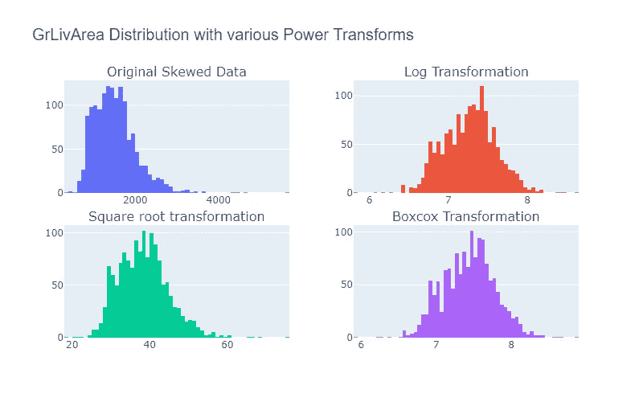
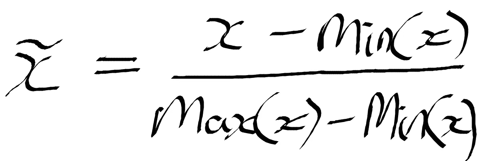
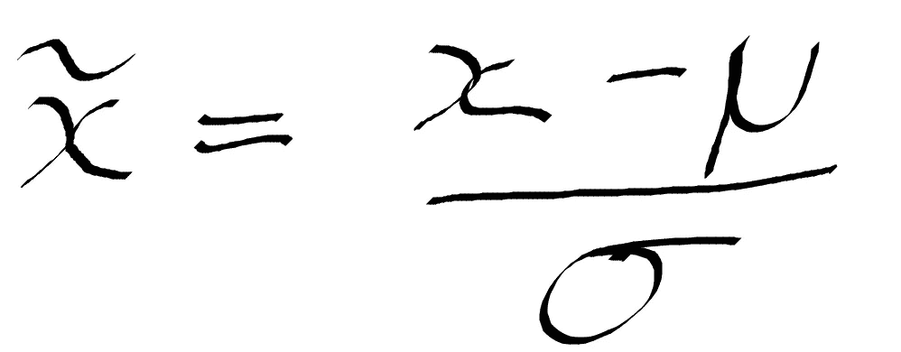
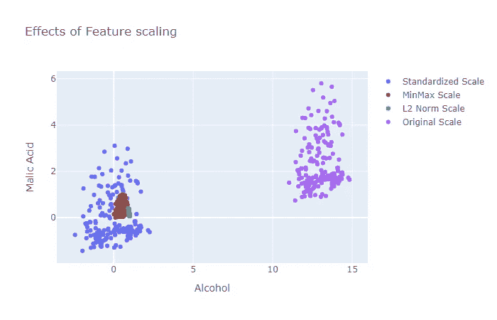
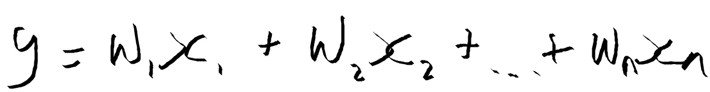
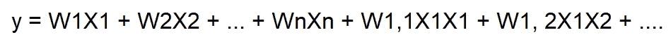

# 数字数据的特征工程

> 原文：<https://towardsdatascience.com/feature-engineering-for-numerical-data-e20167ec18?source=collection_archive---------28----------------------->

## 工程数值的技巧

数字数据几乎是一种福气。为什么差不多？因为它已经是一种机器学习模型可以接受的格式。然而，如果我们把它翻译成与人类相关的术语，仅仅因为一个博士级别的教科书是用英语写的——我用英语说、读和写——并不意味着我能够很好地理解教科书以获得有用的见解。让教科书对我有用的是，它以一种考虑到我的心理模型假设的方式概括了最重要的信息，比如“数学是一个神话”(顺便说一下，这不再是我的观点，因为我真的开始喜欢它了)。同样，一个好的特征应该代表数据的突出方面，以及机器学习模型所做的假设的形状。


图 1:一名士兵在 [Unsplash](https://unsplash.com?utm_source=medium&utm_medium=referral) 上拍摄的照片

特征工程是从原始数据中提取特征并将其转换为机器学习模型可以接受的格式的过程。通常需要转换来降低建模的难度并提高模型的结果。因此，设计数字数据类型的技术是数据科学家(机器学习工程师等)的基本工具。

> “数据就像机器学习中的*原油*，这意味着它必须被提炼为*特征*——预测变量——才能对训练模型有用。”- [威尔·科尔森](https://medium.com/u/e2f299e30cb9?source=post_page-----e20167ec18--------------------------------)

当我们努力掌握时，重要的是要注意，仅仅知道一个机制为什么工作以及它能做什么是远远不够的。精通知道事情是如何完成的，对潜在的原则有直觉，并有神经连接，这使得在面临挑战时绘制正确的工具成为一个无缝的过程。这不会来自于阅读这篇文章，而是来自于有意的实践，这篇文章将通过提供技术背后的直觉为你打开大门，这样你可以理解如何以及何时应用它们。

> 数据中的特征将直接影响您使用的预测模型以及您可以实现的结果。”——[杰森·布朗利](https://medium.com/u/f374d0159316?source=post_page-----e20167ec18--------------------------------)

> 注意:您可以在我的 Github 页面上找到本文使用的代码

[](https://github.com/kurtispykes/demo/tree/master) [## kurtispykes/演示

### 与中等博客文章相关的演示代码。-路径/到/文件；链接到文章有效的数据可视化…

github.com](https://github.com/kurtispykes/demo/tree/master) 

可能会有这样的情况，即在累积的要素上收集数据，从而具有无限的上限。这种类型的连续数据的例子可能是一个跟踪系统，该系统监视我的所有媒体帖子每天接收的访问量。这种类型的数据很容易吸引离群值，因为可能会有一些不可预测的事件影响我的文章累积的总流量，例如有一天，人们可能会决定他们希望能够进行数据分析，所以我关于[有效数据可视化](/effective-data-visualization-ef30ae560961)的文章可能会在那一天出现峰值。换句话说，当数据可以被快速和大量地收集时，那么它很可能包含一些需要工程的极端值。

处理此实例的一些方法有:

**量子化**

此方法通过将值分组到箱中来包含数据的比例。因此，量化将连续值映射为离散值，从概念上讲，这可以被认为是有序的二进制序列。为了实现这一点，我们必须考虑我们创建的箱的宽度，其解决方案分为两类，固定宽度箱或自适应箱。

> 注意:这对于线性模型特别有用，在基于树的模型中这是没有用的(基于树的模型进行它们自己的分割)。

在固定宽度的情况下，该值是自动或自定义设计的，用于将数据分割到离散的条块中，它们也可以线性缩放或指数缩放。一个流行的例子是以十年为间隔将人的年龄分成几个部分，例如容器 1 包含 0-9 岁，容器 2 包含 10-19 岁，等等。

请注意，如果这些值跨越大量的数字，那么更好的方法可能是将这些值分组为常数的幂，例如 10 的幂:0–9、10–99、100–999、1000–9999。请注意，仓位宽度呈指数增长，因此在 1000–9999 的情况下，仓位宽度为 O(10000)，而 0–9 为 O(10)。获取计数的日志，以从计数映射到数据的 bin。

```
import numpy as np #15 random integers from the "discrete uniform" distribution
ages = np.random.randint(0, 100, 15)#evenly spaced bins
ages_binned = np.floor_divide(ages, 10)print(f"Ages: {ages} \nAges Binned: {ages_binned} \n")
>>> Ages: [97 56 43 73 89 68 67 15 18 36  4 97 72 20 35]
Ages Binned: [9 5 4 7 8 6 6 1 1 3 0 9 7 2 3]#numbers spanning several magnitudes
views = [300, 5936, 2, 350, 10000, 743, 2854, 9113, 25, 20000, 160, 683, 7245, 224]#map count -> exponential width bins
views_exponential_bins = np.floor(np.log10(views))print(f"Views: {views} \nViews Binned: {views_exponential_bins}")
>>> Views: [300, 5936, 2, 350, 10000, 743, 2854, 9113, 25, 20000, 160, 683, 7245, 224]
Views Binned: [2\. 3\. 0\. 2\. 4\. 2\. 3\. 3\. 1\. 4\. 2\. 2\. 3\. 2.]
```

当计数中有大的间隙时，自适应箱是更好的选择。当计数值之间有大的余量时，一些固定宽度的仓将是空的。

为了进行自适应宁滨，我们可以利用数据的分位数，即像中位数一样将数据分成相等部分的值。

```
import pandas as pd#map the counts to quantiles (adaptive binning)
views_adaptive_bin = pd.qcut(views, 5, labels=False)print(f"Adaptive bins: {views_adaptive_bin}")
>>> Adaptive bins: [1 3 0 1 4 2 3 4 0 4 0 2 3 1]
```

**电力变换**

我们已经看到了一个这样的例子…对数变换是方差稳定变换系列的一部分，称为幂变换。维基百科将幂变换描述为一种*“用于稳定方差、使数据更像正态分布、提高关联测量的有效性(如变量之间的皮尔逊相关性)以及用于其他数据稳定程序的技术。”*

为什么我们要转换数据以符合正态分布？很棒的问题！您可能希望使用参数模型——对数据进行假设的模型——而不是非参数模型。当数据呈正态分布时，参数模型非常强大。然而，在某些情况下，我们拥有的数据可能需要帮助来呈现正态分布的美丽的钟形曲线，例如，数据可能是倾斜的，因此我们应用幂变换来帮助我们的特征看起来更像高斯。

下面的代码利用数据科学框架(如 pandas、scipy 和 numpy)来演示电源转换，并使用 Plotly.py 框架将它们可视化以进行交互式绘图。使用的数据集是 Kaggle 的 [*房价:高级回归技术*](https://www.kaggle.com/c/house-prices-advanced-regression-techniques/data) ，可以轻松下载( [**点击此处获取数据**](https://www.kaggle.com/c/house-prices-advanced-regression-techniques/data) )。

```
import numpy as np
import pandas as pd
from scipy import stats
import plotly.graph_objects as go
from plotly.subplots import make_subplotsdf = pd.read_csv("../data/raw/train.csv")# applying various transformations
x_log = np.log(df["GrLivArea"].copy()) # log 
x_square_root = np.sqrt(df["GrLivArea"].copy()) # square root x_boxcox, _ = stats.boxcox(df["GrLivArea"].copy()) # boxcox
x = df["GrLivArea"].copy() # original data# creating the figures
fig = make_subplots(rows=2, cols=2,
                    horizontal_spacing=0.125,
                    vertical_spacing=0.125,
                    subplot_titles=("Original Data",
                                    "Log Transformation",
                                    "Square root transformation",
                                    "Boxcox Transformation")
                    )# drawing the plots
fig.add_traces([
                go.Histogram(x=x,
                             hoverinfo="x",
                             showlegend=False),
                go.Histogram(x=x_log,
                             hoverinfo="x",
                             showlegend=False), go.Histogram(x=x_square_root,
                             hoverinfo="x",
                             showlegend=False), go.Histogram(x=x_boxcox,
                             hoverinfo="x",
                             showlegend=False),
               ],
               rows=[1, 1, 2, 2],
               cols=[1, 2, 1, 2]
)fig.update_layout(
    title=dict(
               text="GrLivArea with various Power Transforms",
               font=dict(
                         family="Arial",
                         size=20)),
    showlegend=False,
    width=800,
    height=500)fig.show() # display figure
```



图 2:可视化原始数据和各种电力转换电力转换。

> 注意:Box-cox 变换仅在数据为非负时有效

> “这些中哪一个最好？你无法事先知道。你必须尝试它们，并评估结果，以实现你的算法和性能指标。”- [杰森·布朗利](https://medium.com/u/f374d0159316?source=post_page-----e20167ec18--------------------------------)

**特征缩放**

顾名思义，特征缩放(也称为特征归一化)与改变特征的比例有关。当数据集的要素在比例上有很大差异时，对输入要素比例敏感的模型(即线性回归、逻辑回归、神经网络)会受到影响。确保特征在相似的范围内是必要的。然而，诸如基于树的模型(即决策树、随机森林、梯度增强)之类的模型不关心规模。

缩放要素的常用方法包括最小-最大缩放、标准化和 L 归一化，接下来是 python 中的简单介绍和实现。

**最小-最大缩放** -特征被缩放到一个固定的范围(通常在 0-1 之间)，这意味着我们将减少标准偏差，从而抑制异常值对特征的影响。其中 x 是实例的单个值(即人 1，特征 2)，max(x)，min(x)是特征的最大值和最小值，见图 3。关于这方面的更多信息，请参见 [sklearn 文档。](https://scikit-learn.org/stable/modules/generated/sklearn.preprocessing.MinMaxScaler.html)



图 3:最小-最大缩放的公式

**标准化** -将重新调整特征值，使其符合均值为 0、标准差为 1 的正态分布的属性。为此，我们从特征实例值中减去特征的平均值(所有实例的平均值),然后除以方差，见图 4。 [Sklearn 文档](https://scikit-learn.org/stable/modules/generated/sklearn.preprocessing.StandardScaler.html)用于标准化。



图 4:标准化公式

**L 归一化** -这种技术将原始特征值除以 L 范数(也称为欧氏距离)，这是图 5 中的第二个等式。l 范数取所有实例的特征集中的值的平方和。L 范数的 Sklearn [文档](https://scikit-learn.org/stable/modules/generated/sklearn.preprocessing.Normalizer.html#sklearn.preprocessing.Normalizer)(注意，也可以通过将`norm`参数设置为`"l1"`来进行 L 归一化)。


图 5:L 归一化的公式

> 特征缩放效果的可视化将给出正在发生的事情的更好的图像。为此，我使用可以从 sklearn 数据集导入的葡萄酒数据集。

```
import pandas as pd
from sklearn.datasets import load_wine
from sklearn.preprocessing import StandardScaler, MinMaxScaler, Normalizer
import plotly.graph_objects as gowine_json= load_wine() # load in datasetdf = pd.DataFrame(data=wine_json["data"], columns=wine_json["feature_names"]) # create pandas dataframedf["Target"] = wine_json["target"] # created new column and added target labels# standardization
std_scaler = StandardScaler().fit(df[["alcohol", "malic_acid"]])
df_std = std_scaler.transform(df[["alcohol", "malic_acid"]])# minmax scaling
minmax_scaler = MinMaxScaler().fit(df[["alcohol", "malic_acid"]])
df_minmax = minmax_scaler.transform(df[["alcohol", "malic_acid"]])# l2 normalization
l2norm = Normalizer().fit(df[["alcohol", "malic_acid"]])
df_l2norm = l2norm.transform(df[["alcohol", "malic_acid"]])# creating tracestrace1 = go.Scatter(x= df_std[:, 0],
                    y= df_std[:, 1],
                    mode= "markers",
                    name= "Standardized Scale")trace2 = go.Scatter(x= df_minmax[:, 0],
                    y= df_minmax[:, 1],
                    mode= "markers",
                    name= "MinMax Scale")trace3 = go.Scatter(x= df_l2norm[:, 0],
                    y= df_l2norm[:, 1],
                    mode= "markers",
                    name= "L2 Norm Scale")trace4 = go.Scatter(x= df["alcohol"],
                    y= df["malic_acid"],
                    mode= "markers",
                    name= "Original Scale")layout = go.Layout(
         title= "Effects of Feature scaling",
         xaxis=dict(title= "Alcohol"),
         yaxis=dict(title= "Malic Acid")
         )data = [trace1, trace2, trace3, trace4]
fig = go.Figure(data=data, layout=layout)
fig.show()
```



图 6:原始特性和各种缩放实现的曲线图。

**功能交互**

我们可以通过使用特征之间成对交互的乘积来创建逻辑 AND 函数。在基于树的模型中，这些交互是隐式发生的，但是在假设特征独立的模型中，我们可以显式地声明特征之间的交互以改进模型的输出。

考虑一个简单的线性模型，该模型使用输入要素的线性组合来预测输出 y:



图 7:线性模型的公式

我们可以扩展线性模型来捕捉特征之间发生的交互。



图 8:扩展线性模型

> 注意:使用线性函数是昂贵的，并且具有成对交互的线性模型的评分和训练将从 O(n)到 O(n)。但是，您可以执行特征提取来克服这个问题(特征提取超出了本文的范围，但是我将在以后的文章中讨论)。

让我们用 python 来编码这个，我将利用 scitkit-learn `PolynomialFeatures`类，你可以在[文档](https://scikit-learn.org/stable/modules/generated/sklearn.preprocessing.PolynomialFeatures.html)中读到更多关于它的内容:

```
import numpy as np
from sklearn.preprocessing import PolynomialFeatures# creating dummy dataset
X = np.arange(10).reshape(5, 2)
X.shape
>>> (5, 2)# interactions between features only
interactions = PolynomialFeatures(interaction_only=True)
X_interactions= interactions.fit_transform(X)
X_interactions.shape
>>> (5, 4)# polynomial features 
polynomial = PolynomialFeatures(5)
X_poly = polynomial.fit_transform(X)
X_poly.shape
>>> (5, 6)
```

> 这篇文章很大程度上受到了《机器学习的特征工程:数据科学家的原则和技术》这本书的启发，我强烈推荐阅读这本书。虽然它是在 2016 年出版的，但它仍然信息量很大，解释清楚，即使对那些没有数学背景的人来说也是如此。

**结论**

在本文中，我们讨论了处理数字特征的技术，如量化、幂变换、特征缩放和交互特征(可应用于各种数据类型)。这绝不是特性工程的全部，每天都有更多的东西需要学习。特征工程是一门艺术，需要实践，所以现在你有了直觉，你就可以开始实践了。您可以在我的 Github 上找到本文中使用的代码(链接如下)。非常感谢您的宝贵时间！

[](https://github.com/kurtispykes/demo/tree/master) [## kurtispykes/演示

### 与中等博客文章相关的演示代码。-路径/到/文件；链接到文章有效的数据可视化…

github.com](https://github.com/kurtispykes/demo/tree/master) 

**其他资源……**

[Jason Brownlee](https://medium.com/u/f374d0159316?source=post_page-----e20167ec18--------------------------------) - [探索特性工程，如何设计特性以及如何做好它](https://machinelearningmastery.com/discover-feature-engineering-how-to-engineer-features-and-how-to-get-good-at-it/)

[杰森·布朗利](https://medium.com/u/f374d0159316?source=post_page-----e20167ec18--------------------------------) - [如何将数据更好地拟合正态分布](https://machinelearningmastery.com/how-to-transform-data-to-fit-the-normal-distribution/)

[Emre ren bero Lu](https://medium.com/u/c6b0b560a0c4?source=post_page-----e20167ec18--------------------------------)-[机器学习的特征工程基础技术](/feature-engineering-for-machine-learning-3a5e293a5114)

黛博拉·拉姆齐- [统计数据的类型:数字、分类和顺序](https://www.dummies.com/education/math/statistics/types-of-statistical-data-numerical-categorical-and-ordinal/)

Alice Zheng & Amanda Casari - [机器学习的特征工程:数据科学家的原则和技术](https://www.amazon.co.uk/Feature-Engineering-Machine-Learning-Principles-ebook/dp/B07BNX4MWC)