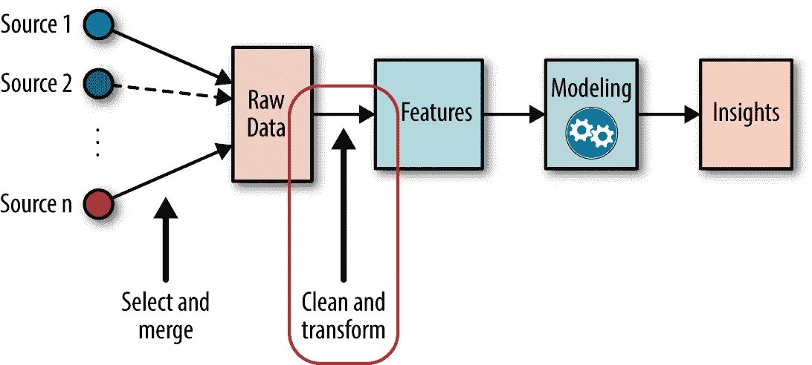
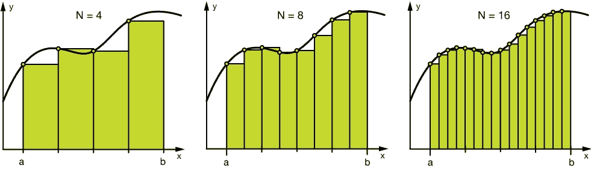
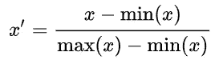
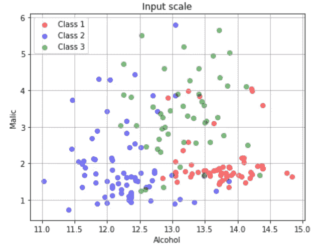
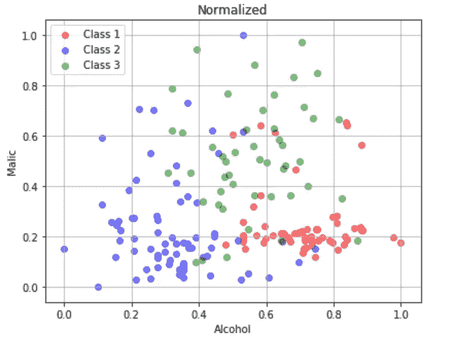
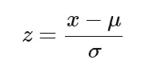
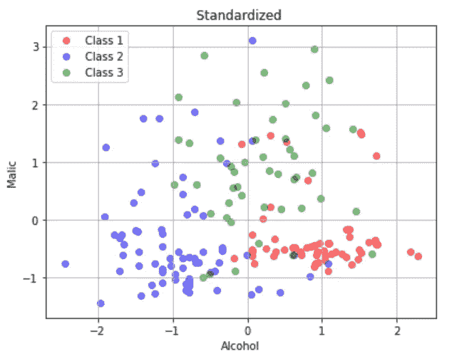

# 机器学习中的特征工程

> 原文：<https://towardsdatascience.com/feature-engineering-in-machine-learning-23b338ea48f4?source=collection_archive---------52----------------------->


Pierre Bamin 在 [Unsplash](https://unsplash.com?utm_source=medium&utm_medium=referral) 上拍摄的照片

## 使数据模型就绪

要解决机器学习问题，我们不能只获取提供的数据，然后应用算法。适合()。我们需要先建立一个数据集。

> *将原始数据转换成数据集的任务称为* ***特征工程*** *。*

例如，假设业务问题是预测客户是否坚持订购特定产品。这将进一步有助于增强产品或用户体验，这将有助于业务增长。

原始数据将包含每个客户的详细信息，如位置、年龄、兴趣、在产品上花费的平均时间、客户续订的次数。这些细节是数据集的**特征**。创建数据集的任务是从原始数据中了解有用的要素，并从对结果有影响的现有要素中创建新要素，或者操作要素以使其可用于模型或可增强结果。这整个过程简称为**特征工程**。

有各种方法可以实现这一点。根据数据和应用程序，使用其中的每一项。

**在本文中，我们将了解为什么要使用特征工程以及执行特征工程的各种方法。**

# 为什么选择特征工程？

特征工程出现在机器学习工作流的初始步骤中。特征工程是决定成败的最关键因素。



特征工程在机器学习工作流中的地位

许多 Kaggle 比赛都是通过根据问题创建适当的功能赢得的。例如，在一次汽车转售比赛中，获胜者的解决方案包含一个分类特征，该分类特征具有类别-正常汽车颜色、罕见汽车颜色。这一特点增加了对汽车转售的预测。既然我们已经理解了特性工程的重要性，那么让我们深入研究用于实现特性工程的各种标准方法。

现在让我们了解如何实现特征工程。以下是广泛使用的基本特征工程技术，

*   编码
*   扔掉
*   正常化
*   标准化
*   处理缺失值
*   数据插补技术

# 编码

有些算法只适用于数字特征。但是，在我们的示例中，我们可能有分类数据，如“客户观看的内容类型”。为了转换这种分类数据，我们使用编码。

## 一键编码:

将分类数据转换为列，每个唯一的类别作为一列，这是一种一次性编码。

下面是实现一键编码的代码片段，

```
encoded_columns = pd.get_dummies(data['column'])
data = data.join(encoded_columns).drop('column', axis=1)
```

当该分类特征具有不太唯一的类别时，这被广泛使用。我们需要记住，随着分类特征的独特类别的增加，维度也在增加。

## 标签编码:

通过给每个类别分配一个唯一的整数值来将分类数据转换为数字数据称为标签编码。

比如 0 代表“喜剧”，1 代表“恐怖”，2 代表“浪漫”。但是这样分配可能会导致给这些类别不必要的普通性。

当类别是顺序的(特定顺序)时，可以使用这种方法，比如 3 代表“优秀”，2 代表“良好”，1 代表“差”。在这种情况下，给类别排序是有用的。并且分配的值不必是连续的。

下面是实现标签编码器的代码片段，

```
from sklearn.preprocessing import ColumnTransformer
labelencoder = ColumnTransformer()
x[:, 0] = labelencoder.fit_transform(x[:, 0])
```

# 扔掉

一种相反的情况，在实践中不太常见，就是当我们有一个数字特征，但我们需要把它转换成一个分类特征。宁滨(也称为分桶)是将一个连续要素转换为多个二元要素(称为箱或桶)的过程，通常基于值范围。



将数值数据宁滨到 4，8，16 个箱中

```
**#Numerical Binning Example
Value      Bin**       
0-30   ->  Low       
31-70  ->  Mid       
71-100 ->  High**#Categorical Binning Example
Value      Bin**       
Germany->  Europe      
Italy  ->  Europe       
India  ->  Asia
Japan  ->  Asia
```

宁滨的主要动机是使模型更加健壮，防止 T2 过度拟合，然而，这是有代价的。每次我们装箱，我们都会牺牲一些信息。

# 正常化

归一化(也称为**最小-最大归一化**)是一种缩放技术，当应用该技术时，特征将被重新缩放，从而数据将落入【0，1】的*范围内*

每个特征的归一化形式可以计算如下:



归一化的数学公式

这里“x”是原始值,“x `”是标准化值。



原始数据、标准化数据的散点图

在*原始数据*中，特征*酒精*位于【11，15】，特征*苹果*位于【0，6】。在*归一化数据*中，特征*酒精*位于[0，1]，特征*苹果酸*位于[0，1]

# 标准化

标准化(也称为 **Z 值归一化**)是一种缩放技术，当应用该技术时，要素将被重新缩放，以便它们具有标准正态分布的属性，具有**平均值、 *μ=0* 和标准偏差、*σ= 1***；其中 *μ* 是平均值，而 *σ* 是平均值的标准偏差。

样本的*标准分*(也称****z****分*)计算如下:*

**

*标准化的数学公式*

*这将缩放特征，使它们的*范围在[-1，1]* 之间*

****

*原始数据、标准化数据的散点图*

*在*原始数据*中，特征*酒精*位于【11，15】，特征*苹果*位于【0，6】。在*标准化数据*中，特征*酒精*和*苹果酸*以 0 为中心。*

*要了解更多关于使用规范化和标准化的特性缩放，请查看我的文章。*

*[](/normalization-vs-standardization-cb8fe15082eb) [## 规范化与标准化

### 两种最重要的特征缩放技术

towardsdatascience.com](/normalization-vs-standardization-cb8fe15082eb)* 

# *处理缺失值*

*数据集可能包含一些缺失值。这可能是在输入数据时或出于隐私考虑。不管原因是什么，了解如何减少信息技术对结果的影响是至关重要的。下面是处理缺失值的方法，*

*   *只需删除那些丢失值的数据点(当数据很大而丢失值的数据点较少时，这是更好的选择)*
*   *使用处理缺失值的算法(取决于实现该算法的算法和库)*
*   *使用**数据插补技术**(取决于应用和数据)*

# *数据插补技术*

*数据插补只是用一个不会影响结果的值替换缺失值。*

*对于数字特征，缺失值可以替换为，*

*   *简单的 0 或默认值*

```
***#Filling all missing values with 0**
data = data.fillna(0)*
```

*   *特征的最大重复值*

```
***#Filling missing values with mode of the columns**
data = data.fillna(data.mode())*
```

*   *特征平均值(受异常值影响，甚至可以用特征的中值替换)*

```
***#Filling missing values with medians of the columns**
data = data.fillna(data.median())*
```

*对于分类特征，缺失值可以替换为，*

*   *特征的最大重复值*

```
***#Most repeated value function for categorical columns**
data['column_name'].fillna(data['column_name'].value_counts()
.idxmax(), inplace=True)*
```

*   *“其他”或任何新命名的类别，这意味着数据点是估算的*

*在本文中，我们了解了广泛使用的基本特征工程技术。我们可以根据数据和应用程序创建新功能。但是，如果数据很小而且很脏，这些可能就没有用了。*

*谢谢你的阅读。以后我会写更多初学者友好的帖子。请在[媒体](https://medium.com/@ramyavidiyala)上关注我，以便了解他们。我欢迎反馈，可以通过 Twitter [ramya_vidiyala](https://twitter.com/ramya_vidiyala) 和 LinkedIn [RamyaVidiyala](https://www.linkedin.com/in/ramya-vidiyala-308ba6139/) 联系我。快乐学习！*