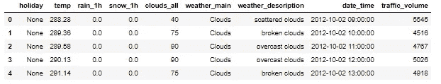
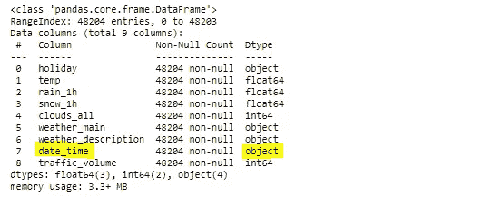
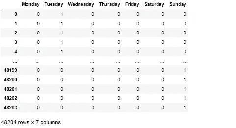
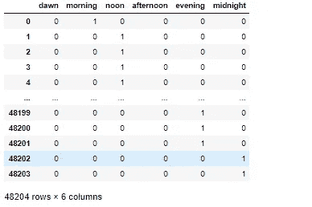
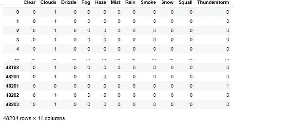
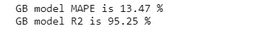
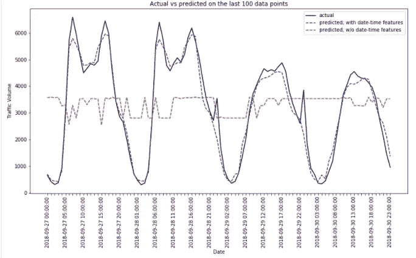

# 日期时间数据的特征工程

> 原文：<https://towardsdatascience.com/feature-engineering-on-date-time-data-90f6e954e6b8?source=collection_archive---------8----------------------->


[埃斯特扬森斯](https://unsplash.com/@esteejanssens?utm_source=unsplash&utm_medium=referral&utm_content=creditCopyText)在 [Unsplash](https://unsplash.com/s/photos/calendar?utm_source=unsplash&utm_medium=referral&utm_content=creditCopyText) 上拍摄的照片

## 以及如何使用梯度推进回归在您的预测模型中实现它

根据维基百科，特征工程是指利用领域知识通过数据挖掘技术从原始数据中提取特征的过程。然后，这些特征可以用于提高机器学习算法的性能。

尽管如此，特征工程并不一定非要花里胡哨。特征工程的一个简单但普遍的用例是时间序列数据。特征工程在这一领域的重要性是由于(原始)时间序列数据通常只包含一个单独的列来表示时间属性，即日期-时间(或时间戳)。

关于该日期-时间数据，**特征工程可视为从这些数据中提取有用的信息，作为独立的(独特的)特征**。例如，从日期时间数据“2020–07–01 10:21:05”中，我们可能希望从中提取以下特征:

1.  月份:7
2.  一月中的第几天:1
3.  日期名称:星期三(2020 年 7 月 1 日是星期三)
4.  小时:10 分钟

从日期时间数据中提取这类特征正是本文的目标。之后，我们将整合我们的工程特征作为梯度推进回归模型的预测器。具体来说，我们将预测地铁州际交通量。

# 快速小结

本文将涵盖以下内容。

**从日期-时间列中提取以下特征的分步指南。**

1.  月
2.  一月中的某一天
3.  日期名称
4.  小时
5.  白天(上午、下午等)
6.  周末标志(如果是周末，则为 1，否则为 0)

**如何将这些特征整合到梯度推进回归模型中，以预测地铁州际交通量。**

# 数据

在整篇文章中，我们使用**地铁州际交通量数据集，**可以在 UCI 机器学习知识库[这里](https://archive.ics.uci.edu/ml/datasets/Metro+Interstate+Traffic+Volume)找到。

引用其摘要，该数据是关于明尼苏达州明尼阿波利斯-圣保罗西行 I-94 的每小时交通量，包括 2012 年至 2018 年的天气和假日特征。这 48204 行数据包含以下属性。

1.  美国国家法定假日加上地区假日，明尼苏达州博览会
2.  `temp`:以开尔文为单位的数字平均温度
3.  `rain_1h`:一小时内降雨量的数值，单位为毫米
4.  `snow_1h`:一小时内降雪的数值，单位为毫米
5.  `clouds_all`:云量百分比
6.  `weather_main`:当前天气的分类简短文本描述
7.  `weather_description`:对当前天气的分类更长的文本描述
8.  `**date_time**`:当地 CST 时间采集的数据的日期时间小时
9.  `traffic_volume:`每小时 I-94 ATR 301 报告的西行交通量(目标值)

让我们加载数据。

```
# import libraries
import pandas as pd
import numpy as np
import matplotlib.pyplot as plt# load the data
raw = pd.read_csv('Metro_Interstate_Traffic_Volume.csv')# display first five rows
raw.head()# display details for each column
raw.info()
```



raw.head()



raw.info()

从上面的`info`方法的输出中，我们知道`date_time`列仍然是`object`类型。所以我们需要将其转换为`datetime`类型。

```
# convert date_time column to datetime type
raw.date_time = pd.to_datetime(raw.date_time)
```

# 开始特征工程

从上面 info 方法的输出中，我们知道除了`date_time`列之外还有分类特性。但是由于本文的主题，我们将把重点放在我们的`date_time`专栏的特性工程上。

**月**

事实证明，Pandas 有许多方便的方法来处理`datetime`类型的数据。要提取时间/日期组件，我们需要做的就是调用`pd.Series.dt`属性族。`pd.Series.dt.month`是我们需要提取的月份成分。这将产生一系列`int64`格式的月份数字(例如 1 代表一月，10 代表十月)。

```
# extract month feature
months = raw.date_time.dt.month
```

**一个月中的某一天**

和之前很像，我们只需要调用`pd.Series.dt.day`。例如，使用此属性，日期时间 2012–10–27 09:00:00 将产生 27。

```
# extract day of month feature
day_of_months = raw.date_time.dt.day
```

**小时**

这个也是琐碎的。属性`pd.Series.dt.hour`将产生一系列小时数字，范围从 0 到 23。

```
# extract hour feature
hours = raw.date_time.dt.hour
```

**日名**

这个越来越有趣了。我们的目标是提取`raw.date_time`系列中每个日期时间的日期名称。它包括两个步骤。首先是使用`pd.Series.dt.day_name()`方法提取日名称文字。之后，我们需要使用`pd.get_dummies()`方法对第一步的结果进行一次性编码。

```
# first: extract the day name literal
to_one_hot = raw.date_time.dt.day_name()# second: one hot encode to 7 columns
days = pd.get_dummies(to_one_hot)#display data
days
```



一键编码的日期名称

**日间部分**

在这一部分中，我们将根据小时数字创建一个分组。在高层次上，我们希望有六个组来代表每一天。它们是黎明(02.00-05.59)、早晨(06.00-09.59)、中午(10.00-13.59)、下午(14.00-17.59)、晚上(18.00-21.59)和午夜(第+1 天的 22.00-01.59)。

为此，我们创建了一个标识函数，稍后我们将使用它来提供一个系列的`apply`方法。之后，我们对产生的日部分执行一键编码。

```
# daypart function
def daypart(hour):
    if hour in [2,3,4,5]:
        return "dawn"
    elif hour in [6,7,8,9]:
        return "morning"
    elif hour in [10,11,12,13]:
        return "noon"
    elif hour in [14,15,16,17]:
        return "afternoon"
    elif hour in [18,19,20,21]:
        return "evening"
    else: return "midnight"# utilize it along with apply method
raw_dayparts = hours.apply(daypart)# one hot encoding
dayparts = pd.get_dummies(raw_dayparts)# re-arrange columns for convenience
dayparts = dayparts[['dawn','morning','noon','afternoon','evening','midnight']]#display data
dayparts
```



日部分，一键编码

**周末旗帜**

我们从`date_time`栏设计的最后一个特征是`is_weekend`。该列指示给定的日期时间是否在周末(周六或周日)。为了实现这个目标，我们将利用之前的`pd.Series.dt.day_name()`方法，并在其上应用一个简单的 lambda 函数。

```
# is_weekend flag 
day_names = raw.date_time.dt.day_name()
is_weekend = day_names.apply(lambda x : 1 if x in ['Saturday','Sunday'] else 0)
```

**节日旗帜&天气**

幸运的是，该数据还包含公共假期信息。信息是精细的，因为它提到了每个公共假日的名称。尽管如此，我认为对这些节日进行编码并没有明显的好处。因此，让我们创建一个二元特征来表示相应的日期是否是假日。

```
# is_holiday flag
is_holiday = raw.holiday.apply(lambda x : 0 if x == "None" else 1)
```

我们需要注意的最后一个分类特性是`weather`列(我的假设在这里再次出现，我做*不*包括`weather_description`特性)。正如您可能猜到的，我们只是一次性地将该特性编码如下。

```
# one-hot encode weather
weathers = pd.get_dummies(raw.weather_main)#display data
weathers
```



天气，一键式编码

**最终数据**

万岁！我们终于有了最终的数据，可以开始训练了！让我们创建一个名为`features`的全新数据框架，它包含所有的特征，既有数字特征(我们按原样从原始数据中提取)，也有分类特征(我们设计的特征)。

```
# features table#first step: include features with single column nature
features = pd.DataFrame({
    'temp' : raw.temp,
    'rain_1h' : raw.rain_1h,
    'snow_1h' : raw.snow_1h,
    'clouds_all' : raw.clouds_all,
    'month' : months,
    'day_of_month' : day_of_months,
    'hour' : hours,
    'is_holiday' : is_holiday,
    'is_weekend' : is_weekend
})#second step: concat with one-hot encode typed features
features = pd.concat([features, days, dayparts, weathers], axis = 1)# target column
target = raw.traffic_volume
```

在将数据输入模型之前，我们需要分割数据(训练和测试数据)。请注意下面我们做的是*而不是*打乱我们的数据，这是由于数据的时间序列性质。

```
#split data into training and test data
X_train, X_test, y_train, y_test = train_test_split(features, target, test_size=0.1, shuffle = False)
```

# 建模零件

现在我们准备建立我们的模型来预测地铁州际交通量。在这项工作中，我们将使用梯度推进回归模型。

该模型的细节超出了本文的范围，但是在较高的层次上，梯度推进模型属于集成模型家族，其采用梯度下降算法来最小化顺序(附加)弱学习器模型(决策树)中的错误。

**模特培训**

让我们在训练数据上实例化和训练模型！

```
from sklearn import datasets, ensemble# define the model parameters
params = {'n_estimators': 500,
          'max_depth': 4,
          'min_samples_split': 5,
          'learning_rate': 0.01,
          'loss': 'ls'}# instantiate and train the model
gb_reg = ensemble.GradientBoostingRegressor(**params)
gb_reg.fit(X_train, y_train)
```

请稍等片刻，直到训练结束。

**模型评估**

为了评估该模型，我们使用两个指标:MAPE(平均绝对百分比误差)和 R2 分数。我们将根据测试数据计算这些指标。

```
# define MAPE function
def mape(true, predicted):        
    inside_sum = np.abs(predicted - true) / true
    return round(100 * np.sum(inside_sum ) / inside_sum.size,2)# import r2 score
from sklearn.metrics import r2_score# evaluate the metrics
y_true = y_test
y_pred = gb_reg.predict(X_test)#print(f"GB model MSE is {round(mean_squared_error(y_true, y_pred),2)}")
print(f"GB model MAPE is {mape(y_true, y_pred)} %")
print(f"GB model R2 is {round(r2_score(y_true, y_pred)* 100 , 2)} %")
```



测试数据的度量性能

我们可以看到我们的模型在性能上相当不错。我们的 MAPE 不到 15%，而 R2 的分数是 95%多一点。

**图形结果**

为了直观地理解我们的模特表演，让我们来点剧情吧！

由于我们测试数据的长度(4820 个数据点)，我们只绘制了最后 100 个数据点的实际值与模型预测值。此外，我们还包括另一个模型(在下面的绘图代码中称为`gb_reg_lite`)，该模型的*而不是*包含日期-时间工程特征作为其预测器(它只包含非日期-时间列作为特征，包括`temp`、`weather`等)。

```
fig, ax = plt.subplots(figsize = (12,6))index_ordered = raw.date_time.astype('str').tolist()[-len(X_test):][-100:]ax.set_xlabel('Date')
ax.set_ylabel('Traffic Volume') # the actual values
ax.plot(index_ordered, y_test[-100:].to_numpy(), color='k', ls='-', label = 'actual')# predictions of model with engineered features
ax.plot(index_ordered, gb_reg.predict(X_test)[-100:], color='b', ls='--', label = 'predicted; with date-time features')# predictions of model without engineered features
ax.plot(index_ordered, gb_reg_lite.predict(X_test_lite)[-100:], color='r', ls='--', label = 'predicted; w/o date-time features')every_nth = 5
for n, label in enumerate(ax.xaxis.get_ticklabels()):
    if n % every_nth != 0:
        label.set_visible(False)ax.tick_params(axis='x', labelrotation= 90)plt.legend()
plt.title('Actual vs predicted on the last 100 data points')
plt.draw()
```



我们对最后 100 个数据点的预测性能

该图支持我们之前对该模型获得的良好评估指标的调查结果，因为蓝色虚线与黑色实线非常接近。也就是说，我们的梯度推进模型可以很好地预测地铁交通。

同时，我们看到不使用*而不使用*日期-时间工程功能的模型在性能上有所下降(红色虚线)。为什么会出现这种情况？因为目标(交通流量)确实取决于我们刚刚创建的特征。交通流量在周末趋于降低，但在高峰时段会达到峰值(见上图)。因此，如果我们不对日期-时间列执行特征工程，我们将会错过这些声音预测器！

# 在你走之前

恭喜你已经阅读了这么多！

现在简单回顾一下。在本文中，我们学习了如何对日期时间数据执行特征工程。之后，我们结合工程特征建立了一个强大的梯度推进回归模型，以预测地铁交通量。

最后，感谢您的阅读，让我们通过 [LinkedIn](https://www.linkedin.com/in/pararawendy-indarjo-5b87bab7) 与我联系吧！