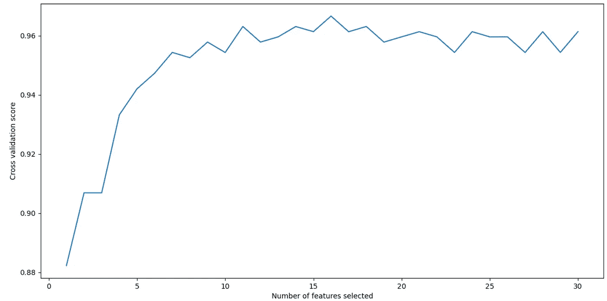

# 特征工程—带交叉验证的递归特征消除

> 原文：<https://towardsdatascience.com/feature-engineering-recursive-feature-elimination-with-cross-validation-745d594df730?source=collection_archive---------28----------------------->

## 内部人工智能

## 开发一个具有最小所需维度并忽略不太重要的特征的通用机器学习模型是一门艺术。


由[灭霸朋友](https://unsplash.com/@thanospal?utm_source=medium&utm_medium=referral)在 [Unsplash](https://unsplash.com?utm_source=medium&utm_medium=referral) 上拍摄的照片

在调查和数据收集阶段，我们不知道哪些特征/属性对输出有很大影响，哪些没有那么大影响。因此，我们在这个阶段收集或测量尽可能多的逻辑属性。

随着训练数据集中特征数量的增加，机器学习模型变得复杂，并且在计算上也变得昂贵。

目标是开发一个经过训练的机器学习模型，该模型具有最少的所需特征，并且能够以可接受的精度预测数据点。我们不应该过度简化模型，通过修剪重要的特征来丢失重要的信息，同时拥有过多冗余或不太重要的特征的复杂模型。

Scikit-Learn 库提供了几种方法来简化模型，降低训练数据集的维数，并对机器学习模型的预测精度产生最小影响。

在本文中，我将讨论递归特征消除和交叉验证选择，以确定最佳独立变量并降低训练数据集的维度。

在本文中，我们将使用 Sckit_Learn 中的乳腺癌数据集来解释交叉验证递归特征消除(RFECV)。

```
from sklearn.datasets import load_breast_cancer
from sklearn.feature_selection import RFECV
from sklearn.ensemble import RandomForestClassifier
import matplotlib.pyplot as plt
```

乳腺癌数据集有 569 条记录，30 个自变量(特征)和因变量的二元类。

```
X,y=load_breast_cancer(return_X_y=True,as_frame=True)
print(X.shape)
```


自变量(特征)的维数—上述代码的输出。作者图片

我们将在 RandomForestClassifier 中使用 feature_importances_ attribute 来计算迭代中特征集的重要性。

在 RECV 中，基于选择的估计器计算特征重要性，并且在每次迭代中丢弃一个/几个特征。

在下面的代码中,“step”参数表示在每次迭代中要删除的特性的数量。这里，我们将在每次迭代中删除一个特性，以确定对因变量有最大影响的正确特性集。为了将数据分成训练/测试集并计算特征重要性，我们提到了使用分层 K 折叠交叉验证器的三折叠交叉验证。

你可以在 Scitkit-learn [文档](https://scikit-learn.org/stable/modules/generated/sklearn.model_selection.StratifiedKFold.html#sklearn.model_selection.StratifiedKFold)中了解更多关于 StratifiedKFold 的信息

```
rfc = RandomForestClassifier(max_depth=8, random_state=0)
clf = RFECV(rfc, step=1, cv=3)
clf.fit(X, y)
```

“n_features_”提供了对预测因变量有重要影响的特征计数。

```
print("Optimal number of features : %d" % clf.n_features_)
print("Optimal number of features : ", clf.n_features_)
```

在乳腺癌数据集中，我们有 30 个特征。基于“特征重要性”, RFECV 推荐了 16 个在预测癌症类别中有意义的特征。


最佳重要特性—上述代码的输出。作者图片

“ranking_”属性提供了每个特征的重要性顺序。

```
print(clf.ranking_)
```


每个独立变量的排名(数字越低越重要)—上述代码的输出。:作者图片

排名第一的特征是最重要的，并且对预测癌症类别具有最大影响。随着某个特性的排名越来越高，它的重要性也相对降低。

让我们将交叉验证分数与特征数量进行可视化，以了解交叉验证分数的变化。

```
plt.plot(range(1, 31), clf.grid_scores_)
plt.xlabel("Number of features selected")
plt.ylabel("Cross validation score")
plt.show()
```

我们可以看到，对于 16 个最重要特征的组合，交叉验证得分最高。进一步增加训练数据集的维数不会进一步提高预测精度。



功能数量与交叉验证分数—上述代码的输出:作者提供的图片

> 关键要点和结论

监督机器学习的目标是拥有一个具有最重要特征的通用训练模型。

我们必须致力于减少模型训练的维度(特征)数量。这使得模型更简单，并且在计算上也更经济。

具有交叉验证的递归特征消除指示具有重要性排序的重要特征。这使我们能够构建具有最佳尺寸的模型。

由于 RFECV 通过逐步消除不太重要或冗余的特征以及交叉验证来识别最佳特征，因此它在计算上非常昂贵。这是交叉验证的递归特征消除的缺点之一。

学会用探索性的数据分析和统计选择文章中的自变量[如何为机器学习监督算法识别正确的自变量？](/how-to-identify-the-right-independent-variables-for-machine-learning-supervised-algorithms-439986562d32)