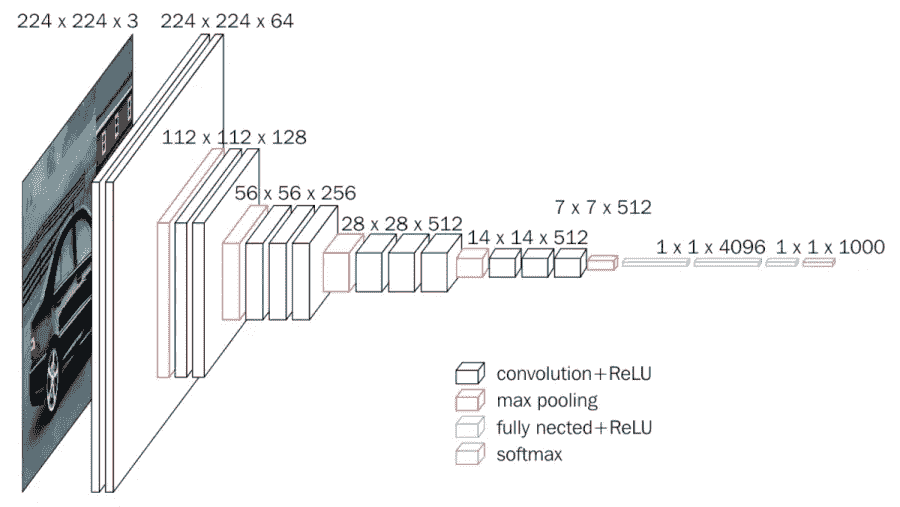

# 特征提取:搜索和推荐的心理模型

> 原文：<https://towardsdatascience.com/feature-extraction-a-mental-model-for-search-and-recommendation-48a2d3eeb519?source=collection_archive---------48----------------------->

## +对神经网络的一些一般直觉

Aneta Pawlik 在 [Unsplash](https://unsplash.com?utm_source=medium&utm_medium=referral) 上拍摄的照片

# 动机

图像检索是一个很酷的概念。

点。啪。搜索。

我想不出比这更好的用户体验了。[谷歌镜头](https://lens.google.com/)、[亚马逊 StyleSnap](https://affiliate-program.amazon.com/resource-center/amazon-influencers-introducing-stylesnap) 、 [Syte](https://www.syte.ai/) 都有正确的想法。

最近，[写了关于向量相似度搜索引擎 Milvus](/up-and-running-with-milvus-2466161e8b1f) 。我能够在几分钟内让一个快速和肮脏的图像检索应用程序工作。我意识到，建造酷的东西并不是遥不可及的，这是那些授权工程师的时刻之一。我发现自己想了解更多关于卷积神经网络(CNN)以及它们如何在图像检索中工作的信息。

具体来说，我在想:

> *给定一些卷积神经网络，我如何选择一个层进行特征提取？*

我找到的答案大概是这样的:

*“因使用情形而异。”*

*“各层各有所长。”*

*“需要测试。”*

这些回答让我不满意。他们没有方向感。他们没有留下进一步调查的线索。我在挠头。我决定更深入地研究，经过一些修补，我找到了一种测试特征向量“搜索能力”的方法。更重要的是，我对 CNN 的****架构目标** **有了更强的直觉。****

# **理解问题**

****

**建筑 [VGG 16](https://arxiv.org/abs/1409.1556)**

## **像 VGG16 这样的 CNN 是如何运作的**

**VGG16 是一种卷积神经网络架构。它在图像分类中表现非常好，并且具有相对简单的架构。为了理解它的结构，我喜欢把网络分成两部分:**

****网络的前半部分**(黑色和红色)被称为*特征提取器。*它被喂了一个图像。它负责从图像中提取有用的信息。随着数据向前传递，每一层都比上一层需要更少的内存来存储有关图像的信息。**

**以下是按顺序排列的中间层的形状，请注意每一步中的信息量是如何减少的:**

1.  **112 x 112 x 64 = 802，816**
2.  **56 x 56 x 128 = 401，408**
3.  **28 x 28 x 256 = 200，704**
4.  **14 x 14 x 512 =100，352**
5.  **7x 7x 512 = 25088**

**为什么这很重要？一个成功的网络学会了如何接受任何输入，并以某种方式压缩信息，以有效地完成手头的任务。当数据是这样的压缩形式时，它被称为*潜在表示*或*嵌入*。**

****网络的后半部分**(蓝色和金色)，负责取一些*潜在表象*并执行某种任务。在 VGG16 的情况下，任务通常是分类。这可能意味着输出“猫”或“狗”来分类一些图像。这部分网络学习如何从数字上理解*潜在表征。*从这里它可以分类，画一个包围盒等。**

**在图像检索的上下文中，我们不需要后半部分，所以我们将只关注前半部分。*特征提取器。***

> **当我把机器学习应用想成**数据转换问题时，我的生活就轻松多了。这些是我能理解的问题类型。****

## **VGG16 如何用于图像检索？**

**一旦我们有了一个模型，这个模型可以把我们的输入图像变成某种潜在的表示。结果通常以张量的形式出现。**

****

**[由大卫·施维默利用米罗](https://miro.com/)创作。免费使用**

**张量没有错，但是要使用它，我们需要把它展平成一个矢量。有不同的方法可以做到这一点(最大池，平均池，或只是扁平化)。一旦我们展平了数据，我们就有了一个由浮点数*(特征)*组成的矢量，它以某种抽象的方式表示图像:**

**`[0.4366, 0.7169, 0.0093, 0.1545, …]`**

**相似的图像会产生相似的*特征向量。*度量相似度的方法有很多种，但最常见的是 e *uclidean distance* 和*余弦相似度。这些术语可能听起来很陌生，但它们背后的数学原理没什么可怕的。***

****

**[由大卫·施维默利用米罗](https://miro.com/)创作。免费使用**

**给定所有这些信息，图像检索可以分为以下步骤:**

1.  **使用*特征提取器*到将图像处理成*特征向量*。**
2.  **将*特征向量*存储在像 Milvus 这样的搜索引擎中。Milvus 允许我们通过一些相似性度量来搜索向量，比如*欧几里德距离*。**
3.  **使用相同的特征提取器将任何查询图像处理成一个*特征向量*，然后在 Milvus 中查询相似的出现。**

**事实上，这些步骤可以应用于一般的搜索或推荐系统。它们绝不仅限于图像。音频、文本、视频都遵循相同的模式**

**回到手头的任务，我想弄清楚 CNN 的哪一层会导致最好的搜索结果。我有一个想法:*一个能很好地用于分类的特征提取器也能很好地用于搜索*。我决定测试这个想法，分享代码和我的见解。**

# **实验**

**所用的猫/狗数据集可在 [kaggle](https://www.kaggle.com/c/dogs-vs-cats) 上获得。下载完成后，我将图像提取到一个名为`data`的目录中。本实验的代码可在 [GitHub](https://github.com/dshvimer/feature-extraction) 上获得。采取的步骤如下:**

1.  **加载狗/猫数据集。**
2.  **从我们想要在模型中测试的每一层获取输出。执行 MaxPooling 操作，将每个输出平坦化为一个*特征向量。***
3.  **将结果按图层分组: *block1_pool.csv，block2_pool.csv…***
4.  **对于每个数据集，训练和评估一个分类模型。选择 KNeighborsClassifier 是因为它使用欧几里得距离。**
5.  **比较结果。**

****关于使用 VGG16 进行特征提取的说明****

**我们需要访问网络的中间层。默认情况下，预训练的 VGG16 将只输出最终层。我们可以通过在 keras 中使用通用的`Model`类来解决这个问题。在下面的代码片段中，我们声明了一个输出每个块的池层的模型。**

# **结果呢**

****

**以下是使用 10 倍交叉验证训练分类器(KNeighborsClassifier)的结果。我们看到每一层在分类上都比上一层好。我大声对自己说*【咄】**。***

***对预训练的 VGG16 模型进行分类训练。它训练的 *imagenet* 数据集毕竟有猫狗在里面！我的实验基本上证实了网络的前半部分已经学会了如何表示信息。被丢弃的另一半网络很容易被我们的分类模型所取代。***

***那么在搜索方面有什么结论呢？***

***“block5_pool”层将很好地表现我们的搜索图像。不会经常混淆猫狗。这将导致较高的*召回*分数，这是一种用于评估搜索相关性的衡量标准。***

*****但是，类内相似性呢？*****

***该模型能在多大程度上确定同一犬种的图像比不同犬种的图像**更加**相似？***

***好吧，如果网络从来没有为这个任务优化过，那就不能保证它能分辨出不同。例如，如果类内相似性取决于颜色、形状或纹理等属性，我们可能会很幸运。这是因为这些特征在最初的分类任务中可能非常重要。如果我们在寻找更细微的结果，我们将需要用更精细的数据集来测试，以获得完全的信心。更精细的可能意味着按品种、颜色、大小等给每张图片贴上标签。***

***然而，问题往往比这更微妙。考虑一个面部识别系统。预测一幅图像包含一张脸和识别一个特定的人的脸不是一回事。在这些情况下，人们可以考虑使用[三联体网络](/image-similarity-using-triplet-loss-3744c0f67973)。***

******

***[此报告的图片](https://github.com/omoindrot/tensorflow-triplet-loss)***

*****如果数据集没有被标记怎么办？*****

***幸运的是，有一个工具可以解决这个问题！此处[描述的方法](https://medium.com/@franky07724_57962/using-keras-pre-trained-models-for-feature-extraction-in-image-clustering-a142c6cdf5b1#:~:text=Let's%20consider%20VGG%20as%20our,model%20with%2019%20weight%20layers.)演示了如何使用[轮廓系数](https://scikit-learn.org/stable/modules/clustering.html#silhouette-coefficient)。这是一个用于评估数据集在无监督学习中表现如何的指标。***

> ***较高的轮廓系数分数与具有更好定义的聚类的模型相关***

***不要认为这是测量未标注数据集的唯一可用方法。毕竟，有一个完整的 ML 分支关注无监督学习。***

# ***最后的想法***

***它确实因用例而异。至少现在我可以解释为什么了。***