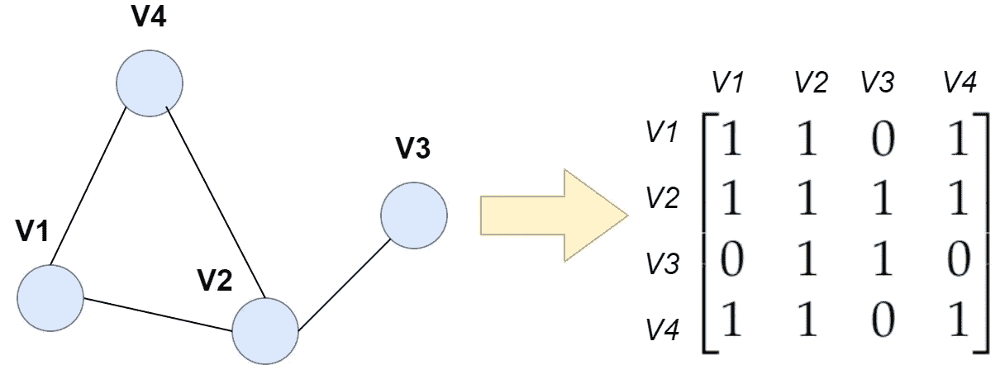
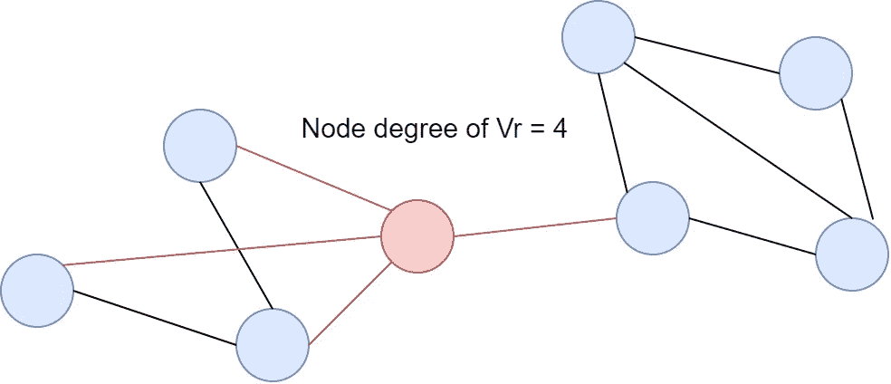
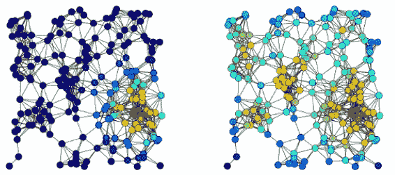
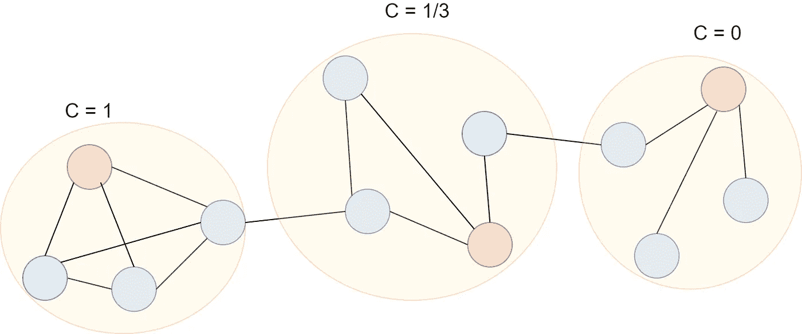
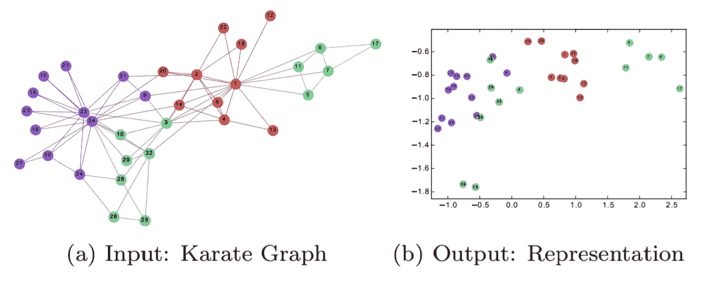
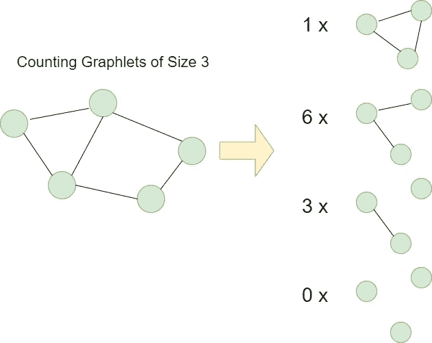
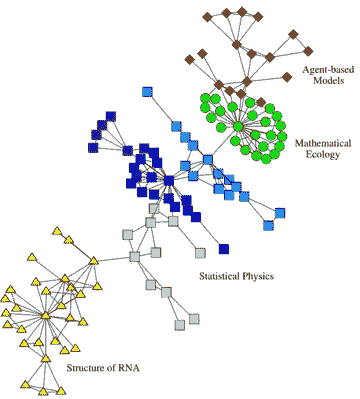

# 图的特征提取

> 原文：<https://towardsdatascience.com/feature-extraction-for-graphs-625f4c5fb8cd?source=collection_archive---------11----------------------->

## 对机器学习模型最有用的图形特征

从图中创建邻接矩阵。图片作者。

# 相关文章

*   [图上的机器学习任务](/machine-learning-tasks-on-graphs-7bc8f175119a)
*   [走向可解释的图形神经网络](/towards-explainable-graph-neural-networks-45f5e3912dd0)
*   [图形神经网络十大学习资源](/top-10-learning-resources-for-graph-neural-networks-f24d4eb2cc2b)

从图中提取特征与从正常数据中提取特征完全不同。每个节点都是相互关联的，这是我们不能忽视的重要信息。幸运的是，已经为图形创建了许多特征提取方法。这些技术可以分为节点级、图形级和邻域重叠特征。在本文中，我们将研究最常见的图形特征提取方法及其特性。

注意:我的文章结构与林子幸·汉密尔顿的《图形表示学习》一书中的相似。

# **节点级特性**

从图中获取信息的最简单方法之一是为每个节点创建单独的要素。这些特征可以使用迭代方法捕获来自邻近区域和更远的 K 跳区域的信息。让我们开始吧！

## 节点度

要计算节点度，请计算 Vr 的关联边数。图片作者。

节点度是一个简单的度量，可以定义为与一个节点关联的边的数量。数学上，它可以定义为:

节点度方程。修改自[1]

其中 **A** 是邻接矩阵，**d**u 是节点 *u* 的度。这一指标通常用作算法的初始化，以生成更复杂的图形级特征，如 *Weisfeiler-Lehman 内核。*

## 特征向量中心性

不同的中心性度量。左图说明了特征向量的中心性。右边的例子说明了程度中心性。[【来源】](https://commons.wikimedia.org/w/index.php?curid=39064835)

特征向量中心性度量考虑了两个方面:

*   节点 *u* 有多重要
*   节点的邻居有多重要

换句话说，具有高特征向量中心性的节点应该具有许多也高度连接到其他节点的邻居。

这一指标背后的数学是基于使用矩阵方程的递归算法，相当复杂。我不会告诉你这个数学方程的血淋淋的细节，但是如果你对此感兴趣，[1]有一个关于这个话题的很好的解释(第 19 页)。

## 聚类系数

为每个红色节点计算的聚类系数。图片作者。

直观地说，我们可以将这一指标视为节点组连接在一起的紧密程度。它测量节点[1]的邻域中闭合三角形的比例。节点 *u* 的聚类系数可以定义为:

聚类系数方程。修改自[1]

其中( **v** *1* ，**v***2*)∈ɛ表示节点 **v** *1* ， **v** *2* 之间有连接。**v**1 和**v**2 被定义为与节点 *u.* 相邻的任意一对节点

我们可以说它是邻居之间的边的数量与节点的邻居的数量的比率(节点度)[1]。接近 1 的值意味着节点 *u* 的所有邻居都相互连接(图中右侧的黄色圆圈)，而接近 0 的值意味着节点的邻居之间几乎没有任何连接(图中左侧的黄色圆圈)。

## 深度行走

DeepWalk 将图作为输入，并创建 R 维节点的输出表示。看看 R 中的“映射”是如何将不同的集群分开的。修改自[4]

这是一种基于学习的方法，以图形作为输入，学习和输出节点的表示[4]。它将语言建模中使用的技术重新应用到图域中。该算法包括两个主要部分:

*   深度行走
*   SkipGram

在深度行走中，我们应用随机行走生成器来生成短的节点序列。然后，使用生成的节点序列，应用 SkipGram 将顶点编码到低维空间中。

DeepWalk 算法有点难懂，所以我推荐看看他们的[原始论文](http://www.perozzi.net/publications/14_kdd_deepwalk.pdf)(写得真好！)，或者这个[条](https://medium.com/analytics-vidhya/an-intuitive-explanation-of-deepwalk-84177f7f2b72)。

## 荣誉提名

节点的其他重要特征包括中心性方法，如 [PageRank](https://en.wikipedia.org/wiki/PageRank) 、[局部着色](https://en.wikipedia.org/wiki/Graph_coloring)，或基于学习的方法，如[HOPE](https://www.kdd.org/kdd2016/papers/files/rfp0184-ouA.pdf)【2】。

# **图形层次特征**

如果我们想获取整个图的信息，而不是查看单个节点，该怎么办？幸运的是，有许多方法可以聚集整个图表的信息。从诸如邻接矩阵的简单方法到诸如 Weisfeiler-Lehman 核或基于路径的核的更复杂的核。从图中提取全局信息有许多不同的方法；在这一部分，我们将探讨最常见的。

## 邻接矩阵

邻接矩阵是一种稀疏矩阵，其中“1”表示两个节点之间存在连接。图片作者。

如果有一个你应该知道的图级特征，那就是*邻接* *矩阵*。这只是一个包含两个节点之间连接信息的稀疏矩阵。如果有“1”，说明两个特定节点之间有联系。矩阵中的 a_ *ij* 元素，其中 *i* 是一行，而 *j* 是一列，将指示节点**V**I 和**V**j .之间是否存在连接

## 拉普拉斯矩阵

拉普拉斯矩阵包含与邻接矩阵相同的连通性信息，但方式略有不同。它被简单地定义为:

拉普拉斯矩阵方程。 **L** —拉普拉斯矩阵， **D** —度矩阵， **A** —邻接矩阵

在这个方程中， **L** 是拉普拉斯矩阵， **D** 是度矩阵， **A** 是邻接矩阵。度矩阵只是一个对角矩阵，其中对角线上的每个元素表示每个节点有多少个邻居。

## 节点包

它不是一个单一的指标，而是一种类型。其背后的思想非常简单——我们只是以某种方式聚合节点级别的特性[1]。例如，我们可以取节点度的平均值，或者边连接的直方图。

## 魏斯费勒-雷曼核

WL 核是对节点包方法的改进，在这种方法中，我们迭代地聚合来自节点邻域的信息[1]。

该算法可以总结为几个步骤[1]:

*   为图中的每个节点设置一个初始标签，例如节点的度数
*   使用来自邻域的散列标签为每个节点迭代地分配新标签
*   在 K 次迭代之后，我们现在已经从 K 跳邻域中收集了信息。然后，我们可以使用任何类型的节点包指标来总结这些新标签

这种内核在化学信息学中被广泛使用，它经常被扩展到分子数据。例如，[圆形指纹算法](https://medium.com/@hacertilbec/introduction-to-cheminformatics-circular-fingerprints-f557cdc77492)就是基于 WL 核的。

## Graphlet 内核

从图中计数所有可能的大小为 3 的小图。图片由作者提供，灵感来自[6]

Graphlet 被定义为大小为 k ∈ {3，4，5}的小的子图。graphlet 内核背后的思想很简单:我们计算 graphlet 在图中的出现次数。比较所有可能的 graphlet 是一个 NP-hard 问题，因此存在替代技术，例如采样固定数量的 graphlet，这降低了计算复杂度[5]。数学上，graphlet 内核定义如下:

graphlet 内核的定义。G-graph，G '-other graph，f _ G-vector，其中第 I 个分量对应于 graphlet_i 的出现。修改自[5]

其中 G 和 G '是我们可以比较的不同图形。f_G 和 f _ G’是向量，其中第 **i** 个元素对应于某个 graphlet_i [5]的出现频率。我们可以对这些向量进行归一化，以考虑较小尺寸的 graphlets 的较高频率计数[5]:

归一化 graphlet 频率向量以考虑较小 graphlet 的较高计数。修改自[5]

Graphlet 核广泛用于生物信息学和化学信息学，其中知道由图形表示的分子内某些子结构的出现频率特别有用。

## 基于路径的内核

基于路径的内核通过在图的标记节点和边上应用随机行走或最短路径来创建特征向量[7，8]。这个内核的方法类似于 graphlet 内核，但是我们检查的不是 graphlet，而是图中的不同路径[1]。使用随机行走的基于路径的内核将检查随机生成的路径。基于最短路径的方法将只调查连接两个节点的最短路径。

## 荣誉提名

还有许多算法/模型可以创建图形级特征。其他例子包括[GraphHopper 内核](https://ysig.github.io/GraKeL/latest/kernels/graph_hopper.html)、[神经消息传递](https://arxiv.org/abs/1704.01212)，或者[图卷积网络](https://arxiv.org/abs/1609.02907)。

# **邻域重叠特征**

节点和图形级特征不能收集关于相邻节点之间关系的信息[1]。这通常对于边缘预测任务是有用的，在该任务中，我们预测两个节点之间是否存在连接及其类型。邻域重叠功能可解决这一问题，并测量图表中的局部和全局重叠。

## 局部重叠度量

局部重叠度量是量化两个节点之间的邻域相似性的度量。这些指标中的大多数都非常相似，它们只是在归一化常数方面略有不同[1]。

例如，在节点*u***和 *v* 之间计算的**索伦森指数**由以下等式给出:**

节点 **u** 和 **v** 之间的索伦森指数。该等式中的分子计算这些节点之间的公共邻居。分母是归一化常数，是节点度数的总和。修改自[1]

分子项计算这些节点之间的公共邻居。分母项(d_u + d_v)/2 是节点度数的平均值。

另一种度量，如 [**索尔顿指数**](https://cran.r-project.org/web/packages/linkprediction/vignettes/proxfun.html#salton-index-cosine-similarity) 、[**枢纽提升指数**](https://cran.r-project.org/web/packages/linkprediction/vignettes/proxfun.html#hub-promoted-index) ，或 [**雅克卡指数**](https://cran.r-project.org/web/packages/linkprediction/vignettes/proxfun.html#jaccard-index) 只是与索伦森指数相差了归一化常数。

一个略有不同的指标是**资源分配(RA)指数**。该指标衡量节点***和***【1】之间的公共邻居的重要性。它通过对所有公共邻居的节点度的倒数求和来做到这一点。******

************

******资源分配指数。修改自[1]******

## ******全局重叠度量******

************

******全局重叠度量检查节点是否是图中相同社区的一部分。修改自[9]。******

******如果图中的某些节点属于同一个社区，则全局重叠度量捕获信息。我们不是只关注两个相邻的节点，而是关注来自更远的邻居的节点，并检查它们是否属于图中的同一个社区。******

******一种常见的方法是 **Katz 索引**，它计算两个特定节点之间所有可能的路径:******

************

******卡茨指数。修改自[1]******

******邻接矩阵 **A** 有一个有趣的性质，其中该矩阵的 **i** 次方表示在两个节点 **u** 和**v**【10】之间是否存在长度为**I的路径。 **β** 项是一种归一化常数，我们可以选择最重要的路径长度(即短路径或长路径)。********

****Katz 指数是有偏差的，并且将为具有较高节点度的节点生成较高的相似性分数[1]。为了克服这个问题，提出了 **LHN 相似性度量**来考虑这种偏差:****

********

****LHN 相似性度量。修改自[1]****

****该度量通过邻接矩阵的期望值(提升到 **i** 次方)来标准化。****

# ****总结****

****我们已经看到了可以从图中提取的 3 种主要类型的特征:节点级、图级和邻域重叠特征。诸如节点度或特征向量中心性之类的节点级特征为每个单独的节点生成特征，而诸如 WL 或 Graphlet 核之类的图形级特征一次从整个图形中捕获信息。邻域重叠特征，例如索伦森指数或 LHN 相似性，创建了用于测量两个节点之间的共同邻域的特征。****

****在本文中，我总结了最流行的图形特征提取方法。当然，还有很多，我没有时间在这里提及。如果您想深入了解这个主题，可以在参考资料部分找到非常有用的文献:)****

*****感谢您阅读本文。希望对你有用！*****

# ****关于我****

****我是阿姆斯特丹大学的人工智能硕士学生。在我的业余时间，你可以发现我摆弄数据或者调试我的深度学习模型(我发誓这很有效！).我也喜欢徒步旅行:)****

****如果你想了解我的最新文章和其他有用的内容，以下是我的其他社交媒体资料:****

*   ****领英****
*   ****[GitHub](https://github.com/KacperKubara)****

# ****参考****

****[1] [林子幸·汉密尔顿《图形表示学》一书](https://www.cs.mcgill.ca/~wlh/grl_book/)****

****【2】[关于图神经网络的节点特征](https://arxiv.org/ftp/arxiv/papers/1911/1911.08795.pdf)****

****[3] [关于图核的调查](https://arxiv.org/pdf/1903.11835.pdf)****

****[[4] DeepWalk:社交表征的在线学习](http://www.perozzi.net/publications/14_kdd_deepwalk.pdf)****

****[5] [用于大型图形比较的高效 graphlet 内核](http://proceedings.mlr.press/v5/shervashidze09a/shervashidze09a.pdf)****

****[6][【Graphlet kerns(ETH 讲义)](https://ethz.ch/content/dam/ethz/special-interest/bsse/borgwardt-lab/documents/slides/BNA09_3_4.pdf)****

****【7】[标签图之间的边缘化核](https://www.aaai.org/Papers/ICML/2003/ICML03-044.pdf)****

****【8】[图的最短路径核](https://www.dbs.ifi.lmu.de/~borgward/papers/BorKri05.pdf)****

****[9] [社会和生物网络中的社区结构](https://www.pnas.org/content/99/12/7821)****

****[10] [卡茨中心性](https://en.wikipedia.org/wiki/Katz_centrality#:~:text=In%20graph%20theory%2C%20the%20Katz,node)%20within%20a%20social%20network.)****