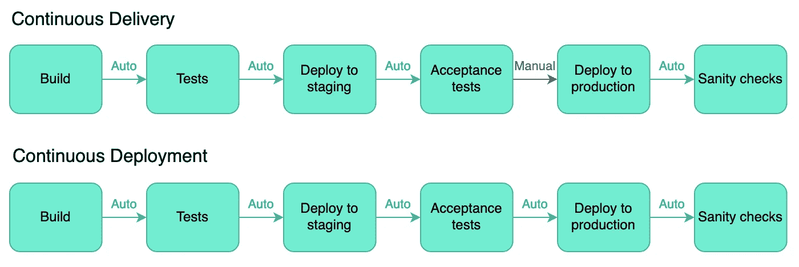
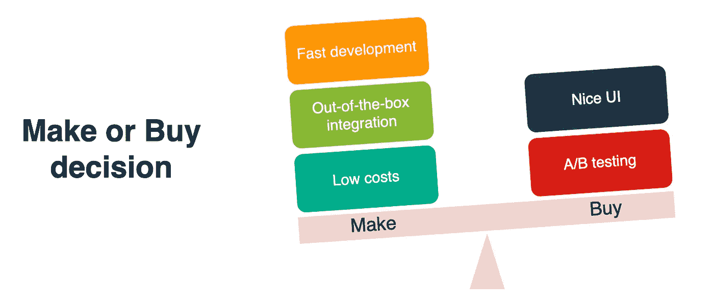
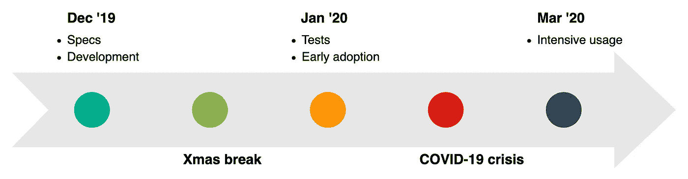
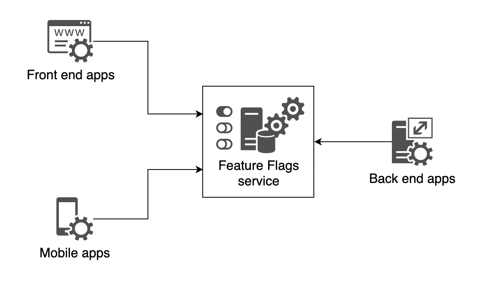

# 特性标志对管理者和开发者都很有价值

> 原文：<https://towardsdatascience.com/feature-flags-are-valuable-for-managers-as-well-as-developers-1c33bb4085fc?source=collection_archive---------39----------------------->

## 在部署过程中给每个人带来舒适

## 特性标志(又名特性切换)改变了我们的生命周期，特别是当与持续交付相结合时，而且成本很低。闪回。

照片由[雅诺什·迪格尔曼](https://unsplash.com/@janoschphotos?utm_source=medium&utm_medium=referral)在 [Unsplash](https://unsplash.com?utm_source=medium&utm_medium=referral) 上拍摄

如何在生产中部署一个新特性？您是否创建了应用程序的新版本，然后将其推向生产？先前的版本可以包含代码吗？

多年来，我看到开发团队将一个新特性的发布与一个版本的部署结合起来。当该特性不能正常工作时，唯一的解决方案是回滚整个版本，丢失所有其他更改。

# 连续交货

连续交付引入了一个新的想法:每一个单独的变更都会导致代码的交付，代码可以自动部署到产品中(连续的*部署*)或者需要手动操作(连续的*交付*)。以这种方式工作需要启用/禁用某个特性的能力，这正是特性标志的设计目的。

持续交付和持续部署之间的区别—作者举例说明

但是请注意**连续交付不是使用特征标志**的先决条件。不管工作方式如何，将业务上线与技术部署分离可能是可取的。

# 特色旗帜改变了我们的生活

作为一名架构师，我深信持续交付是像我这样的团队以及整个公司的未来。因为我的队友和经理都认同这一愿景，所以我们一直在努力实现这一目标。

为我们的日常业务每周(或一天)部署几次应用程序是一个巨大的成就，但事实是我们仍在努力推出新功能。当时，通过应用程序附带的一些配置来启用或禁用功能，激活功能的唯一方法是更新配置，即再次发布和部署应用程序。

为了解决这一痛点，我提出实现一个功能标志系统，这远不是一场革命，但却鲜为人知，往往被低估。这个想法是有一个系统来切换一个特性，可以通过查询来确定给定的特性是否是活动的。皮特·霍奇森在马丁·福勒的博客上发表了精彩的文章:

> 特性切换是一种强大的技术，允许团队在不改变代码的情况下修改系统行为。

## 制造还是购买

当我向管理层提出这个想法时，我被告知，也许我们应该为此购买一个工具——如果这样的工具还可以进行 A/B 测试和其他有趣的功能，那就太好了。当然，在这里考虑所有的选择，并根据公司的限制和能力做出好的决定是有意义的。

我主张这次制作我们自己的有几个原因，其中包括:

1.  我们的架构由分布式和可扩展的微服务组成，我知道为功能标志创建一个新的架构会很快，并立即满足我们的需求。
2.  尽管在某些阶段 A/B 测试肯定是有用的，但是对于第一步来说有点超出了范围，因为它不能解决我们的技术部署问题。这里的复杂性开销可能会降低它的调试速度，购买工具也意味着不可忽略的集成工作。

对功能标志组件做出决策或购买决策—作者举例说明

最后，管理层信任我，批准了范围有限的轻量级 PoC(无 A/B 测试，专注于技术特性)。仅仅经过一次冲刺，组件就准备好了，因为我们的基础设施就是为此而设计的，开发微服务是我们的日常业务。

## 保持简单愚蠢(吻)

提议的服务被设计为一个简单的 RESTful API，绑定了常见的 CRUD 操作:

来自我们的特征标志应用程序的 REST API 概述(JSON 有效负载省略)

注意，使用了`PATCH`方法而不是`PUT`，因为我们只应用了*特性*资源的部分更新(只有状态和最后修改信息)。

该组件依赖于自己专用的关系数据库，有一个由几列组成的基本表:名称、状态、截止日期、创建和修改信息。

应用程序中几乎没有逻辑，请求被转换并提交给数据库。出于显而易见的原因，我们只是实现了一些额外的安全和缓存层:

*   跟踪——跟踪谁触发了一个特性是可取的，当然首先要检查他们的特权级别。
*   稳定性——避免产生单点故障至关重要，尤其是考虑到系统可能会面临很大的负载(有许多关于系统无响应的故事，因为 DoS 是由太多的内部调用产生的)。

另一个关键点是，当服务由于某种原因没有响应时，能够管理来自调用该 API 的客户端的错误。这有传统的模式，如超时、断路器等。

## 习惯了

这种新机制的采用花了几天时间，直到每个 IT 团队都有机会推出一些新的技术功能(或禁用一些旧功能)，但每个开发人员都对此非常积极，因为它极大地促进了上线，并大大降低了压力水平。

仅仅几周后，我们的公司受到了新冠肺炎危机的强烈冲击，作为一家电子杂货公司，我们不得不调整许多业务流程来支持我们面临的突发需求。

我非常高兴地看到，在这样的关键时刻，开发人员加强了切换。通常情况下，当事情变得更困难时，人们会选择回到以前的、传统的、遗留下来的工作方式，但这里的情况并非如此。

特征标志采用表示法—作者插图

## 直接优势

以我的拙见，这是许多人意识到持续交付与功能标志相结合的难以置信的好处的时候:IT 团队能够走得很快，在短时间内开发紧急功能，这些功能立即被推向生产，功能激活只是一次点击——或者更有可能，一次`curl`之遥。

此外，当功能切换服务被公开时，我们的集群中的任何应用程序都可以访问它，因此当一个功能被激活时，每个部分(前端、后端、移动设备等)都会立即对齐。

功能标志服务公开—作者插图

另一个有趣的好处是，不仅功能可以被激活，而且*去激活*非常快，这是非常舒适的，因为它比完全回滚容易得多。

## 限制

认为给架构设置特性标志只有好处是天真的。一个特别的缺点是对于每个调用服务的客户来说额外的复杂性。这些代码必须被维护和测试，并且在特性被启动后，它必须被清理。

这给我们带来了另一个威胁:拥有太多的特性标志可能会适得其反。皮特·霍奇森在他的文章中再次警告我们:

> 特征标志有迅速增加的趋势，尤其是在首次引入时。它们是有用的，而且制造起来很便宜，所以经常会制造出很多。然而，切换带来了运输成本。它们要求你在代码中引入新的抽象或条件逻辑。它们也带来了巨大的测试负担。

为了降低风险，我们采用了这样的策略，即一旦插入了特性切换，就在 backlog 中创建一个故事，这样在*整理*(或 *backlog 精化*)会话期间，清理任务就在我们的雷达上了。

我们还定义了一个推荐的工作流来帮助开发人员使用该工具，并提供了一些指导原则。通常，命名约定是必要的，因为特性名称是标识符。

# 结论

特性标志提高了我们的生产力，减少了我们在部署过程中的压力，并使产品所有者(或一般的管理者)能够基于业务约束而不是技术发布系列来激活特性。我相信我们在这里获得的敏捷性是无价的，因为上市时间略有减少，而控制力增强了。

最终，所有人都赢了:开发者、管理者、产品所有者，最后是客户。这绝对是一步好棋。

# 资源

*   皮特·霍奇森在马丁·福勒的博客上写道