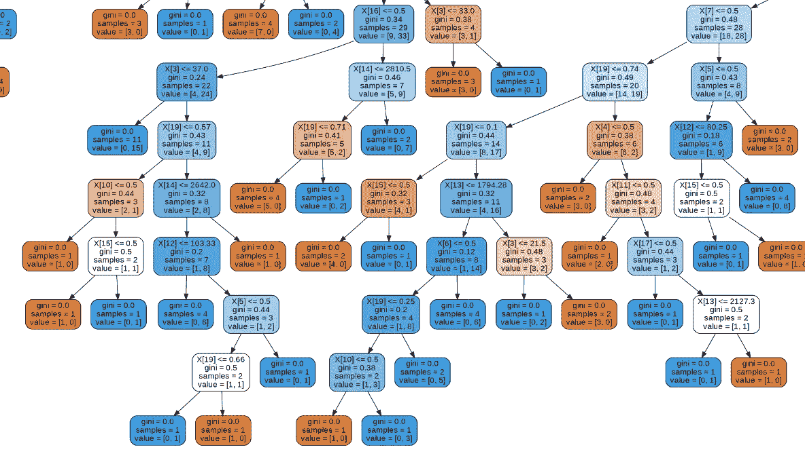
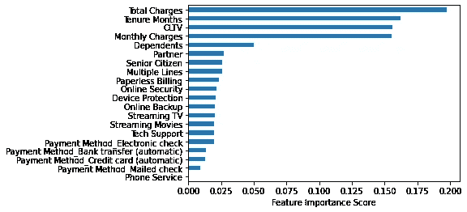
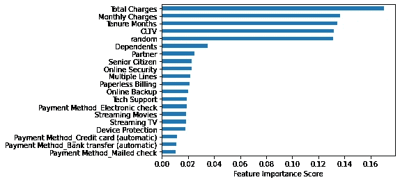
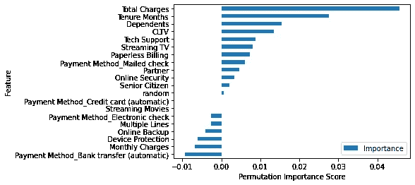
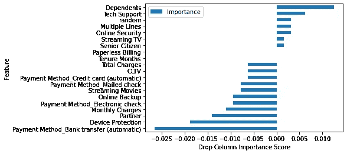

# 功能重要性可能在骗你

> 原文：<https://towardsdatascience.com/feature-importance-may-be-lying-to-you-3247cafa7ee7?source=collection_archive---------30----------------------->

## 有一种新的替代方法更加准确


paweczerwi ski 在 [Unsplash](https://unsplash.com?utm_source=medium&utm_medium=referral) 上的照片

我喜欢随机森林模型。它们很容易设置，不需要太多的力量来训练，并且很容易理解。这也是我在生产中使用的第一批模型之一。

随机森林是一个可解释的模型，这意味着你可以看到它在幕后做什么。在做一些类似的事情时，可解释性是非常有价值的，预测哪些客户将取消，因为不只是知道哪个客户将取消，你还可以知道为什么。

> 您可能不知道的是，功能重要性的计算完全独立于模型训练。

# 了解随机森林

有两种流行的方法来理解“为什么”，第一种是可视化整个决策树，这有助于你从头到尾看到整个过程，并逐步通过重要的领域。可能会让人不知所措，但是很强大。



在免费的 IBM telco 数据集上训练的流失模型的整体树形图的一个小片段

另一种方法是可视化要素重要性，它告诉我们模型预测最依赖的数据。这就好理解多了！



相同流失模型的特征重要性分数

# 功能重要性的工作原理

您可能不知道的是，功能重要性的计算完全独立于模型训练。这是模型已经做的最好的猜测。

有多种特征重要性算法，但我将重点关注 scikit-learn 中使用的一种算法，称为“杂质平均减少”

该算法测量该功能在创建决策树时减少不确定性或方差的有效性。就像我说的，最好的猜测。

它因其速度而被选中，但不幸的是，它并不总是准确的。

> 这不是实现中的错误，而是对许多数据集来说不合适的算法选择— [解释. ai](https://explained.ai/rf-importance/)

证明算法有多不准确的最好方法是在训练中插入完全随机的数据。

```
import numpy as np# For example, if you have a pandas DataFrame you can do this:
df['random'] = np.random.random(len(df))
# len(df) ensures it adds a random value for each row of your data
```

这些数据不会影响您的模型，但是，要素重要性算法似乎认为它会影响您的模型:



上述相同的流失模型将随机因素排在第五位

这是一个主要问题。如果随机数据是错的，还有哪些数据是错误的？

# 你应该用什么

谢天谢地，比我聪明的人已经想出了一个更好的方法来确定特征的重要性。有两种算法，你应该两种都用。

## 排列重要性

> “该功能的重要性在于基线和因置换色谱柱而导致的整体准确度下降之间的差异。”— [来源](https://explained.ai/rf-importance/#4)

简而言之，该方法更改列中的数据，然后测试这对模型准确性的影响程度。如果更改一列中的数据会降低准确性，则该列被认为是重要的。

您已经可以看到这将如何避免我们在默认算法中看到的随机数据问题。排列的重要性是巨大的，但它不应该单独使用。

这种算法的问题在于，当要素仅仅因为与其他高等级的要素相关而具有高等级时。



同样的模型，这是排列重要性的样子。看到兰登这次的结局了吗？

## 下降列重要性

Drop-column Importance 听起来确实如此。您从数据集中完全删除一列，重新训练模型，并查看它对准确性的影响。

如你所想，这可能会很贵。您可以通过使用训练数据的子集来降低成本，但这仍然很慢。如果理解真正的特性重要性对你的分析有价值，我仍然强烈推荐它。



在这个图表中，随机排序很差，但没有你想象的那么差。这就是为什么将这些方法结合起来并关注在这两种方法中排名都很好的列是很重要的。

现在你知道它们是什么了，让我们看看使用这些算法的两种常见方法。

# 方法 1:使用 Scikit-Learn

如果你正在使用 scikit-learn，那么我有一些好消息，在 2019 年 7 月，他们给它添加了排列重要性！首先，检查你正在使用的 scikit-learn 的版本。

```
import sklearnprint(sklearn.__version__) # This works on any package
```

如果您使用的是早于 0.22 的版本，那么您需要更新到至少 0.22 才能利用该功能。您可以使用以下命令进行升级:

```
pip install --upgrade scikit-learn
```

这里有一个简单的例子，说明如何将您的模型传递到新的`permutation_importance`函数中，并打印出结果。

```
from sklearn.linear_model import LogisticRegression
**from sklearn.inspection import permutation_importance**X = [[1, 9, 9],[1, 9, 9],[1, 9, 9],
     [0, 9, 9],[0, 9, 9],[0, 9, 9]]
y = [1, 1, 1, 0, 0, 0]# Train a basic logit model on this simple data,
# replace this with your model
clf = LogisticRegression().fit(X, y)**# Here's how you use permutation importance**
**result = permutation_importance(clf, X, y, n_repeats=10,
                                random_state=0)
print('Permutation importance scores', result.importances)**
```

这个例子是从[文档修改而来的](https://scikit-learn.org/stable/modules/generated/sklearn.inspection.permutation_importance.html#sklearn.inspection.permutation_importance)，值得一读。

删除列的重要性可以简单地通过删除每个列并重新训练来实现，如果您已经训练过一个模型，您就已经知道如何做了。

然而，我的 TDS 作者同事 [Eryk Lewinson](https://towardsdatascience.com/@eryk.lewinson) 写了一些漂亮的代码来帮助你在 scikit 中实现这一点——学习，以下是他的要点:

他写了[一篇关于功能重要性](/explaining-feature-importance-by-example-of-a-random-forest-d9166011959e)许多方面的精彩文章，如果你想深入了解，我强烈推荐你读一读。

# 方法 2:使用 rfpimp

发现这些问题并提出这些替代方案的研究人员有一个名为`rfpimp`的轻量级包。尽管 scikit-learn 增加了排列重要性，但我还是更喜欢它。

首先，你需要安装`pip install rfpimp`

接下来，将`clf`更改为您的模型(与前面的示例相同),并将您的培训和测试 x/y 列传递给这个代码片段:

```
# Yes, this is bad syntax, but it's how their docs recommend usage
from rfpimp import *# Calculate permutation and dropcolumn importances
perm_imp = permutation_importances(clf, X_train, y_train, oob_classifier_accuracy)
drop_imp = dropcol_importances(clf, X_train, y_train, X_test, y_test)print("Trained on {} rows with {} accuracy, {} oob score".format(data.shape[0], accuracy, clf.oob_score_))
```

如果您想要我上面显示的图表，下面是使用 matplotlib 将结果呈现到图表中的代码:

```
# You'll need to pip install matplotlib first
import matplotlib.pyplot as plt# Create charts based on results
perm_imp.sort_values(by=['Importance'], ascending=True).plot(kind='barh').set(xlabel="Permutation Importance Score")
drop_imp.sort_values(by=['Importance'], ascending=True).plot(kind='barh').set(xlabel="Drop Column Importance Score")plt.show()
```

这篇文章的大部分内容是对特伦斯·帕尔、凯雷姆·图尔古特鲁、克里斯多夫·奇泽和杰瑞米·霍华德在[所做的出色工作的简化。](https://explained.ai/rf-importance/)

他们做了所有艰苦的工作，我写了这篇文章，因为它对我有巨大的影响，很难找到简单的解释，我知道它的时候已经太晚了。

如果你在这篇文章中发现了价值，我想你也会喜欢我这篇关于熊猫常见错误的文章。

[](https://link.medium.com/tHYGFMVbo7) [## 请停止在熊猫身上做这 5 件事

### 作为一个在进入数据科学之前从事了十多年开发工作的人，我看到数据中有很多错误…

link.medium.com](https://link.medium.com/tHYGFMVbo7)