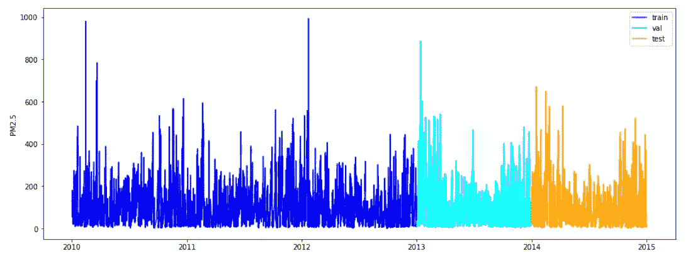
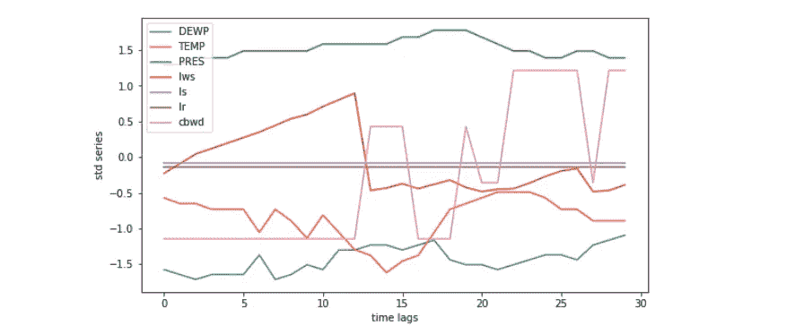
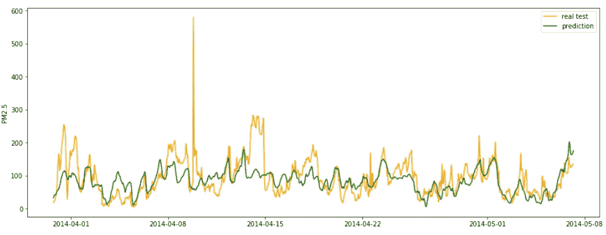
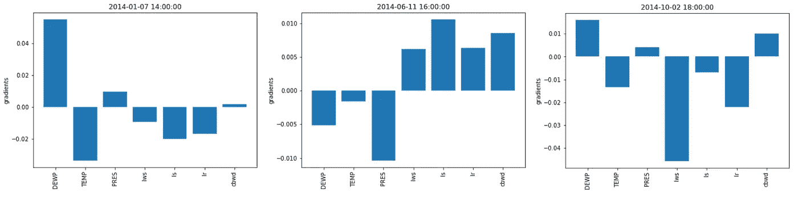
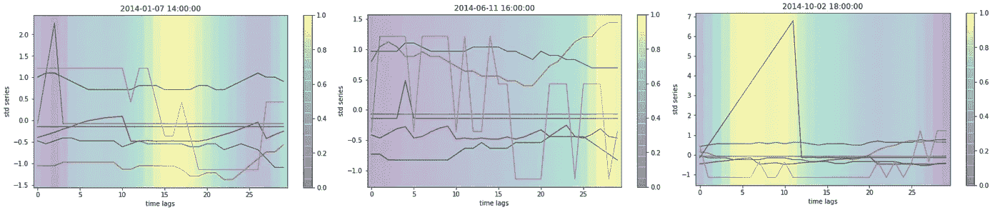

# 时间序列和递归神经网络的特征重要性

> 原文：<https://towardsdatascience.com/feature-importance-with-time-series-and-recurrent-neural-network-27346d500b9c?source=collection_archive---------7----------------------->

## 想象并解释你的深度学习模型想要对你说什么


在 [Unsplash](https://unsplash.com?utm_source=medium&utm_medium=referral) 上 [Shin Roran](https://unsplash.com/@metatzon297?utm_source=medium&utm_medium=referral) 拍摄的照片

神经网络通常被认为是黑盒算法。这是真的，但是通过一些技巧和一些有用的外部推理技术，我们可以从中提取大量信息。惊人的例子来自深度学习对图像的应用。从网络中提取内部特征有助于理解网络是如何工作的:著名的热图表示是指图像中模型做出决策的感兴趣区域。

这个知识提取过程背后的概念可以推广到深度学习的每个应用领域，如 NLP 和时间序列预测。实际上，我们可以用几行代码查询我们训练好的神经网络，检查输出滤波器对最终预测的重要性。

在这篇文章中，**我调查了一个被训练用来预测未来的神经网络所做的决定**。我使用了一个递归结构来自动学习时间维度的信息。通过一些简单的步骤，我们提取了理解模型输出所需的所有内容。我们这样做不需要使用任何额外的外部库，只是简单地压缩模型所学的东西。

# 数据

我们实验的数据是从 UCI 知识库中收集的。顾名思义,[北京 PM2.5 数据集](https://archive.ics.uci.edu/ml/datasets/Beijing+PM2.5+Data)存储 pm2.5 每小时观测值(从 2010 年到 2015 年)以及其他天气回归量，如温度、压力、风力和降雨量。我们的范围是提前一步预测 pm2.5 的准确值(下一小时的浓度)。



我们使用前三年作为训练集，后两年分别用于验证和测试。

为了训练我们的序列神经网络，我们将数据适当地重新排列为维度的 3D 序列:*样本 x 时间维度 x 特征*。下面是一个生成的长度为 30 小时的序列的示例，其中每个序列的值都用标准比例进行了标准化。



这是我们模型的输入样本示例。我们还用平均值和标准差来标准化目标。

# 模型

我们用于时间序列预测的神经网络结构如下:

```
def get_model(params):

    inp = Input(shape=(sequence_length, len(columns))) x = GRU(params['units_gru'], return_sequences=True)(inp)
    x = AveragePooling1D(2)(x)
    x = Conv1D(params['units_cnn'], 3, 
               activation='relu', padding='same', 
               name='extractor')(x)
    x = Flatten()(x)
    out = Dense(1)(x)

    model = Model(inp, out)
    model.compile(optimizer=Adam(lr=params['lr']), loss='mse')

    return model
```

递归层处理初始序列，以序列的形式返回完整的输出。平均池压缩输出，然后由一维卷积层处理。最后，在生成最终预测之前，所有的都被展平，变成 2D 维度。下面是测试集的子样本中预测值和实际值的比较(这是一个演示，我们对性能不感兴趣)。



训练好我们的神经网络后，我们就可以检验这些预测了。我提供了对模型输出的两种解释，对于每一个测试序列都可以很容易地检索到。

# 梯度重要性

我们的想法是检查每个单一输入特征对最终预测输出的贡献。在我们的例子中，贡献是由从预测的输入序列的微分操作中获得的梯度值给出的。

使用 Tensorflow，该方法的实施只需 3 个步骤:

*   使用 *GradientTape* 对象捕捉输入的梯度；
*   用 *tape.gradient* 获取梯度:该操作产生与单个输入序列相同形状的梯度(*时间维度 x 特征)；*
*   获取每个序列特征在时间维度上的平均影响。

```
def gradient_importance(seq, model): seq = tf.Variable(seq[np.newaxis,:,:], dtype=tf.float32) with tf.GradientTape() as tape:
        predictions = model(seq) grads = tape.gradient(predictions, seq)
    grads = tf.reduce_mean(grads, axis=1).numpy()[0]

    return grads
```

结果的一些图形示例如下所示:



平均梯度越高，该特征对最终预测的影响就越大。因此，对于上面显示的每种情况，我们可以确定在输入序列中，哪个变量对于预测下一个小时的 pm2.5 浓度值更重要。

# 预测的激活图

可视化哪个输入要素对预测影响最大有助于检测奇怪的行为。然而，它对神经网络为什么做出决定给出了更少的见解。这种方法倾向于强调输入的哪个特定部分影响输出值。

得出这些结论的过程是基于之前所做的相同假设。换句话说，我们需要操作梯度重要性。现在的区别是，这个操作是用一些内部滤波器计算的，而不是用原始输入序列。给定我们的内部卷积/递归滤波器，我们对输出进行梯度运算。为了确定每个过滤器在决策中的重要性，我们取其权重的平均值(梯度重要性),并将每个图乘以其相应的权重。如果激活图在向前传递过程中变亮，并且其梯度很大，这意味着激活的区域对决策有很大的影响。



用代码语言来说，几乎不需要做什么改变；特别是在我们操作归一化的最后，我们需要调整维度，以匹配输入序列。

```
def activation_grad(seq, model):

    seq = seq[np.newaxis,:,:]
    grad_model = Model([model.inputs], 
                       [model.get_layer('extractor').output, 
                        model.output]) # Obtain the predicted value and the intermediate filters
    with tf.GradientTape() as tape:
        seq_outputs, predictions = grad_model(seq) # Extract filters and gradients
    output = seq_outputs[0]
    grads = tape.gradient(predictions, seq_outputs)[0] # Average gradients spatially
    weights = tf.reduce_mean(grads, axis=0) # Get a ponderated map of filters according to grad importance
    cam = np.ones(output.shape[0], dtype=np.float32)
    for index, w in enumerate(weights):
        cam += w * output[:, index] time = int(seq.shape[1]/output.shape[0])
    cam = zoom(cam.numpy(), time, order=1)
    heatmap = (cam - cam.min())/(cam.max() - cam.min())

    return heatmap
```

# 摘要

在这篇文章中，我为时间序列预测建立了一个序列神经网络。我们的目的是从中提取有用的信息。为此，我们提供了两种不同的方法，基于梯度计算，在训练后进行推理。我已经表明，对于时序神经网络(递归/卷积)，在时间序列应用程序中，可以用简单的技巧和几行代码来研究深度模型的行为。

[**查看我的 GITHUB 回购**](https://github.com/cerlymarco/MEDIUM_NoteBook)

保持联系: [Linkedin](https://www.linkedin.com/in/marco-cerliani-b0bba714b/)