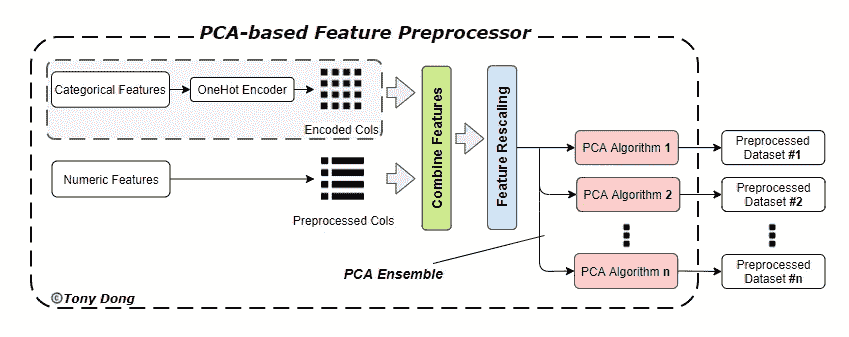
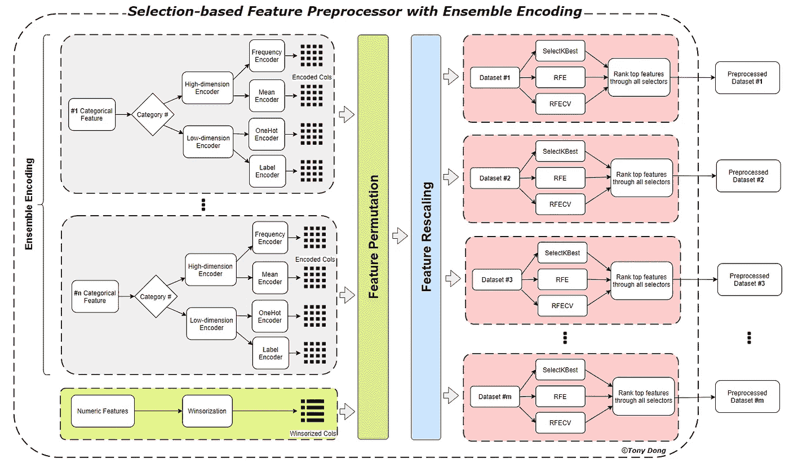
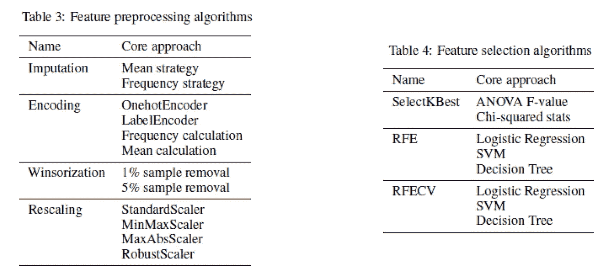
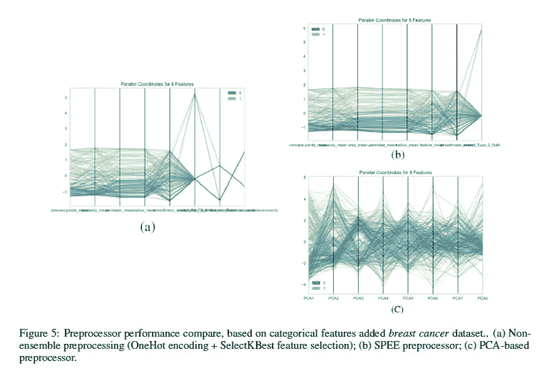

# 自动机器学习中的特征预处理器

> 原文：<https://towardsdatascience.com/feature-preprocessor-in-automated-machine-learning-c3af6f22f015?source=collection_archive---------38----------------------->

## [入门](https://towardsdatascience.com/tagged/getting-started)

## AutoML 中的主成分分析和特征选择策略

由[马库斯·斯皮斯克](https://unsplash.com/@markusspiske?utm_source=medium&utm_medium=referral)在 [Unsplash](https://unsplash.com?utm_source=medium&utm_medium=referral) 上拍摄的照片

自动机器学习(AutoML)工作流的性能取决于我们如何处理不同类型的变量并将其提供给模型，因为大多数机器学习模型只接受数字变量。因此，分类特征编码成为任何自动机器学习方法的必要步骤。它不仅提高了模型质量，而且有助于更好地进行特征工程。

AutoML 中有两种主要的特征约简策略:主成分分析和特征选择。

## PCA 策略:

PCA 在当前的 AutoML 框架中被广泛使用，因为它经常被用于降低大型数据集的维度，使得在原始数据本来就是高维的情况下应用机器学习变得更加实际。它依赖于特征元素之间的线性关系，通常不清楚这种关系是什么，因为它还“隐藏”了对数据中的方差贡献很小的特征元素，它有时可以消除影响机器学习模型性能的微小但重要的差异。

当 AutoML 系统处理分类特征时，PCA 的提取更加明显。大多数 AutoML 框架都使用 Onehot 算法，当分类特征包含大量类别时，该算法很容易生成高维虚拟特征。这将导致信息丢失，并且在没有人工诊断和中断的情况下难以调整。

典型的基于 PCA 的特征预处理器仅使用一个编码器来处理分类特征，并且具有至少一个 PCA 算法来实现特征约简。该预处理系统广泛应用于 AutoML 框架中，如 *Auto-ML* 和 *H2O autoML。*和 *Auto-Sklearn* 中有一个 PCA ensemble 组件，它允许多个 PCA 算法为不同的管道生成输入数据集。

基于 PCA 的特征预处理器(图片由作者提供)

## 特征选择策略:

为了设计一个健壮的自动化特征预处理器，[***optimal flow***](https://optimal-flow.readthedocs.io/en/latest/)选择特征选择作为替代策略，并引入集成编码机制来处理输入数据中的分类特征。这种基于选择的特征预处理器具有集成编码(SPEE)系统，通过集成编码方法提高了 AutoML 对多个分类特征的适应性。代替 PCA 算法，它通过集成特征选择算法保持特征关系信息和方差。

SPEE 预处理器(图片由作者提供)

对于特征选择集成组件，SPEE 使用 3 种主要算法:

*   使用标签/特征之间的方差分析 F 值或非负特征的卡方统计方法等选择 K 个最佳特征(Select K Best)。
*   使用逻辑回归、SVM 或决策树估计器的递归特征消除(RFE)
*   使用逻辑回归、SVM 或决策树估计器的递归特征消除和交叉验证选择(RFECV)

SPEE 的算法总结(图片由作者提供)

下图显示，SPEE 在感知趋势和模式时更好地处理了多个分类特征，这也将有利于进一步的 AutoML 工作流。这是基于添加了乳腺癌[数据集](https://github.com/tonyleidong/OptimalFlow/blob/master/optimalflow/webapp/input/breast_cancer.csv)的分类特征的性能比较图。OptimalFlow 的 SPEE 方法性能优于 AutoML 中典型的基于 PCA 的预处理器，保留了特征趋势信息和变换之间的差异。

(图片由作者提供)

## 参考资料:

[1]OptimalFlow GitHub。在[*https://github.com/tonyleidong/OptimalFlow*](https://github.com/tonyleidong/OptimalFlow)。

[2]杰克·利弗、马丁·克日温斯基和内奥米·奥特曼。主成分分析。在第 641–642 页的 *Nat 方法 14* 中。自然方法 2010。

[3]M. Pechenizkiy、A. Tsymbal 和 S. Puuronen。用于分类的基于 PCA 的特征转换:医疗诊断学中的问题。诉讼程序。第 17 届 IEEE 基于计算机的医疗系统研讨会，第 535–540 页。IEEE 2004。

[4]H2o.ai GitHub。[在*https://github.com/h2oai/h2o-3*在](https://github.com/h2oai/h2o-3)。

[5]Auto-Sklearn GitHub。在[https://github.com/automl/auto-sklearnT21](https://github.com/automl/auto-sklearn)里。