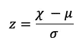
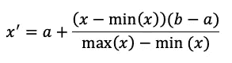
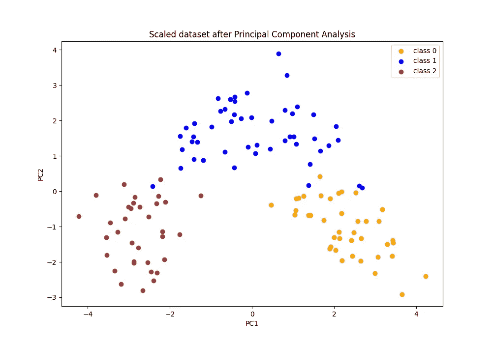
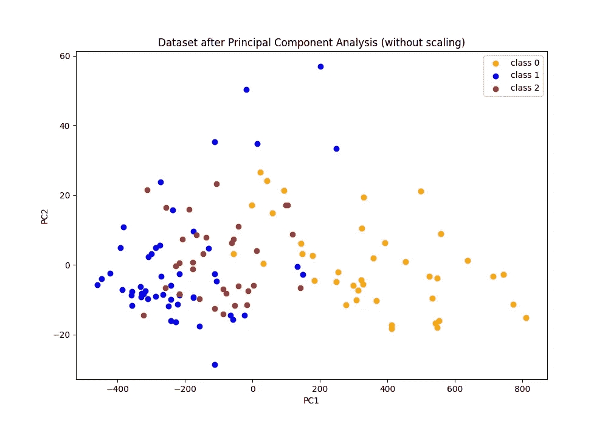

# 简而言之，特征缩放和标准化

> 原文：<https://towardsdatascience.com/feature-scaling-and-normalisation-in-a-nutshell-5319af86f89b?source=collection_archive---------17----------------------->

## 为什么、何时以及如何调整要素的比例


弗兰基·查马基在 [Unsplash](https://unsplash.com/search/photos/data?utm_source=unsplash&utm_medium=referral&utm_content=creditCopyText) 上拍摄的照片

机器学习中最基本的步骤之一可能是特征工程，在此过程中，我们试图尽可能多地构建预测特征。一旦我们设法到达那里，我们可能会以一堆性质明显不同的特征而告终。那么这种不规则性对模型性能有什么影响，我们该如何处理呢？

**特征工程**是创建预测特征的过程，这些预测特征可能有助于机器学习模型实现预期的性能。在大多数情况下，特征将是不同单位和数值范围的测量值。例如，您可能会考虑在您的特征空间中添加员工的年龄(理论上可以取 1 到 100 之间的值)以及他们的薪酬(可能在几千到几百万之间)。

在本文中，我将介绍**特征缩放**，这是一种预处理技术，用于处理 ML 模型需要缩放特征以获得最佳结果的情况。

# 数据集中具有不同比例和值范围的要素有什么问题？

当我们尝试构建的模型使用距离测量(如欧几里德距离)时，要素的比例和范围可能会有问题。这种模型可以是**K-最近邻、K-均值聚类、学习矢量量化(LVQ)** 等。

**主成分分析(PCA)** 也是一个很好的例子，说明了特征缩放的重要性，因为我们感兴趣的是使方差最大化的成分，因此我们需要确保我们是在进行比较。

此外，特征缩放还可以帮助使用梯度下降作为优化算法的模型，因为特征标准化有助于更快地达到收敛。

另一方面，对于*不*采用基于距离的方法的模型，不需要特征缩放(因此应用时无效)。这些包括基于树的模型，如决策树和随机森林。

# 什么是特征缩放？

**要素缩放**是对数据集中的要素值进行缩放的过程，以使它们按比例参与距离计算。两种最常用的特征缩放技术是*标准化(或 Z 分数标准化)*和*最小-最大缩放*。

**标准化**(也称为 Z 分数标准化/规范化)是重新调整特征 *χ* 的过程，以便它们具有 *μ=0* 和 *σ=1* 。从技术上讲，标准化通过减去平均值并除以标准差来集中和标准化数据。结果值被称为**标准分数**(或 z 分数)，计算如下:



特征值的标准化

在 Python 和 scikit 中——了解这可能会转化为

```
from sklearn.preprocessing import StandardScalerscaler = StandardScaler()
train_X = scaler.fit_transform(train_X)
test_X = scaler.transform(test_X)
```

**最小-最大缩放**是将特征值重新缩放到特定范围(例如[0，1])的过程。下面给出了将值缩放到[a，b]之间的范围-σ内的公式+ -(m:



将特征值缩放到范围[a，b]的公式

```
from sklearn.preprocessing import MinMaxScalerscaler = MinMaxScaler()
train_X = scaler.fit_transform(train_X)
test_X = scaler.transform(test_X)
```

# 我们在哪个建模步骤应用特征缩放？

值得一提的是，在应用任何类型的数据标准化之前，**我们首先需要将初始数据集分成训练集和测试集**。不要忘记测试数据点代表真实世界的数据。

如前所述，在标准化我们的数据时，会考虑均值和标准差。如果我们取整个数据集的平均值和方差，那么我们将把未来的信息引入到训练解释变量中。因此，我们应该对训练数据执行特征缩放，然后对测试实例也执行归一化，但是这次使用训练解释变量的平均值和标准偏差。这样，我们可以测试和评估我们的模型是否可以很好地推广到新的、看不见的数据点。

# 探索特征缩放对葡萄酒识别数据集的影响

现在让我们假设我们想要对 [UCI ML 葡萄酒识别数据集](https://archive.ics.uci.edu/ml/machine-learning-databases/wine/)执行主成分分析(PCA)。

> 这些数据是对生长在意大利同一地区但来自三个不同品种的葡萄酒进行化学分析的结果。这项分析确定了三种葡萄酒中 13 种成分的含量。

特征是*酒精、苹果酸、灰分、灰分的碱度、镁、总酚、黄酮类化合物、非黄酮类化合物、原花青素、颜色强度、色调、稀释酒的 od 280/od 315*和*脯氨酸*。目标是预测品种可能是*类 _0* 、*类 _1* 和*类 _2* 中的一个。

在这个例子中，我们将首先跳过特征缩放步骤，观察不进行预处理步骤时的结果。然后，我们将重复相同的程序，但这次使用特征缩放，最后比较结果。

**第一步:加载数据**

我们加载数据，并将我们的特征从它们各自的目标变量中分离出来:

```
from sklearn.datasets import load_winefeatures, target = load_wine(return_X_y=True)
```

**步骤 2:将初始数据集分成训练集和测试集**

如前所述，在采取预处理步骤之前，我们首先需要将数据集分成训练和测试。前者将用于模型训练，后者用于评估已训练模型的性能。

```
from sklearn.model_selection import train_test_splitX_train, X_test, y_train, y_test = train_test_split(
    features, target, test_size=0.3, random_state=42
)
```

**第三步:缩放数据**

现在，我们需要缩放数据，以便我们适合缩放器，并使用在观察训练示例后学习到的参数来转换训练集和测试集。

```
from sklearn.preprocessing import StandardScaler scaler = StandardScaler()
X_train_scaled = scaler.fit_transform(X_train)
X_test_scaled = scaler.transform(X_test)
```

**第四步:使用 PCA 进行降维**

现在我们可以进行主成分分析。为了方便起见，我将使用两个组件，以便稍后在二维空间中更容易可视化结果:

```
pca = PCA(n_components=2)
X_train_dim_red = pca.fit_transform(X_train_scaled)
X_test_dim_red = pca.transform(X_test_scaled)
```

现在，我们可以在缩放和执行降维后快速可视化训练实例(下面给出了代码的链接):



应用 StandardScaler 和 PCA 后的训练示例

下图生成了相同的图，但这次没有应用特征缩放:



应用 PCA 后的训练示例(但不是 StandardScaler)

**第五步:训练和评估模型**

最后，我们可以拟合高斯朴素贝叶斯模型，并在测试实例上评估该模型的性能:

```
from sklearn.naive_bayes import GaussianNBmodel = GaussianNB()
model.fit(X_train_dim_red, y_train)
predictions = model.predict(X_test_dim_red)
print(f'Model Accuracy: {accuracy_score(y_test, predictions):.2f}')
>>> Model Accuracy: 0.98
```

在测试实例上，模型准确率达到 98%。在没有应用缩放的情况下，测试精度下降到 0.81%。

**完整的代码可以在** [**Github 上找到，作为一个要点。**](https://gist.github.com/gmyrianthous/59ce220c2785225d2efd4dd8cc57730f)

# 结论

特征缩放是我们在训练机器学习模型之前需要考虑的最基本的预处理步骤之一。正如我们已经讨论过的，我们需要理解是否需要特性缩放。这取决于我们要构建的模型(例如，基于树的模型不需要任何类型的特征缩放)和我们特征值的性质。

[**成为会员**](https://gmyrianthous.medium.com/membership) **阅读介质上的每一个故事。你的会员费直接支持我和你看的其他作家。**