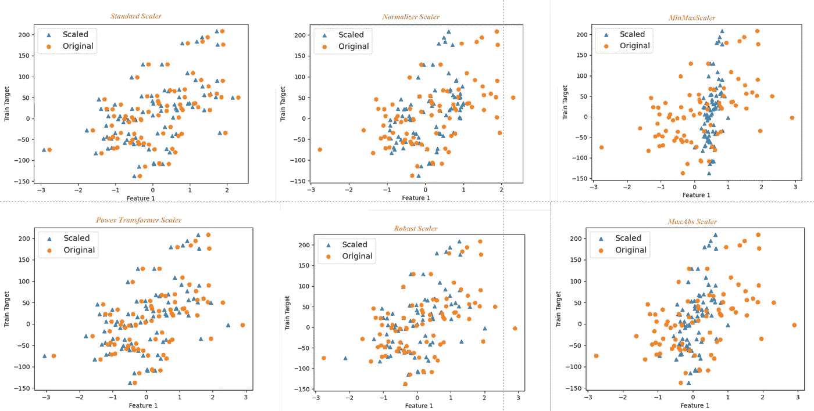
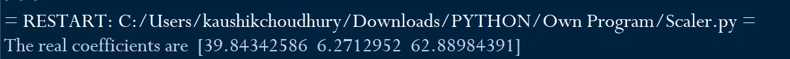
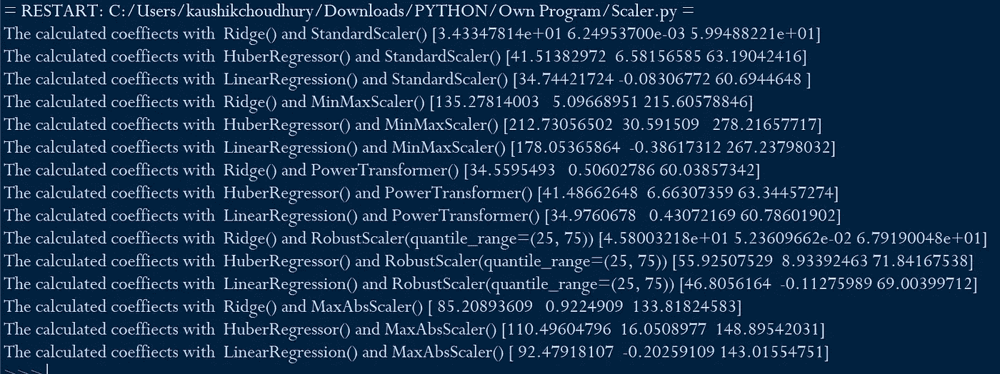
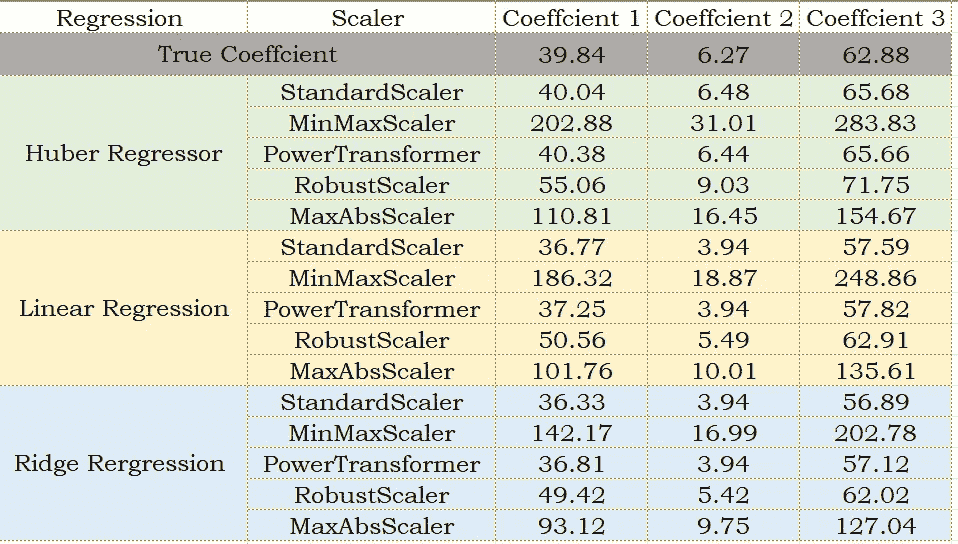
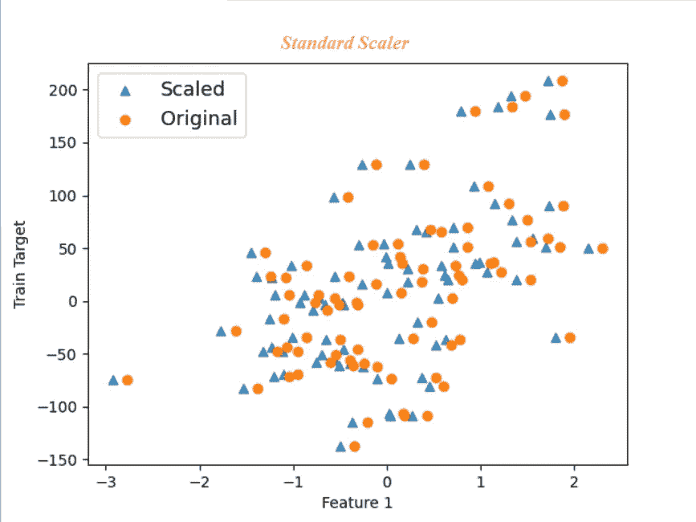
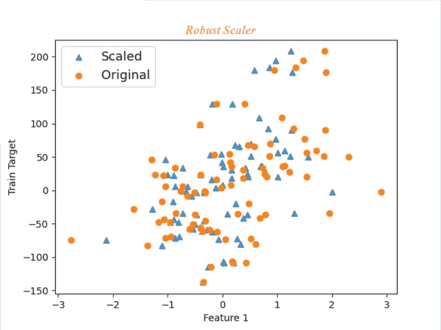
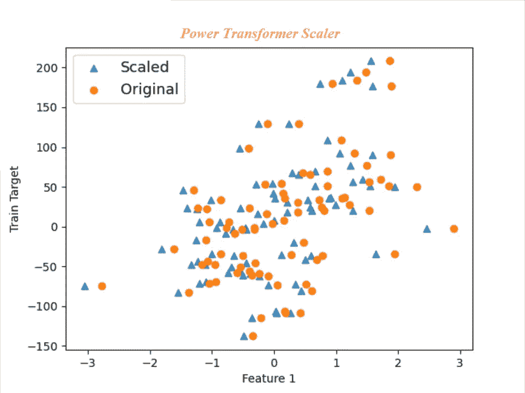
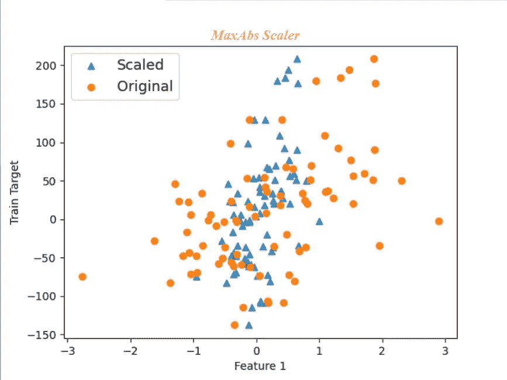

# 特征缩放—不同 Scikit-Learn 缩放器的效果:深入探讨

> 原文：<https://towardsdatascience.com/feature-scaling-effect-of-different-scikit-learn-scalers-deep-dive-8dec775d4946?source=collection_archive---------24----------------------->

## [内部 AI](https://towardsdatascience.com/machine-learning/home)

## 特征缩放是机器学习数据预处理的一个重要元素。实现正确的缩放器对于机器学习算法的精确预测同样重要。



文章中讨论的由作者编写的代码中的情节

在监督机器学习中，我们通过向算法提供输入变量值来计算输出变量值。机器学习算法将输入和输出变量与数学函数相关联。

> 输出变量值= (2.4*输入变量 1)+(6 *输入变量 2) + 3.5

每种机器学习算法背后都有一些特定的假设。为了建立一个准确的模型，我们需要确保输入数据满足这些假设。如果提供给机器学习算法的数据不满足假设，那么模型的预测准确性就会受到损害。

sklearn 中的大多数监督算法需要以零为中心的标准正态分布输入数据，并且具有相同数量级的方差。如果一个输入变量的取值范围为 1 到 10，而另一个变量的取值范围为 4000 到 700，000，那么第二个输入变量值将占主导地位，算法将无法像预期的那样正确地从其他特征中学习。

在本文中，我将说明在 scikit-learn 中使用不同的缩放器和三种不同的回归算法缩放输入变量的效果。

在下面的代码中，我们导入将用于分析的包。我们将在 make_regression 的帮助下创建测试数据

```
from sklearn.datasets import make_regression
import numpy as np
from sklearn.model_selection import train_test_split
from  sklearn.preprocessing import *
from sklearn.linear_model import*
```

我们将使用具有三个独立(输入)变量的 100 条记录的样本量。此外，我们将使用“np.random.normal”方法注入三个异常值

```
X, y, coef = make_regression(n_samples=100, n_features=3,noise=2,tail_strength=0.5,coef=True, random_state=0)X[:3] = 1 + 0.9 * np.random.normal(size=(3,3))
y[:3] = 1 + 2 * np.random.normal(size=3)
```

我们将打印样本数据集的真实系数作为参考，并与预测系数进行比较。

```
print("The real coefficients are ". coef)
```



我们将使用 80 条记录来训练该算法，并保留算法先前未看到的剩余 20 个样本，用于测试模型的准确性。

```
X_train, X_test, y_train, y_test = train_test_split(X, y,           test_size=0.20,random_state=42)
```

我们将研究 scikit-learn StandardScaler、MinMaxScaler、power transformers、RobustScaler 和 MaxAbsScaler 的缩放效果。

```
regressors=[StandardScaler(),MinMaxScaler(),
PowerTransformer(method='yeo-johnson'),
RobustScaler(quantile_range=(25,75)),MaxAbsScaler()]
```

我们将使用的所有回归模型都在一个列表对象中提到。

```
models=[Ridge(alpha=1.0),HuberRegressor(),LinearRegression()]
```

在下面的代码中，我们通过从前面定义的回归变量列表中连续调用每个缩放器来缩放训练和测试样本输入变量。我们将绘制原始第一个输入变量的散点图，并对第一个输入变量进行缩放，以深入了解各种缩放。我们将在本文稍后的部分看到这些图。

此外，我们用来自不同定标器的定标输入变量拟合每个模型，并预测测试样本数据集的因变量的值。

```
for regressor in regressors: X_train_scaled=regressor.fit_transform(X_train)
    X_test_scaled=regressor.transform(X_test)
    Scaled =plt.scatter(X_train_scaled[:,0],y_train, marker='^', alpha=0.8)
    Original=plt.scatter(X_train[:,0],y_train)
    plt.legend((Scaled, Original),('Scaled', 'Original'),loc='best',fontsize=13)
    plt.xlabel("Feature 1")
    plt.ylabel("Train Target")         
    plt.show() for model in models:
        reg_lin=model.fit(X_train_scaled, y_train)
        y_pred=reg_lin.predict(X_test_scaled)   
        print("The calculated coeffiects with ", model , "and", regressor, reg_lin.coef_)
```

最后，打印模型拟合的预测系数，以便与真实系数进行比较。



表格形式的结果

乍看之下，我们可以推断出，相同的回归估计量根据标度预测不同的系数值。使用 MaxAbsScaler 和 MinMax scaler 预测的系数与真实的系数值相差甚远。
从这个例子可以看出合适的定标器对模型预测精度的重要性。

> 作为一个自我探索和学习的练习，我将鼓励大家计算每个训练和测试集组合的 R2 分数和均方根误差(RMSE ),并相互比较。

现在我们已经了解了缩放和选择合适的缩放器的重要性，我们将进入每个缩放器的内部工作。

*标准定标器:*是各种现实生活机器学习项目中使用的流行定标器之一。每个输入变量样本集的平均值和标准偏差分别确定。然后从每个数据点中减去平均值，除以标准偏差，将变量转换为零平均值和一的标准偏差。它不会将值限制在特定的范围内，对于一些算法来说，这可能是一个问题。



标准缩放器——基于本文讨论的代码的原始与缩放图

*最小最大值缩放器:*用最小最大值缩放器在 0 和 1 之间缩放的所有数值

Xscaled= (X-Xmin)/(Xmax-Xmin)

最小最大值缩放受异常值的影响很大。如果我们的数据集中有一个或多个极端异常值，那么最小-最大缩放器会将正常值放得非常接近，以适应 0 和 1 范围内的异常值。我们之前看到，使用最小最大值缩放器预测的系数大约是真实系数的三倍。我建议不要对离群数据集使用*最小最大缩放器*。



鲁棒定标器——基于本文讨论的代码的原始与定标图

*鲁棒定标器-* 鲁棒定标器是最适合离群数据集的定标器之一。它根据四分位范围调整数据。四分位范围是大多数数据点存在的中间范围。

*Power Transformer Scaler:*Power Transformer 试图像高斯一样缩放数据。它试图通过最大似然估计的最优缩放来稳定方差和最小化偏斜。有时，Power transformer 无法缩放类似高斯的结果，因此检查缩放数据的绘图很重要



电源变压器定标器——基于本文讨论的代码的原始与定标图

*max ABS Scaler:*max ABS Scaler 最适合缩放稀疏数据。它通过除以每个要素中的最大值来缩放每个要素。



max ABS Scaler——基于本文讨论的代码的原始与缩放图

例如，如果一个输入变量的原始值为[2，-1，0，1]，那么 *MaxAbs* 会将其缩放为[1，-0.5，0，0.5]。它将每个值除以最高值，即 2。不建议使用大型异常数据集。

我们已经知道，使用合适的缩放器缩放输入变量与选择正确的机器学习算法一样重要。很少有定标器对异常数据集非常敏感，而其他定标器则非常稳定。Scikit-Learn 中的每个缩放器都有其优势和局限性，我们在使用它时需要注意它。

它还强调了最初执行探索性数据分析(EDA)的重要性，以识别异常值和其他特性的存在与否，从而指导选择合适的定标器。

在我的文章[探索性数据分析(EDA)的 5 种高级可视化](/5-advanced-visualisation-for-exploratory-data-analysis-eda-c8eafeb0b8cb)中，你可以了解更多这方面的内容。

如果你想学习一种结构化的方法来识别适当的独立变量以做出准确的预测，那么请阅读我的文章[“如何识别机器学习监督的正确独立变量](/how-to-identify-the-right-independent-variables-for-machine-learning-supervised-algorithms-439986562d32)。

```
**"""Full Code"""****from sklearn.datasets import make_regression
import numpy as np
from sklearn.model_selection import train_test_split
from  sklearn.preprocessing import *
from sklearn.linear_model import*
import matplotlib.pyplot as plt
import seaborn as sns****X, y, coef = make_regression(n_samples=100, n_features=3,noise=2,tail_strength=0.5,coef=True, random_state=0)****print("The real coefficients are ", coef)****X[:3] = 1 + 0.9 * np.random.normal(size=(3,3))
y[:3] = 1 + 2 * np.random.normal(size=3)****X_train, X_test, y_train, y_test = train_test_split(X, y,test_size=0.20,random_state=42)****regressors=[StandardScaler(),MinMaxScaler(),PowerTransformer(method='yeo-johnson'),RobustScaler(quantile_range=(25, 75)),MaxAbsScaler()]****models=[Ridge(alpha=1.0),HuberRegressor(),LinearRegression()]****for regressor in regressors:
    X_train_scaled=regressor.fit_transform(X_train)
    X_test_scaled=regressor.transform(X_test)
    Scaled =plt.scatter(X_train_scaled[:,0],y_train, marker='^', alpha=0.8)
    Original=plt.scatter(X_train[:,0],y_train)
    plt.legend((Scaled, Original),('Scaled', 'Original'),loc='best',fontsize=13)
    plt.xlabel("Feature 1")
    plt.ylabel("Train Target")         
    plt.show()
    for model in models:
        reg_lin=model.fit(X_train_scaled, y_train)
        y_pred=reg_lin.predict(X_test_scaled)   
        print("The calculated coeffiects with ", model , "and", regressor, reg_lin.coef_)**
```