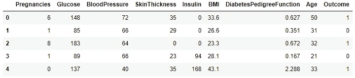
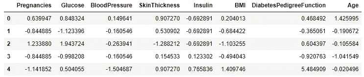
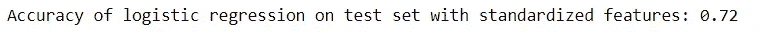
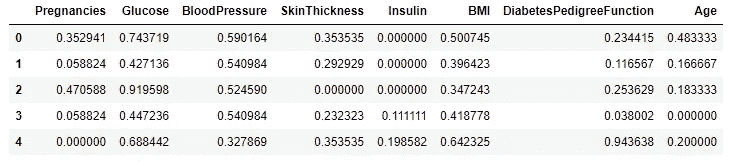
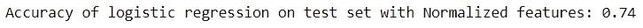
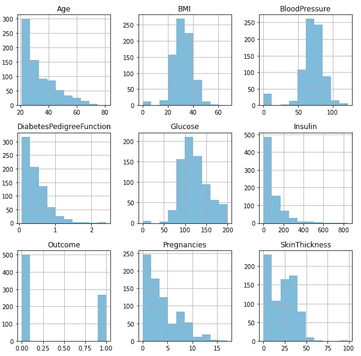
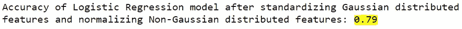

# 要素缩放-根据分布有效选择输入变量

> 原文：<https://towardsdatascience.com/feature-scaling-effectively-choose-input-variables-based-on-distributions-3032207c921f?source=collection_archive---------9----------------------->

## 演示如何明智地选择数值变量进行缩放，从而提高模型的准确性


照片由 Siora Photography 在 Unsplash 上拍摄

在构建 ML 模型时，我们经常会遇到处理由不同范围、单位和数量组成的各种数值变量的情况。作为惯例，我们将在构建模型之前对所有特征应用标准化或规范化技术。然而，在决定应用哪种技术进行特征缩放之前，研究数据的分布是至关重要的。

在本文中，我们将讨论标准化和规范化之间的区别，并理解数据的分布。最后，我们将看到如何根据特征的高斯和非高斯分布来选择策略，以提高逻辑回归模型的性能。

## 标准化与规范化

这两种技术有时可以互换使用，但它们指的是不同的方法。

***标准化*** :该技术将数据转换为平均值为零，标准差为 1。

***规范化*** :该技术将变量中的值在 0 和 1 之间转换。

我们正在使用皮马印度糖尿病数据集，你可以在这里找到相同的[

```
import pandas as pd
import numpy as np
data = pd.read_csv(“Pima Indian Diabetes.csv”)
data.head()
```



数据集的前几条记录

从上面我们可以看到，数值变量在不同的范围内变化，结果就是目标变量。我们将执行缩放技术和应用逻辑回归。

👉**将标准化应用于所有特征和建模。**

从 sklearn 库中，我们需要使用 StandardScaler 来实现标准化。

```
from sklearn.preprocessing import StandardScaler
Y = data.Outcome
X = data.drop("Outcome", axis = 1)
columns = X.columns
scaler = StandardScaler()
X_std = scaler.fit_transform(X)
X_std = pd.DataFrame(X_std, columns = columns)
X_std.head()
```



应用标准化后输入要素的转换

让我们进行训练并测试标准化特征的分割。

```
from sklearn.model_selection import train_test_split
x_train, x_test, y_train, y_test = train_test_split(X_std, Y, test_size = 0.15, random_state = 45)
```

现在，我们将对标准化数据集应用逻辑回归。

```
#Building Logistic Regression model on the Standardized variables
from sklearn.linear_model import LogisticRegression
lr_std = LogisticRegression()
lr_std.fit(x_train, y_train)
y_pred = lr_std.predict(x_test)
print('Accuracy of logistic regression on test set with standardized features: {:.2f}'.format(lr_std.score(x_test, y_test)))
```



具有标准化特征的模型的准确性

从上面我们可以看出，应用标准化技术的所有特征的模型的准确度是 72%。

👉**对所有特征和建模应用标准化。**

从 sklearn 库中，我们需要使用 MinMaxScaler 来实现规范化。

```
from sklearn.preprocessing import MinMaxScaler
norm = MinMaxScaler()
X_norm = norm.fit_transform(X)
X_norm = pd.DataFrame(X_norm, columns = columns)
X_norm.head()
```



应用归一化后输入要素的变换

让我们进行训练并测试归一化特征的分割。

```
# Train and Test split of Normalized features
from sklearn.model_selection import train_test_split
x1_train, x1_test, y1_train, y1_test = train_test_split(X_norm, Y, test_size = 0.15, random_state = 45)
```

对规范化数据集应用逻辑回归。

```
#Building Logistic Regression model on the Normalized variables
from sklearn.linear_model import LogisticRegression
lr_norm = LogisticRegression()
lr_norm.fit(x1_train, y1_train)
y_pred = lr_norm.predict(x1_test)
print(‘Accuracy of logistic regression on test set with Normalized features: {:.2f}’.format(lr_norm.score(x1_test, y1_test)))
```



具有归一化特征的模型的精度

当所有特征都归一化时，模型的准确度为 74%。

👉**了解特征分布**

让我们画出变量的直方图来研究分布。

```
# Plotting the histograms of each variable
from matplotlib import pyplot
data.hist(alpha=0.5, figsize=(20, 10))
pyplot.show()
```



每个特征的直方图，以了解分布情况

***高斯分布*** —身体质量指数，血压，葡萄糖。

***非高斯分布*** —年龄、糖尿病、胰岛素、怀孕、皮肤厚度

## 👉归一化非高斯特征和标准化类高斯特征

最后，我们来到一个实验，等待选择变量，并根据同一数据集上的分布应用两种策略。

为了应用这个策略，我们将使用 sklearn 中的列转换器和管道概念，因为我们需要通过对列进行子集化来实现混合类型的技术。

如上所述，我们正在为高斯和非高斯特征启动不同的流水线

```
from sklearn.compose import ColumnTransformer
from sklearn.pipeline import Pipeline
**Standardize_Var = ['BMI','BloodPressure', 'Glucose']**
Standardize_transformer = Pipeline(steps=[('standard', StandardScaler())])
**Normalize_Var = ['Age','DiabetesPedigreeFunction','Insulin','Pregnancies','SkinThickness']**
Normalize_transformer = Pipeline(steps=[('norm', MinMaxScaler())])
```

现在，让我们用标准化和规范化的选择性特征对数据建立逻辑回归模型。

```
x2_train, x2_test, y2_train, y2_test = train_test_split(X, Y, test_size=0.2)
**preprocessor = ColumnTransformer(transformers=
 [(‘standard’, Standardize_transformer, Standardize_Var),
 (‘norm’, Normalize_transformer, Normalize_Var)])**clf = Pipeline(steps=[(‘preprocessor’, preprocessor),
 (‘classifier’, LogisticRegression(solver=’lbfgs’))])
clf.fit(x2_train, y2_train)
print(‘Accuracy after standardizing Gaussian distributed features and normalizing Non-Gaussian features: {:.2f}’.format(clf.score(x2_test, y2_test)))
```



👉**最终关键细节**

下面是迄今为止我们已经建立的不同模型的精度细节。

所有特征标准化后的精度: **0.72**

所有特征归一化后的精度: **0.74**

***对高斯分布特征进行标准化，对非高斯分布特征进行归一化后的精度:0.79***

## 摘要

当我们处理基于梯度下降的算法(线性和逻辑回归、神经网络)和基于距离的算法(KNN、K 均值、SVM)时，我们需要执行特征缩放，因为这些算法对数据点的范围非常敏感。在处理基于树的算法时，这一步不是强制性的。

本文的主要重点是解释数据的分布如何在特征缩放中发挥重要作用，以及如何选择基于高斯和非高斯分布的策略来提高模型的整体精度。

你可以从我的 GitHub [ [profile](https://github.com/SushmithaPulagam/FeatureScaling-with-Distributions) ]中获得完整的代码

感谢阅读，快乐学习！🙂