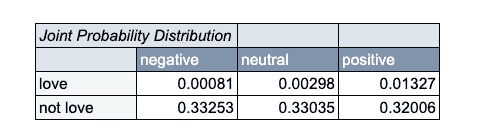
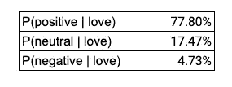
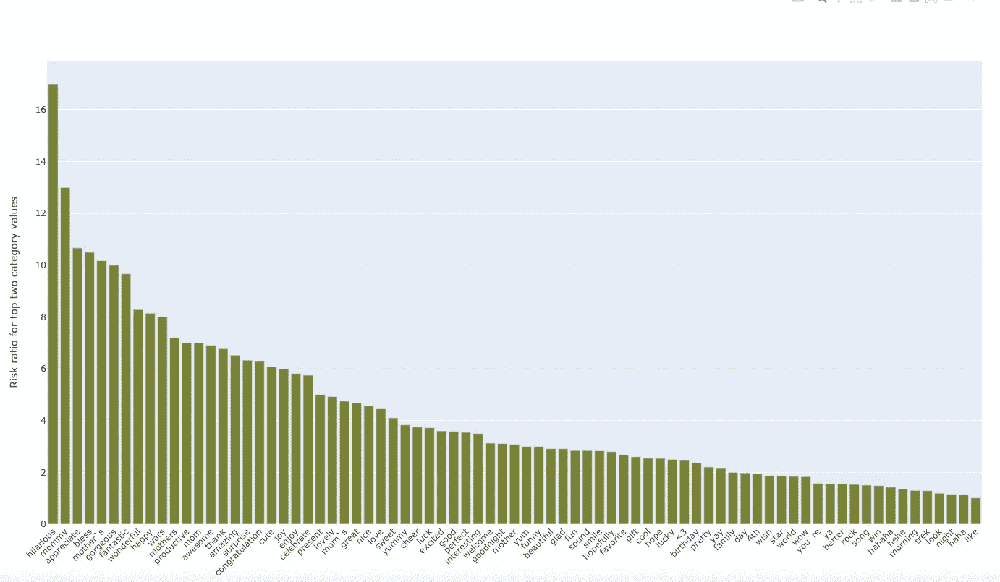
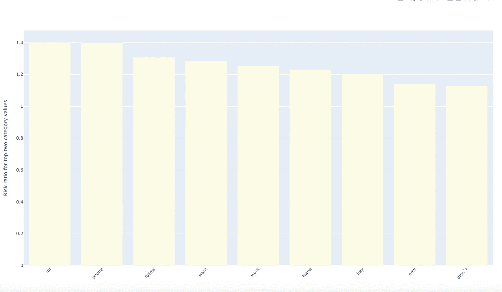
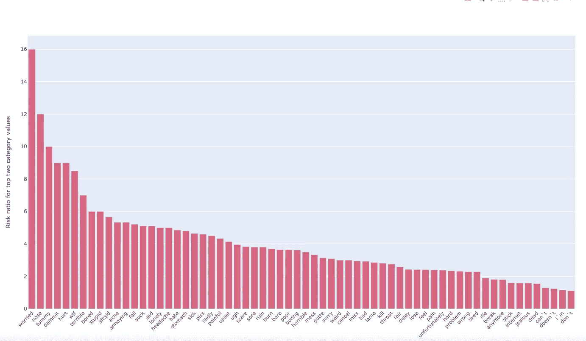

# 推特情感分类中的特征区分

> 原文：<https://towardsdatascience.com/feature-selection-a1450dd4ec22?source=collection_archive---------64----------------------->

## 使用条件概率比来衡量不同特征的区分程度

这是我关于推特情感分类的特征选择和特征工程系列文章的第 3 部分。(前面的部分在这里链接:[第一部分](/nlp-with-naive-bayes-feature-selection-in-python-15c4d327aad5)和[第二部分](https://medium.com/@benjohnsonlaird/text-classification-with-feature-selection-using-likelihoods-part-2-c28793575cbf))。

该数据集由来自 Kaggle 的 27482 条推文组成。在这篇博客中，我们来看看前 150 个已知特征是什么；他们是多么有鉴别力；并举例说明了它们在区分推文表达积极、中立还是消极情绪方面的用途。

区别特征是其存在更能表明一种情感胜过其他情感。以下段落将展示一种测量每个特征的区别效果的方法。

对于每个特征，我们知道该特征相对于三个类别标签的完整联合概率分布(JPD ):正面、中性和负面推特情感。这是用于计算互信息的 JPD(见[第二部分](https://medium.com/@benjohnsonlaird/text-classification-with-feature-selection-using-likelihoods-part-2-c28793575cbf))。

在推特的数据集中，交互信息的最高特征是单词 *love* 。其联合概率分布为:



图 1:“爱”的联合概率分布

现在，给定特征 *love* 并且是 JPD，让我们确定该特征的区分度。首先，我们需要计算三个条件概率:

```
P(positive | love)
P(neutral | love)
P(negative | love)
```

条件概率定义为:

```
P(A | B) = P(A & B) / P(B)
```

因此，从图 1 中的 JPD 得出三种条件概率:



图 2 给定“爱”的推特情感的条件概率

# 特征辨别的风险比

因此，有一个单调的趋势:一条包含*爱*的推文是正面的概率远远高于它是中性的概率，而中性的概率又高于它是负面的概率。

我们可以通过简单地将较高的概率除以较低的概率来量化高得多的风险比率。为简单起见，我们将只考虑最有可能和第二有可能的结果之间的比较。对于*爱*来说，这给出了风险比:

```
P(positive | love) / P(neutral | love) = **4.45**
```

这意味着，如果一条推文中有单词 *love* ，那么积极情绪的可能性是中性情绪的 4 倍多。

接下来的三个条形图按照风险比率的等级顺序显示了最上面的积极、中性和消极情绪特征。最明显的特征在每个图表的最左边。



图 3 按特征区分度排序的正面情感特征(风险比)

对于积极情绪特征，我们可以将集合分为:

```
that make obvious sense: 
       hilarious, fantastic & wonderfulnouns that tend to evoke good feeling: 
       mom, a present, a gift, a birthday, a songsome mysteries:
       star, wars, morning, night, world
```



图 4 按特征区分度分类的中性情感特征(风险比)

对于中性情绪特征，有两点是显而易见的。首先，前 150 名中只有 9 个功能(根据互信息)。第二，那些在那里的人具有较低的辨别力(风险比小于 1.4)。



图 5 按特征区分度排序的负面情绪特征(风险比)

消极情绪的特征有:

```
negative verbs: can't, doesn't, don't
references to ailments: ache, headache, sick
negative emotions: worried, bored, sad, lonely, upset
```

在我的下一篇文章中，我将继续分析这些特征，特别是任何可能也有意义的单词搭配；无论是与前 150 名相比还是与目标情绪相比。