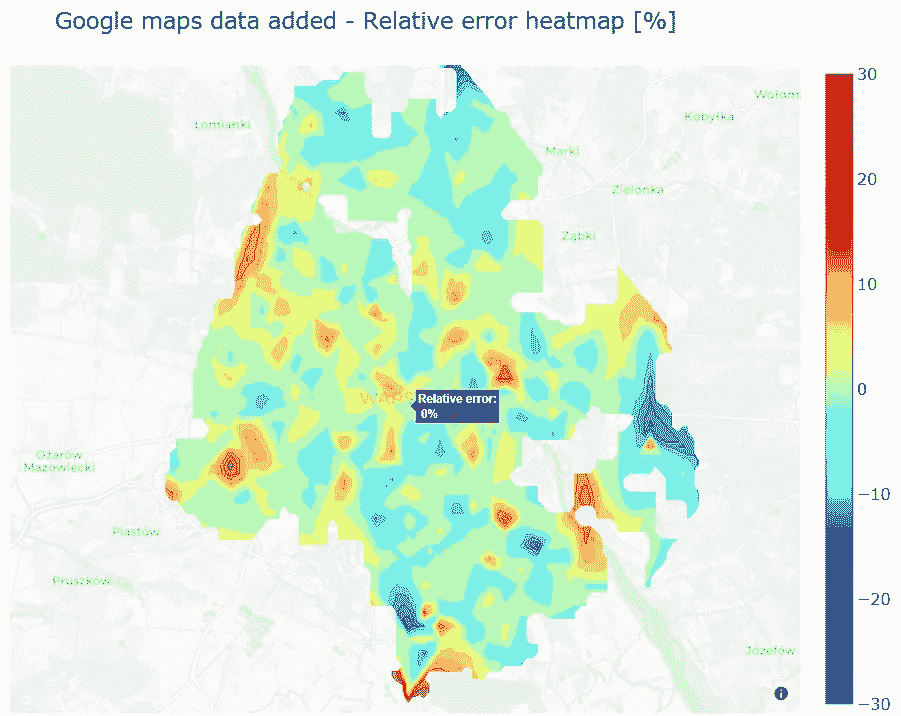

# 空间数据分析的特征选择和误差分析路线图

> 原文：<https://towardsdatascience.com/feature-selection-and-error-analysis-while-working-with-spatial-data-a9d38af05b88?source=collection_archive---------35----------------------->

## 在发现算法遗漏了一些关键细节之前，您是否曾花费数小时试验模型架构和参数调整？了解如何在处理空间数据时进行有效的要素选择和错误分析。


错误分析是训练任何 ML 模型的关键部分之一。尽管它很重要，但我发现自己在调查算法造成的错误之前，花了太多的时间来试验模型架构和超参数调整。有效的错误分析需要结合输入数据、算法的良好知识，以及我们试图解决的问题的领域知识。

使用空间数据使结构化误差分析变得更加容易，因为您可以通过绘制误差图来提取大量信息。在这篇文章中，我将重点介绍使用随机森林回归法对华沙的房地产价格进行基准评估。

关键数据源包括来自华沙的约 25，000 个房产销售报价，有近 100 个特征。在项目开发过程中，在错误分析过程中发现需要额外的位置信息后，使用额外的数据源丰富了这些数据。我将展示错误分析驱动开发过程的关键阶段。

GitHub 上有完整的代码和数据来源:[https://GitHub . com/Jan-Majewski/Project _ Portfolio/blob/master/03 _ Real _ Estate _ pricing _ in _ Warsaw/03 _ 03 _ Feature _ selection _ and _ error _ analysis . ipynb](https://github.com/Jan-Majewski/Project_Portfolio/blob/master/03_Real_Estate_pricing_in_Warsaw/03_03_Feature_selection_and_error_analysis.ipynb)

使用 nbViewer 访问代码以获得完整的交互性:[https://nb viewer . jupyter . org/github/Jan-Majewski/Project _ Portfolio/blob/EB 4 bb 8 be 0 cf 79 CAC 979d 9411 b 69d 5150270550d 5/03 _ Real _ Estate _ pricing _ in _ Warsaw/03 _ 03 _ Feature _ selection _ and _ error _ analysis . ipynb](https://nbviewer.jupyter.org/github/Jan-Majewski/Project_Portfolio/blob/eb4bb8be0cf79cac979d9411b69d5150270550d5/03_Real_Estate_pricing_in_Warsaw/03_03_Feature_selection_and_error_analysis.ipynb)

# 1.介绍

使用的数据可以从 GitHub 下载

```
df = pd.read_excel(r"[https://raw.githubusercontent.com/Jan-Majewski/Project_Portfolio/master/03_Real_Estate_pricing_in_Warsaw/Warsaw_RE_data.xlsx](https://raw.githubusercontent.com/Jan-Majewski/Project_Portfolio/master/03_Real_Estate_pricing_in_Warsaw/Warsaw_RE_data.xlsx)")
```

在初始数据转换和基本 EDA(在链接笔记本中有详细描述)之后，我们最终得到一个名为 ml_data 的数据帧，它有 25240 行和 89 列。

```
ml_data.columns
```


基础输入数据中可用的特性特征

浏览近 100 个特征起初似乎很困难，但我们可以很快意识到，除了面积、建筑年份、房间数和楼层数等 5 个数字特征之外，其余的特征都是根据数字数据创建的 1-hot 列。

我们可以看到，基本数据集仅包含类似于 BostonHousing 或 CaliforniaHousing 数据集的资产级别特征。最初的数据缺少对建筑位置的详细描述，而实际上这是关键的价格驱动因素。

# 2.特征选择

第一个挑战是如何选择最重要的特征，以使回归模型的训练更容易，并避免过度拟合。Sklearn 提供了一个很棒的功能——select kbest 来帮助我们进行特性选择。由于我们面临一个回归问题，我选择了 f_regression 评分函数。

SelectKBest 允许我们找到 top features，它携带了关于变量 y 的大部分信息，在我们的例子中，变量 y 是以单位面积价格表示的 unit_price。

```
from sklearn.feature_selection import SelectKBest, f_regressionbestfeatures = SelectKBest(score_func=f_regression, k="all")fit = bestfeatures.fit(X,y)
dfscores = pd.DataFrame(fit.scores_)
dfcolumns = pd.DataFrame(X.columns)#Let's transform outputs into one DataFrame for readabilityfeatureScores = pd.concat([dfcolumns,dfscores],axis=1)
featureScores.columns = ['Specs','Score']
featureScores.nlargest(50,'Score').head(20)
```


来自基础数据输入的前 20 个特征

经过几轮迭代，我决定只使用 f_regression 分数超过 200 的特性。在处理初始数据时，有 33 个要素超过了该阈值。

```
top_features=featureScores.query("Score>200").Feature.unique()
top_features
```


初始模型中使用的功能

# 3.建立初始模型

由于特征选择和错误分析是本文的重点，我选择了随机森林回归器作为最佳算法——它结合了相当好的性能和分析特征重要性的能力。为了结果的可比性，我将在所有交互中使用一个具有相同超参数的模型。

为了避免过度拟合，我选择了几个正则化超参数——它们可能会被调整以获得稍好的结果，但超参数调整可能是另一篇文章的好材料。请在下面找到模型设置:


随机森林回归超参数

## 3.1 调查模型性能和特征重要性

由于我的模型的关键目标是准确地确定房地产价格的基准，我的目标是尽可能多地获得接近基准的房地产。我将根据测试集的属性份额来分析模型性能，模型预测的绝对百分比误差在 5%、10%和 25%的范围内。

## 最初的模型做得怎么样？

*   绝对误差在 25%以内的预测份额= 91.2%
*   绝对误差在 10%以内的预测份额= 63.4%
*   绝对误差在 5%以内的预测份额= 37.5%
*   平均百分比误差= 10.3%

我们可以看到，初始模型运行得相当好——来自测试集的所有属性中，近 2/3 的误差小于 10%,超过 1/3 的预测值与实际值的误差在 5%以内。

## 哪些特性是最重要的？


十大功能

District_Downtown 功能原来是最重要的功能，其次是 District_Bialoleka。这是很符合逻辑的，因为这两个地区的价格最贵和最便宜。

其余 8 个主要特征描述了关键的物业特征，如建造年份、建筑类型或建筑是否来自一级市场，这些都对价格有重大影响。

## 3.2 绘图错误—我们是否遗漏了河流？


初始模型平均百分比误差图

在处理数据时，分析地图上的误差是一种有用的工具，因为位置是关键变量之一。一个处理空间数据的好模型应该将位置和误差之间的相关性最小化-它应该适用于我们建模的所有区域。如果有明显的高估或低估，这是一个明确的暗示，我们正在错过一些重要的数据。

在初始模型误差图上，有一个明显的趋势很快变得明显。目前，我们的模型没有看到塑造城市本身及其价格的关键地标之一——维斯瓦河。

每个花了至少 15 分钟时间研究华沙房地产市场的人都会知道，西岸地区比东部地区更受欢迎，价格也更高。分析模型产生的误差，我们可以看到大部分蓝色区域在西边，红色区域在东边。这意味着所提供的数据未能捕捉到哪些房产位于更便宜的 east riverside。

让我们只添加一个要素，描述每个区是否在河的东侧，并查看它如何影响性能。

## 3.2 添加东岸旗帜

## 一个额外的特性能改善结果吗？

*   绝对误差在 25%以内的预测份额= 91.6% (+0.4 个百分点)
*   绝对误差在 10%以内的预测份额= 63.7% (+0.4 个百分点)
*   绝对误差在 5%以内的预测份额= 38.5% (+1.0 个百分点)
*   平均百分比误差= 10.1% (-0.2 个百分点)

仅仅增加这一个简单的特征就提高了我们在每个类别中的模型性能，在 5%的误差范围内，属性份额增加了 1 个百分点。East_bank 特征也成为丰富模型中的第四重要特征。

乍一看，这听起来可能并不令人印象深刻，但考虑到这项功能工程任务是多么容易，我认为这实际上是一笔很大的投资。

## 3.3 维斯瓦河两岸的平衡误差


东银行标志添加平均百分比误差图

添加东岸旗帜有助于平衡维斯瓦河两岸的误差——减少东岸的高估区域和西岸的低估区域。

现在我们可以看到另一个明显的趋势-模型低估价格的大多数蓝色区域都在市中心附近，相比之下，我们可以在市郊发现最高的高估。似乎我们缺少一些描述位置的额外数据。

# 4.添加谷歌地图交通数据

我发现开车时间和去市中心的通勤时间可能是“好位置”的最佳代表，而我们目前似乎缺少这一点。我准备了从 GoogleMaps API 中提取的 4 个 GoogleMaps 特性:

*   距离 _ 驾驶:从每个物业到中心的驾驶距离
*   时间驾驶:从每个物业到中心的驾驶时间
*   距离 _ 交通:乘坐公共交通工具从每个物业到中心的通勤距离
*   time_transit:从每个物业到中心的公共交通通勤时间

## 4.1 特征选择——Google maps 数据领先

所有这 4 个特征都超过了 200 f _ 回归得分阈值，这与 east_bank 特征一起将我们的回归变量数量增加到 38 个。老实说，他们不仅通过了门槛，而且还获得了前 4 名的分数，距离运输的分数是前领导者的两倍:区市中心。


数据丰富后选择最佳分数

让我们看看更多的功能和更高的分数如何转化为模型性能！

## 4.2 关键领域的性能提升约 10%！

## 4 个谷歌地图功能对性能有什么影响？

*   绝对误差在 25%以内的预测份额= 93.7% (+2.1 个百分点)
*   绝对误差在 10%以内的预测份额= 69.0% (+5.3 个百分点)
*   绝对误差在 5%以内的预测份额= 43.9% (+5.4 个百分点)
*   平均百分比误差= 8.9% (-1.1 个百分点)

我们可以看到在模型准确性方面取得了令人印象深刻的进步，超过 10%的属性属于最低误差类别，并且在所有分析的部分都有所改善。看起来我们正在接近为华沙制作一个相当精确的房地产基准模型。让我们看看整个城市的误差分布是否平稳。

## 4.3 中心低估处理成功



东银行标志添加平均百分比误差图

我们可以看到误差分布的明显改善，大部分区域被浅绿色覆盖(0%-5%误差)，中心的低估区域显著减少，郊区的高估区域减少。


平均百分比误差图— Praga 深潜

放大后，我意识到，我们有一个地区对普拉加或萨斯卡帕克的低估程度最高。领域知识告诉我，这是华沙的文化中心之一，有几十家餐馆，这使得这个原本不受欢迎的 Praga 区成为一个受欢迎的位置。

我们是否可以尝试添加一些来自谷歌的餐厅数据，以捕捉热门地点的价格溢价？这可能是一个相当长的镜头，但让我们看看结果。

# 5.添加餐馆数据

我删除了华沙近 3000 家餐馆的信息，分析了它们的受欢迎程度、评级和价格区间，以分析它们是否能代表每个街区的受欢迎程度。我将华沙划分为一个由大约 600 个图块组成的网格，并分析了在每个图块中心 1 公里范围内可以找到什么样的餐馆。

这使我能够创建以下额外功能:

*   餐厅 _ 价格 _ 级别
*   餐馆平均等级
*   餐馆 _ 平均 _ 受欢迎程度
*   餐厅 _ 计数
*   餐厅 _ 评分 _ 计数

我必须承认，我有点惊讶地发现这 5 个特性都通过了 200 f_regression 分数阈值，这样我们总共有 43 个特性。让我们看看这最后一轮迭代如何影响我们的模型性能。

## 5.1 边际收益和餐馆数据的先有鸡还是先有蛋的困境

## 5 个餐厅特征如何影响绩效？

*   绝对误差在 25%以内的预测份额= 93.9% (+0.2 个百分点)
*   绝对误差在 10%以内的预测份额= 69.3% (+0.3 个百分点)
*   绝对误差在 5%以内的预测份额= 44.6% (+0.7 个百分点)
*   平均百分比误差= 8.8% (-0.1 个百分点)

我们可以看到增量改进的减少，因为我们可能越来越接近贝叶斯不可避免的错误，与任何市场的价格都不是 100%有效。我仍然认为，将误差在 5%以内的建筑份额提高到近 45%是相当成功的。

## 餐馆数据在特征重要性方面表现如何？


最终模型的 10 大特点

最终，3 个餐馆特色进入了前 10 名。连同 4 个谷歌地图功能，这留下了空间，只有 3 个属性特定的特征。

餐馆数据提出了先有鸡还是先有蛋的问题，因为它们可能是热门地点的结果，而不是原因。我们可能不应该使用这种模型来支持任何理论，如“多建 20 家餐馆会使当地房地产价格上涨 5%”。只要我们把餐馆作为衡量受欢迎程度的代表，我们就仍未脱离危险地带。

## 5.2 接近随机误差分布的平衡误差图


经过 4 次交互后，我终于对模型的当前状态和误差在-10%-10%范围内的大部分区域感到满意。我们仍然有一些高误差的区域，但它们通常在郊区，那里我们有较小的样本。

# 6.摘要

在任何位置驱动的问题中，将基于地图的误差分析与领域知识相结合，有助于将项目引向正确的方向，并将您的时间集中在获取初始输入中缺失的附加要素或数据上。

如果你已经阅读了，我希望我的路线图对你的空间分析项目有用。

如果你对如何创建这个项目中使用的热图感兴趣，请阅读我以前的文章:[https://towardsdatascience . com/visualizing-spatial-data-with-geo JSON-heat maps-1 FBE 2063 ab 86](/visualizing-spatial-data-with-geojson-heatmaps-1fbe2063ab86)