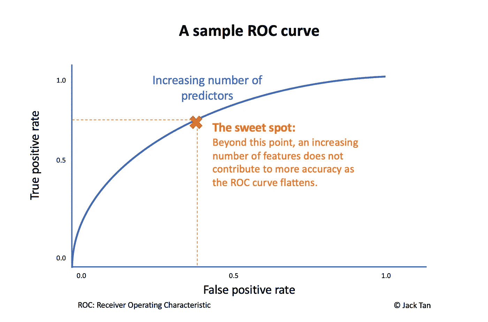

# Python 中机器学习的特征选择——过滤方法

> 原文：<https://towardsdatascience.com/feature-selection-for-machine-learning-in-python-filter-methods-6071c5d267d5?source=collection_archive---------25----------------------->

## 如何使用统计方法选择正确的预测因子

马丁·范·登·霍维尔在 [Unsplash](https://unsplash.com?utm_source=medium&utm_medium=referral) 上的照片

> **厨子多了烧坏汤。**

早在 1575 年，乔治·加斯科因就已经知道，厨房里有太多的厨师是做不出一碗丰盛的肉汤的。那句谚语的严谨延伸到现代，是的，甚至在机器学习中。

您是否曾经想过，为什么无论您如何微调这些超参数，您的模型的性能都会达到一个平稳状态？或者更糟的是，在使用了您所能找到的最精确的数据集之后，您只看到了性能上的普通改进？嗯，罪魁祸首实际上可能是您用来训练模型的预测器(列)。

理想情况下，预测值应该与模型要预测的输出数据在统计上相关，并且应该仔细挑选这些预测值以确保最佳预期性能。本文将简要介绍什么是特性选择，并附有一些 Python 中的实际例子。

**为什么功能选择很重要？**

作者自我说明

> **特征选择**主要关注从模型中移除冗余或无信息的预测器。[1]

在表面水平上，特征选择简单地意味着丢弃和减少预测器到最佳子集的最佳点。为什么特征选择在机器学习中很重要的一些理由:

*   简约(或简单)——简单模型比复杂模型更容易解释，尤其是在做推论的时候。
*   时间就是金钱。更少的特征意味着更少的计算时间，这直接导致更短的训练时间。
*   避免维数灾难-用大量特征训练的高精度模型可能具有欺骗性，因为它可能是过度拟合的标志，不会推广到新样本。

**特征选择的方法**

通常有三种特征选择方法:

> **过滤方法**使用统计计算评估预测模型之外的预测因子的相关性，仅保留通过某些标准的预测因子。[2]选择过滤方法时需要考虑的是预测值和结果中涉及的数据类型——数值型或分类型。
> 
> **包装器方法**使用添加和/或移除预测器的程序来评估多个模型，以找到最大化模型性能的最佳组合。[3]一般来说，程序的三个方向是可能的——前向(从 1 个预测值开始，迭代增加更多预测值),后向(从所有预测值开始，一个接一个地迭代消除),逐步(双向)进行。
> 
> **嵌入式方法** 是在模型拟合过程中特征选择过程自然发生的模型。[4]简单来说，这种方法将特征选择算法集成为机器学习算法的一部分。最典型的嵌入式技术是基于树的算法，包括决策树和随机森林。特征选择的总体思路是在分裂节点基于信息增益来决定。嵌入方法的其他范例是具有 L1 罚函数的套索和用于构建线性模型的具有 L2 罚函数的岭。

**Python 中的过滤方法**

使用 scikit-learn 包的过滤方法备忘单。颜色代码:浅蓝色—输入/输出预测值，蓝色—数值数据，绿色—分类数据，橙色— scikit-learn 函数，浅橙色—映射统计/数学理论。作者自我图解。

在本教程中，我们将使用 Scikit-learn 包来执行 Python 中的过滤方法，这意味着它们都是使用统计技术来执行的。

完整的 Python 代码可以在 [Github](https://github.com/jackty9/Feature_Selection_in_Python/blob/master/Feature_Selection.ipynb) 上找到，也可以在分类数据示例中使用的[原始数据](https://github.com/jackty9/Feature_Selection_in_Python/blob/master/car_data.csv)上找到。

1.  **数值输入，数值输出—皮尔逊与 f_regression()**

打印输出:显示了 5 个最重要的功能。随机生成 50 个特征(列),并使用 f_regression()根据得分对其重要性进行排序。

**2。数值输入，分类输出-带 f_classif()的方差分析**

打印输出:显示了 5 个最重要的功能。随机生成 50 个特征(列),并使用 f_classif()根据得分对其重要性进行排序。

**3。分类输入，分类输出—用 chi2()进行卡方检验**

对于分类示例，使用了用于汽车评估的数据集。它由 6 个特征组成——购买价格、维护价格、(数量)门、人员(容量)、行李箱(尺寸)、安全(等级),以确定可接受性等级，分布在 4 个不同的可能结果中。

打印输出:显示了 5 个最重要的功能。6 个特征(列)被一次性编码成 18 个特征(见第 8 行)，预测类也是如此(见第 10 行)。卡方检验需要一次性编码，因为它利用频率分布进行统计假设检验。

**3.1。分类输入，分类输出-Mutual Info with Mutual _ Info _ classif()**

打印输出:显示了 5 个最重要的功能。6 个特征(列)被一次性编码成 18 个特征(见第 9 行)。互信息分类要求将特征转换为数值，以便可以计算它们的熵和信息增益。注意，输出变量不需要一次性编码，因为 mutual_info_classif 将输出视为分类结果。

**总结**

在这篇文章中，您了解了如何选择基于过滤器的统计方法来选择数字和分类数据的特征。您还学习了如何用 Python 实现它们。

有些人可能会问——如果我的预测值中混合了数字和分类数据会怎么样？那么，你必须将两种类型的数据分开，然后应用基于输出变量的方法。

有没有一个理想的预测数？不，至少不是普遍的。这取决于数据的大小——行数与列数(预测值)、使用的 ML 算法(SVM 比基于树的算法更容易过度拟合)、可用的计算资源，当然还有项目时间。经验法则是考虑提到的所有要点，看看什么最适合你的情况。

**接下来期待什么**

本文涵盖了特征选择的第一种方法——使用统计测量的过滤方法。在下面的文章中，我们将研究第二种和第三种方法— [包装器](https://medium.com/@jackyeetan/feature-selection-for-machine-learning-in-python-wrapper-methods-2b5e27d2db31)和嵌入式方法。关注，敬请期待！

参考:

[1] [应用预测建模](https://www.amazon.de/gp/product/1461468485/ref=as_li_tl?ie=UTF8&camp=1638&creative=6742&creativeASIN=1461468485&linkCode=as2&tag=jackty-21&linkId=af56407a66a11e651fd5e5ddf4933d26)，第 488 页

[2] [应用预测建模](https://www.amazon.de/gp/product/1461468485/ref=as_li_tl?ie=UTF8&camp=1638&creative=6742&creativeASIN=1461468485&linkCode=as2&tag=jackty-21&linkId=af56407a66a11e651fd5e5ddf4933d26)，第 490 页

[3] [应用预测建模](https://www.amazon.de/gp/product/1461468485/ref=as_li_tl?ie=UTF8&camp=1638&creative=6742&creativeASIN=1461468485&linkCode=as2&tag=jackty-21&linkId=af56407a66a11e651fd5e5ddf4933d26)，第 490 页

[4] [特色工程与选择](https://books.google.de/books/about/Feature_Engineering_and_Selection.html?id=q5alDwAAQBAJ&source=kp_book_description&redir_esc=y)，第 17 页