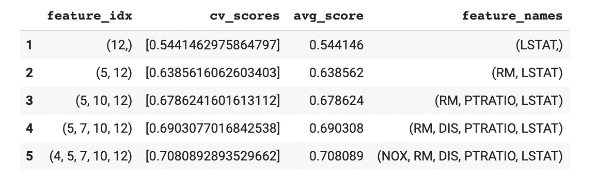
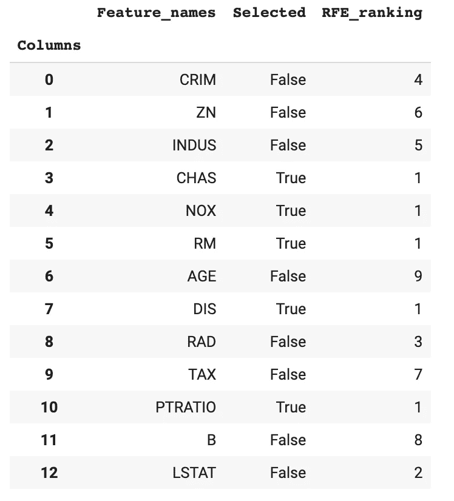
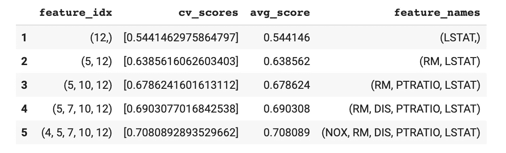
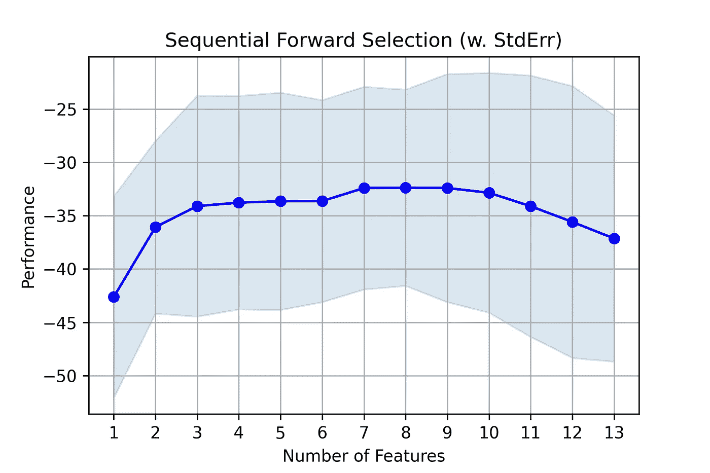
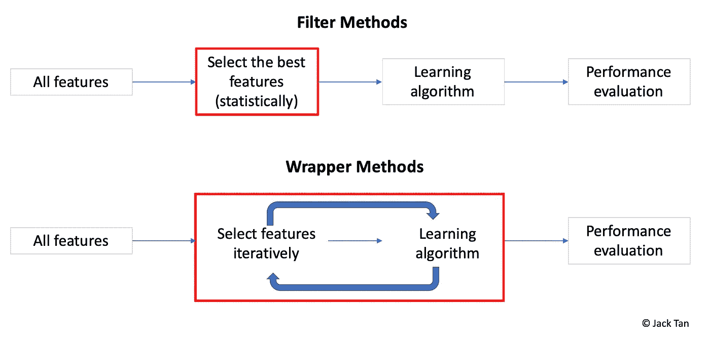

# Python 中机器学习的特征选择——包装器方法

> 原文：<https://towardsdatascience.com/feature-selection-for-machine-learning-in-python-wrapper-methods-2b5e27d2db31?source=collection_archive---------12----------------------->

## 如何使用最大似然算法选择正确的预测值

由作者根据 [Unsplash](https://unsplash.com?utm_source=medium&utm_medium=referral) 上 [Markus Spiske](https://unsplash.com/@markusspiske?utm_source=medium&utm_medium=referral) 的照片编辑

在本文的[第一系列](/feature-selection-for-machine-learning-in-python-filter-methods-6071c5d267d5?source=friends_link&sk=6a6258beba174b3c5513f606dfdb9f6b)中，我们讨论了什么是特性选择，并提供了一些使用统计方法的演练。本文在原文章的基础上，进一步解释了机器学习(ML)的特征选择中的另外两种常见方法，即包装器和嵌入式方法。解释将伴随着用 Python 编写的示例代码。

概括地说，特征选择意味着减少用于训练 ML 模型的预测器的数量。主要目标是提高预测性能的准确性(通过减少冗余预测值的数量)，减少计算时间(预测值越少，计算所需的时间越少)，以及提高模型的可解释性(当预测值数量较少时，更容易研究预测值的相关性)。基于统计技术的过滤方法通常可以独立于用于 ML 模型的算法来应用。然而，包装器和嵌入式方法通常被“微调”以优化分类器性能，如果目标是客观地为特定的学习算法或模型找到一组理想的预测器，则它们是理想的。

**介绍和概念**

> **包装方法**使用添加和/或移除预测器的程序评估多个模型，以找到最大化模型性能的最佳组合。[1]这些程序通常建立在贪婪搜索技术(或算法)的概念之后。[2]贪婪算法是遵循在每个阶段做出局部最优选择的问题解决启发式算法的任何算法。[3]

一般来说，程序的三个方向是可能的:

*   ***正向选择*** —从一个预测器开始，迭代增加更多预测器。在随后的每次迭代中，基于性能标准添加剩余的最佳原始预测值。
*   ***向后消除*** —从所有预测值开始，逐一迭代消除。最流行的算法之一是递归特征消除(RFE ),它根据特征重要性排序消除不太重要的预测器。
*   ***逐步选择*** —双向，基于向前选择和向后消除的组合。它被认为没有前两个过程那么贪婪，因为它确实重新考虑将预测器添加回已经被移除的模型中(反之亦然)。尽管如此，在任何给定的迭代中，考虑因素仍然是基于局部优化的。

**Python 中的包装方法**

Python 中有两个流行的库可用于执行包装器风格的特性选择——来自 [mlxtend](http://rasbt.github.io/mlxtend/) 的[顺序特性选择器](http://rasbt.github.io/mlxtend/user_guide/feature_selection/SequentialFeatureSelector/)和来自 [Scikit-learn](https://scikit-learn.org/stable/index.html) 的[递归特性消除](https://scikit-learn.org/stable/modules/generated/sklearn.feature_selection.RFE.html)。

完整的 Python 代码可以在 [Github](https://github.com/jackty9/Feature_Selection_Wrapper_Methods_in_Python) 上找到。使用的数据是来自 Scikit-learn 的波士顿房价数据集。

1.  **正向选择—来自 mlxtend 的 SFS()**

打印输出:5 个最重要的特征以基于 R 平方评分的正向选择方式迭代地添加到子集。

`SequentialFeatureSelector()`类接受以下主要参数:

*   `LinearRegression()`作为特征选择过程的估计器。或者，也可以用其他基于*回归*或*分类*的算法代替。
*   `k_features`表示要选择的特征数量。出于演示目的，从最初的 13 个特征中选择了 5 个特征。可以通过分析不同数量特征的*分数*来优化该值。
*   `forward`指示所用包装方法的方向。`forward = True`用于*前进选择*，而`forward = False`用于*后退淘汰*。
*   `Scoring`参数指定要使用的*评估标准*。对于*回归*问题，`r2` *得分*是默认且唯一实现。但是对于*分类*，有准确度、精度、召回率、f1-score 等选项。
*   `cv`论证是为了 *k 倍交叉验证*。默认情况下，它将被设置为 5。请记住，大量的交叉验证可能非常耗时且计算量大。

关于其他可能的参数，请参考[文档](http://rasbt.github.io/mlxtend/api_subpackages/mlxtend.feature_selection/#sequentialfeatureselector)。

**2。落后淘汰——RFE()来自 Sklearn**

打印输出:根据回归系数，以递归反向消除方式将 5 个最重要的特征选入子集。由于可用的方法不同，每个迭代的中间评分不是立即可用的。但是，`[**score**](https://scikit-learn.org/stable/modules/generated/sklearn.feature_selection.RFE.html#sklearn.feature_selection.RFE.score)` (X，y)可以用来输出底层估计量的得分。

`**RFE**(*estimator*, *n_features_to_select*)`是一个代表重复特征消除的类，来源于机器学习算法常用的 sklearn 库，它接受以下主要参数:

*   `estimator`(在上面的示例代码中使用*模型*传递)作为特征选择过程的对象。对于所示的回归问题，`coef_`属性用于确定特征重要性。对于树状算法，使用`feature_importances_`属性代替。
*   `n_features_to_selec`指要选择的特征数量。如果`None`，则选择一半的特征。

关于其他可能的参数，请参考[文档](https://scikit-learn.org/stable/modules/generated/sklearn.feature_selection.RFE.html)。

**3。分步选择—mlx tend**中的 SFFS()

打印输出:5 个最重要的特征基于 R 平方评分以逐步方式迭代添加到子集。

类似于 *1 中使用的类。正向选择*，使用的参数是相同的，除了:

*   `floating`参数添加了特征的条件排除/包含，以创建双向选择。当`forward = True`时，这意味着对于每个正向迭代(在*顺序正向选择*中)，它还考虑排除前一次迭代中的特征以优化性能。反之亦然，用于*反向消除*将特征包括在现有子集中。

**奖励——理想的功能数量是多少？**

在最后 3 个例子中，分配给`k_features`的特征数量设置为 5。但是我们怎么知道 5 是不是最好的数字呢？幸运的是，在同一个 mlxtend 库中，可以使用`plot_sequential_feature_selection`类来可视化评分，以使决策更容易。更多详情，请参考[文档](http://rasbt.github.io/mlxtend/user_guide/plotting/plot_sequential_feature_selection/)。

如图所示，在 5 重交叉验证(`cv=5`)的情况下，性能在 7 个特征处达到峰值。不要与性能的负号混淆，`neg_mean_squared_error`只是将均方差(MSE)的结果乘以`-1`，以遵循`sklearn`的惯例。其思想是最小化 MSE 相当于最大化负 MSE。

**总结**

作者自我图解。

过滤器和包装器方法之间的主要区别是对学习算法的依赖。通过观察红框，可以在没有学习算法的先验知识的情况下统计地执行过滤方法。另一方面，包装器方法基于学习算法中使用的估计器迭代地选择特征。它们就像一把双刃剑，所选择的特性将最适合所选择的算法，但可能不太适合另一种算法。包装器方法也更容易过度拟合，因为它涉及用几组特征组合进行训练。因为包装器方法使用交叉验证来选择最佳的特征子集，所以这个过程在计算上是昂贵的。包装方法的优点和缺点可以总结为:

优点:

*   面向算法，这意味着所选算法通常具有良好的性能

缺点:

*   过度装配的风险
*   可能计算量很大

**下一步预期什么**

本文介绍了特性选择的第二种方法——使用 ML 算法的包装器方法。在下一篇文章中，我们将研究最后一种方法，也称为嵌入式方法。如果你想了解更多关于特征选择和过滤方法的基础知识，你可以点击[这里](/feature-selection-for-machine-learning-in-python-filter-methods-6071c5d267d5)。

参考:

[1] [应用预测建模](https://www.amazon.de/gp/product/1461468485/ref=as_li_tl?ie=UTF8&camp=1638&creative=6742&creativeASIN=1461468485&linkCode=as2&tag=jackty-21&linkId=af56407a66a11e651fd5e5ddf4933d26)，第 490 页

[2] [特征工程与选择](https://books.google.de/books/about/Feature_Engineering_and_Selection.html?id=q5alDwAAQBAJ&source=kp_book_description&redir_esc=y)，第 241 页

[3] [美国国家标准与技术研究所(NIST)](https://xlinux.nist.gov/dads//HTML/greedyalgo.html)