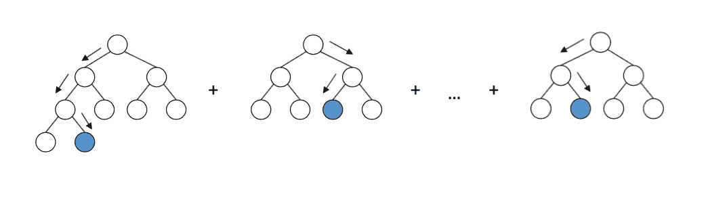
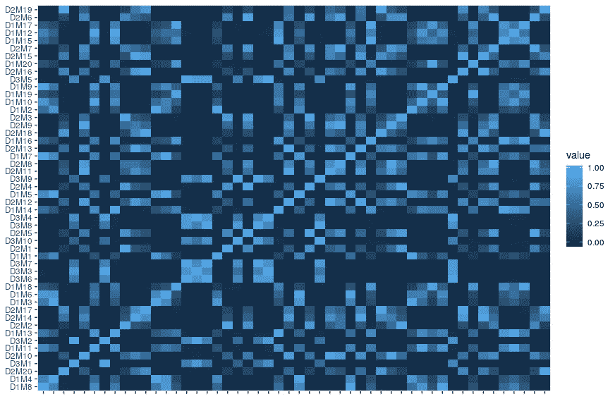
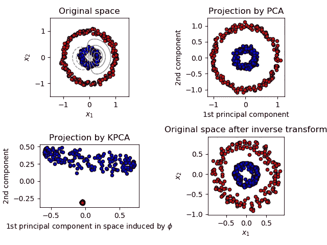
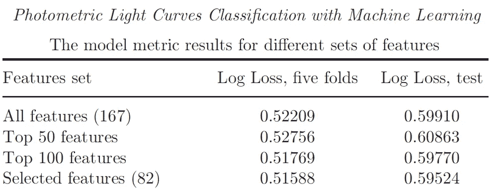

# 机器学习中的特征选择

> 原文：<https://towardsdatascience.com/feature-selection-in-machine-learning-d5af31f7276?source=collection_archive---------11----------------------->

## 使用 Python 进行要素选择的方法


作者:[凯布鲁恩](https://unsplash.com/@brune)，来源:[突发](https://unsplash.com/photos/Z-gTyL0dOH4)

**简介**

梯度增强的决策树，如 *XGBoost* 和*light GBM*【1–2】，成为表格数据和时间序列的分类和回归任务的流行选择。通常，首先提取代表数据的特征，然后将它们用作树的输入。



决策树集合示意图，作者:[莫赫塔迪·本·弗拉杰](https://medium.com/@mohtedibf)，来源:[媒体](https://medium.com/all-things-ai/in-depth-parameter-tuning-for-gradient-boosting-3363992e9bae)

特征是被观察现象的一个单独的可测量的属性或特征[3]——数据集中的一个属性。特征可以包括各种统计(平均值、标准差、中值、百分位数、最小值、最大值等)、趋势(上升和下降)、峰值分析(周期、平均峰值宽度、峰值数量、频率)、自相关和互相关等。有几个开源库可以帮助提取所有的基本特性，比如 *NumPy* 、 *SciPy、sklearn、ts fresh*【4–7】等等。通常，根据领域知识和对问题的物理理解，为任务设计定制的特性也是有用的。

一旦从数据中提取出特征，它们就被用作梯度推进决策树(GBDT) [8]的输入。然而，GBDT 容易过度拟合，对于相对较小的数据集，减少特征的数量，只保留那些有助于分类器的特征是很重要的。

决策树管道的一个重要部分是特征选择过程。特征选择有助于减少过度拟合，移除冗余特征，并避免混淆分类器。在这里，我描述了几种常用的方法来为任务选择最相关的特性。

**自动递归特征消除**


作者:[奇莫诺](https://pixabay.com/users/qimono-1962238/)，来源: [pixabay](https://pixabay.com/illustrations/cubes-choice-one-yellow-light-2492010/)

移除额外特征的可能性之一是从 *sklearn* 库【9】中移除递归特征的自动工具。带交叉验证的递归特征消除[10]比不带交叉验证的选项更常用。

该工具的目标是通过递归考虑越来越小的要素集来选择要素。

*   首先，在初始特征集上训练估计器，并获得每个特征的重要性。
*   然后，从当前特征集中移除最不重要的特征，并再次检查分类度量。
*   递归地重复该过程，直到最终达到要选择的特征的期望数量。

该工具提供了有用功能集的第一近似值。然而，自动特征消除并不总是最佳的，并且经常需要进一步的微调。在使用上述递归排除法选择了初始特征集之后，我使用排列重要性来选择特征。

**排列重要性**


来源: [pixabay](https://pixabay.com/illustrations/calculator-hand-robot-count-695084/)

这种方法被称为“排列重要性”或“平均降低精度”，并在 Breiman [11]中进行了描述。当特征值被置换(变成噪声)时，置换重要性被计算为分数的减少。

测量特征重要性的方法之一是完全去除它，在没有该特征的情况下训练分类器，并观察这样做如何影响分数。然而，这种方法需要为每个特征重新训练分类器，这在计算上是昂贵的。解决方法是只从验证集中删除有问题的特征，并计算没有该特征的验证集的分数。由于经训练的分类器仍然期望该特征可用，因此可以用来自相同分布的随机噪声代替该特征作为初始特征值，而不是移除该特征。获得这种分布的最简单的方法是简单地混洗(或置换)原始特征值。这就是排列重要性是如何实现的。对于分类器来说，特征仍然存在，但是它不包含任何有用的信息。

**排列重要性**可以使用 eli5 包来计算【12】。它提供了一个特性的排名，然后我删除了那些负面的或者不重要的特性。eli5 包提供了一种计算任何黑盒评估者的特性重要性的方法，通过测量当一个特性不可用时分数是如何降低的。

示例:

```
import eli5 
from eli5.sklearn import PermutationImportancefrom lightgbm import LGBMClassifier# set data and targets, split, and metric# set a classifier
clf = LGBMClassifier(**best_params)# fit the classifier model
clf.fit(x_train, y_train, 
        eval_set=[(x_train, y_train), (x_valid, y_valid)],
        eval_metric=lgbm_multi_weighted_logloss, 
        verbose=100,
        early_stopping_rounds=400, 
        sample_weight=y_train.map(weights), )# calculate permitation importance for the classifier
perm = PermutationImportance(
           clf, scoring=permutation_scorer, 
           random_state=1).fit(x_valid, y_valid)        
expl = eli5.explain_weights(
           perm, feature_names=x_valid.columns.tolist(), top=None)        print(eli5.format_as_text(expl))        print(expl.feature_importances)# save importances to html 
text_file = open("importance.html", "w")        text_file.write(eli5.format_as_html(expl))        
text_file.close()
```

该方法最适合于在特征数量不大时计算特征重要性；否则，它可能是资源密集型的。因此，我将它作为上述初始自动特征消除之后的第二步。

我删除了置换重要性低或为负的特性，同时检查模型性能的改进。

一些要素可能具有很高的排列重要性，但定义了非常相似的数据方面。在这种情况下，找到特征之间的相关性有助于识别冗余特征。

**去除多余特征**


来源:knowyourmeme.com，知识共享署名-共享许可协议

**相关性**是一种统计技术，可以显示变量对是否相关以及相关程度如何。

当相关性等于 1 时，特征完全相关
当相关性为零时，特征完全独立

相关性高的特征更具线性相关性，因此对因变量的影响几乎相同。因此，当两个特性高度相关时，我们可以去掉其中一个。

相关矩阵可以简单地计算为 *corr = X.corr()，*其中向量 X 包含具有所考虑特征的所有列。

所有特征之间的相关矩阵在对角线元素上具有 1，因为该特征与其自身 100%相关。具有高相关值的非对角线元素指示冗余特征。

```
sns.heatmap(corr)
```



作者:a .胡宾，许可证:麻省理工学院

在检查验证度量时逐个手动移除冗余要素(高度相关的要素)有助于减少要素集并提高 GBDT 的性能。为此，只需比较不同特征(非对角线元素)之间的相关性，并尝试移除相关性高于某个阈值(例如 0.9)的两个特征之一

**主成分分析**

另一种减少特征数量的方法是使用**主成分分析**【13】。这种技术允许减少特征空间的维数，同时从特征的组合中找到最突出的成分。



来源:[scikit-learn.org](https://scikit-learn.org/stable/auto_examples/decomposition/plot_kernel_pca.html#sphx-glr-auto-examples-decomposition-plot-kernel-pca-py)，BSD 许可证

主成分分析的主要思想是降低由许多变量组成的数据集的维数，这些变量或多或少相互关联，同时最大程度地保留数据集中存在的差异。

使用 sklearn 库可以很容易地实现它[14]。PCA 对缩放敏感，并且在应用该算法之前需要对特征进行归一化。一个例子:

```
from sklearn.preprocessing import StandardScaler
from sklearn.decomposition import PCAfeatures = [‘feat_a’, ‘feat_b’, ‘feat_c’, ‘feat_d’]# Scale the features
x = StandardScaler().fit_transform(features)# decide on the number of components
pca = PCA(n_components=2)
principalComponents = pca.fit_transform(x)
```

有许多课程和博客文章，在那里你可以读到关于这种技术的细节，例如在[15]中。

**遗言**

当然，还有其他的特征选择方法，比如使用自动编码器、P 值、LightGBM 重要性等等。在这里，我描述了我个人选择的子集，这是我在 Kaggle 上的竞争机器学习期间开发的。

我逐一执行步骤 1–2–3 来选择功能。这是在 Kaggle competition PLAsTiCC 天文分类[16]中应用特征选择技术的例子。首先，使用自动**递归特征消除**和交叉验证[10]来选择特征，给出 167 个特征。然后，使用在 eli5 中实现的**排列重要性**算法对剩余的特征进行排序，并选择顶部的特征。正如我们所看到的，50 个特征是不够的，100 个特征在这个数据集上表现得更好。最后，使用相关性从前 100 个特征中移除了**冗余特征**，给我们留下了所选的 82 个特征【17】。



不同特性集的模型结果，参见[17]中的完整文章

与自动特征选择相比，这种多步骤方法提高了模型性能，但并不显著。定义和设计最相关的特征仍然是使用 GBDT 分类器/回归器获得最佳模型的首要任务。

*Tatiana Gabruseva 博士*

**参考文献:**

[1] LightGBM，[https://lightgbm.readthedocs.io/en/latest/](https://lightgbm.readthedocs.io/en/latest/)

[2] XGBoost，[https://XGBoost . readthedocs . io/en/latest/tutorials/index . html](https://xgboost.readthedocs.io/en/latest/tutorials/index.html)

[3]克里斯托弗·毕晓普(2006 年)。模式识别和机器学习。柏林:施普林格。[ISBN](https://en.wikipedia.org/wiki/International_Standard_Book_Number)[0–387–31073–8](https://en.wikipedia.org/wiki/Special:BookSources/0-387-31073-8)。

[4] NumPy，[https://numpy.org/](https://numpy.org/)

[5] SciPy，[https://www.scipy.org/](https://www.scipy.org/)

[6] sklearn，[https://sci kit-learn . org/stable/modules/classes . html # module-sk learn . feature _ extraction](https://scikit-learn.org/stable/modules/classes.html#module-sklearn.feature_extraction)

[7] tsfresh，[https://ts fresh . readthedocs . io/en/latest/text/introduction . html](https://tsfresh.readthedocs.io/en/latest/text/introduction.html)

[8][https://en.wikipedia.org/wiki/Gradient_boosting](https://en.wikipedia.org/wiki/Gradient_boosting)

[9 ] RFE，[https://sci kit-learn . org/stable/modules/generated/sk learn . feature _ selection。RFE.html](https://scikit-learn.org/stable/modules/generated/sklearn.feature_selection.RFE.html)

[10 ] RFECV，[https://sci kit-learn . org/stable/modules/generated/sk learn . feature _ selection。RFECV.html](https://scikit-learn.org/stable/modules/generated/sklearn.feature_selection.RFECV.html)

[11] Breiman，“随机森林”，机器学习，45(1)，5–32，2001 年(可在 https://www . stat . Berkeley . edu/% 7 ebreiman/randomforest2001 . pdf 上在线获得)。

[12]米哈伊尔·科罗博夫、康斯坦丁·洛普欣、埃利 5、[https://eli5.readthedocs.io/en/latest/overview.html](https://eli5.readthedocs.io/en/latest/overview.html)

[13] PCA，[https://en.wikipedia.org/wiki/Principal_component_analysis](https://en.wikipedia.org/wiki/Principal_component_analysis)

【14】[sk learn . decomposition](https://scikit-learn.org/stable/modules/classes.html#module-sklearn.decomposition)。PCA，[https://sci kit-learn . org/stable/modules/generated/sk learn . decomposition . PCA . html](https://scikit-learn.org/stable/modules/generated/sklearn.decomposition.PCA.html)

[15] PCA:在机器学习中的应用，[https://medium . com/apprentice-journal/PCA-Application-in-Machine-Learning-4827 c 07 a61db](https://medium.com/apprentice-journal/pca-application-in-machine-learning-4827c07a61db)

[16]塑料天文分类，[https://www.kaggle.com/c/PLAsTiCC-2018](https://www.kaggle.com/c/PLAsTiCC-2018)

[17] T. Gabruseva，S. Zlobin 和 P. Wang，用机器学习进行光度学光变曲线分类，JAI，2020 (ArXiv: [和)](https://arxiv.org/pdf/1909.05032.pdf)