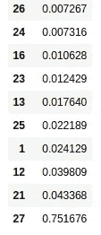

# Python 中的特征选择技术:预测酒店取消

> 原文：<https://towardsdatascience.com/feature-selection-techniques-in-python-predicting-hotel-cancellations-48a77521ee4f?source=collection_archive---------20----------------------->

## 机器学习项目最重要的特征之一(没有双关语)是特征选择。

特征选择允许识别对响应(或因变量)最重要或最有影响的因素。在这个例子中，特征选择技术被用于预测对客户是否选择取消他们的酒店预订最重要的影响因素。


资料来源:pixabay.com

# 特征选择工具

三种不同的特征选择工具用于分析该数据集:

*   **extractreesclassifier:**extractreesclassifier 的目的是使多个随机决策树适合数据，在这方面，它是集成学习的一种形式。特别是，对所有观察值进行随机分割，以确保模型不会过度拟合数据。
*   **前进和后退特征选择**:这是一种**“基于包装器”**的特征选择方法，其中特征选择基于特定的机器学习算法(在本例中为 RandomForestClassifier)。对于前向步骤选择，每个单独的特征被一次一个地添加到模型中，并且具有最高 ROC_AUC 分数的特征被选择为最佳特征。当进行后向特征选择时，该过程反向进行，由此每次从模型中丢弃一个特征，即从模型中丢弃具有最低 ROC_AUC 分数的特征。

# 背景和数据处理

使用这些算法的目的是确定最有助于预测客户是否会取消酒店预订的功能。这是因变量，其中(1 =取消，0 =继续预订)。

用于分析的特征如下。

## 间隔

```
leadtime = train_df['LeadTime']
arrivaldateyear = train_df['ArrivalDateYear']
arrivaldateweekno = train_df['ArrivalDateWeekNumber']
arrivaldatedayofmonth = train_df['ArrivalDateDayOfMonth']
staysweekendnights = train_df['StaysInWeekendNights']
staysweeknights = train_df['StaysInWeekNights']
adults = train_df['Adults']
children = train_df['Children']
babies = train_df['Babies']
isrepeatedguest = train_df['IsRepeatedGuest'] 
previouscancellations = train_df['PreviousCancellations']
previousbookingsnotcanceled = train_df['PreviousBookingsNotCanceled']
bookingchanges = train_df['BookingChanges']
agent = train_df['Agent']
company = train_df['Company']
dayswaitinglist = train_df['DaysInWaitingList']
adr = train_df['ADR']
rcps = train_df['RequiredCarParkingSpaces']
totalsqr = train_df['TotalOfSpecialRequests']
```

## 绝对的

```
arrivaldatemonth = train_df.ArrivalDateMonth.astype("category").cat.codes
arrivaldatemonthcat=pd.Series(arrivaldatemonth)
mealcat=train_df.Meal.astype("category").cat.codes
mealcat=pd.Series(mealcat)
countrycat=train_df.Country.astype("category").cat.codes
countrycat=pd.Series(countrycat)
marketsegmentcat=train_df.MarketSegment.astype("category").cat.codes
marketsegmentcat=pd.Series(marketsegmentcat)
distributionchannelcat=train_df.DistributionChannel.astype("category").cat.codes
distributionchannelcat=pd.Series(distributionchannelcat)
reservedroomtypecat=train_df.ReservedRoomType.astype("category").cat.codes
reservedroomtypecat=pd.Series(reservedroomtypecat)
assignedroomtypecat=train_df.AssignedRoomType.astype("category").cat.codes
assignedroomtypecat=pd.Series(assignedroomtypecat)
deposittypecat=train_df.DepositType.astype("category").cat.codes
deposittypecat=pd.Series(deposittypecat)
customertypecat=train_df.CustomerType.astype("category").cat.codes
customertypecat=pd.Series(customertypecat)
reservationstatuscat=train_df.ReservationStatus.astype("category").cat.codes
reservationstatuscat=pd.Series(reservationstatuscat)
```

关于这些特征，某些特征如提前期是**区间**——换句话说，它们可以取很大范围的值，不一定受特定范围的限制。

但是，某些变量，如 **customertype** 是分类变量。在这方面，*类别代码*用于将这些变量识别为分类变量，并确保它们在最终分析中不会被错误地排序。例如，考虑以下变量:1 =苹果，2 =香蕉，3 =橙子。这个变量是分类的，数字没有固有的等级，因此如此指定是很重要的。

在这方面，以 **customertype** 为例，变量首先被转换为 categorical，然后存储为 pandas 系列:

```
customertypecat=train_df.CustomerType.astype("category").cat.codes
customertypecat=pd.Series(customertypecat)
```

被取消的变量是响应变量:

```
IsCanceled = train_df['IsCanceled']
y = IsCanceled
```

将要素加载到 Python 中后，它们将存储为 numpy 堆栈(或数组序列):

```
x = np.column_stack((leadtime,arrivaldateyear,arrivaldatemonthcat,arrivaldateweekno,arrivaldatedayofmonth,staysweekendnights,staysweeknights,adults,children,babies,mealcat,countrycat,marketsegmentcat,distributionchannelcat,isrepeatedguest,previouscancellations,previousbookingsnotcanceled,reservedroomtypecat,assignedroomtypecat,bookingchanges,deposittypecat,dayswaitinglist,customertypecat,adr,rcps,totalsqr,reservationstatuscat))
x = sm.add_constant(x, prepend=True)
```

既然已经定义了 **x** 和 **y** 变量，那么使用特征选择方法来识别哪些变量对酒店取消有最大的影响。

具体来说，一旦相关特征被识别，SVM(支持向量机)模型被用于分类。从上述三种技术中识别出的特征被分别输入到模型中，以确定哪种特征选择工具在识别重要特征方面做得最好——这被认为是由较高的 AUC 分数反映的。

# 树外分级机

将生成 ExtraTreesClassifier:

```
from sklearn.ensemble import ExtraTreesClassifier
model = ExtraTreesClassifier()
model.fit(x, y)
print(model.feature_importances_)
```

结果如下:

```
[0.00000000e+00 2.41288705e-02 6.54290762e-03 3.56552004e-03
 4.69576062e-03 3.47427522e-03 4.05667428e-03 4.86925873e-03
 2.53797514e-03 2.90658184e-03 3.51521069e-04 2.81228056e-03
 3.98090524e-02 1.76395497e-02 5.72618836e-03 4.67231162e-03
 1.06281516e-02 1.18152913e-03 4.53164843e-03 7.05720850e-03
 4.01953363e-03 4.33681743e-02 5.47423587e-04 1.24294822e-02
 7.31621484e-03 2.21889104e-02 7.26745746e-03 7.51675538e-01]
```

让我们将它归类到一个数据框架中，并看看主要特性:

```
ext=pd.DataFrame(model.feature_importances_,columns=["extratrees"])
ext
ext.sort_values(['extratrees'], ascending=True)
```



最常见的特征是特征 1、12、13、21、23、25(交付周期、原产国、市场细分、存款类型、客户类型和所需停车位)。请注意，功能 **27** (预订状态)在这种情况下无效，因为这实际上代表了与响应变量相同的东西——即客户是否取消或坚持预订。在这种情况下，在分析中包含该特征是错误的。

# 向前和向后步进特征选择

如前所述，这种特征选择方法基于 RandomForestClassifier。就逐步向前的特征选择而言，当每个特征被添加到模型中时，对其 ROC_AUC 分数进行评估，即具有最高分数的特征被添加到模型中。对于后退特征选择，过程是相反的-基于具有最低 ROC_AUC 分数的特征从模型中删除。使用此要素选择工具从数据集中选择前六个要素。

正向特征选择实现如下:

```
from sklearn.ensemble import RandomForestRegressor, RandomForestClassifier
from sklearn.metrics import roc_auc_score
from mlxtend.feature_selection import SequentialFeatureSelectorforward_feature_selector = SequentialFeatureSelector(RandomForestClassifier(n_jobs=-1),
           k_features=6,
           forward=True,
           verbose=2,
           scoring='roc_auc',
           cv=4)

fselector = forward_feature_selector.fit(x, y)
```

下面是生成的输出:

```
[Parallel(n_jobs=1)]: Using backend SequentialBackend with 1 concurrent workers.
[Parallel(n_jobs=1)]: Done   1 out of   1 | elapsed:    2.0s remaining:    0.0s
[Parallel(n_jobs=1)]: Done  28 out of  28 | elapsed:   40.8s finished[2020-03-01 19:01:14] Features: 1/6 -- score: 1.0[Parallel(n_jobs=1)]: Using backend SequentialBackend with 1 concurrent workers.
[Parallel(n_jobs=1)]: Done   1 out of   1 | elapsed:    1.3s remaining:    0.0s
[Parallel(n_jobs=1)]: Done  27 out of  27 | elapsed:   37.4s finished[2020-03-01 19:01:52] Features: 2/6 -- score: 1.0[Parallel(n_jobs=1)]: Using backend SequentialBackend with 1 concurrent workers.
[Parallel(n_jobs=1)]: Done   1 out of   1 | elapsed:    1.5s remaining:    0.0s
[Parallel(n_jobs=1)]: Done  26 out of  26 | elapsed:   37.3s finished...[2020-03-01 19:03:49] Features: 5/6 -- score: 1.0[Parallel(n_jobs=1)]: Using backend SequentialBackend with 1 concurrent workers.
[Parallel(n_jobs=1)]: Done   1 out of   1 | elapsed:    1.9s remaining:    0.0s
[Parallel(n_jobs=1)]: Done  23 out of  23 | elapsed:   40.7s finished[2020-03-01 19:04:30] Features: 6/6 -- score: 1.0
```

我们可以按如下方式标识功能名称(在本例中是数字，因为它们存储在数组中):

```
>>> fselector.k_feature_names_
('0', '1', '2', '3', '4', '27')
```

后向要素选择方法计算量更大，因为会考虑数据集中的所有要素。

我们通过简单地设置 *forward=False* 来实现。

```
from sklearn.ensemble import RandomForestRegressor, RandomForestClassifier
from sklearn.metrics import roc_auc_scorebackward_feature_selector = SequentialFeatureSelector(RandomForestClassifier(n_jobs=-1),
           k_features=6,
           forward=False,
           verbose=2,
           scoring='roc_auc',
           cv=4)

bselector = backward_feature_selector.fit(x, y)
```

下面是生成的输出:

```
[Parallel(n_jobs=1)]: Using backend SequentialBackend with 1 concurrent workers.
[Parallel(n_jobs=1)]: Done   1 out of   1 | elapsed:    3.4s remaining:    0.0s
[Parallel(n_jobs=1)]: Done  28 out of  28 | elapsed:  1.1min finished[2020-03-01 19:05:39] Features: 27/6 -- score: 1.0[Parallel(n_jobs=1)]: Using backend SequentialBackend with 1 concurrent workers.
[Parallel(n_jobs=1)]: Done   1 out of   1 | elapsed:    3.2s remaining:    0.0s
[Parallel(n_jobs=1)]: Done  27 out of  27 | elapsed:  1.0min finished...[2020-03-01 19:17:46] Features: 7/6 -- score: 1.0[Parallel(n_jobs=1)]: Using backend SequentialBackend with 1 concurrent workers.
[Parallel(n_jobs=1)]: Done   1 out of   1 | elapsed:    2.7s remaining:    0.0s
[Parallel(n_jobs=1)]: Done   7 out of   7 | elapsed:   13.0s finished[2020-03-01 19:17:59] Features: 6/6 -- score: 1.0
```

以下是确定的特征:

```
>>> bselector.k_feature_names_
('0', '1', '3', '4', '5', '27')
```

如我们所见，所识别的特征与前向特征选择相同。ExtraTreesClassifier 还将要素 1(提前期)识别为重要要素，而此方法识别要素 3、4、5 (arrivaldatemonth、arrivaldateweekno、arrivaldatedayofmonth)。

在这方面，此要素选择方法表明数据集中的时间要素比 ExtraTreesClassifier 方法建议的更重要。

# 结论

总而言之，我们研究了:

*   如何分析分类和区间特征的特征数据
*   使用树外分类器的特征选择
*   向前和向后特征选择方法

本例的数据集和笔记本可从 MGCodesandStats GitHub 库获得，以及对该主题的进一步研究。

*免责声明:本文是在“原样”的基础上编写的，没有担保。本文旨在提供数据科学概念的概述，不应以任何方式解释为专业建议。*

# 有用的参考资料

*   [特征选择的方差分析 F 值](https://chrisalbon.com/machine_learning/feature_selection/anova_f-value_for_feature_selection/)
*   [安东尼奥、阿尔梅迪亚和努内斯(2019)。酒店预订需求数据集](https://www.sciencedirect.com/science/article/pii/S2352340918315191)
*   [使用 Python 中的包装方法进行特征选择](/feature-selection-using-wrapper-methods-in-python-f0d352b346f)
*   [如何使用分类数据进行特征选择](https://machinelearningmastery.com/feature-selection-with-categorical-data/)