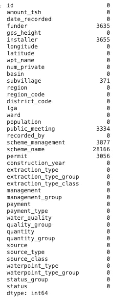
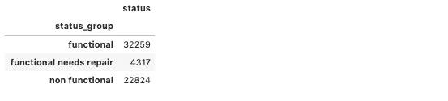

# 使用 BorutaPy 进行特征选择

> 原文：<https://towardsdatascience.com/feature-selection-with-borutapy-f0ea84c9366?source=collection_archive---------24----------------------->

## 查找携带预测信息的所有要素


图片由 [Free-Photos](https://pixabay.com/photos/?utm_source=link-attribution&utm_medium=referral&utm_campaign=image&utm_content=945396) 来自 [Pixabay](https://pixabay.com/?utm_source=link-attribution&utm_medium=referral&utm_campaign=image&utm_content=945396)

这篇文章将作为一个教程，介绍在为预测分类模型执行特征选择时如何实现 BorutaPy。当选择使用 BorutaPy 时，我会经历一些优点和一些缺点。我将使用坦桑尼亚油井分类数据集，尝试构建一个分类模型来预测一口井是正常工作、正常工作但需要维修还是不正常工作。

特征选择是机器学习中最重要的步骤之一。将特征输入模型时，目标是为模型提供与预测类相关的特征。包括不相关的特征带来了数据中不必要的噪声的问题，导致较低的模型精度。通常，我们使用基于统计的特征选择方法，如 ANOVA 或卡方检验，评估每个预测变量与目标变量之间的关系。

> “Boruta 是一种所有相关特征选择方法，而大多数其它方法是最小最优的；这意味着它试图找到携带可用于预测的信息的所有特征，而不是找到某个分类器误差最小的可能紧凑的特征子集。” *-* ***米隆·库尔萨*-**

有了 boruta，这些特性就可以被管理到“所有相关”的停止点，而不是“最小最优”的停止点。当用于预测时，所有相关变量都不是多余的。Boruta 基于两个思想，阴影特征和二项分布。当使用 boruta 时，这些特性不是用它们自己来评估，而是用它们的随机版本来评估。对于二项式分布的想法，boruta 采用了一个我们不知道是否有用的特征，并根据选择分布尾部定义的三个区域拒绝或接受该特征，例如 0.5%。

*   **拒绝区域:**特征被视为噪声而被丢弃的区域。
*   **犹豫不决的区域:**博鲁塔对特性犹豫不决的区域
*   **接受区域:**特征被认为具有预测性的区域

例如，我将构建一个三元分类模型，用于坦桑尼亚水井数据。这个分类器将预测水井的状况，数据集可以在这里检索到[](https://www.drivendata.org/competitions/7/data/)**。我将从我如何处理模型数据开始。**

**要安装 BorutaPy，请在您的笔记本或终端上运行以下代码。Boruta 的依赖项是 numpy、scipy 和 scikit-learn。**

## ****博鲁派文档***[*h*](https://github.com/scikit-learn-contrib/boruta_py)*:****

```
****###Installing BorutaPy**pip install BorutaPy**###Importing the libraries for data processing**import pandas as pd
import numpy as np**###Reading in the data**train_data = pd.read_csv(‘../data/train_data.csv’)train_target = pd.read_csv(‘../data/train_targets.csv’)test = pd.read_csv(‘../data/test_set_values.csv’)**###Adding training label to training dataframe**train = train_data.merge(train_target, on='id', how='inner')**###‘status group' needs to be converted to numerical values for the ###classification model and not ‘functional’, ‘non-functional’, and ###‘functional in need of repair’.**status_group_numeric = {'functional': 2,
                        'functional needs repair': 1,
                        'non functional': 0}
train['status'] = train.status_group.replace(status_group_numeric)**
```

******检查数据集中是否有缺失值******

```
**train.isna().sum()**
```

********

## ****填充缺失值****

****许可字段中大约 69%的值为真，31%为假。我也选择用同样的比例来填充缺失的值。我还需要将这些值转换成数字。****

```
**train['permit'].fillna(False, limit=947, inplace=True)
train['permit'].fillna(True, inplace=True)**###Function to take values in permit field and change them to ###numerical values**
def permit(row):
    if row['permit'] == True:
        return 1
    else:
        return 0
train['permit'] = train.apply(lambda x: permit(x), axis=1)**
```

****公共会议字段有 91%的正确率和 9%的错误率。我选择用相同的比率来填充缺失的值。我还需要将值改为数字。****

```
**train['public_meeting'].fillna(False, limit=300, inplace=True)
train['public_meeting'].fillna(True, inplace=True)**###Function to take values in public field and convert them to ###numerical values**
def public(row):
    if row['public_meeting'] == True:
        return 1
    else:
        return 0
train['public_meeting'] = train.apply(lambda x: public(x), axis=1)**
```

## ****宁滨特色****

****出资者一栏显示了谁资助了油井。有 1，897 个不同的结果，但看起来只有前 7 个字段的值出现超过一千次。我将把这一栏分为 7 个不同的类别，其余的字段将归类为“其他”。****

```
**def categorize_funder(train):
    '''This function will go through every row in
    the dataframe column funder and if the value
    is any of the top 7 fields, will return those
    values. If the value does not equal any of these
    top 7 fields, it will return other.'''
    if train['funder'] == 'Government Of Tanzania':
        return 'govt'
    elif train['funder'] == 'Danida':
        return 'danida'
    elif train['funder'] == 'Hesawa':
        return 'hesawa'
    elif train['funder'] == 'Rwssp':
        return 'rwssp'
    elif train['funder'] == 'World Bank':
        return 'world_bank'
    elif train['funder'] == 'Kkkt':
        return 'kkkt'
    elif train['funder'] == 'World Vision':
        return 'world_vision'
    else:
        return 'other'train['funder'] = train.apply(lambda x: categorize_funder(x), axis=1)**
```

****宁滨将安装程序字段分为 7 类****

```
**def categorize_installer(train):
    '''This function will go through
    every row in the installer column
    and if the value is equal to any of
    the top 7, will return those values.
    If not, will return other.'''
    if train['installer'] == 'DWE':
        return 'dwe'
    elif train['installer'] == 'Government':
        return 'govt'
    elif train['installer'] == 'RWE':
        return 'rwe'
    elif train['installer'] == 'Commu':
        return 'commu'
    elif train['installer'] == 'DANIDA':
        return 'danida'
    elif train['installer'] == 'KKKT':
        return 'kkkt'
    elif train['installer'] == 'Hesawa':
        return 'hesawa'
    else:
        return 'other'train['installer'] = train.apply(lambda x: categorize_installer(x), axis=1)**
```

****宁滨把方案管理领域分为 7 类****

```
**def categorize_scheme(row):
    '''This function will go through each
    row in the scheme management column
    and if the value is equal to any of the 
    top 7, will return those values. If not,
    will categorize the value as other.'''
    if row['scheme_management'] == 'VWC':
        return 'vwc'
    elif row['scheme_management'] == 'WUG':
        return 'wug'
    elif row['scheme_management'] == 'Water authority':
        return 'water_authority'
    elif row['scheme_management'] == 'WUA':
        return 'wua'
    elif row['scheme_management'] == 'Water Board':
        return 'water_board'
    elif row['scheme_management'] == 'Parastatal':
        return 'parastatal'
    elif row['scheme_management'] == 'Private operator':
        return 'private_operator'
    else:
        return 'other'train['scheme_management'] = train.apply(lambda x: categorize_scheme(x), axis=1)**
```

****由于数据集中有 55 个不同的建造年份，看起来建造年份字段对于我们的模型来说很难分类。我打算把宁滨的这些年变成几十年。****

```
**def categorize_contruction(row):
    if row['construction_year'] < 1970:
        return '1960s'
    elif row['construction_year'] < 1980:
        return '1970s'
    elif row['construction_year'] < 1990:
        return '1980s'
    elif row['construction_year'] < 2000:
        return '1990s'
    elif row['construction_year'] < 2010:
        return '2000s'
    elif row['construction_year'] < 2020:
        return '2010s'train['construction_year'] = train.apply(lambda x: categorize_contruction(x), axis=1)**
```

## ****移除的功能****

****我选择删除值与另一个值相似的字段，以及包含我找不到与预测模型相关的足够信息的值的字段。被删除的功能可能包含重要信息，我建议仔细查看这些数据。出于本示例的目的，我将在没有它们的情况下继续。****

```
**- train = train.drop(columns=['subvillage'], axis=1)
- train = train.drop(columns=['scheme_name'], axis=1)
- train = train.drop(columns=['wpt_name'], axis=1)
- train = train.drop(columns=['region'], axis=1)
- train = train.drop(columns=['extraction_type', 'extraction_type_group'],
                  axis=1)
- train = train.drop(columns=['management_group'], axis=1)
- train = train.drop(columns=['payment_type'], axis=1)
- train = train.drop(columns=['water_quality'], axis=1)
- train = train.drop(columns=['quantity_group'], axis=1)
- train = train.drop(columns=['source_type'], axis=1)
- train = train.drop(columns=['waterpoint_type_group'], axis=1)**
```

## ****来自数据的状态****

```
**pivot_train = pd.pivot_table(train, index=['status_group'], 
                            values='status',
                            aggfunc='count')
pivot_train**
```

********

## ****对训练数据集进行训练测试拆分****

```
**X = train.drop(columns=['id', 'status_group', 'status', 'date_recorded'], axis=1)
y = train.statusX_train, X_test, y_train, y_test = train_test_split(X, y, random_state=42)**
```

## ****编码和缩放****

****我用一个 Sklearn 的热编码器对分类特征进行编码，并用 Sklearn 的标准定标器对连续特征进行定标。****

```
****###Instantiating One Hot Encoder** ohe = OneHotEncoder()**###Defining features to encode** ohe_features = ['funder', 'installer', 'basin', 
               'region_code', 'district_code', 'lga', 'public_meeting',
               'scheme_management', 'permit', 'construction_year', 
               'extraction_type_class', 'management',
               'payment', 'quality_group',
               'quantity', 'source', 'waterpoint_type']**###Defining continuous numerical features** cont_features = ['amount_tsh', 'gps_height', 'longitude',
                        'latitude', 'population'**###Creating series for categorical test and train** X_train_cat = X_train[ohe_features]
X_test_cat = X_test[ohe_features]**###Fitting encoder to training categorical features and transforming ###test and train**
X_train_ohe = ohe.fit_transform(X_train_cat)
X_test_ohe = ohe.transform(X_test_cat)**###Converting series to dataframes** columns = ohe.get_feature_names(input_features=X_train_cat.columns)
X_train_processed = pd.DataFrame(X_train_ohe.todense(), columns=columns)
X_test_processed = pd.DataFrame(X_test_ohe.todense(), columns=columns)**###Instantiating Standard Scaler**
ss = StandardScaler()**###Converting continuous feature values to floats**
X_train_cont = X_train[cont_features].astype(float)
X_test_cont = X_test[cont_features].astype(float)**###Fitting scaler to training continuous features and transforming ###train and test**
X_train_scaled = ss.fit_transform(X_train_cont)
X_test_scaled = ss.transform(X_test_cont)**###Concatenating scaled and encoded dataframes** X_train_a2 = pd.concat([pd.DataFrame(X_train_scaled), X_train_processed], axis=1)
X_test_a2 = pd.concat([pd.DataFrame(X_test_scaled), X_test_processed], axis=1)**
```

## ****导入用于预测分类的库****

```
****###Classification Algorithm** from sklearn.ensemble import RandomForestClassifier**###Model evaluation** from sklearn.model_selection import cross_val_score
from sklearn.metrics import accuracy_score, precision_score, recall_score, f1_score, roc_auc_score**###Feature Selection** from boruta import BorutaPy**
```

****对于这个例子，我选择使用随机森林分类器，这是一种基于系综树的学习算法。它是用随机选择的训练数据子集创建的一组决策树。随机森林分类器然后聚集来自不同决策树的投票来选择测试对象的最终类。随机森林分类器的第一次运行将包括所有的特性，然后我将运行 BorutaPy。****

```
****###Instantiating Random Forest Classifier** rf = RandomForestClassifier(n_estimators=500, random_state=42)**###Fitting Random Forest Classifier to training data** rf.fit(X_train_a2, y_train)**###Print accuracy and recall scores for both test and train****###Average is set to micro for recall score since this is a ###multi-class classification model. Micro-average aggregates the ###contributions of all classes to compute the average metric. Micro ###is preferred for data with class imbalance.** print('Test Accuracy:')
print(accuracy_score(y_test, rf.predict(X_test_a2)))
print('Test Recall:')
print(recall_score(y_test, rf.predict(X_test_a2), average='micro'))
print('Train Accuracy:')
print(accuracy_score(y_train, rf.predict(X_train_a2)))
print('Train Recall:')
print(recall_score(y_train, rf.predict(X_train_a2),  average='micro'))**####Output:**Test Accuracy:
0.80006734006734
Test Recall:
0.6729820394303477
Train Accuracy:
0.9955555555555555
Train Recall:
0.9902567898799216**
```

****这导致了 80%的测试分数(平均准确度)和 96%的训练分数，现在我将通过 BorutaPy 运行这些特性，看看哪些被选为相关的。****

## ****博鲁塔方法论****

*   ****首先，通过创建重复要素并混洗每列中的值来移除它们与响应的相关性，从而为要素提供随机性。(阴影特征)****
*   ****在数据集上训练随机森林分类器，并通过收集 Z 分数来计算相关性/重要性。****
*   ****在阴影属性中查找最大 Z 得分，并为 Z 得分高于阴影要素最大 Z 得分的每个属性指定一个命中。(准确度损失除以准确度损失的标准偏差)****
*   ****获取尚未确定为重要的每个属性，并使用阴影属性中的最大 Z 得分执行双边质量测试。****
*   ****将重要性级别低于 MZSA 的属性标记为“不重要”。****
*   ****将重要性级别高于 MZSA 的属性标记为“重要”。****
*   ****移除所有阴影属性****
*   ****重复此过程，直到计算出所有属性的重要性，或者算法达到设定的迭代次数****

```
****###define X and y for boruta, algorithm takes numpy arrays as inputs ###and not dataframe (why you see .values)**
X_boruta = train_all.drop(columns=['status'], axis=1).values
y_boruta = train_all.status.values**###define random forest classifier, set n_jobs parameter to -1 to ###utilize all processors and set n_estimators parameter to 500, ###number of trees in the forest.**
rf = RandomForestClassifier(n_jobs=-1, n_estimators=500, oob_score=True, max_depth=6)**###Define borutapy with rf as estimator and verbose parameter set to ###2 to output which features have been selected already**
feat_selector = BorutaPy(rf, n_estimators='auto', verbose=2, random_state=42)**###fit boruta selector to X and y boruta**
feat_selector.fit(X_boruta, y_boruta)Output:*Iteration: 	1 / 100
Confirmed: 	0
Tentative: 	277
Rejected: 	0
Iteration: 	2 / 100
Confirmed: 	0
Tentative: 	277
Rejected: 	0
Iteration: 	3 / 100
Confirmed: 	0
Tentative: 	277
Rejected: 	0
Iteration: 	4 / 100
Confirmed: 	0
Tentative: 	277
Rejected: 	0
Iteration: 	5 / 100
Confirmed: 	0
Tentative: 	277
Rejected: 	0
Iteration: 	6 / 100
Confirmed: 	0
Tentative: 	277
Rejected: 	0
Iteration: 	7 / 100
Confirmed: 	0
Tentative: 	277
Rejected: 	0
Iteration: 	8 / 100
Confirmed: 	110
Tentative: 	49
Rejected: 	118
Iteration: 	9 / 100
Confirmed: 	110
Tentative: 	49
Rejected: 	118
Iteration: 	10 / 100
Confirmed: 	110
Tentative: 	49
Rejected: 	118* *...* *Iteration: 	90 / 100
Confirmed: 	122
Tentative: 	11
Rejected: 	144
Iteration: 	91 / 100
Confirmed: 	122
Tentative: 	11
Rejected: 	144
Iteration: 	92 / 100
Confirmed: 	122
Tentative: 	11
Rejected: 	144
Iteration: 	93 / 100
Confirmed: 	122
Tentative: 	11
Rejected: 	144
Iteration: 	94 / 100
Confirmed: 	122
Tentative: 	11
Rejected: 	144
Iteration: 	95 / 100
Confirmed: 	122
Tentative: 	11
Rejected: 	144
Iteration: 	96 / 100
Confirmed: 	122
Tentative: 	11
Rejected: 	144
Iteration: 	97 / 100
Confirmed: 	122
Tentative: 	11
Rejected: 	144
Iteration: 	98 / 100
Confirmed: 	122
Tentative: 	11
Rejected: 	144
Iteration: 	99 / 100
Confirmed: 	122
Tentative: 	11
Rejected: 	144

BorutaPy finished running.

Iteration: 	100 / 100
Confirmed: 	122
Tentative: 	2
Rejected: 	144***
```

******检查接受的特征******

```
****###Print accepted features as well as features that boruta did not ###deem unimportant or important (area of irresolution)**
accept = X.columns[feat_selector.support_].to_list()
irresolution = X.columns[feat_selector.support_weak_].to_list()**###Call transform on boruta to update X_boruta to selected features** X_filtered = feat_selector.transform(X_boruta)print('Accepted features:')
print('----------------------------')
print(list(accept))
print('----------------------------')
print(list(irresolution))**
```

## ****为所选要素创建新的数据框****

****通过使用这些选择的特征并将超参数 max_depth 调整为 6，我们获得了改进的分数。****

```
****###Creating new dataframe from original X dataframe with only the ###selected features from BorutaPy**
new_x = train_all[accept]
X2_boruta = new_x.drop(['status'], axis=1)
y2_boruta = new_x.status**###Train test split on updated X**
X_t, X_val, y_t, y_val = train_test_split(new_x, y, random_state=42)**###Instantiating Random Forest Classifier** rf2 = RandomForestClassifier(n_jobs=-1, n_estimators=500, oob_score=True, max_depth=6, random_state=42)**###Fitting Random Forest Classifier to train and test** rf2.fit(X_t, y_t)**###Predicting on test data** y_pred = rf2.predict(X_val)**###Test Score** rf2.score(X_val, y_val)**###Training Score** rf2.score(X_t, y_t)**###Print accuracy and recall scores for both test and train ###Average is set to micro for recall score since this is a ###multi-class classification model. Micro-average aggregates the ###contributions of all classes to compute the average metric. Micro ###is preferred for data with class imbalance.**print('Test Accuracy:')
print(accuracy_score(y_test, rf.predict(X_test_a2)))
print('Test Recall:')
print(recall_score(y_test, rf.predict(X_test_a2), average='micro'))
print('Train Accuracy:')
print(accuracy_score(y_train, rf.predict(X_train_a2)))
print('Train Recall:')
print(recall_score(y_train, rf.predict(X_train_a2),  average='micro'))**###Output:** Test Accuracy:
0.797068340067343
Test Recall:
0.769820394303477
Train Accuracy:
0.818649338720538
Train Recall:
0.810256789879921**
```

****仅使用所选功能的第二次运行导致 80%的测试分数和 81%的训练分数。从我们的第一次迭代到 80%的测试分数和 96%的训练分数，这绝对是一个进步。我们正在最小化测试和训练分数之间的差距(模型越来越不适合)。****

## ****结论****

****Boruta 是一个强大的特征选择算法，你可以在大多数数据集上实现。在时间紧迫的情况下，以及在包含大量弱相关预测变量的数据集的情况下，它会非常有用。主要缺点是计算时间，虽然很多算法可以在几秒或几毫秒内执行，但 boruta 的执行时间是以小时计算的。这使得调整参数极其困难，因为每次调整都需要大量的额外时间。对于您正在处理的数据集，Boruta 可能不是最佳选择，我建议您也测试其他算法并比较结果。****

******参考文献**:****

*   *****Bhattacharyya，I. (2018 年 9 月 18 日)。特征选择(Boruta/Light GBM/Chi Square)-分类特征选择。检索自*[*https://medium . com/@ indreshbhattacharyya/feature-selection-category-feature-selection-boruta-light-GBM-chi-square-BF 47 e 94 e 2558*](https://medium.com/@indreshbhattacharyya/feature-selection-categorical-feature-selection-boruta-light-gbm-chi-square-bf47e94e2558)****
*   ****丹尼尔·霍莫拉。(2016 年 02 月 08 日)。一种全相关特征选择方法。检索自[*http://danielhomola . com/2015/05/08/boru tapy-an-all-relevant-feature-selection-method/*](http://danielhomola.com/2015/05/08/borutapy-an-all-relevant-feature-selection-method/)****
*   *****博鲁塔。(未注明)。检索自*[*https://pypi.org/project/Boruta/*](https://pypi.org/project/Boruta/)****