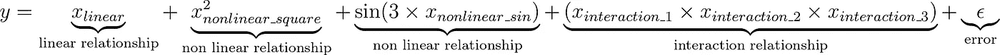
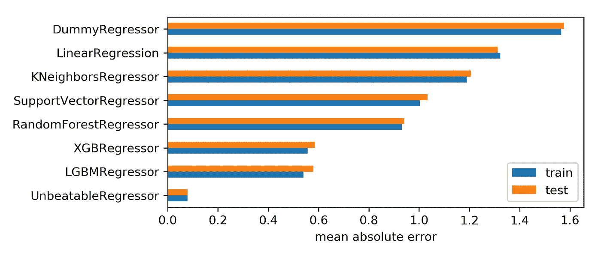
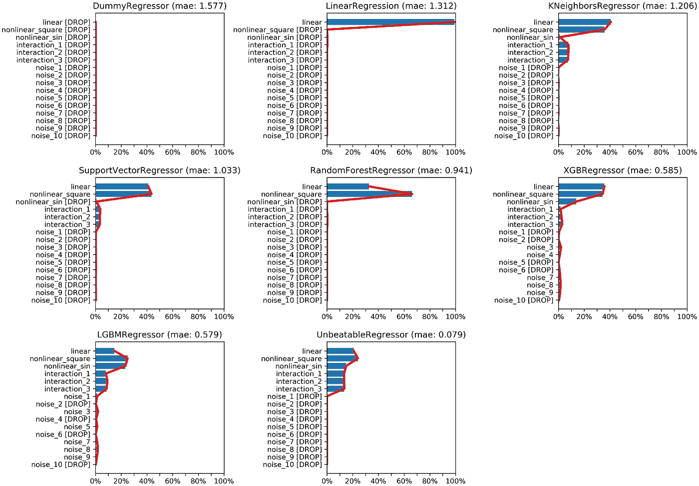
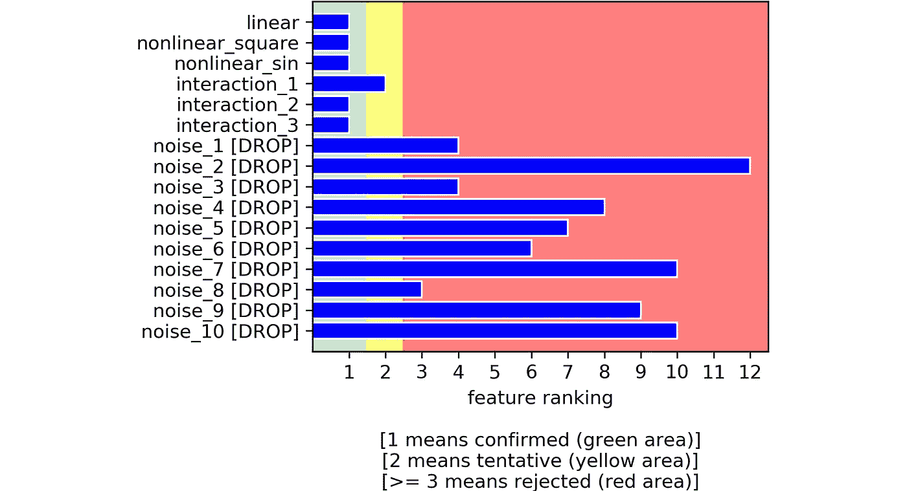

# 特征选择？你可能做错了

> 原文：<https://towardsdatascience.com/feature-selection-you-are-probably-doing-it-wrong-985679b41456?source=collection_archive---------13----------------------->

## …除非您正在使用这个 Python 包

一张关于樱桃采摘的精美照片(版权所有 [Shutterstock](https://www.shutterstock.com/image-photo/female-hand-picking-red-cherry-isolated-533345503)

我敢打赌，在那里，99%的特征选择是在“SelectFromModel”模式下进行的(这个名字来自 Scikit-learn 的`[SelectFromModel](https://scikit-learn.org/stable/modules/generated/sklearn.feature_selection.SelectFromModel.html)`)，它是这样工作的:

1.  你选择一个预测模型(姑且称之为`WhatevBoost`)；
2.  你符合`WhatevBoost`的所有特征；
3.  你从`WhatevBoost` *中提取特征重要性；*
4.  您删除了所有重要性低于某个阈值的特性，保留了所有其他特性。

这似乎是一个合理的方法，对不对？答案可能会让你大吃一惊。

在这篇文章中，我将测试这个过程是否真的如预期的那样工作。最后，我将展示一个出色的——但仍然鲜为人知的——用于特性选择的 Python 包，它恰好优于所有其他测试过的算法。

# 给我数据

在本帖中，我们将使用模拟数据。

我知道数据科学家对模拟数据嗤之以鼻，但这是测试事物的有效方法。在数据科学中，这是我们能够真正了解真相的唯一情况。

我们的模拟数据集会是什么样子？我们希望生成一些独立的特征:其中一些将与目标变量(称为`y`)相关，而其他特征将只是噪声。目的是找到一种能够确定哪些特征属于第一组和哪些特征属于第二组的特征选择方法。

假设我们的特征矩阵由 16 个独立特征组成，我们将其命名如下:

你可能已经从它们的名字猜到了，前 6 个特性与`y`有某种关系，而后 10 个只是噪音。

`y` 的函数形式应该足够复杂，能够包含一些自然界中存在的变量之间的非平凡效应。特别是，我们希望考虑以下类型的关系:

*   线性的
*   非线性的
*   相互作用

而且`X` 和`y` 的关系应该是非确定性的，所以增加了一个误差因子，叫做 *ε* 。为了说明这一切，我想出了下面的函数:

这转化为以下 Python 代码:

最后我们可以生成 *X* 和 *y* ，然后在一个训练集和一个测试集中拆分。

# 尝试“SelectFromModel”模式

现在我们有了数据，是时候挑选一些预测模型，并在“SelectFromModel”模式下进行尝试了。我们来看 8 个模型:

很有可能你听过所有的，但最后一个。你可能会挠头问“这个`UnbeatableRegressor`到底是什么？”。好吧，因为我们的数据是用我们确实知道的函数模拟的，所以我们可以得到每个数据科学家的圣杯:完美的模型。它是 y 的功能形式，不用说，它是不可战胜的。

为了获得与 scikit 兼容的回归器，我们只需将我们的函数包装在一个类中:

现在，让我们根据训练数据拟合我们的模型，看看它们在平均绝对误差方面的表现如何。

到目前为止，这并不奇怪:更酷的算法，如`XGBoost`或`LightGBM`比其他算法表现得更好(即使它们离理论最小值还很远)。

现在，让我们关注特性重要性，这是“SelectFromModel”模式的核心。

特征重要性在机器学习中是一个相当难以捉摸的概念，这意味着没有一种明确的方法来计算它。无论如何，这个想法非常直观:这是一种量化任何单一特征对预测模型准确性的贡献的方式。

值为 0%的特性不会以任何方式影响模型的准确性(因此可以将其删除)。值为 100%的特征是影响预测的唯一特征。在实际应用中，特性从来不是 0%或 100%重要，它们总是介于两者之间。

然而，由于我们只有 16 个特征，并且其中的后 10 个特征(从`noise_1` 到`noise_10`)与`y`没有任何关系，我们期望这些特征的重要性为 0%，其余 6 个特征(`linear`、`nonlinear_square`、`nonlinear_sin`、`interaction_1`、`interaction_2`和`interaction_3`)在它们之间共享所有的重要性。

但是让我们更保守一点:让我们取 1%的安全缓冲:我们将丢弃任何重要性低于 1%的特性。这个阈值是相当武断的，但是，考虑到我们只处理 16 个特征，似乎有理由相信低于 1%重要性的特征实际上是无用的。

在下图中，显示了所有 8 个模型的特征重要性。此外，重要性低于 1%的特性在其名称旁边标有“*【DROP】”*。

令人惊讶的是，最差的模型之一——T0——是唯一一个正确猜测所有相关特征的模型(但是，应该注意的是,`nonlinear_sin`由一根头发保持，因为它的重要性是 1.17%:稍微不同的阈值就会改变事情)。

`UnbeatableRegressor`提供的更接近特征重要性的“实际”形状的模型是`LGBMRegressor`，然而，许多嘈杂的特征被高估了，在这个意义上它们超过了 1%。

您可能会惊讶于这样一个事实，性能更好的模型不一定特性选择更好:**拥有一个优秀的模型并不能保证特性选择的成功**。此外，这种进行方式受到重要性阈值选择的严重影响:不同的阈值会给出完全不同的结果。

出于这些原因，我开始寻找另一种选择。直到我在波鲁塔绊倒。

# 使用 Boruta 进行特征选择

Boruta 是一种可以追溯到 2010 年的特征选择算法。它是作为 R 的一个包而诞生的([)这个](https://www.jstatsoft.org/article/view/v036i11)是米隆·库尔萨(Miron Kursa)和维托尔德·鲁德尼克(Witold Rudnickii)的原创文章，丹尼尔·霍莫拉(Daniel)的《蟒蛇》改编本:你可以在这里找到相关的项目。

Boruta 背后的直觉非常聪明，值得在一篇专门的文章中解释。在本文中，我们将限制自己使用 Python 的 Boruta 库，它可以通过`pip install Boruta`安装。

波鲁塔是一个包装纸。建议用`max_depth = 5`包裹一片随机森林。不用考虑参数调整确实是一个很大的好处。

您可能会问自己:“我们为什么使用`RandomForestRegressor`？在之前的实验中，它是表现最差的模型之一”。好吧，这正是 Boruta 的美妙之处:尽管它是随机森林之类的弱模型的包装，但它的设计是为了克服它的缺点。

Boruta 的输出是一个特征排序，它可以将特征细分为 3 个类别:

*   **排序 1:确认特征**(这些特征对目标变量有一定的信号性，应当保留)；
*   **排名第 2:暂定特征**(博鲁塔对这些特征举棋不定，由你来选择，我是个保守的人，我的建议是保留它们)；
*   **排名 3 或更高:被拒绝的特性**(这些只是噪音，所以应该被丢弃)。

可以绘制排名并可视化 3 个区域:

通过 Boruta 获得的特性排名

Boruta 做了一项惊人的工作:它从剩余的 10 个噪声特征中分离出了 6 个有意义的特征，正如我们所预期的那样。

# 总结

在本文中，我们使用模拟数据来证明，即使是 Xgboost 或 LightGBM 这样的复杂模型，在选择特性时也可能不是一个好的选择。

作为替代，我们提出了一个名为 Boruta 的相当未知但功能强大的 Python 包，它已经交付了预期的结果。

如果你对 Boruta 的功能感兴趣(我相信理解算法是有效使用它们的唯一方法)，你可以阅读我写的关于这个主题的文章:“ [Boruta 准确地解释了你希望有人如何向你解释](/boruta-explained-the-way-i-wish-someone-explained-it-to-me-4489d70e154a)”。

完整的 Python 代码可以在这里找到:[https://github . com/smazzanti/TDS _ feature _ selection _ you _ are _ possible _ doing _ it _ error](https://github.com/smazzanti/tds_feature_selection_you_are_probably_doing_it_wrong)

感谢您的阅读！希望这篇帖子有用。我感谢反馈和建设性的批评。如果你想谈论这篇文章或其他相关话题，你可以在这里给我发短信或在[我的 Linkedin 联系人](https://www.linkedin.com/in/samuelemazzanti/)。