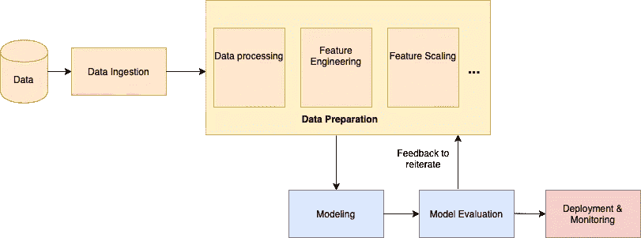

# 特征存储:在组织内部和跨组织实现数据科学和人工智能的更好方式。

> 原文：<https://towardsdatascience.com/feature-store-a-better-way-to-implement-data-science-and-ai-in-and-across-your-organization-93edc6366375?source=collection_archive---------42----------------------->

## 功能商店如何帮助企业加速数据和人工智能的采用？

克里斯蒂娜@ wocintechchat.com 在 [Unsplash](https://unsplash.com?utm_source=medium&utm_medium=referral) 上的照片

# **特色商店——人工智能应用的加速器**

数据科学和人工智能是改变您的业务和您所做的一切的强大力量，然而，优化和自动化数据科学和人工智能以充分利用它们的潜力和能力有着巨大的可能性。当组织开始他们的人工智能之旅时，他们会面临许多挑战，通常需要但很难加速其采用。

虽然有很多原因，但我们在这篇博客中关注的一个原因是，数据科学家需要重复他们的工作，缺乏集中的存储库等。这给业务和数据科学家带来了成本，例如**大量重复工作**、**增加生产时间**，以及**产生不一致的人工制品**。

在这篇博客中，我们将讨论什么是功能商店，它如何帮助人工智能的采用，以及它能给你的企业带来什么好处。我们将进一步讨论特征库如何成为解决上述问题的解决方案，并作为人工智能采用的推动者和加速器。我们将讨论它如何缩短机器学习模型的上市(生产)时间，以及它如何解决上述问题。

W 什么是特色店？

作为数据科学家，由于没有集中的存储库，我们经常重复工作，这是以增加生产时间为代价的，大量工作重复而不一致，无法共享和重用工件。在这篇博客中，我们将讨论它如何缩短机器学习模型的上市(生产)时间，以及它如何解决上述问题。

企业用户越来越需要并接受在企业中利用数据科学和人工智能来实现以下目标:

1.  优化决策
2.  优化业务运营
3.  创造新的商业机会

一方面是业务利益相关者，另一方面是技术极客、数据(科学)专业人员(我使用这个术语来涵盖所有数据工作者，包括数据科学家、数据工程师、数据可视化专家、数据架构师等。).企业所有者制定决策并经营企业，他们追求的是投资回报(ROI)，而数据工作者追求的是他们的技术产品的运行和工作。在这场竞赛中，数据科学家利用他们或其他数据工作者从不同来源获取的不同数据集，构建了不同的机器学习(ML)和深度学习(DL)模型。通常情况下，不同的模型准备数据的过程是相似的，这种努力可以在不同的人工智能工作中简化和重用。

因此，为了使构建人工智能模型的过程更加高效、可重用、可扩展，企业必须构建或利用企业范围的人工智能平台，除了降低在整个企业中开发、部署和共享人工智能模型的成本之外，该平台还可以大幅缩短生产周期。

典型的 ML 流如下所示

典型的 ML 工作流程 2020，Chan Naseeb。保留所有权利。

数据科学家将大部分时间花在准备数据上，在他们到达某个点(如 ML 模型)之前提取特征。这种时间、精力和资源的浪费可以节省下来，并用于获得有价值的见解，通过使这些数据成为可重用和可扩展的东西，可以更快地获得这些信息。

当谈到跨组织和跨部门的人工智能计划时，在数据准备步骤中提取的特征可以在多个项目中共享。存储和共享提取的特征、其他数据和人工智能产品(或资产)可以大大有助于加速人工智能工作和概念验证(POCs)。此外，企业将有更多可扩展的方式来管理数据和人工智能资产。

# F 特征存储:

上述关于实现可扩展性、可重用性等预期好处的讨论是促使我们建立这样一个平台(我们称之为功能库)的激励因素，它可以帮助组织在不同的工作和团队中共享数据和人工智能产品。这将有助于加快运行和部署模型的时间，因为花费大部分时间的 ML 管道中的警告现在通过利用/重用现有的工件在某种程度上减少了。

> “功能库是一个存储库，允许团队共享、发现和使用一组高度精选的功能来解决他们的机器学习问题”。

我们可以这样定义它

It 是一个集中的软件仓库(库),包含许多功能(工件),其中每个功能都从输入数据中创建一个特征。除了特性之外，你可以将这个定义扩展到存储、创建和共享任何其他数据&人工智能产品(模型、笔记本、代码文件等)。

它可以作为不同团队之间的桥梁，帮助他们减少整个组织中的孤岛。大量的数据和人工智能产品可以存储在特征库中。它们可以根据不同的目的进一步更新、版本化和编目。它可以帮助数据科学家构建新模型或增强现有模型，他们可以使用现成的人工制品并向其添加新的功能(人工制品)。

您可以利用特征库对模型进行在线和离线训练。在前一种情况下，您可以计算所需的特征(实时或批量预计算)并将它们存储到特征库中。而在后一种情况下，您拥有所有类型的数据以及与之相关的其他特征，您可以利用这些数据来训练机器学习模型。

数据科学家因此受益于自动化的数据准备步骤，否则会重复计算。数据处理的标准化和功能的版本化提供了不同模型之间的一致性，同时为数据科学家提供了按需定制的机会。这使得在整个业务中共享知识、模型和其他人工制品变得更加容易。

## 实施功能商店后，作为一个组织，您会获得什么好处？

向您的数据和人工智能策略中添加一个特征库可以为您带来以下好处:

**可伸缩性:**特性库可以随着 ML 项目交付的速度而增长。你可以使用现有的功能和其他可能的数据和人工智能产品来共享和引导人工智能项目，而不是每次都重新发明轮子。

**规模经济:**组织开发人工智能模型变得更加容易和快速。构建新模型所需的资源更少，因为新模型可以重用特征库中的现有特征。因此，使用共享特征库可以使组织实现规模经济

**更少的生产时间:**每次重新发明轮子时，通过节省数据准备和特征工程的时间、精力和资源，获得有价值的见解所需的时间更少。这并不意味着你不必做任何事情，而是规模和强度会小得多。这将需要您做很少的工作，因为您可以在需要的地方重用和修改这些特性。

**一致性和标准化:**特征库解决了 ML 项目管道中效率低下的问题。它通过自动化重复进行的数据准备工作和标准化数据处理使数据科学家受益，从而使不同模型的特征保持一致。

2020，Chan Naseeb。保留所有权利。

*最初发表于*[T5【https://www.community.ibm.com】](https://community.ibm.com/community/user/ibmcommunity/blogs/chan-naseeb1/2020/04/03/becoming-a-data-driven-organisation)*。*

# 感谢阅读！

如果你喜欢我的工作，并希望保持联系…

1.  最好的方法是跟随我上 [**中级**](https://medium.com/@channaseeb) 。
2.  如果你想**在介质**上写作并提交给出版物。点击此处查看 [**数据和 AI**](https://medium.com/data-and-ai) 以及更多一般性和多样化的话题，您可以将您的文章提交至
3.  **在**Twitter**这里关注我。我会在那里发布很多更新和有趣的东西！**
4.  **还有，订阅我的 **YouTube 频道** [这里](https://www.youtube.com/channel/UCAbnQ5KV9pnz1sLoRvx9v_w?view_as=subscriber)！**
5.  **关注我**LinkedIn**这里。**
6.  **查看我的[网站](https://sites.google.com/site/channaseeb/home?authuser=0)。**