# 数据科学家的特征转换

> 原文：<https://towardsdatascience.com/feature-transformation-for-data-scientists-3a9eed562752?source=collection_archive---------19----------------------->

## 数据插补，宁滨，编码，等等！熟练掌握所有步骤！

本·怀特在 [Unsplash](https://unsplash.com?utm_source=medium&utm_medium=referral) 上的照片

# 简介

要素变换是修改数据但保留信息的过程。这些修改将使机器学习算法更容易理解，从而提供更好的结果。

我们将涵盖每种方法的所有步骤，从解释到代码；但首先，让我们来看看今天我们将学习的内容:

**数据缩放(标准化和规范化)**

*   我们将减少重复，提高性能和数据完整性。

**数据插补、宁滨和编码**

*   如何填充缺失的值，将其转换为数字，并按值进行缩放。

**异常值检测**

*   最后，我们将根据标准差和四分位间距移除异常值。

# 数据集

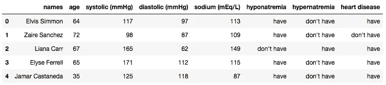

图片由[雷南·洛里科](https://medium.com/@renfelo)拍摄——中号

您可以通过[点击此处](https://github.com/renfelo/datascience/tree/master/others/guides/feature_transformation/data)下载数据集。现在，我们需要定义一些参数和要回答的问题。

这个人工数据集**模拟了一些关于心脏病可能性的数据**，这就是我们的目标。为了找到答案，我们有一些虚假的医疗信息，如血压、年龄和钠含量。

## 我们有什么资源？

*   **名称:**对象；
*   **年龄:**int 64；
*   **收缩压(mmHg):**int 64；
*   **舒张压(mmHg):**int 64；
*   **钠(mEq/L):**int 64；
*   **低钠血症:**客体；
*   **高钠血症:**客体；
*   **心脏病:**对象；(目标)

# 1)数据插补

当获得新数据时，您要做的第一件事是检查它并寻找丢失的值；让我们看看它看起来怎么样。

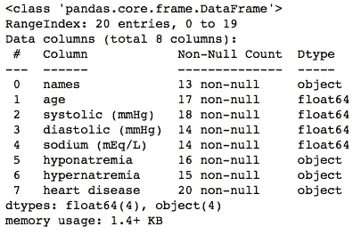

图片由[雷南·罗利科](https://medium.com/@renfelo)拍摄——中号

我在这个数据集中随机添加了一些空值，忽略了心脏病一栏。至于我们的方法，对小数据集使用 Pandas 函数是可以的；但是如果你有更大的，**考虑使用 scikit-learn** 。

# 如何分配数据？

在 Pandas 中，我们有一个很好的函数叫做 **fillna()** ，可以想象，它会填充任何空值。让我们来看看。

简单吧？它将产生下面的变化。

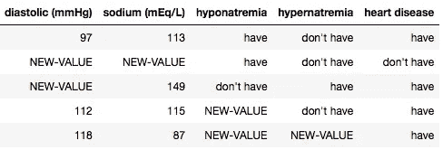

图片由[雷南·洛里科](https://medium.com/@renfelo)拍摄——中号

## 问题是

多么简单啊！一行代码就这样，牛逼！但是冷静下来，有一个问题:我们把同一个值定义为分类的和数值的，这是不对的，那怎么办？

现在，我们有了填充数字资源中空白空间的整列的平均值和分类空间中“缺失”的文本。

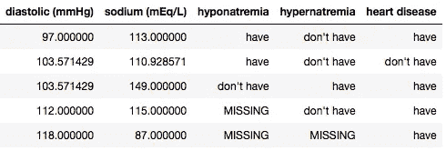

图片由[雷南·洛里科](https://medium.com/@renfelo)拍摄——中号

## 数据插补技巧

*   如果您有数字数据，请考虑用平均值或中值填充空值。
*   当心零；有些功能可以用这个作为布尔表示！
*   使用特定的单词来填充文本列。
*   当心数据重复。

# 2)异常值检测和消除

在继续之前，我们需要在我们的数字列中寻找差异，**，因为它们会影响我们模型的质量。**基于一个具体的问题，最好保留每个值，但无论如何你都需要知道如何移除它们。

## 怎么找他们？

通常可以用一些图形工具来显示，比如 Matplotlib。图表的类型？通常是直方图和箱线图。不知道如何绘制数据？我有一篇关于它的文章:[数据可视化的终极指南](/the-ultimate-guide-for-data-visualization-c98de0d3158d?source=your_stories_page---------------------------)。

下面我们将检查我们的数据表示**是否没有异常值**。

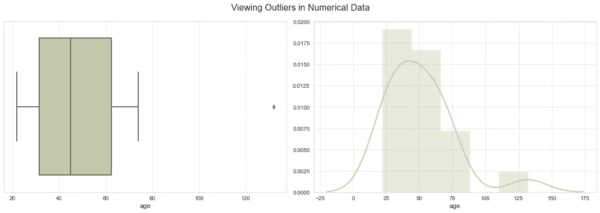

图片由[雷南·洛里科](https://medium.com/@renfelo)拍摄——中号

为了了解情况，我附上了一个将一个人的年龄改为 134 岁的案例，非常罕见。

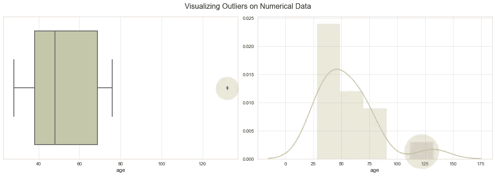

图片由[雷南·洛里科](https://medium.com/@renfelo)拍摄——中号

## 老式的方法

你可能对视觉效果不太适应，或者只是想要一些更切题的东西。如果您符合上面的描述，我将留下代码来创建一个只有离群值的数据帧。

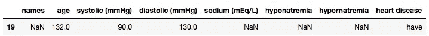

图片由[雷南·洛里科](https://medium.com/@renfelo)拍摄——中号

对于大量的异常值，我们的模型将创建使用这些值的模式，但它们通常只是打字错误、错误数据等等。

## 如何去除它们？

通常有两种常见的剔除异常值的方法:**标准差和四分位距**。还有更多像 Z 分数，甚至手动删除，但让我们现在忽略它们。

1.  **标准偏差**

图片来自[维基百科——标准差](https://en.wikipedia.org/wiki/Standard_deviation)

使用标准差，我们可以只选择那些在平均值的+3 或-3 标准差之间的数据。该值可以调整，但通常在 2 到 4 之间。如果你不确定如何使用标准差，[点击此处](https://www.youtube.com/watch?v=HvDqbzu0i0E)观看可汗学院的视频。

2.**四分位距**

图片由[统计 How To —四分位间距计算器](https://www.statisticshowto.com/calculators/interquartile-range-calculator/)

为了以这种方式去除异常值，我们需要获得第一个和第三个四分位数。**数据必须按升序排列。**

[https://gist . github . com/ren felo/a1c 773511 e 5171 ace 6735032145 a0a 59](https://gist.github.com/renfelo/a1c773511e5171ace6735032145a0a59)

# 3)宁滨数据

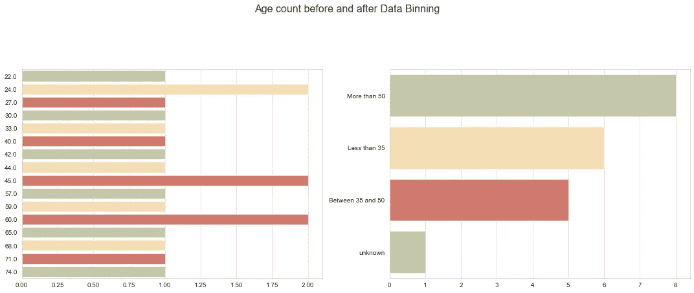

图片由[雷南·洛里科](https://medium.com/@renfelo)拍摄——中号

在这个阶段，我们引入一个间隔来替换所有条目的原始值。换句话说，我们将年龄列更改为:

*   **比**少 35；
*   **在** 35 和 50 之间；
*   **超过**50；

因此，任何符合这些标准的人的年龄值都将被修改。让我们看看代码。

这对于减少过拟合非常有用，但这是有代价的:**我们惩罚了我们机器学习模型的准确性**。您已经用三个结果的几个可能值更改了整个列。在我们的具体情况下不是问题，而是用好它。

## 数据宁滨提示

*   **永远记住代价；**
*   它是来用的，如果没必要，就忽略它；
*   它可以在特征工程期间使用，基于某些条件创建新列；

# 4)数据编码

用 scikit-learn 库中的任何工具对我们的数据集进行编码要容易得多，但这是一本 Pandas 手册，所以我们将手动进行。

## 为什么我需要编码？

计算机能阅读数字，甚至是最复杂的数字。理解数字数据比理解分类数据要容易得多，这也是我们这样做的原因。

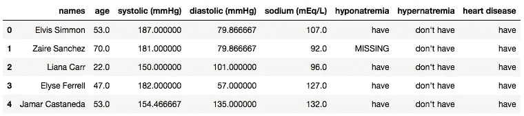

正常数据集。图片由[雷南·洛里科](https://medium.com/@renfelo)拍摄——中号

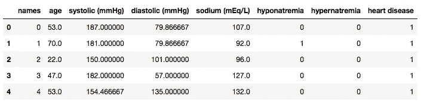

编码数据集。图片由[雷南·洛里科](https://medium.com/@renfelo)拍摄——中号

编码后，我们可以验证皮尔逊相关性；它通常忽略分类特征。让我们来看看。

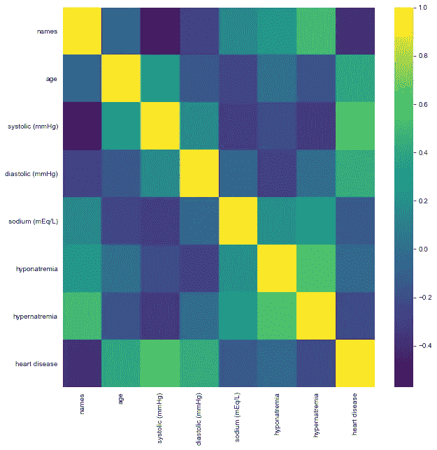

图片由[雷南·洛里科](https://medium.com/@renfelo)拍摄——中号

如您所见，我们开始从数据中获得重要信息:

*   name 列现在变得没用了，我们可以看到这一点；
*   年龄、收缩压和舒张压呈高度正相关；
*   低钠血症和高钠血症几乎不相关；

# 5)数据缩放

机器不像我们一样理解规模。你可以很容易地发现你的工资和你的体重之间的差异，要知道体重不可能和你每月收到的一样多，但计算机不会；这就是我们扩展整个数据集的原因。基本来说，有两种方式可以规模化:**标准化和规范化**。

## 标准化

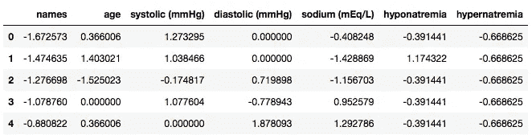

为什么我要保留“姓名”列？图片由[雷南·洛里科](https://medium.com/@renfelo)拍摄——中号

也称为 Z 分数标准化，这种方法调整我们的数据大小，使**中值为零，标准差为 1** 。最后，无论他们的价值观如何不同，他们都会有相同的代表性。

它非常有用，可以减少过度配置资源的影响，所以请使用它。

## 技巧

*   标准化减少了过度拟合的影响；
*   在深度学习和神经网络项目中，这是一个常见的过程；

## 正常化

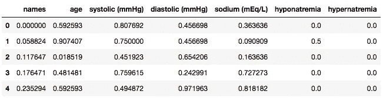

图片由[雷南·洛里科](https://medium.com/@renfelo)拍摄——中号

也被称为最小-最大规范化，这个方法**将我们的数据调整为 0 和 1** 之间的固定值。

## 技巧

*   标准化**增加**过度拟合的影响；
*   无论什么时候想用，先去掉离群值；

# 项目

作为本手册的最后一部分，我想展示应用于机器学习模型时的结果。首先，我们从探索性的数据分析开始。

## 探索性数据分析

我们不必担心数据清理，因为我们的数据集已经准备好了。让我们直接进入预览。

**问题 1:** 我们的年龄是如何影响收缩压指数的？

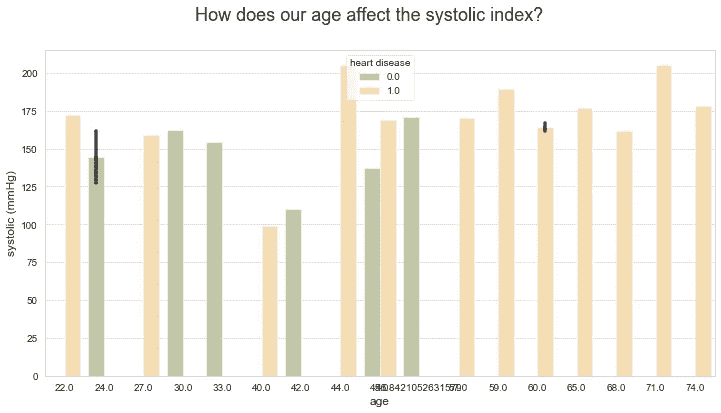

图片由[雷南·洛里科](https://medium.com/@renfelo)拍摄——中号

**问题二:**有多少心脏病患者有高钠血症？

图片由[雷南·洛里科](https://medium.com/@renfelo)拍摄——中号

可视化:我们的数据是如何传播的？

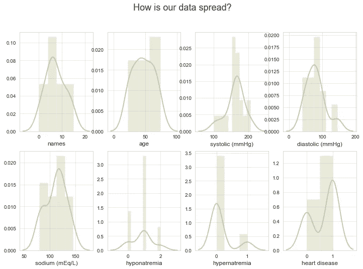

图片由[雷南·洛里科](https://medium.com/@renfelo)拍摄——中号

你喜欢这些图像吗？我在 Medium 上还有一篇文章，教你如何创建漂亮的数据可视化效果。如果你想的话，过会儿再看。

 [## 数据可视化的终极指南

### 没有人喜欢丑陋的东西，对吗？如果他们猜不出我们的期望，那就更糟了。所以让我们来学习如何生成…

towardsdatascience.com](/the-ultimate-guide-for-data-visualization-c98de0d3158d) 

## 模型

由于它不是一个专注于机器学习模型工作流程每一步的项目，所以我会留下三个随机获得的算法的基础分数。这是分类问题，别忘了。我们的评估方法将是一个**准确度分数和一个混淆矩阵**。

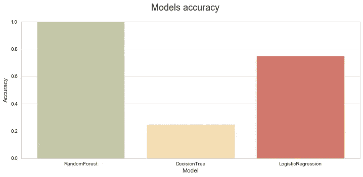

图片由[雷南·洛里科](https://medium.com/@renfelo)拍摄——中号

不幸的是，我们没有足够的数据来改进我们的模型，我们的第一个模型(RandomForest)可能会过度拟合。别忘了这个:**你的数据越多，你的算法就越有能力**。让我们检查一下混淆矩阵。

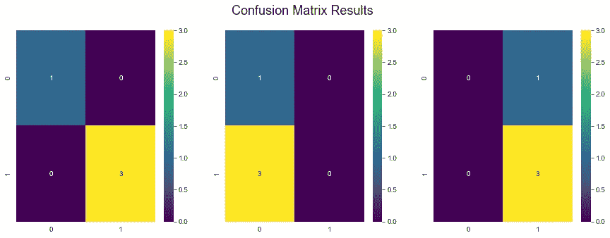

图片由[雷南·罗利科](https://medium.com/@renfelo)拍摄——中号

看看这个！RandomForest 太棒了！但是现在注意了:后两个有假阳性和假阴性。我们上两个模型有时预测错误。这样不好，其实。当然可以改进。

# 不知道如何创建模型？

如果你对机器学习模型的制作有任何困难，不要担心，我有一篇关于它的令人钦佩的文章。充满图像，非常愉快。如果你想的话，可以看看。

 [## 你的机器学习模型完全指南

### 使用哪种模型，何时使用，为什么？如何调优你的算法？让我们一起投入进去吧！

towardsdatascience.com](/your-complete-guide-to-machine-learning-models-403b4716172c) 

# 我在哪里可以找到这些材料？

如果您对我如何创建所有这些图形和代码感兴趣，您可以:

*   [获取 Jupyter 笔记本文件](https://github.com/renfelo/datascience/blob/master/others/guides/feature_transformation/feature_transformation.ipynb)；
*   [下载数据集](https://github.com/renfelo/datascience/tree/master/others/guides/feature_transformation/data)；

# 就是这样，伙计们！

我希望你喜欢这个内容，并能熟练运用你的新知识！如果你想每天学习有趣的东西，我很乐意与你分享精彩的内容！

另外，你可以在 Github 上查看我的个人资料。我从事一些数据科学项目已经有一段时间了。所有的关键概念都可以学习和重用！

 [## 雷南·洛利科-吉图布

### 在 GitHub 上注册你自己的个人资料，这是托管代码、管理项目和构建软件的最佳地方…

github.com](https://github.com/renfelo)