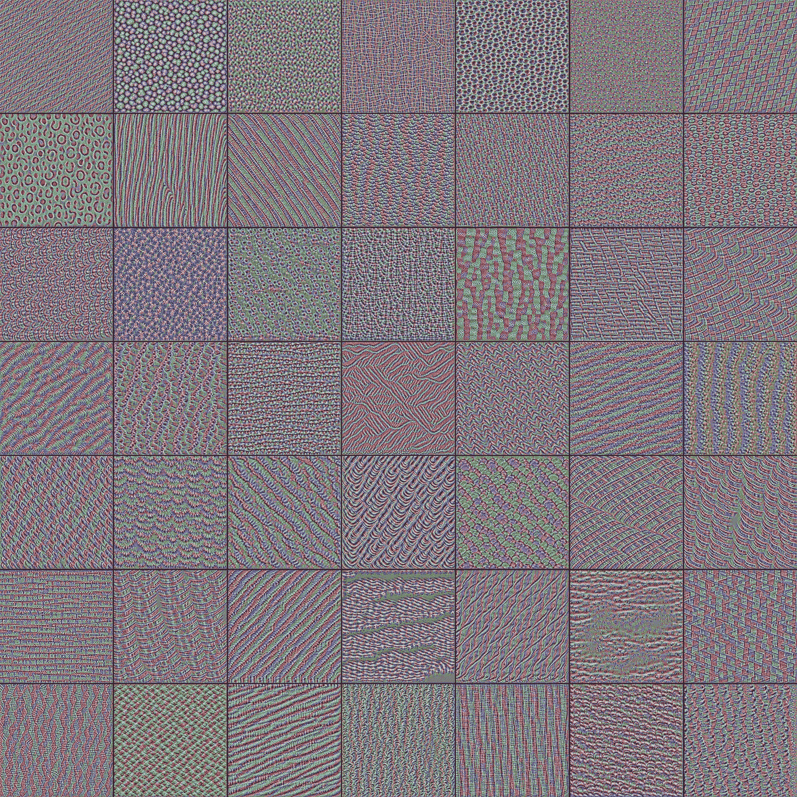
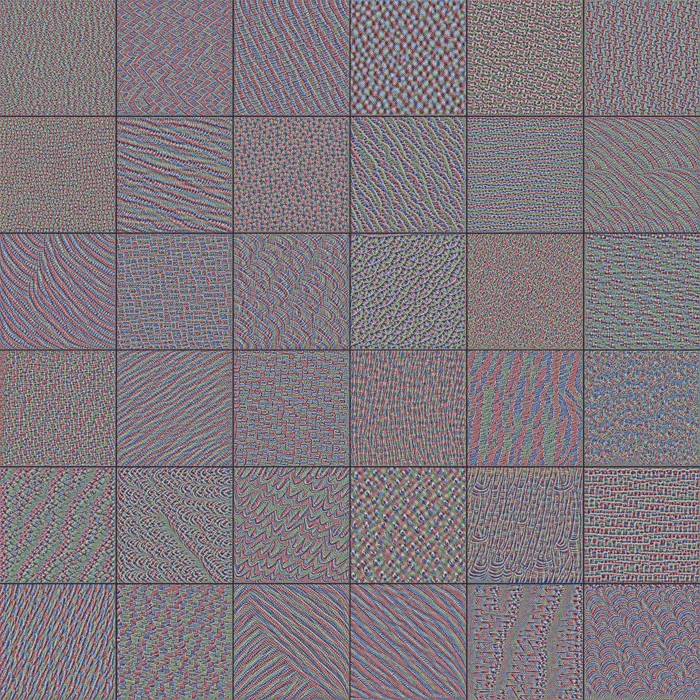
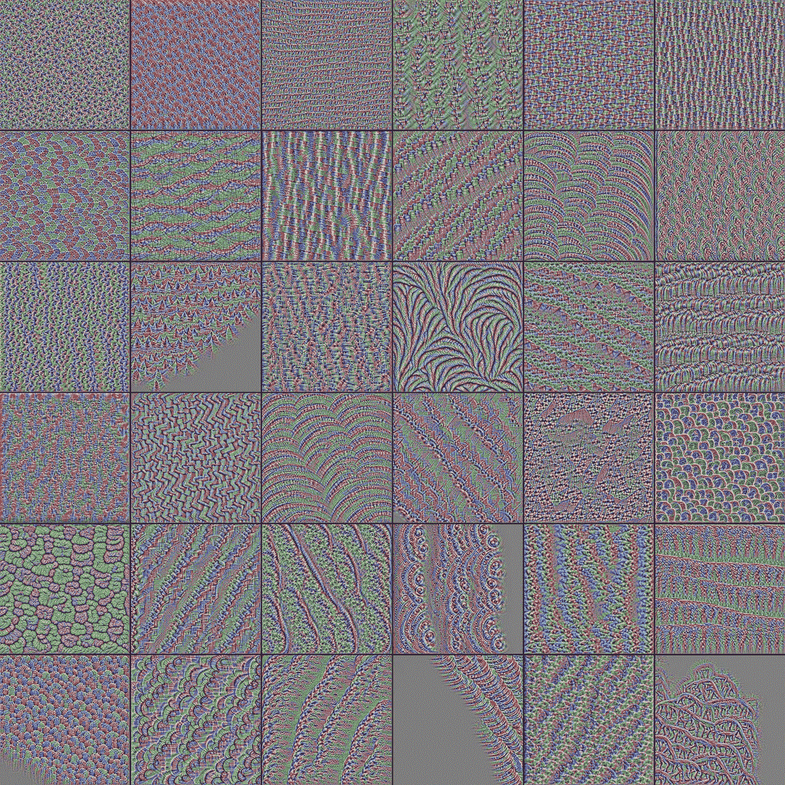
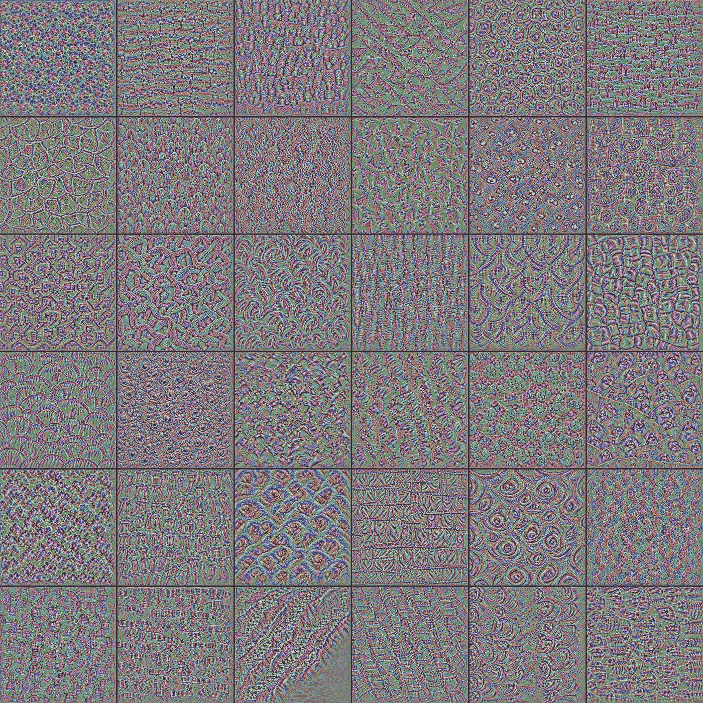
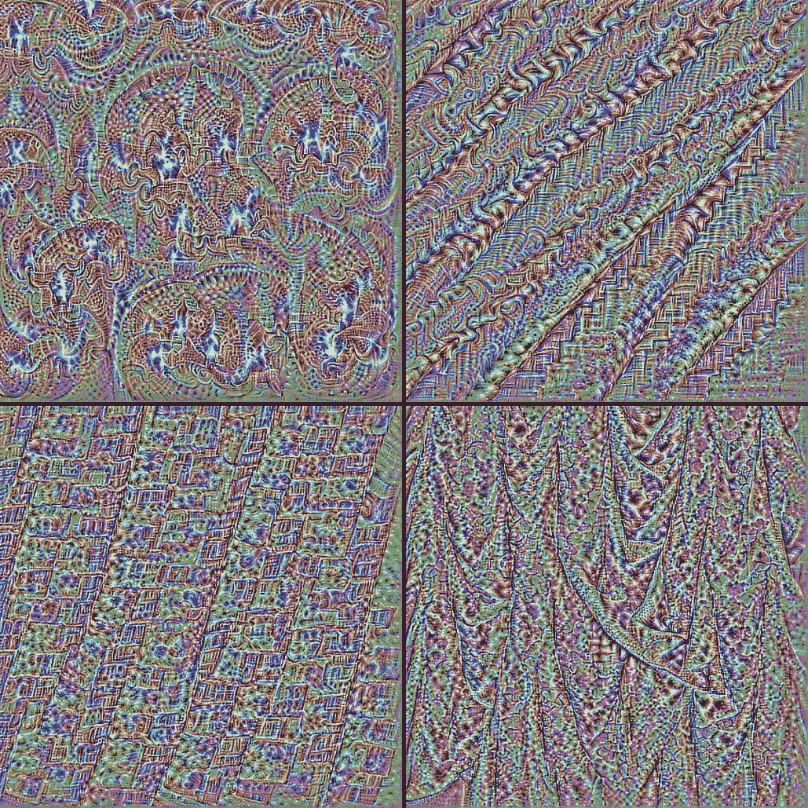
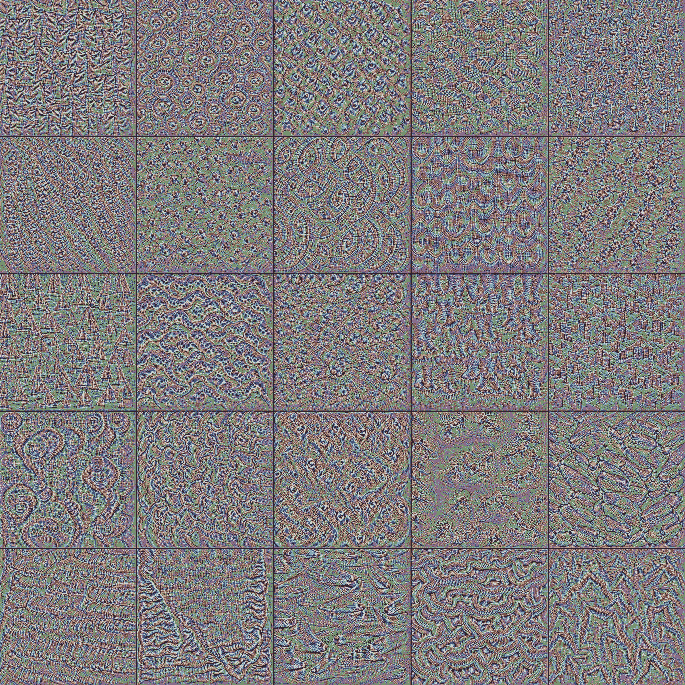
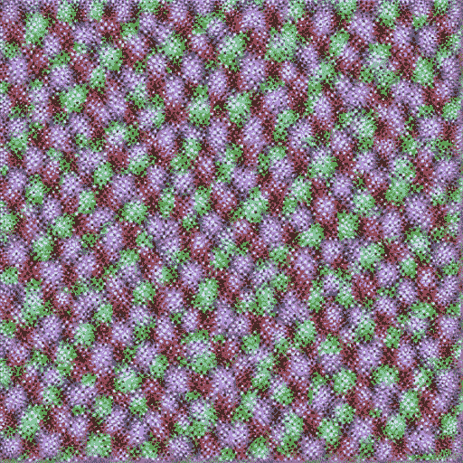
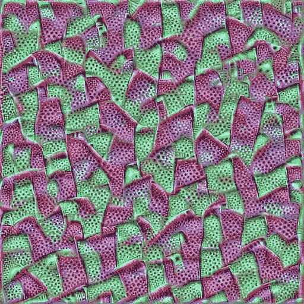
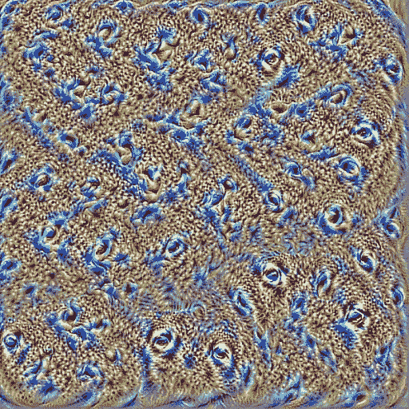
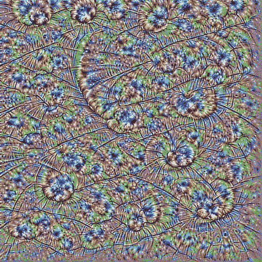

# 卷积神经网络的特征可视化

> 原文：<https://towardsdatascience.com/feature-visualization-on-convolutional-neural-networks-keras-5561a116d1af?source=collection_archive---------16----------------------->

## 卷积神经网络中的每个滤波器在做什么？它正在学习检测哪种图像？这里有一个方法可以知道

根据维基百科的说法， [apophenia](https://en.wikipedia.org/wiki/Apophenia) 是*“错误感知不相关事物之间的联系和意义的倾向”*。它也被用作“人类在随机信息中寻找模式的倾向”。无论是科学家在实验室里做研究，还是阴谋论者警告我们“这一切都是联系在一起的”，我想人们需要感觉我们明白发生了什么，即使面对明显随机的信息。

与 XGboost 或[可解释的增强机器](https://github.com/interpretml/interpret)等更透明的模型相比，深度神经网络通常被视为“黑盒”,因为它们的**不可预测性**。

然而，有一种方法可以解释卷积神经网络中每个单独的滤波器正在做什么，以及它正在学习检测哪种图像。

至少从 2012 年开始，卷积神经网络开始崭露头角，当时 [AlexNet](http://image-net.org/challenges/LSVRC/2012/supervision.pdf) 以 85%的准确率赢得了 [ImageNet 计算机视觉竞赛](http://www.image-net.org/challenges/LSVRC/2012/index#workshop)。第二名的比例仅为 74%,一年后大多数竞争者都转向这种“新”算法。

它们广泛用于许多不同的任务，大多与**图像处理**相关。这些包括图像分类，检测问题，以及许多其他问题。

我不会深入探讨卷积神经网络是如何工作的，但如果你是这方面的初学者，我建议你阅读我的[卷积神经网络实用介绍](https://www.datastuff.tech/machine-learning/convolutional-neural-networks-an-introduction-tensorflow-eager/)和工作张量流代码。

如果你已经掌握了卷积神经网络是如何工作的，那么这篇文章就是你理解**什么特征可视化**和它如何工作所需要知道的全部。

# 特征可视化是如何工作的？

通常，你会训练一个 CNN 给它提供图像和标签，并使用梯度下降或类似的优化方法来**拟合神经网络的权重**，以便它预测正确的标签。

在整个过程中，人们希望图像保持不变，这同样适用于标签。

然而，如果我们选取任何图像，在我们(已经训练好的)网络中选择一个卷积滤波器，并对输入图像应用梯度下降**以**最大化该滤波器的输出**，同时**保持网络的权重不变**，您认为会发生什么？**

突然间，我们的视角发生了转变。我们不再训练一个模型来预测图像的标签。相反，我们现在正在将图像与模型相匹配，让它生成我们想要的任何输出。

在某种程度上，这就像我们在问模型“看到这个过滤器了吗？什么样的图像能打开它？”。

如果我们的网络已经被适当地训练，那么我们期望大多数过滤器携带有趣的、有价值的信息，帮助模型为其分类任务做出准确的预测。我们期望过滤器的激活带有语义含义。

因此，显而易见的是,“激活”过滤器，使其具有大量输出的图像应该具有与数据集中(以及模型标签中)存在的某个对象相似的特征。

然而，鉴于卷积是一种局部变换**，在我们图像的许多不同区域，触发卷积滤波器重复“发芽”的模式是很常见的。**

**这一过程产生了谷歌深梦模型流行的那种画面。**

**在本教程中，我们将使用 **TensorFlow 的 Keras** 代码来**生成最大化给定滤镜输出的图像**。**

**由于滤波器的输出在技术上是一个矩阵，我们将最大化的实际函数是该矩阵组件的平均值，**是整个图像**的平均值。通过这种方式，我们的算法将被激励来生成贯穿整个图像的激活过滤器的任何模式。**

# **实现过滤器可视化**

**正如我之前提到的，要做到这一点，我们需要首先**训练一个神经网络分类器**。幸运的是，我们不需要经历整个混乱而昂贵的过程: **Keras** 已经配备了一整套预先训练好的神经网络，我们可以下载并使用。**

# **使用预先训练好的神经网络**

**对于本文，我们将使用 VGG16，这是一个在相同的 ImageNet 竞争数据集上训练的巨大卷积神经网络。还记得我提过 AlexNet 以 85%的准确率胜出，颠覆了图像分类领域吗？VGG16 在同样的任务上得分 92%。**

> ***VGG16 是由英国牛津大学的 K. Simonyan 和 A. Zisserman 在论文《用于大规模图像识别的甚深卷积网络》中提出的卷积神经网络模型。该模型在 ImageNet 中达到了 92.7%的 top-5 测试准确率，ImageNet 是一个包含属于 1000 个类的超过 1400 万个图像的数据集。那是提交给*[*ils vrc-2014*](http://www.image-net.org/challenges/LSVRC/2014/results)*的著名模型之一。它通过用多个 3×3 内核大小的滤波器一个接一个地替换大内核大小的滤波器(在第一和第二卷积层中分别是 11 和 5)来对 AlexNet 进行改进。VGG16* ***训练了几周，用的是 NVIDIA Titan Black GPU 的*** *。***
> 
> **[*https://neurohive.io/en/popular-networks/vgg16/*](https://neurohive.io/en/popular-networks/vgg16/)*—vgg 16—用于分类和检测的卷积网络(重点地雷)***

**对于这些实验，我将使用 [Google colab 的](https://colab.research.google.com/) GPU 机器，并调整 Keras 库的示例[过滤器可视化](https://github.com/keras-team/keras/blob/master/examples/conv_filter_visualization.py)代码。**

**关于原始脚本是如何工作的，你可以看看 Keras 的博客。我只对它进行了轻微的修改，以方便配置文件名和其他小细节，所以我认为不值得链接到我自己的笔记本上。**

**这个重要函数的作用是:**

*   **定义一个损失函数，它等于所选的**滤波器在整个图像**上的平均输出。在我们的代码中，我们这样做:`loss = K.mean(layer_output[:, filter_index, :, :])`。**
*   **初始化一个小的**起始图片**，典型的是以 RGB(128，128，128)为中心的**随机均匀噪声**(我实际上用这个玩了一会儿，稍后会详细说明)。**
*   **针对该损失计算输入图像的**梯度，并执行梯度下降。
    注意，我们正在**向神经网络**输入图像，但是忽略了我们关心的那一层之后的任何一层。****
*   **重复 N 次，然后调整图片大小，使其稍微变大(默认值为 20%)。我们从一张小图片开始，随着我们生成过滤器的最大化图像，它会越来越大，因为否则该算法会创建一个重复多次的小图案，而不是创建一个具有更大(主观上更美观)形状的低频图案。**
*   **重复最后两步，直到达到所需的分辨率。**

**差不多就是这样。我链接到的代码还发生了一些事情(图像标准化，将许多过滤器生成的图像拼接成可爱的拼贴画)，但这是最重要的一点。**

**这是那个函数的代码，现在你知道发生了什么，就没那么可怕了，对吗？**

**现在有趣的部分，让我们试试这个，看看哪种过滤器出来。**

# **我尝试特征可视化的结果**

**在尝试之前，我阅读了[许多](https://distill.pub/2017/feature-visualization/) [不同的](/how-to-visualize-convolutional-features-in-40-lines-of-code-70b7d87b0030) [例子](https://arxiv.org/pdf/1311.2901.pdf)的特性可视化文章。以下是我学到的一些东西。**

*   **第一个卷积层(靠近输入的层)产生更简单的视觉效果。它们通常只是粗糙的纹理，比如平行的波浪线，或者彩色的圆圈。**

****

**VGG16 上卷积滤波器的可视化，第二层。**

*   **更接近输出的卷积层产生更复杂的纹理和图案。有些甚至类似于存在的物体，或者看起来可能存在(以一种非常神秘的方式)。**

**老实说，这也是我玩得最开心的地方。我尝试了许多不同的“初始图像”，从随机噪声到均匀灰度，再到渐进退化。**

**任何给定过滤器的结果都非常相似。这让我想到，考虑到我使用的迭代次数，初始图像本身变得非常不相关。至少，它没有对结果产生可预测的影响。**

****

**VGG16 的第一个卷积层中的块 4 滤波器的特征可视化。大多数图案看起来规则而有颗粒，但比我们在第一层看到的早期乡村纹理要复杂得多。**

****

**块 4 的滤波器可视化，VGG16 的第二卷积层中的滤波器。注意这些图案是如何重复的，但是产生的纹理看起来比第一层要复杂得多。**

****

**块 4 的滤波器可视化，VGG16 的第三卷积层中的滤波器。一些更容易渗透的模式似乎出现了。**

**随着我们越来越深入，并且**越来越接近完全连接的层**，我们到达了**的最后一个卷积层**。它生成的图像是迄今为止最复杂的**，它们制作的图案很多时候都类似于现实生活中的物品。****

********

****块 5 的滤波器可视化，VGG16 的第一卷积层中的滤波器****

********

****块 5 的滤波器可视化，VGG16 的第三卷积层中的滤波器****

********

****块 5，第二卷积层中的滤波器。所有这些模式都是通过最大化一个“简单的”(尽管是超维的)数学函数出现的，这难道不疯狂吗？****

****现在，看着这些图像寻找模式，很容易感觉到一个人正在坠入阿波菲斯。然而，我想我们都同意，其中一些图片的特征**看起来很像** …你可以放大图片，自己完成句子。特征可视化是新的凝视云。****

****我自己的猜测是这只是一种新的抽象艺术。****

****让我向你展示一些我认为视觉上最有趣的滤镜:****

********************************

****棉花，橘子皮，眼睛？奇怪的发霉螺旋。****

****我还有大约 240 张这样的照片，如果有足够的兴趣，我可以把它们做成一个画廊，但我担心过一会儿它可能会变得重复。****

# ****结论****

****老实说，我从这个项目中获得了很多乐趣。直到几周前，我才真正听说过 Google Colab(感谢 [r/mediaSynthesis](https://www.reddit.com/r/MediaSynthesis/) )。能够免费使用一台好的 GPU 机器，感觉太棒了。****

****几年前，我也读过关于这个主题的大部分论文，但是从来没有真正测试过代码或者写过这样的文章。我很高兴我终于把它从我的清单上划掉了(或者特雷罗，我在骗谁呢？).****

****最后，在未来，我想尝试不同的网络架构，并想象图像如何在每次迭代中变形，而不是简单地看着成品。****

****请在评论中让我知道哪些其他实验或参考书目值得查看，以继续扩展这个主题！****

*****如果你喜欢这篇文章，请考虑在推特上发布或在其他地方分享！* *关注我的*[*Twitter*](https://www.twitter.com/strikingloo)*进一步讨论这些问题，或者关注我的最新文章。*****

****你可以在我的 [*个人网站*](http://strikingloo.github.io/wiki) *中看到我正在做的事情以及我最近的文章和笔记。*****