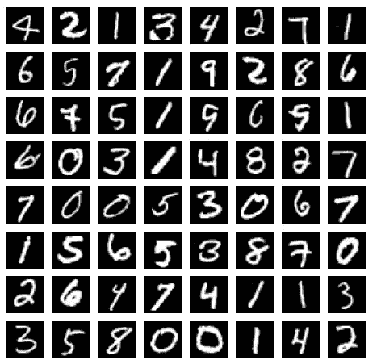

# 联邦学习:用 PyTorch 简单实现 FedAvg(联邦平均)

> 原文：<https://towardsdatascience.com/federated-learning-a-simple-implementation-of-fedavg-federated-averaging-with-pytorch-90187c9c9577?source=collection_archive---------6----------------------->

## [实践教程](https://towardsdatascience.com/tagged/hands-on-tutorials)


[杰森·登特](https://unsplash.com/@jdent?utm_source=unsplash&utm_medium=referral&utm_content=creditCopyText)在 [Unsplash](https://unsplash.com/s/photos/privacy?utm_source=unsplash&utm_medium=referral&utm_content=creditCopyText) 上的照片

手机、平板电脑和智能手表等移动设备现在是主要的计算设备，已经成为许多人不可或缺的一部分。由于结合了丰富的用户交互和强大的传感器，这些设备承载了大量有价值的私人数据。基于这些数据训练的模型可以显著提高智能应用程序的可用性和功能。然而，这些数据的敏感性意味着也有一些风险和责任[1]。在这一点上，联邦学习(FL)的概念开始发挥作用。

在 FL 中，每个客户分散地训练它的模型。换句话说，模型训练过程是为每个客户单独进行的。只有学习到的模型参数被发送到可信中心，以组合和馈送聚合的主模型。然后可信中心将聚合的主模型发回给这些客户端，这个过程就这样循环下去[2]。

在这种情况下，我使用 IID(独立同分布)数据准备了一个简单的实现，以展示如何将运行在不同节点上的数百个不同模型的参数与 FedAvg 方法结合起来，以及该模型是否会给出合理的结果。该实现是在 MNIST 数据集上进行的。MNIST 数据集包含数字从 0 到 9 的 28 * 28 像素灰度图像[3]。



来自 MNIST 数据集的手写数字(图片由作者提供*)

*   MNIST 数据集并不平等地包含每个标签。因此，为了满足 IID 要求，数据集被分组、混洗，然后分布，使得每个节点包含相同数量的每个标签。
*   为分类过程创建了一个简单的两层模型。
*   定义了用于 FedAvg 的函数。

这里，一次迭代完成如下。

1.  由于主模型的参数和节点中所有局部模型的参数都是随机初始化的，所以所有这些参数都将互不相同。为此，主模型在节点中的本地模型的训练开始之前将其参数发送到节点。
2.  通过使用这些参数，节点开始在它们自己的数据上训练它们的本地模型。
3.  每个节点在训练它自己的模型时更新它的参数。训练过程完成后，每个节点将其参数发送到主模型。
4.  主模型取这些参数的平均值，并将它们设置为新的权重参数，并将它们传递回节点，用于下一次迭代。

上面的流程是针对一次迭代的。这种迭代可以不断重复，以提高主模型的性能。

**注:**这里的目的不是为了提高分类算法的性能，而是将联邦学习得到的模型与集中式模型的性能进行比较。如果您愿意，可以使用更复杂的模型或调整超参数来提高性能。

如果你准备好了，我们开始吧！

GIF 由[欧洲公园](https://giphy.com/gifs/europapark-fun-looping-xUOwGdA2o7E4TPJICQ)在 [giphy](https://giphy.com/) 上发布

# 功能解释

**数据分发功能**

*   ***【split _ and _ shuffle _ labels(y _ data，seed，amount):*** 数据集不包含相同数量的每个标签。为了将数据作为 IID 分布到各个节点，必须采集相同数量的数据。该函数根据每个标签给出的数量对它们进行分组，并在自身内部打乱顺序。请注意，这里混洗的是数据的索引，我们将在将来检索数据时使用它们。但是这些索引需要重新设置以避免关键错误。因此，定义了一个新列，并在那里保留了混排索引。

*   ***get _ iid _ sub samples _ indexes(label _ dict，number_of_samples，amount):*** 该函数将每个节点中的索引用每个标签的相同数量进行划分。(这里索引仍然是分布式的，而不是数据)

*   ***create _ iid _ sub samples(sample _ dict，x_data，y_data，x_name，y_name):*** 该函数将 x 和 y 数据分发给字典中的节点。

**FedAvg**的功能

*   ***create _ model _ optimizer _ criterion _ dict(number _ of _ samples):***该函数为每个节点创建一个模型、优化器和损失函数。

*   ***get _ averaged _ weights(model _ dict，number_of_samples):*** 该函数取单个节点权重的平均值。

*   ***set _ averaged _ weights _ as _ main _ model _ weights _ and _ update _ main _ model(main _ model，model_dict，number_of_samples):*** 该函数将单个节点的平均权重发送到主模型，并将其设置为主模型的新权重。(调用 def get _ averaged _ weights(model _ dict，number_of_samples))

*   ***compare _ local _ and _ merged _ model _ performance(number _ of _ samples:***该函数比较主模型和每个节点上运行的局部模型的精度。

*   ***send _ main _ model _ to _ nodes _ and _ update _ model_dict(main _ model，model _ dict，number_of_samples):*** 该函数将主模型的参数发送给节点。

*   ***start _ train _ end _ node _ process _ without _ print():***该函数在节点中训练单个局部模型。

# 基于所有训练数据的集中式模型的性能如何？

首先，让我们检查一下，如果数据根本不分布到节点上，集中式模型的性能会如何？

```
 — — — Centralized Model — — — 
epoch: 1 | train accuracy: 0.8743 | test accuracy: 0.9437
epoch: 2 | train accuracy: 0.9567 | test accuracy: 0.9654
epoch: 3 | train accuracy: 0.9712 | test accuracy: 0.9701
epoch: 4 | train accuracy: 0.9785 | test accuracy: 0.9738
epoch: 5 | train accuracy: 0.9834 | test accuracy: 0.9713
epoch: 6 | train accuracy: 0.9864 | test accuracy: 0.9768
epoch: 7 | train accuracy: 0.9898 | test accuracy: 0.9763
epoch: 8 | train accuracy: 0.9923 | test accuracy: 0.9804
epoch: 9 | train accuracy: 0.9941 | test accuracy: 0.9784
epoch: 10 | train accuracy: 0.9959 | test accuracy: 0.9792
 — — — Training finished — — -
```

此示例中使用的模型非常简单，可以执行不同的改进来提高模型性能，例如使用更复杂的模型、增加历元或超参数调整。然而，这里的目的是比较主模型的性能，该主模型是通过将根据它们自己的数据训练的局部模型的参数与根据所有训练数据训练的集中模型相结合而形成的。通过这种方式，我们可以深入了解联合学习的能力。

然后，开始我们的第一次迭代

**数据被分发到节点**

**主模型被创建**

**定义节点中的模型、优化器和损失函数**

**字典的关键字变得可重复**

**主模型的参数被发送到节点**
由于主模型的参数和节点中所有局部模型的参数都是随机初始化的，所以这些参数会互不相同。为此，主模型在节点中的本地模型的训练开始之前将其参数发送到节点。你可以查看下面的重量。

**节点中的模型被训练**

# 让我们比较一下联邦主模型和集中式模型的性能

**第一次迭代前联合主模型与集中式模型(对所有测试数据)**
由于主模型是随机初始化的，且尚未对其采取任何行动，因此在第一次迭代前，其性能非常差。在第一次迭代之后，主模型的精度提高到了%85。

```
Before 1st iteration main model accuracy on all test data: 0.1180
After 1st iteration main model accuracy on all test data: 0.8529
Centralized model accuracy on all test data: 0.9790
```

这是一次迭代，我们可以将主模型的参数发送回节点，并重复上述步骤。现在让我们检查当我们重复迭代 10 次以上时，主模型的性能是如何提高的。

```
Iteration 2 : main_model accuracy on all test data:  0.8928
Iteration 3 : main_model accuracy on all test data:  0.9073
Iteration 4 : main_model accuracy on all test data:  0.9150
Iteration 5 : main_model accuracy on all test data:  0.9209
Iteration 6 : main_model accuracy on all test data:  0.9273
Iteration 7 : main_model accuracy on all test data:  0.9321
Iteration 8 : main_model accuracy on all test data:  0.9358
Iteration 9 : main_model accuracy on all test data:  0.9382
Iteration 10 : main_model accuracy on all test data:  0.9411
Iteration 11 : main_model accuracy on all test data:  0.9431
```

集中式模型的准确度被计算为大约 98%。用 FedAvg 方法得到的主模型的准确率从 85%开始提高到 94%。在这种情况下，我们可以说，虽然 FedAvg 方法得到的主模型是在没有看到数据的情况下训练出来的，但其性能不可小觑。

可以访问[https://github . com/ECE isik/fl _ public/blob/master/fed avg _ mnist _ iid . ipynb](https://github.com/eceisik/fl_public/blob/master/fedavg_mnist_iid.ipynb)查看完整实现。

*您可以访问 github 页面。

> [1]j . konen，H. B. McMahan，D. Ramage 和 P. Richtárik，“联邦优化:分布式机器学习用于设备智能”，第 1–38 页，2016 年。
> 
> [2] H. B. Mcmahan 和 D. Ramage，“从分散数据中进行深度网络的通信高效学习”，第 54 卷，2017 年。
> 
> [3] Y. LeCun、L. Bottou、Y. Bengio 和 P. Haffner。"基于梯度的学习应用于文档识别."IEEE 会议录，86(11):2278–2324，1998 年 11 月。