# FedSpeak——如何构建 NLP 管道来预测央行政策变化

> 原文：<https://towardsdatascience.com/fedspeak-how-to-build-a-nlp-pipeline-to-predict-central-bank-policy-changes-a2f157ca0434?source=collection_archive---------16----------------------->

## [实践教程](https://towardsdatascience.com/tagged/hands-on-tutorials)

## 用深度神经网络分析决策者谈话指南

(图片由作者创作)

# 介绍

这篇博客描述了我如何在过去的项目中通过 NLP 技术分析央行政策。源代码可在 [github repo](https://github.com/yuki678/centralbank_analysis) 获得。

# 商业背景

FOMC 有八次例会来决定货币政策。每次会议，它都在[网站](https://www.federalreserve.gov/monetarypolicy/fomccalendars.htm)上发布新闻发布会的记录、声明以及脚本。除了这种定期会议，成员的发言和证词也在网站上。

在会议上，政策制定者讨论、投票和决定货币政策，并公布决定以及他们对当前经济形势和预测的看法，包括 2012 年以来的前瞻性指导。各国央行打算在其出版物中表明其潜在的未来货币政策，以此作为市场沟通的一种手段。

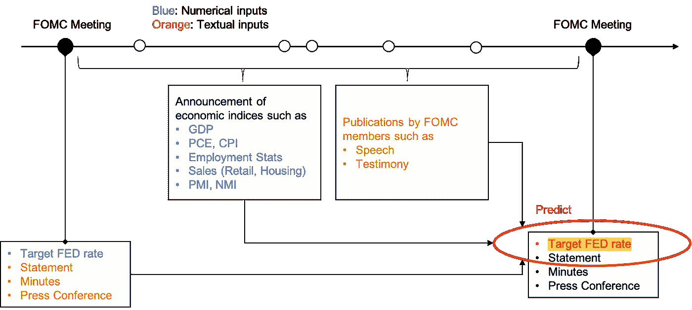

预测输入(由作者创建)

这个项目的目标是在 FOMC 出版的文本中发现潜在的特征。首先，我将机器学习应用于经济指数，以观察这些数字数据的预测性能。然后，在传统的机器学习技术中加入预处理过的文本数据作为附加特征，看它是否包含有意义的信息。最后，应用深度学习技术，如 LSTM/RNN 和伯特，看看这些能否更好地预测每次 FOMC 会议上的加息/降息。

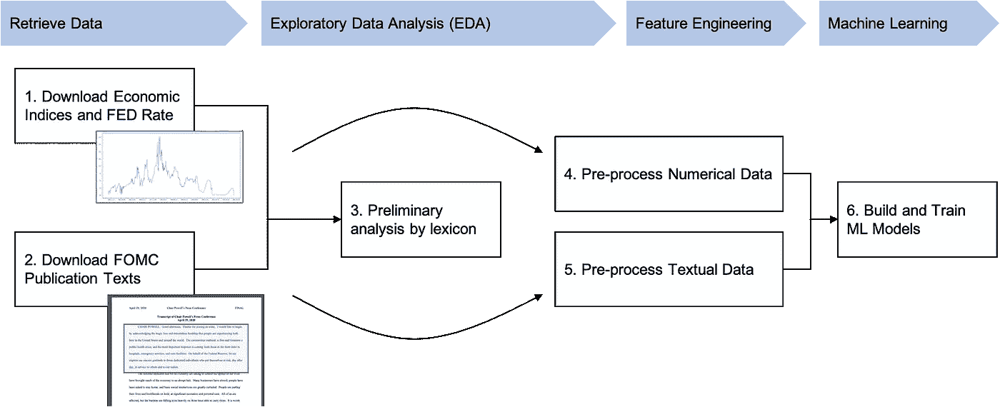

该项目的整个过程(由作者创建)

# 1.检索市场数据

每日美联储利率和主要经济指数可以从圣路易斯联邦储备银行的经济研究网站获得，该网站名为 [FRED](https://fred.stlouisfed.org/) :

*   联邦利率
*   国内生产总值
*   消费物价指数/ PCE
*   就业和失业
*   零售和家庭销售

制造业 PMI 和服务业 PMI(原名“非制造业指数或 NMI”)由 [ISM(供应管理学会)网站](https://www.ismworld.org/supply-management-news-and-reports/reports/ism-report-on-business/)发布。

每日国债收益率可以从[美国财政部网站](https://www.treasury.gov/resource-center/data-chart-center/interest-rates/pages/textview.aspx?data=yield)以 xml 格式下载。

探索每个网站上的数据细节很好，但使用 [Quandl](https://www.quandl.com/) 更方便，它提供了 Web APIs 和库，以相同的方式检索所有数据。以上所有数据都是公开的，个人使用也是免费的，但是你应该根据你的目标，在原始资料中检查许可条款。

一旦创建了 Quandl 帐户，就会提供 API 密钥。例如，您可以像这样在`pip install quandl`之后下载 python 中的数据:

2008 年，美联储将目标联邦利率从单一利率改为一个区间，因此串联两个区间证明了下限或上限观点。

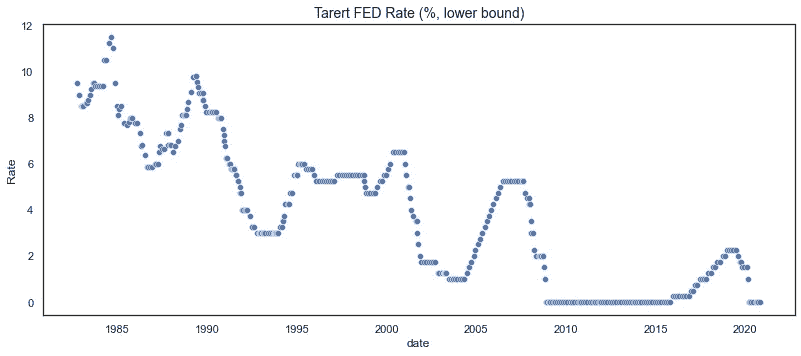

联邦基金利率，目标下限(由作者创建)

# 2.检索文本数据

所有 FOMC 的出版物都可以在 [FOMC 网站](https://www.federalreserve.gov/monetarypolicy/fomccalendars.htm)上找到。你可能会注意到网站包含每次会议的材料，但内容会随着时间的推移而变化。此外，除了常规会议之外，还有不定期的会议和电话会议。一些文本是 html 格式的，而另一些则是 pdf 格式的。甚至还有一个不同的历史数据网站，页面结构也各不相同。

从 FOMC 会议日历下载以下文本:

*   **声明** —在每次 FOMC 会议后立即发布
*   **会议纪要** —在每次 FOMC 会议后三周提供，因此可能无法用于最近的会议
*   **新闻发布会记录**——每次 FOMC 会议都有，但 2011 年才开始提供
*   **会议记录** —会议五年后可用，因此不能用作预测的输入，但仍是查看旧会议详细背景的良好来源
*   **演讲** —文字记录发表在[这一页](https://www.federalreserve.gov/newsevents/speeches.htm)，我使用了两次会议之间发表的主席演讲
*   **证词** —各种证词文本也发表在[这一页](https://www.federalreserve.gov/newsevents/testimony.htm)我用半年度货币政策报告向国会报告

当文本是 HTML 格式时，BeautifulSoup 将完成这项工作。使用 textract 提取 PDF 和 re 模块，通过正则表达式进行搜索。

# 3.初步分析

为了看看这些文本是否包含一些预测美联储利率的有用见解，我使用了[拉夫兰和麦当劳情绪词表](https://sraf.nd.edu/textual-analysis/resources/)来衡量声明的情绪。这本字典包含几千个出现在财务文件中的单词，如 10K，10Q 和收益电话，分为积极，消极等。它包括不同形式的单词，因此不应应用词干分析或词条解释。我运用了一个简单的技巧将情绪转化为否定(例如，不能，不是，不)。请注意，您需要获得必要的商业使用许可证。

首先，画出每句话中正面词和负面词的数量，取其差值作为净情绪。正字数和负字数高度相关，平均值为正。

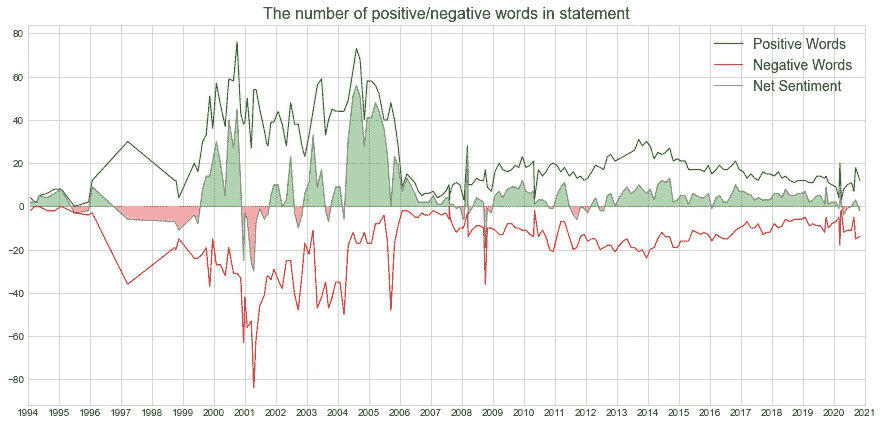

历年感悟(作者创作)

接下来，将移动平均线应用于净情绪，以查看衰退周期的趋势图。16 项声明的移动平均指数在经济不确定时大多会下降。这表明，净情绪的方向在一定程度上与宏观经济相关，尽管在每次 FOMC 会议上用它来预测会过于嘈杂。

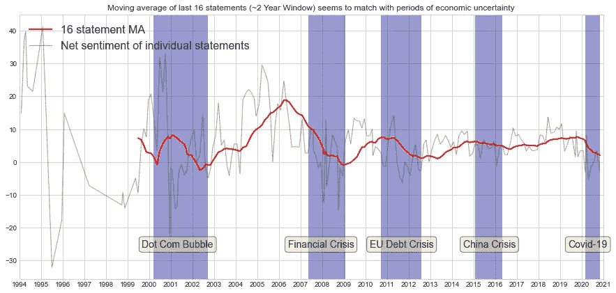

情绪和衰退的移动平均线(由作者创建)

此外，在每次 FOMC 会议上，将净情绪的移动平均值与实际的美联储利率决策进行对比。这与美联储的目标利率有一定的相关性，但在金融危机期间，不容易看到利率处于有效下限，并采取了量化宽松政策。我认为 QE 的声明是一个降低利率的事件。

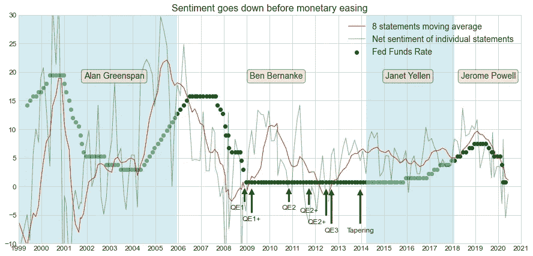

情绪和货币政策的移动平均线(由作者创建)

以下是在 matplotlib 中生成此图的一些示例代码:

# 4.预处理经济指数

当 FOMC 决定货币政策时，与之前数据的差异也很重要。对于每个指数，取所有指数与前期和上年同期的差值。

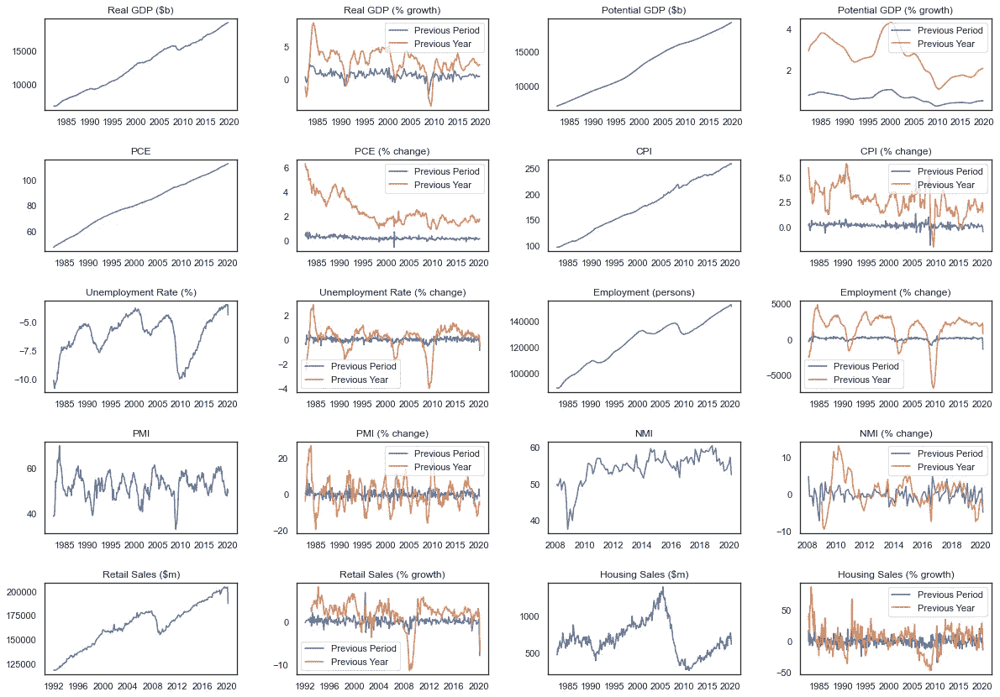

经济指数(由作者创建)

首先使用`seaborn.heatmap()`检查美联储利率决策和经济指数之间的相关性。PMI 相关性较高，CPI 与费率决定关系不大。

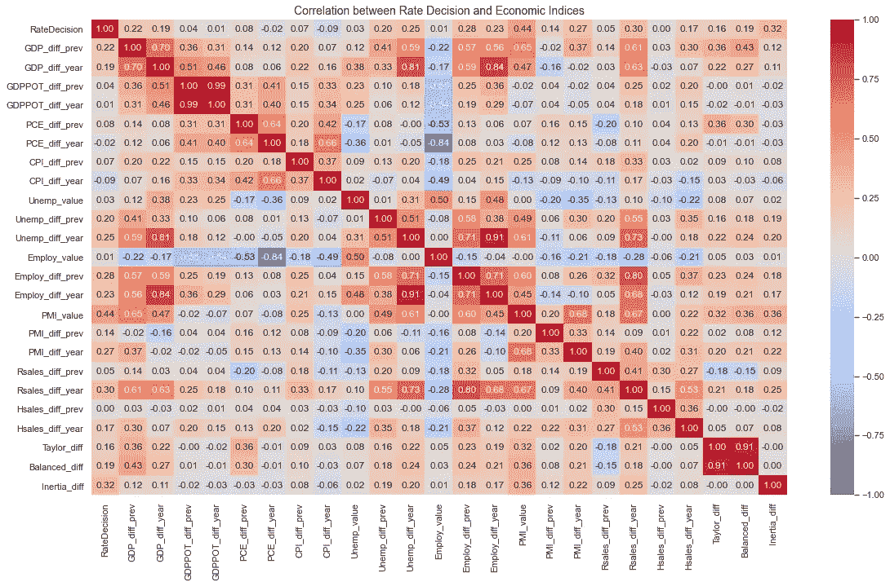

经济指数和利率决策之间的相关性(由作者创建)

然后，计算这些数字的移动平均值，检查与速率决策的相关性，并选择高度相关的字段作为特征。

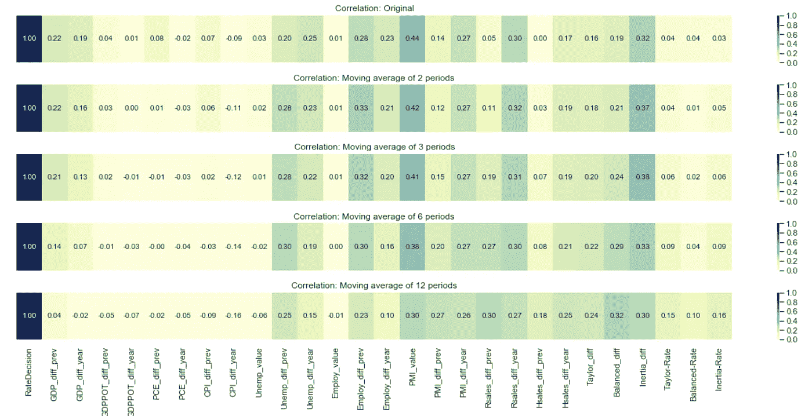

移动平均线的相关性(由作者创建)

例如，PMI 值是输入特征候选之一。`seaborn.kdeplot()`提供漂亮的分布图。

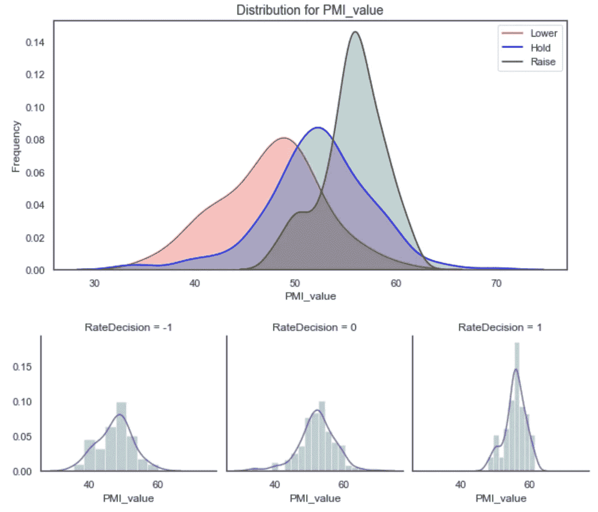

每个下一个费率决策的 PMI 值分布(由作者创建)

作为特征工程的一部分，计算泰勒规则，看看是否可以使用一阶导数和与美联储利率的差异。美联储在其网站上发布了政策制定者如何使用经济指数数据。这里，从原始数据计算泰勒规则、平衡接近规则和惯性规则。

这一结果看起来与他们的出版物相符，而且这些理论利率和实际美联储利率之间的相关性相当高。

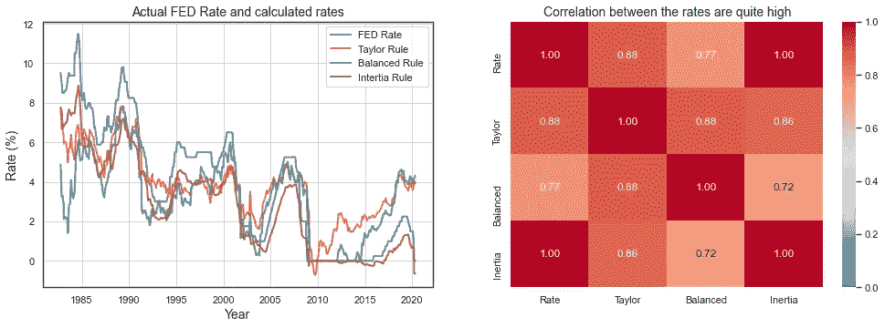

理论费率(由作者创建)

不要忘记检查缺失的值，并用 0 或平均值/中值来估算这些值。还要删除一些没有足够输入数据或缺少输出标签的记录。机器无法从部分丢失的输入中学习，因为它无论如何都需要猜测丢失的数据意味着什么。

每次 FOMC 会议时可用的最新数据被用作决策的基本输入，并添加文本数据作为附加输入，以查看预测是否可以改进。

# 5.预处理文本数据

在过去的 25 年里，大约有 200 个决定。根据型号，由于缺少数据或可用时间，一些输入无法使用。

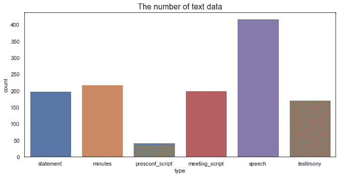

每个文档类型的输入文档计数(由作者创建)

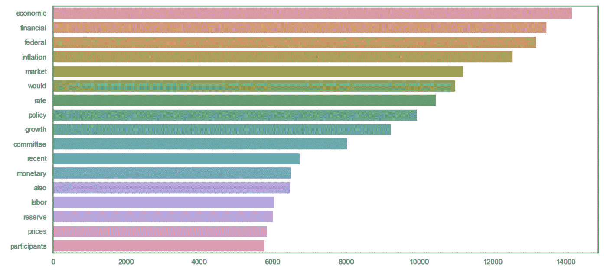

最常用的单词(由作者创建)

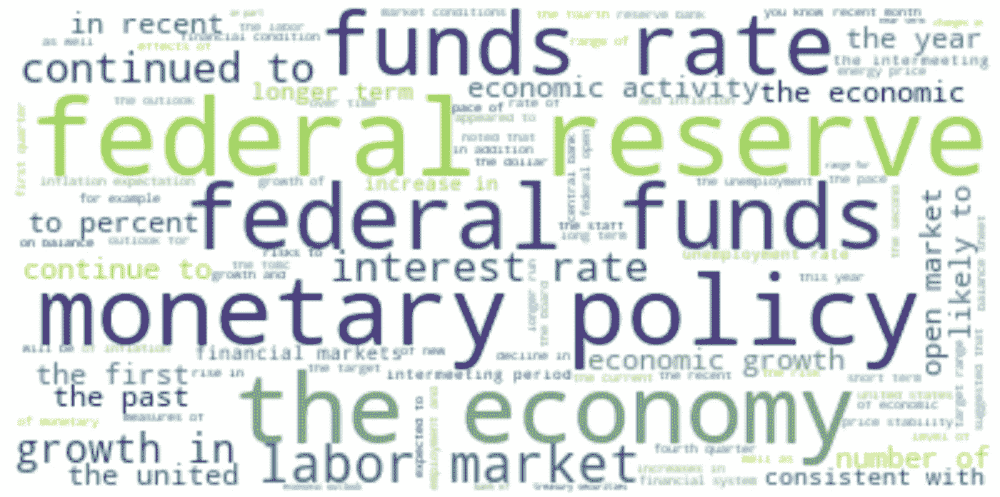

词云(由作者创建)

在文本处理过程中，您可能面临的一个常见问题是如何在机器学习中处理长文本。大多数基于神经网络的算法都无法分析像 10，000 个单词(最多 500 个)这样的长文本。我们的大多数输入文本太长，无法作为一个完整的文档进行分析。

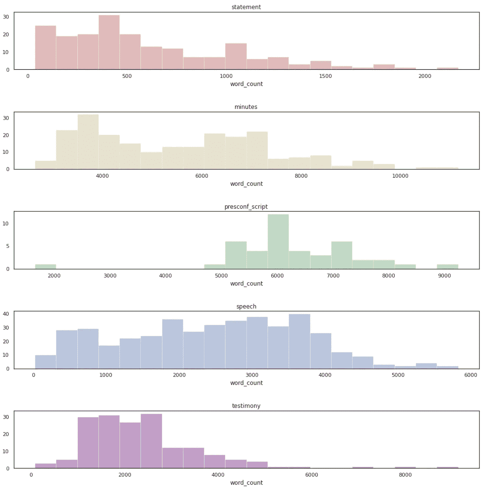

每句话的字数(由作者创造)

这个问题的典型解决方案是或者对文档向量使用其他算法，例如 JAC card/余弦相似度，或者找到分割长文本的方法，或者使用一些技术来缩短，例如文本摘要。

这里使用的一个简单的解决方案是文本分割技术，按字数(例如 200 个单词，重叠 50 个单词)分割文本，如下所示。这是一种简单的自动化方法，但很容易丢失上下文，因为提取的 200 个单词可能包含也可能不包含相关文本，甚至离题。

另一个问题是数据不平衡—在本例中，比率决策有 60%以上的机会是“保持”,而可用的决策只有大约 200 个，因为会议每年举行八次。如果没有足够的数据，机器学习很容易过度适应训练数据。

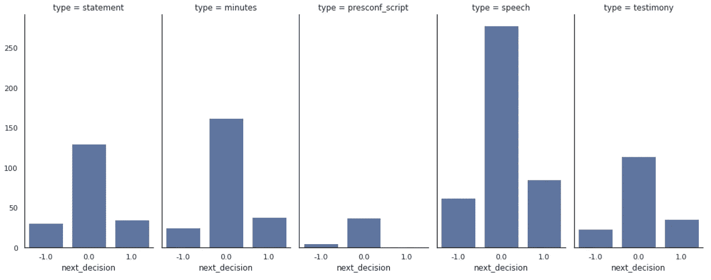

按文档类型列出的输入文档数(由作者创建)

文本数据处理已经以如下方式完成，这是 NLP 的常见情况。

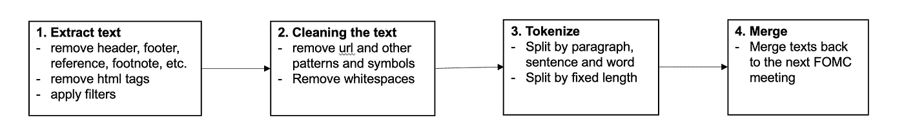

NLP 管道(由作者创建)

# 6.建立和训练 ML 模型

在高层次上，该模型采用文本输入和元输入来预测三个类别:提高、保持或降低，如下所示。关键是如何将文本输入和数字输入结合起来，并且有不同的实现方法。

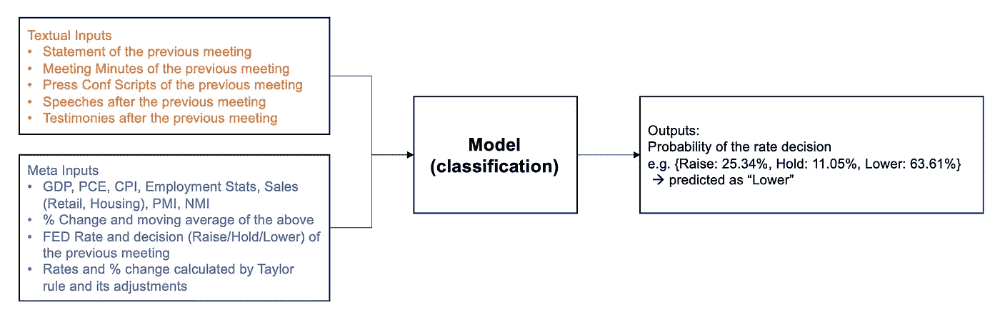

总体流程(由作者创建)

除了基线模型之外，这里还构建了以下六个模型。所有的模型都是在 pytorch 中构建和训练的，源代码可以在 Github [repo](https://github.com/yuki678/centralbank_analysis) 中找到，本文摘录了其中的一些部分。

## 0.基线模型

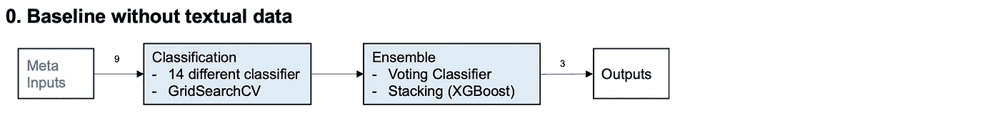

基线流程(由作者创建)

这不使用文本输入，而只接受元输入。首先比较具有默认参数的 14 个不同分类器，以快速获得基线性能。

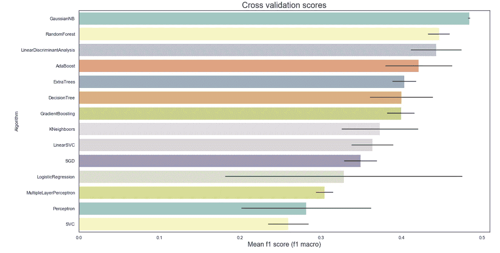

F1 由 14 个不同的分类器评分(由作者创建)

然后，应用 RandomizedSearchCV 和 GridSearchCV 来寻找最优的超参数，并决定使用随机森林作为基础，因为它产生具有合理特征重要性的最佳结果。StratifiedKFold 用于交叉验证。

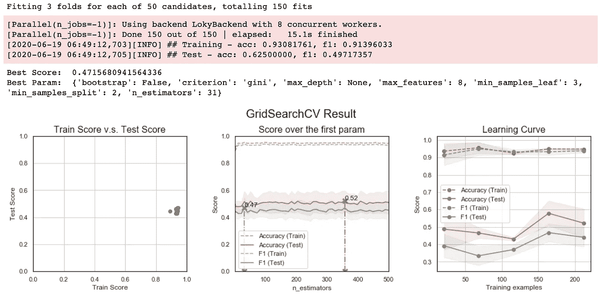

网格搜索 CV 结果(由作者创建)

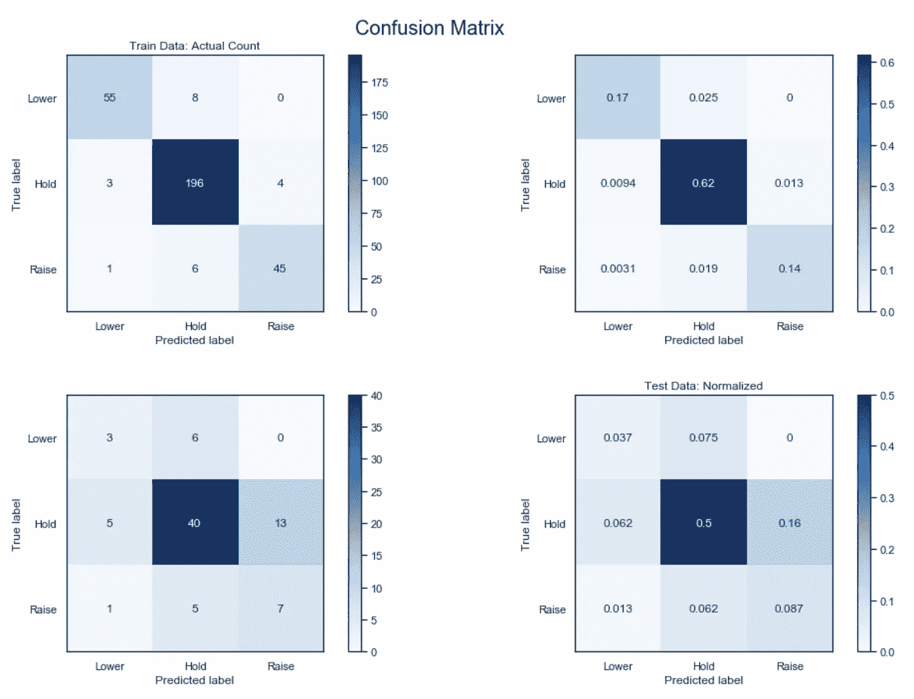

困惑矩阵(由作者创建)

学习曲线告诉我们，模型过度适应训练数据，更多的数据可能会提高性能。查看混淆矩阵，它未能预测“降低”和“提高”事件。

功能重要性(由作者创建)

查看混淆矩阵，它未能预测“降低”和“提高”事件。

也进行了系综和叠加，但没有提高性能，因为这里的根本问题是缺乏足够的数据。

## A.余弦相似性

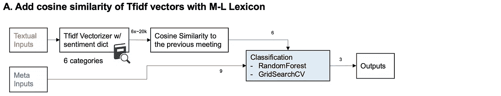

余弦相似性流程图(由作者创建)

Tfidf 使用初步分析中使用的 [Loughran-McDonald 字典](https://sraf.nd.edu/textual-analysis/resources/)对文本进行矢量化，并计算两个连续会议之间的余弦相似度。该值是文本方向的变化程度(即向量的余弦)，其可以指示策略变化。然后将其与基线模型中使用的经济指数相结合。

## B.Tfidf

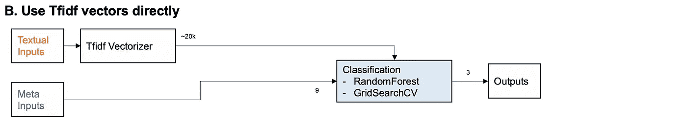

Tfidf 流程图(由作者创建)

使用 Tfidf 向量本身作为输入，而不是余弦相似度。只有当 Tfidf 向量直接保存关于速率变化的有意义的信息时，这才会起作用。使用上一步中标记化的文本，通过 FunctionTransfomer 将 Tfidf 向量与非文本输入连接起来。

## C.LSTM

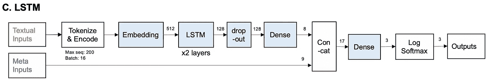

LSTM 流程图(由作者创建)

LSTM ( [长短时记忆](https://en.wikipedia.org/wiki/Long_short-term_memory))是一种流行的 RNN ( [递归神经网络](https://en.wikipedia.org/wiki/Recurrent_neural_network))架构，可以保存长时记忆和短时记忆，用于序列学习。有许多改进版本，如双向 LSTM，而这里使用的是一个简单的普通模型。深度神经网络的输出与漏失和密集层后的经济指标相结合。

然后，将输入分为文本数据和数字数据。定制数据加载器以产生两种类型的输入。训练过程与 LSTM 处理文本的通常情况相同。

## D.LSTM+手套

LSTM +手套工艺流程(由作者创建)

之前的 LSTM 模型创建了自己的单词嵌入，但也有预先训练的嵌入。这里使用[全局向量进行单词表示(GloVe)](https://nlp.stanford.edu/projects/glove/) 由维基百科和 gigaword (6B tokens)训练。这个想法是，预先训练的单词表示将提高随机初始化模型的性能。

训练步骤与之前的 LSTM 模型相同。

## E.伯特

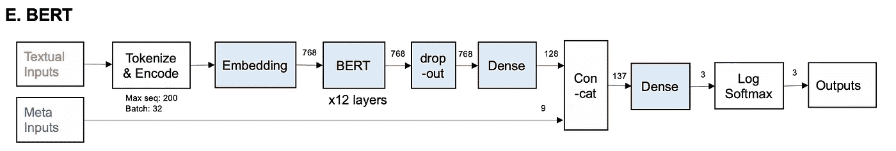

BERT 流程图(由作者创建)

[BERT，或来自 Transformers](https://en.wikipedia.org/wiki/BERT_(language_model)) 的双向编码器表示，是一种基于 transformer 的语言模型，与 Google Research 在 2018 年发布的 RNN 相反。这里使用的模型是预训练的 BERT_BASE，这是一个具有 12 层、768 个隐藏单元、12 个头的深度神经网络，产生 110 万个参数，并在维基百科和图书语料库上进行训练。除了模型和伯特自己的符号化，建筑的其余部分与上面基于 LSTM 的模型保持相同。通常对模型使用`transformers.BertForSequenceClassification`就足够了，但是这里需要创建自己的定义来连接文本和非文本输入。

## F.BERT +前期情绪分析

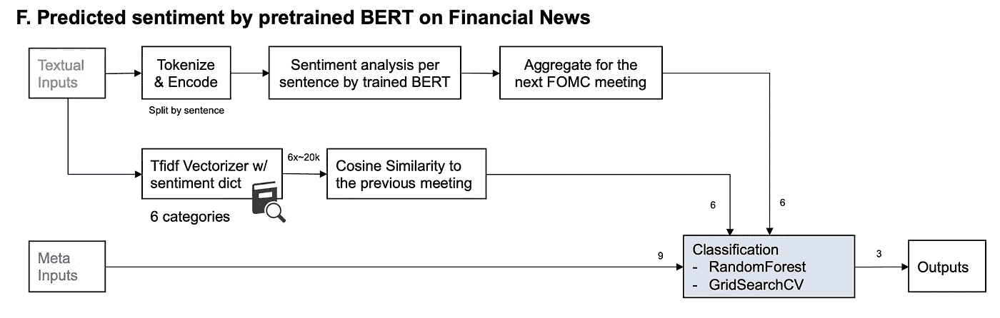

BERT +前期情绪分析流程(由作者创建)

最后，我采用了另一种方法——不是直接在 FOMC 文本上训练模型，而是首先在其他金融文本上训练模型以进行情感分析任务。然后使用经过训练的 BERT 模型来分析 FOMC 文本中每个句子的情感，并计算情感得分，然后对每个文档进行汇总，并将其用作另一个 ML 模型的输入，以预测 FOMC 的决定。

## 结果

下面是测试模型之间的分数对比。深度神经网络模型表现不佳，这基本上是由于缺乏足够的数据来训练这些复杂的模型。带有情绪前分析的最后一个模型优于其他模型，但需要进一步检查这种改进是否具有有意义的显著性和一致性，而不仅仅是由于任何额外的输入。

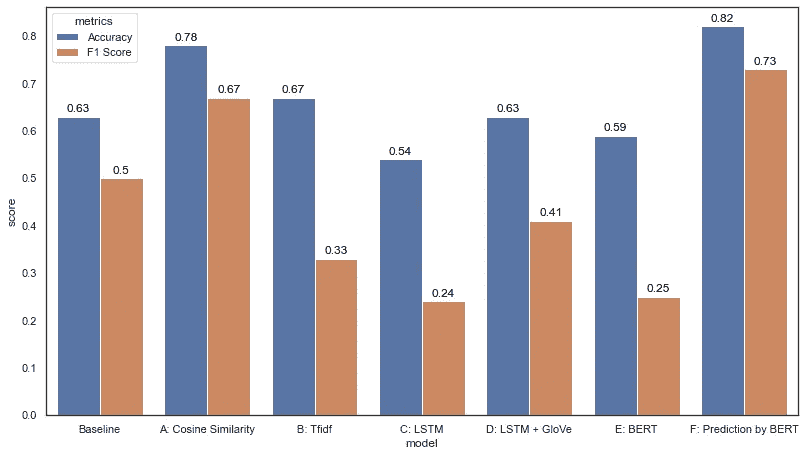

每个模型的性能分数(由作者创建)

# 结论

我们研究了 FOMC 文本数据是否包含有用的洞察力，以预测美联储在下一次 FOMC 会议上的目标利率决定(即提高、保持或降低)。我们可以从文本中观察到一些有用的信息，从而更好地预测 FOMC 的决策。然而，我们不能通过神经网络来提高基于文本的预测性能。这部分是因为对于每个非常长的文本，有少量的测试数据要训练。

作为未来的工作，有两个主要方面需要改进:

1.  解决缺乏足够训练数据的问题——模型显然过度适应训练样本，未能很好地概括，特别是助推算法容易过度适应。这里考虑了超参数调整和插补。此外，通过合成方法配置模型和分割数据以增加训练数据可能是有益的。
2.  提高输入文本质量——输入文本包含大量与美联储目标利率决策无关的段落。例如，有关于法规、组织结构和基础设施的信息。过滤掉不太相关的输入将提高模型预测的准确性以及训练效率。

注意，这篇文章中的代码只是一些摘录。完整源代码请参考 Github [repo](https://github.com/yuki678/centralbank_analysis) 。