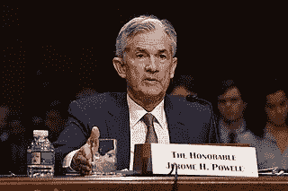

# Fedspeak？或者只是另一袋话？

> 原文：<https://towardsdatascience.com/fedspeak-or-just-another-bag-of-words-c0dd3dcbe29c?source=collection_archive---------52----------------------->

杰罗姆·鲍威尔——现任美联储主席。鸣谢:维基共享。

本文介绍了“fed tools”Python 包，提供了一个基本单词包算法的实际实现。

最后的数字。现在，我们可以使用按钮和下拉菜单来选择感兴趣的项目和时间段。作者创建的图像。

*TL DR* : [Github Repo](https://github.com/David-Woroniuk/Data_Driven_Investor) 和 [FedTools](https://pypi.org/project/FedTools/) 包。

# **那么，什么是 Fedspeak 呢？**

“Fedspeak”也被称为“Greenspeak”，最初是由艾伦·布林德(Alan Blinder)定义的，用来描述美联储董事会主席在发表模糊、不置可否或模棱两可的声明时使用的“英语方言”。近年来，由于全球金融机构自然语言处理(NLP)能力的提高，美联储政策沟通发生了巨大的变化。

# **自然语言处理**

自然语言处理(NLP)是人工智能的一个领域，它使机器能够与人类语言进行交互，分析，理解和解释人类语言的含义。NLP 有许多子领域，例如自动摘要、自动翻译、命名实体识别、关系提取、语音识别、主题分割和情感分析。

这篇文章关注于通过使用一个“单词包”(BoW)算法来实现一个基本的情感分析。BoW 算法对于从文本文档中提取特征是有用的，这些特征可以随后被合并到建模管道中。

# **包话(鞠躬)**

BoW 方法非常简单，可以在不同的文档类型上实现，以便从文档中提取预定义的特征。在高层次上，单词包是文本的表示，它描述了文档中一组预定单词的出现。这以两个步骤为特征:

1)必须选择预定单词的词汇表或“字典”。

2)测量已知单词的存在。这被称为“包”，因为所有关于词序的信息都被丢弃了。该模型仅考虑文本中预定单词的出现次数。

# **实际实施**

现在我们已经概述了 BoW 算法，我们可以通过 7 个简单的步骤来实现它。

第一步是安装我们将使用的软件包和模块:

其次，我们需要获得联邦公开市场委员会(FOMC)的历史声明，可以在这里找到。然而，新的" [FedTools](https://pypi.org/project/FedTools/) " Python 库使我们能够自动提取这些信息:

现在，我们有一个熊猫数据框架，在一栏中有“FOMC 声明”,按 FOMC 会议日期索引。下一步是遍历每条语句并删除段落分隔符:

现在，我们必须考虑我们希望使用哪一个预定单词的字典。为了方便起见，我们使用蒂姆·拉夫兰和比尔·麦克唐纳的情感词汇列表。由于这个列表很长，所以不包含在本文中，但是可以从合并代码中获得，保存在 [Github repo](https://github.com/David-Woroniuk/Data_Driven_Investor) 中。

接下来，我们定义一个函数来确定一个词是否是否定的。该函数检查输入的单词是否包含在预先确定的“求反”列表中。

现在，我们可以实现 BoW 算法，在检测到的单词之前考虑三个单词中的潜在否定者。该函数使我们能够对检测到的正面和负面单词进行计数，同时还将这些单词保存在单独的 DataFrame 列中。

`build_dataset`函数使用 Loghran & McDonald 字典`lmdict`的输入参数，为每个 FOMC 语句迭代调用`bag_of_words_using_negator`函数。

最后，`plot_figure`函数调用`build_dataset`函数，随后构建输出的交互式可视化。

调用 plot_figure 函数，图形显示如下:

最终输出。作者创建的图像。

完整的代码可以在 [Github Repo](https://github.com/David-Woroniuk/Data_Driven_Investor) 中找到，开源的 [FedTools](https://pypi.org/project/FedTools/) 包可以通过 pip install*获得。*