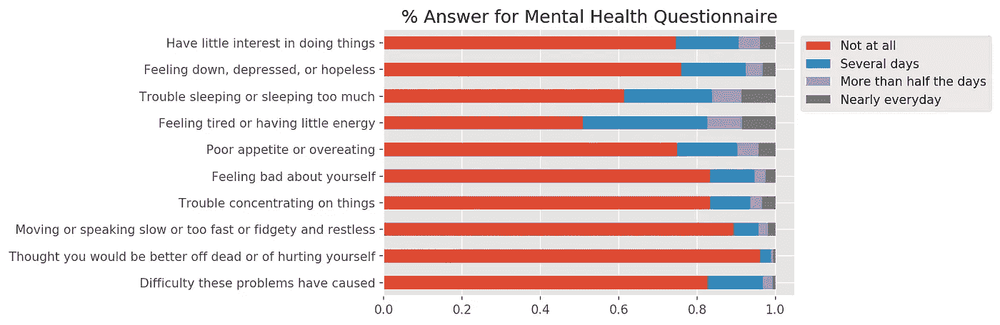
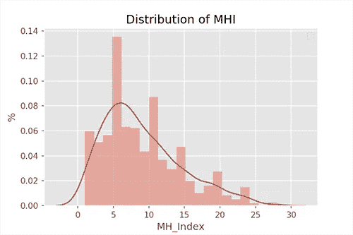
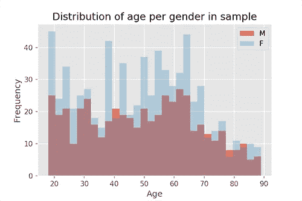
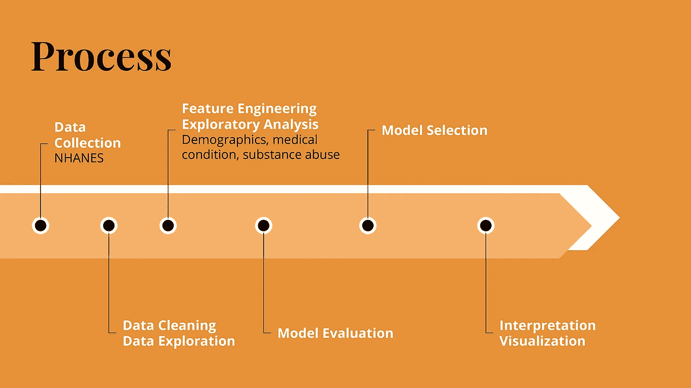
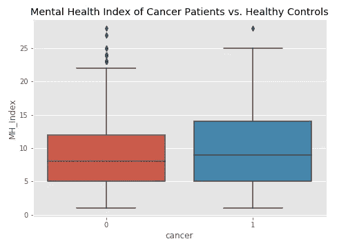
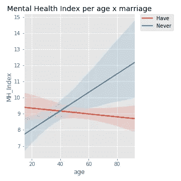

# 从抑郁到想自杀

> 原文：<https://towardsdatascience.com/feeling-depressed-to-feeling-suicidal-76f62b70a2cd?source=collection_archive---------33----------------------->

## [变更数据](https://towardsdatascience.com/tagged/data-for-change)

## 用多元线性回归研究抑郁症状的进展


[奥内拉·宾尼](https://unsplash.com/@ornellabinni?utm_source=medium&utm_medium=referral)在 [Unsplash](https://unsplash.com?utm_source=medium&utm_medium=referral) 上的照片

根据美国国家心理健康研究所的数据，2017 年，自杀是美国第十大死亡原因，在 10 至 34 岁的人群中排名第二。然而，自杀也是最耻辱的话题之一。人们避免谈论自杀意念，这使得很难防止抑郁症状的发展。这也使得我们更难了解是什么让人们从感觉没有动力或抑郁到有自杀的想法。

那么是什么导致人们有时情绪低落而想到自杀呢？

这项分析的目的是确定导致抑郁症状进展的一些关键因素。我希望这个项目可以为未来的自杀预防工作增添一些曙光。

# 数据

国家健康和营养检查调查( [NHANES](https://wwwn.cdc.gov/nchs/nhanes/continuousnhanes/default.aspx) )是疾病控制和预防中心的一部分，它收集并发布了大量来自生活在美国的非制度化平民的采访和医疗检查。

为了准确地代表总体，NHANES 在每个周期对代表不足的总体进行过采样。该数据集特别对西班牙裔、非西班牙裔黑人和亚洲人、处于或低于贫困线 185%的人以及 80 岁及以上的人进行了过采样。

NHANES 网站为每个小节提供单独的 SAS XPT 文件。在这项分析中，我从人口统计、医疗条件和物质使用等主题中串联了其中的 21 个小节。

2017 年至 2018 年间，共有 8704 名参与者完成了面试和体检。由于我对了解轻度抑郁症状如何发展为致命的很感兴趣，我缩小了数据集，只包括那些报告说最近经历过抑郁或绝望困扰的人。这导致了总共 1222 人，占总数据的 14%。

# 精神健康指数(MHI)

为了量化一个人的心理健康或抑郁症状，我创建了一个名为**心理健康指数(MHI)** 的变量，它是十份抑郁筛查问卷的累计答案数。每个问题都有一个 4 分制的等级，表明他们在过去两周内被这些抑郁症状困扰的频率。最终的 MHI 范围从 0 到 30。该图显示了至少回答一半问卷(n = 5087)的所有人中每个答案的百分比。(一些缺失值是从其他最相关问题的答案中推断出来的。)



这是我们子集内 MHI 的总体分布。



MHI 的总体分布显示，大多数参与者都在 5 点左右。概括地说，高 MHI 分数表明抑郁症筛查者的报告分数更高。大多数回答这 10 个问题的人报告 MHI 为 0(不包括在分析中)。



我们组有 59%的女性，年龄分布相对均匀，从 18 岁到 70 岁不等，一些老人超过 80 岁。

# 整体流程



基于探索性分析和我在自杀预防中心的经历，我关注了三个主要话题:人口统计学、现有的医疗条件(其中一些我称之为“绝望”衡量标准)和物质使用。所有过程都是用 Python 完成的。在此过程中检查的个别特征如下。

**人口统计** 年龄、性别、家庭人数、家庭中成年人人数、家庭中儿童人数、收入、成人人均收入、家庭人均收入、婚姻状况、退伍军人、教育水平

**医学状况(限于选择慢性状况)** 肥胖、身体残疾、癌症、自癌症诊断以来的年数

**物质使用** 吸烟(或戒烟)、戒烟年数、开始吸烟年数、大麻使用、可卡因使用、海洛因使用、甲基苯丙胺使用

**交互** 测试了上述特征之间的交互数量，其中婚姻状况和年龄改进了我们的模型，并在更大程度上进行了调查。

# 数据转换

应用了右偏连续测量(如收入)的对数转换和非二进制分类数据(如婚姻状况)的虚拟转换。因为我对比较不同变量的系数感兴趣，所以我也标准化了所有的标量特征。

# 模型评估和选择

心理健康是一个复杂的问题，缩小所有可能影响一个人心理健康发展的因素的范围是一项极具挑战性的任务。为了在选定的主题中找到最适合的模型，我测试了多种不同的特性选择方法。在这里，我概述了最终的评估过程。(要查看整个过程，请参考我的 [Github](https://github.com/stereopickle/mental_health_index) 页面。)

## 相关消除

首先，我在手动控制相关性高于 0.7 后测试了模型。这导致调整后的 R2 为 0.146。

## 差异通货膨胀系数(VIF)

我还使用方差膨胀因子(VIF)测试了使用*的`variance_inflation_factor`stats models*控制多重共线性。VIF 衡量一个特定特征中有多少差异可以由所有其他特征来解释。

```
**import** pandas **as** pd **from** statsmodels.stats.outliers_influence **import** variance_inflation_factordef **vif_**(X):
    vif = pd.**DataFrame**()
    vif['VIF'] = [**variance_inflation_factor**(X.values, i) **for** i **in** range(len(X.columns))]
    vif['Features'] = X.columns
    **return** vifVif = **vif_**(X)
```

使用 VIF 导致模型的调整后 R2 为 0.147。

## 递归特征消除(RFE)

我测试的另一个特征选择方法是递归特征消除(RFE ),使用 scikit-learn 的`RFECV`进行交叉验证。递归特征消除算法重复模型拟合和去除最没有意义的特征的过程。`RFECV`sci kit-learn 还使用交叉验证来确定最佳功能数量。

```
**from** sklearn.linear_model **import** LinearRegression
**from** sklearn.feature_selection **import** RFECVlm = **LinearRegression**()
sel_features = **RFECV**(estimator = lm, step = 1, cv = 10, scoring = 'r2')
sel_features = sel_features.**fit**(X, y)
X = X.**loc**[:,selector.support_]
```

使用递归特征消除算法选择特征后，模型拟合度略有提高，调整后的 R2 为 0.150。

## 最终模型

基于性能，我选择了 RFE 模型，但我通过运行单独的迭代来扩展递归，删除具有最高 p 值的要素，并在提高模型拟合度的情况下再次拟合模型。通过添加这个过程，我的最终模型在调整后的 R2 为 0.156 时提高了拟合优度。尽管 0.156 的 R2 分数看起来很低，但在研究人类认知和行为时，R2 分数仍然很低并不罕见。

清洁和测试完成后，最终模型构建的全过程:

## 最终系数

# 那么，心理健康指数较高的原因是什么呢？

现在我将分享一些对这些系数的解释，这些解释可能有助于自杀预防研究的未来方向。请再次注意，心理健康是一个复杂的问题，与影响我们生存状态的大量因素相比，这个模型只关注了几个主题。这是为了从整体上预防自杀，并不反映任何个人的状况。

## 现有医疗条件

癌症等慢性疾病是频繁出现抑郁症状的重要预测因素。在 MHI，癌症导致了大约 3.8 个百分点的增长。在这里给你一个提示，如果你从完全没有症状到一直有一种症状，那将会增加 3 个百分点。有残疾也是经常经历抑郁症状的一个关键预测因素，在 MHI 增加了大约 3.2 个百分点。



这就是我所说的“绝望”衡量标准，在这种情况下，感到无法摆脱身体或精神痛苦会导致抑郁症状恶化。由于诊断的第一年更接近当前时间，MHI 估计值也降低了，这表明自癌症诊断以来的时间越长，您的 MHI 就越高。

当一个人无论如何努力，事情似乎都没有改变时，应对困难的局面就变得更加具有挑战性。鼓励进一步研究复原力和应对绝望的方法。

## 衰老独奏



未婚个体的年龄增长是较高 MHI 的最高标量特征，在与癌症生活一段时间后。这不是一个明确的衡量标准，因为该模型没有考虑婚姻状况或家庭人数之外的任何其他支持系统。

我相信，研究当前模式如何与护理设施和非婚姻支持团体的可及性相互作用，以及不同类型的支持性护理的效果，将允许更深入地了解心理健康进展。但我也建议继续未婚长者发展支援系统。

## 物质使用

另一个重要的关键因素是该物质的使用。MHI 的吸烟率上升了近一个百分点。较高的平均每日可卡因使用量也与较高的 MHI 有关。这种关系并不意味着因果关系，进一步的调查是必要的。

# 结论

我概述了建立多元线性回归模型的迭代过程，并讨论了一些人口统计数据、医疗条件和物质使用如何可能有助于自我报告的精神健康筛查分数的增加。基于这些发现，我建议继续研究如何应对绝望和药物使用，并为未婚老人开发更多的支持系统。

对于未来的方向，我相信增加关于医疗保健设施和支持团体的可及性、就业状况和食品安全的信息将极大地改善该模型。