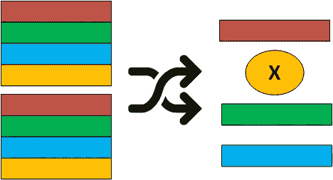
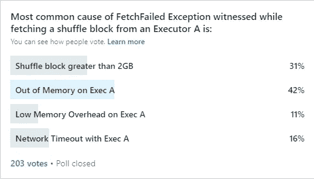

# Apache Spark 中的获取失败异常:解密最常见的原因

> 原文：<https://towardsdatascience.com/fetch-failed-exception-in-apache-spark-decrypting-the-most-common-causes-b8dff21075c?source=collection_archive---------9----------------------->

## SPARK 执行指南

## 大多数 Spark 开发人员花费了大量的时间来排除在混洗操作中观察到的 Fetch Failed 异常。这个故事将为您提供获取失败异常的最常见原因，并揭示最近对该异常进行的调查结果。

Shuffle 操作是几乎所有 Spark 作业的主干，这些作业的目标是数据聚合、连接或数据重组。在混洗操作期间，数据通过两步过程在群集的各个节点之间混洗:

a)混洗写入:混洗映射任务将待混洗的数据写入磁盘文件，数据根据混洗减少任务排列在文件中。对应于由混洗映射任务写入混洗减少任务的一堆混洗数据被称为混洗块。此外，每个混洗映射任务通知驱动程序关于写入的混洗数据。

b)混洗读取:混洗减少任务向驱动程序查询其混洗块的位置。然后，这些任务与托管其洗牌块的执行器建立连接，并开始获取所需的洗牌块。一旦获取了一个块，它就可用于 reduce 任务中的进一步计算。

> 想了解更多洗牌过程，可以参考我之前的故事标题:[揭秘 Apache Spark 洗牌魔术](https://medium.com/swlh/revealing-apache-spark-shuffling-magic-b2c304306142)。

shuffle 的两步过程虽然听起来很简单，但是操作起来很复杂，因为它涉及数据排序、磁盘写/读和网络传输。因此，对于混洗操作的可靠性总是有一个问号，并且这种不可靠性的证据是在混洗操作期间经常遇到的“提取失败异常”。大多数 Spark 开发人员花费大量时间来排除这种常见的异常。首先，他们试图找出异常的根本原因，然后相应地对其进行正确的修复。

> 在 shuffle reduce 任务中报告的获取失败异常指示从宿主执行器读取一个或多个 shuffle 块失败。调试 FetchFailed 异常非常具有挑战性，因为它可能由于多种原因而发生。找到并了解正确的原因是非常重要的，因为这将有助于您采取正确的措施来克服异常。

最近一段时间对数百个 Spark 作业进行故障排除后，我意识到 Fetch Failed 异常主要是由于以下原因造成的:

*   执行器上的堆内存不足
*   执行器上的低内存开销
*   大于 2 GB 的随机播放块
*   网络超时。

为了了解这些原因出现的频率，我最近还对 Spark、 [Apache Spark](https://www.linkedin.com/groups/7403611/) 上最受关注的 LinkedIn 群组进行了[民意调查](https://www.linkedin.com/feed/update/urn:li:activity:6699000104633860096)。令我惊讶的是，相当多的人参与了投票并提交了他们的意见，这进一步证实了人们在 Spark 工作中经常遇到这种例外的事实。以下是投票结果:

LinkedIn Apache Spark 组中对 Fetch Failed Exception 进行的投票结果

> 根据投票结果，“执行程序堆内存不足”和“洗牌块大于 2 GB”是投票最多的原因。接下来是“网络超时”和“执行器的低内存开销”。

让我们详细了解一下这些原因:

**“执行程序上的堆内存不足”:**这个原因表明，由于托管相应洗牌块的执行程序因 Java“内存不足”错误而崩溃，导致获取失败异常。当执行器上的堆空间不足或者执行器的垃圾收集器在垃圾收集上浪费了比实际有用的工作更多的时间时，就会出现“内存不足错误”。

为了关联这个原因，您需要检查 Fetch Failed 异常中提到的主机执行器详细信息(主机名/IP 地址/端口)。一旦您获得了执行器的详细信息，您会注意到针对托管执行器的以下任务失败:

*   由于退出代码 143，导致“ExecutorLostFailure”
*   由于执行器心跳超时，导致“ExecutorLostFailure”。

这些针对托管执行器的任务失败表明托管洗牌块的执行器由于 Java“内存不足”错误而被杀死。此外，还可以明确确认 executor 容器日志中的错误。由于托管执行器被终止，托管的 shuffle 块无法获取，因此可能会导致一个或多个 shuffle reduce 任务中的获取失败异常。

> 根据民意调查结果，这一原因获得了最高的投票率。我在工作中也见证了更大比例的这种原因。

**“执行程序上的低内存开销”:**该原因表明，由于托管相应洗牌块的执行程序因“低内存开销”而崩溃，因此出现了提取失败异常。当一个执行器的物理内存占用超过指定的物理内存限制时，就会出现“内存开销低”的错误。当执行器堆内存被大量利用，并且对堆外内存也有很好的需求时，就会出现这种情况。

为了关联这个原因，您需要检查 Fetch Failed 异常中提到的主机执行器细节(主机名/IP 地址/端口)。一旦获得了执行者的详细信息，您可能会注意到针对托管执行者的以下任务失败:

*   ExecutorLostFailure，使用了# GB 物理内存中的# GB。考虑提高火花。纱线。执行者。开销

针对托管执行器的上述任务失败表明，托管洗牌块的执行器由于过度使用指定的物理内存限制而被杀死。同样，由于托管执行器被终止，托管的混排块不能被获取，因此可能导致一个或多个混排减少任务中的获取失败异常。

> 根据民意调查结果，这一原因的投票率最低。但是，我也目睹了更大比例的这种原因。事实上，这个比例类似于“执行程序内存不足”的原因。

**“大于 2 GB 的随机播放块”:**获取失败异常，提及“帧太大”、“帧大小超过”或“大小超过整数”。作为错误原因的“MaxValue”指示相应的混洗减少任务试图获取大于 2 GB 的混洗块。这主要来源于整数的限制。数据结构抽象(ByteBuffer)上的 MaxValue(2GB)用于在内存中存储 shuffle 块。

然而，从 Spark 版开始，这个特殊的原因在很大程度上得到了解决。

> 根据民意调查结果，这一原因获得了第二高的投票率。但是，在我的工作中，我很少看到 Fetch 因此而失败。

**“网络超时”:**通常以可配置的时间间隔(`spark.shuffle.io.retryWait`)重试可配置的次数(`spark.shuffle.io.maxRetries`)来获取混洗块。当从其宿主执行器获取 shuffle 块时耗尽了所有的退休时，在 shuffle reduce 任务中会引发一个获取失败异常。这些获取失败的异常通常被归类为“网络超时”类别。

这种提取失败异常很难关联。此外，这些异常可能由于网络问题而出现，或者当托管相应洗牌块的执行器变得不堪重负时出现。

> 根据民意调查结果，这一原因获得了第三高的投票率。我也经常目睹这一事业。

我希望，读完这个故事后，您现在一定对 Fetch Failed 异常的各种原因有了一个公平的想法。我计划在一个不同的故事中介绍针对每个原因的可能的修复方法。如果您正在紧急寻找针对 Fetch Failed 异常的修复方法，您可以丢弃一条消息。

最后，我要感谢所有参与投票并提交意见的人。

如果对这个故事有任何反馈或疑问，请写在评论区。我希望，你会发现它有用。 [*这里是我贴的 Apache Spark 上其他综合故事的链接。*](https://medium.com/@ajaygupta.hbti)