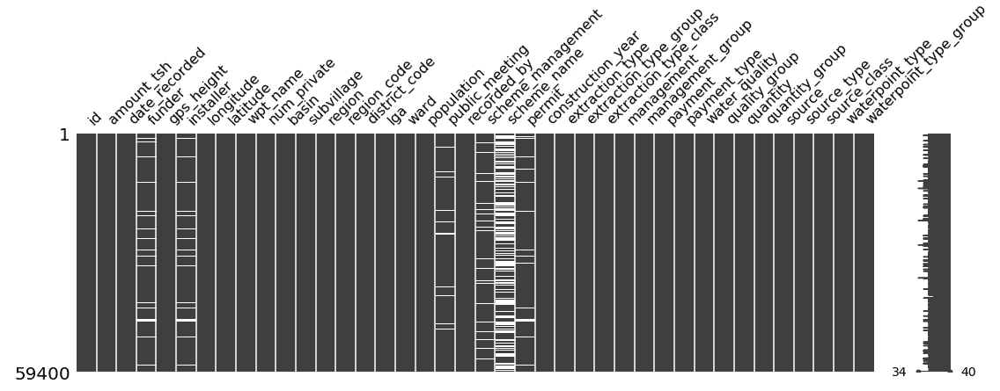

# 删除丢失的值？你可能不应该。

> 原文：<https://towardsdatascience.com/few-reasons-to-not-drop-missing-values-575a8d2b6a41?source=collection_archive---------15----------------------->

## 我们不知道的是，缺失值包含的信息通常与数据集的其他部分一样多。

照片由 [**菲尔听力**](https://unsplash.com/@philhearing?utm_source=unsplash&utm_medium=referral&utm_content=creditCopyText) 上 [**下**](https://unsplash.com/s/photos/missing?utm_source=unsplash&utm_medium=referral&utm_content=creditCopyText)

一个 ***系列的缺失值通常会像一系列结构化数据上的污点一样突出。***

看上图。你可能下意识地注意到的第一件事是有一辆婴儿车不见了。事实上，让我告诉你，这正是人类大脑的工作方式。

> 任何不寻常的东西都需要检查。
> 
> —人类的大脑。

***猜猜看？在处理真实世界的数据时，您很少会遇到没有缺失值的数据集！***

就像一张纸上的一个污点一样，缺少的值会显得很突出，很碍眼。

缺少列中没有缺少值的矩阵

那些令人满意的干净笔直的柱子之间的白色斑块，该死的，**如果我说它们不会触发我的强迫症，就开枪打我吧**。

不幸的是，对我们这些数据分析师来说， ***处理嘈杂的数据是我们一天工作的一半*** &，老实说，为了让我们的生活更轻松，我经常忍不住删除那些缺少值的行！但是这样做是不明智的，因为这可能会导致信息的丢失和/或允许某种程度的偏见进入，这是另一个博客讨论的话题。所以如果感兴趣，继续读到最后& [**订阅**](https://mailchi.mp/9e19ea8935b2/newsletter-blogging) 即时通知。

## 回到关于缺失值的讨论

你不应该感到惊讶，但实际上，数据分析师总是主动处理数据集中的缺失值。事实上，通常情况下， ***缺失值实际上代表了主要信息位&***，尽管它可能与完整数据的其余部分没有什么不同！

因此，确定关于缺失值的*假设*是绝对必要的，它们是:

1.  数据“*是否完全随机缺失(****【MCAR】****)*”？
2.  还是他们“*随意失踪(****MAR****)*”？
3.  最后，如果他们“*不随意失踪(****MNAR****)*”？

*例如，如果男性透露其年龄&体重的可能性比女性高，那么所收集的数据将会有一系列缺失值，它们将被认为是* ***缺失而不是随机****(****MNAR****)。因此，可以采取适当的步骤来处理输入缺失变量以供进一步分析。*

不过，从另一方面来说，本着开放的心态，缺失值应该像剩余的完整数据集一样进行分析。事实上，最近的学术研究表明，不一致比传统的统计推断更直观。

## 我们对不一致的视觉感知

上图中的*缺失矩阵*展示了可视化缺失值如何帮助我们更好地理解数据集的例子。

快速浏览一下图像，可以看到“*scheme _ name”*列中有大量的值缺失。这种差异的原因可能是什么？

上面那张*缺失矩阵*图片中的数据集汇集了来自各种渠道的关于 ***社区水泵*** 的信息，这些水泵分散在坦桑尼亚*的全国各地，看起来其中一些水泵可能是由非政府组织或非营利组织或一些体贴的个人安装的。因此，水泵的维护不属于坦桑尼亚任何政府计划的管辖范围。因此可以有把握地假设数据是 ***MNAR*** 。*

*引用最近一份关于不一致系列数据的视觉感知的研究出版物的声明，应该进一步加强我关于对处理缺失值持开放态度背后的原因的主张。[1]*

> *我们发现，突出显示缺失值的可视化具有更高的感知数据质量，而那些打破
> 视觉连续性的可视化会降低这些感知，并可能导致解释偏差。*
> 
> *—宋海阳和丹妮尔·艾伯斯·萨菲尔*

**他们的主张是，一般来说，人们对不一致更有***的感知能力，尤其是通过向他们描绘一些信息的视觉形式。***

**换句话说，就像上面的图片在潜意识里迫使你放大婴儿推车应该出现的地方一样，*人类的大脑通过视觉感知*做出一系列似乎合理的假设。因此*，可以安全地假设一个常识，即我们作为人类，本能地通过视觉感知更多的信息，而不是任何其他形式的推理。***

**上述出版物的作者进一步指出，人类在良好的光线下不会接收到不一致的模糊视觉。相反， ***如果适用的话，对缺失的数据*** 进行注释或提供含义是更可取的，甚至是非常可取的。**

***总而言之，NaN 值并不一定意味着数据质量差，但作为数据分析师，有责任在正确处理数据之前警惕数据中存在此类差异的原因。***

## *****参考文献*****

**H.宋和萨菲，[我的资料在哪里？用缺失数据评估可视化](https://cmci.colorado.edu/visualab/papers/song_VIS_2018.pdf) (2018)，科罗拉多大学视觉实验室。**

**我是一名自由职业的数据分析师，帮助企业了解如何利用他们的数据需求。如果您有任何相关问题，请随时通过 [**Twitter**](https://twitter.com/Jarmosan) 联系我。**

**此外，你甚至可以 [**订阅**](https://mailchi.mp/9e19ea8935b2/newsletter-blogging) 到我的邮件列表，以便在有新的更新时得到即时通知！**