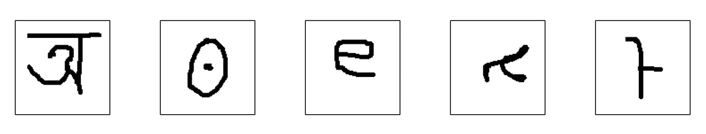
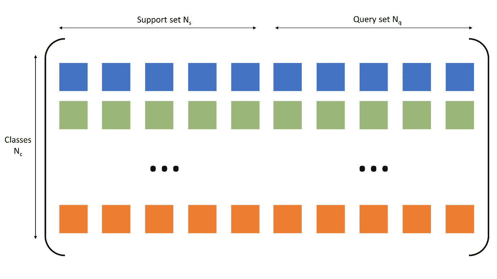
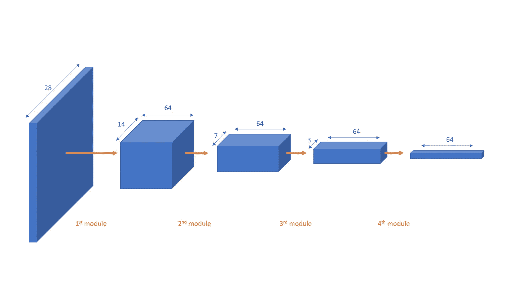
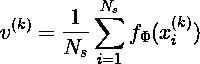
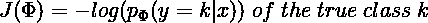
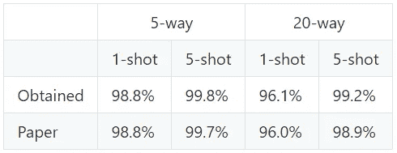

# 基于原型网络的少量学习

> 原文：<https://towardsdatascience.com/few-shot-learning-with-prototypical-networks-87949de03ccd?source=collection_archive---------21----------------------->

## 学习在 Omniglot 数据集上编写少量学习算法

图片来源:[https://unsplash.com/photos/kZO9xqmO_TA](https://unsplash.com/photos/kZO9xqmO_TA)

# 介绍

我们，人类，有能力识别一个类，只要给出这个类的几个例子。例如，一个孩子只需要两到三张兔子的图片就能从其他物种中认出这种动物。这种从有限数据中学习的能力超过了任何经典的机器学习算法。很多人认为人类正在被人工智能推翻，但事实是:为了能够很好地区分类别，一个分类器经常会收到每个类别数千张图像……而我们只需要两三张！

原型网络(prototypic Networks)是由 [Snell 等人在 2017 年推出的一种算法(在“用于少数镜头学习的原型网络”)](https://arxiv.org/abs/1703.05175)中)，它解决了少数镜头学习范式。我们用一个例子一步步来理解。在本文中，我们的目标是对人物图像进行分类。[提供的代码是 PyTorch 格式的，可从这里获得。](https://github.com/cnielly/prototypical-networks-omniglot)

# Omniglot 数据集

在少镜头学习中，我们被给定一个数据集，每个类只有很少的图像(通常是 1 到 10 个)。在本文中，我们将使用 Omniglot 数据集，该数据集包含从 50 个字母中收集的 1，623 个不同的手写字符。这个数据集可以在[这个 GitHub 库](https://github.com/brendenlake/omniglot/tree/master/python)中找到。我使用了“images_background.zip”和“images_evaluation.zip”文件。

Omniglot 数据集中的字符示例

正如官方文件中所建议的，执行数据扩充是为了增加类的数量。实际上，所有图像都旋转了 90 度、180 度和 270 度，每次旋转都会产生一个额外的类别。一旦执行了这种数据扩充，我们就有 1，623 * 4 = 6，492 个类。我将整个数据集分为一个训练集(4，200 个类别的图像)和一个测试集(2，292 个类别的图像)。

# 选择一个样本

为了创建一个样本，Nc 类是从所有类中随机挑选出来的。对于每个类，我们有两组图像:大小为 Ns 的支持集和大小为 Nq 的查询集。

Nc 类的示例图，每个类都包含一个支持集和一个查询集

# 嵌入图像

> “我们的方法基于这样一种思想，即存在一种嵌入，其中点围绕每个类的单个原型表示聚集。”声明原始论文的作者。

换句话说，存在图像的数学表示，其中相同类别的图像聚集在称为簇的组中。在嵌入空间中工作的主要优点是，两个看起来相同的图像会彼此靠近，而两个完全不同的图像会远离。

在我们的例子中，对于 Omniglot 数据集，嵌入块将(28x28x3)图像作为输入，并返回列 64 维点。image2vector 函数由 4 个模块组成。每个模块由一个卷积层、一个批量归一化、一个 ReLu 激活函数和一个 2x2 max 池层组成。

image2vector 功能的 4 个模块

# 计算类原型

在这一步中，我们为每个集群计算一个原型。一旦支持图像被嵌入，向量被平均以形成一个类原型，该类的一种“代表”。

其中 v(k)是类 k 的原型，f_phi 是嵌入函数，xi 是支持图像。

每个类计算一个原型

# 计算查询和原型之间的距离

该步骤包括对查询图像进行分类。为此，我们计算每个未标记图像和原型之间的距离。度量选择在这里是至关重要的，原型网络的发明者必须归功于他们对距离的选择:欧几里德距离。

一旦计算出距离，就对它们执行 softmax 以获得属于每个类的概率。距离越短，概率越大。

# 计算损耗和反向传播

原型网络学习阶段通过最小化负对数概率进行，也称为 log-softmax 损失。使用对数的主要优点是，当模型无法预测正确的类别时，会大幅增加损失。

反向传播通过随机梯度下降(SGD)来执行。

# 启动培训

上面描述的整个序列构成了一集。训练阶段包含几集。我试图重现原始论文的结果。以下是训练设置:

*   Nc: 60 类
*   Ns: 1 或 5 个支持点/类
*   Nq: 5 个查询点/类
*   5 个时代
*   2000 集/时代
*   学习率最初为 0.001，并在每个时期除以 2

训练进行了 30 分钟。

# 结果

一旦质子被训练，我们可以用新的数据来测试它。我们以类似的方式在测试集中选择样本。使用支持集来计算原型，然后根据到原型的较短距离来标记查询集的每个点。

为了测试，我尝试了 5 路和 20 路场景。与培训阶段相比，我获得了相同数量的支持和查询点。测试在 1000 集上进行。

结果如下表所示。“5 路 1 投”就是 Nc = 5，Ns = 1。

获得的结果与论文结果

我获得了与原始论文相似的结果，在某些情况下稍好一些。这可能是由于论文中没有具体说明的采样策略。每集我都采用随机抽样。

我希望原型网络不再是你的秘密！我们能够从每个类仅有的几个例子中建立一个图像分类器。

**我的 GitHub 上有完整的代码:**【https://github.com/cnielly/prototypical-networks-omniglot 