# FickleNet

> 原文：<https://towardsdatascience.com/ficklenet-weakly-and-semi-supervised-semantic-image-segmentation-using-stochastic-inference-5d0e11e624b2?source=collection_archive---------66----------------------->

## 基于随机推理的弱半监督语义图像分割

## 前言

FickleNet 的简要概述[1]源自我在 TUM 计算机辅助医疗程序和增强现实讲座上的硕士研讨会。我要感谢我的项目主管 [Tariq Bdair](http://campar.in.tum.de/Main/TariqBdair) 以及课程主管 [Magda Paschali](http://campar.in.tum.de/Main/MagdaPaschali) 和[Shadi albarquni](http://campar.in.tum.de/Main/ShadiAlbarqouni)博士。

## 介绍

对于分割任务，包括医学任务，如肿瘤分割，像素精度提高了结果的质量。然而，获得像素级精度是一个当前的问题，因为计算是昂贵的，并且所需的完全注释的数据是罕见的。使用弱监督和半监督学习技术，FickleNet 提出了一个解决这个问题的方法。贡献随机隐藏单元选择，使得能够在单个图像上探索不同的位置，解决了计算费用和有限数据的问题。

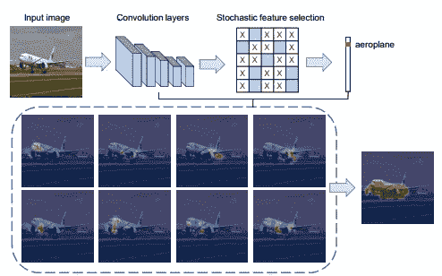

图 FickleNet 的可视化[1]

## 相关著作

分段任务的目标是获得一个类别激活图(CAM) [2]，该图探索神经网络中每个隐藏单元对分类分数的贡献。然而，天真的方法并不代表目标对象的语义结构，而是突出对象的有区别的部分，例如狗的脸。

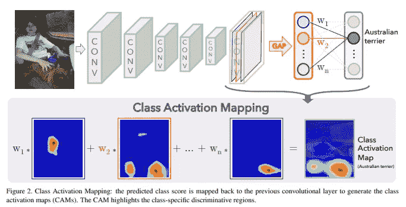

图 2:香草凸轮的可视化[2]

因此，在保持对象的语义和大小的意义上，新方法的目标是产生更好的定位图。为了获得更好的凸轮，存在三个主要方向:

**图像级[3–5]**

图像级处理的思想是隐藏图像的区别部分，迫使网络根据区别较小的部分对对象进行分类。在狗的例子中，这导致隐藏狗的脸，网络现在被迫使用狗身体的其余部分进行分类。然而，现有的模型对于进一步的分割、松散的语义和对象的大小使网络过于混乱，或者在计算上过于昂贵。

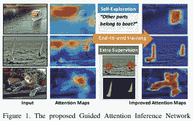

图 3:增益的可视化，一个图像级处理分割网络[3]

**特征级【6，7】**

类似于图像级处理，特征级处理旨在向网络隐藏有区别的部分。代替图像的部分，部分特征被隐藏。网络被迫使用较少区别的特征来分类对象。现有特征级方法的缺点是计算量大。

图 4: ACoL，一个特征级处理分割网络[6]

**区域增长【8–10】**

对于区域生长，CAM 最初提供对象的小的区别部分，称为种子。使用随机游走，网络识别哪些像素仍然属于该分类对象。种子被放大，直到它们适合对象的语义和大小。像特征级方法一样，目前主要的缺点是计算开销大。

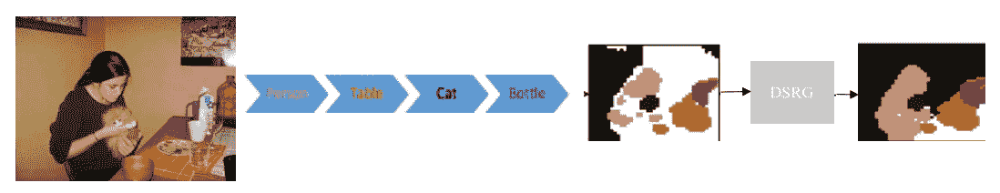

图 5:简化自[10]，DSRG，一个基于区域增长的分割网络

## 方法学

FickleNet 的目标是从单个图像中获取更多信息，同时将其自身限制在单个优化步骤中。简而言之，FickleNet 为区域生长方法 DSRG 提供了分类器的随机部分。该网络遍历单个图像，并在特征图上选择位置的随机组合，用作分割中的种子。因此，单个影像会根据特征地图生成不同的位置，而只需训练一个网络。下面将详细介绍这是如何工作的。

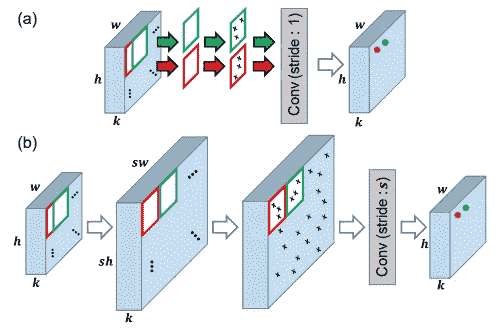

图 6:随机隐藏单元选择的架构[1]

**预处理**

首先，单个图像应该通过迭代产生不同的分类分数。为此，计算随机选择的隐藏单元对的分类分数。要接收这些分类分数，需要完成以下步骤:

a)特征地图扩展

从上面图像 6 中的(a)和(b)的比较中可以看出，特征图被扩展，使得当应用 dropout 时滑动窗口不重叠。这在没有扩展的情况下是可能的，但是它使得计算更便宜，正如结果将显示的那样。

b)保持中心的辍学[11]

在每个滑动窗口位置，除了窗口中心之外，执行带有随机掩码的删除，窗口中心将总是被保留。丢弃的结果是随机选择隐藏单元，在每个滑动窗口位置是不同的。因此，随机零件被提供给 DSRG。保持中心意味着保持滑动窗口位置之间的相关性。结果部分显示了这样做的结果。

c)获得激活分数 *s*

最后的步骤产生不同形状和大小的感受野。对于通过图像的每次迭代，不同的感受野结果。因此，不同的分类分数产生如下。以卷积层、全局平均池和 sigmoid 层的共同方式获得每次迭代的分类分数，以利用激活分数 s 进行分类

**班级激活图**

第二，对于每个图像，来自迭代的激活分数需要被聚集到单个本地化地图中。为了获得第一手的类激活图，使用 Grad-CAM [12]:

公式 1: Grad-CAM [12]

其中还包括最后一层 *∂Sc/∂x_k* 的渐变。这导致了一个更好的类激活映射，可以与更昂贵的方法相比。

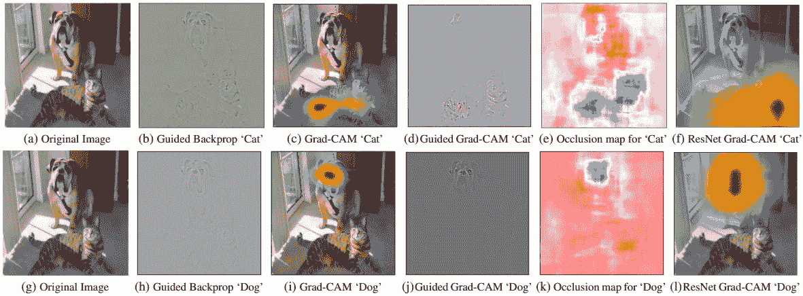

图 7:Grad-CAM 与计算成本更高的方法的比较(e，k) [14]

对于每个类和图像的每次迭代有一个 Grad-CAM，图像的地图被聚集。为此，如果在像素 *u* 处的图像的任何定位图中的 *c* 的 Grad-CAM 分数大于阈值，则该像素 *u* 被分类为类别 *c* 。

**亏损**

最后，训练分割网络。需要注意的是，这是 FickleNet 所需的唯一培训程序。使用 ADAM 可以最大限度地降低以下损耗:

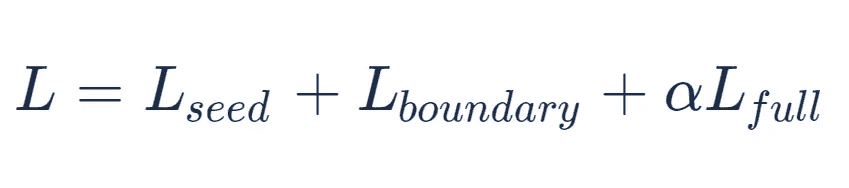

在哪里

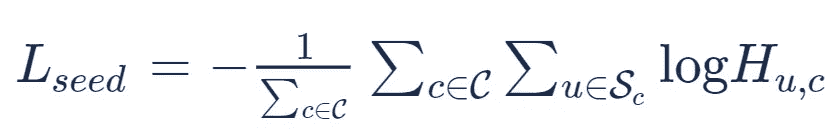

[10]

其中 *H_u，c* 是在分割图 ***H*** 的位置 *u* 处的类别 *c* 的概率，Sc 是被分类到类别 c 的位置集合。这是一个交叉熵损失，目标是仅匹配分类网络给出的种子线索，而忽略其余线索。

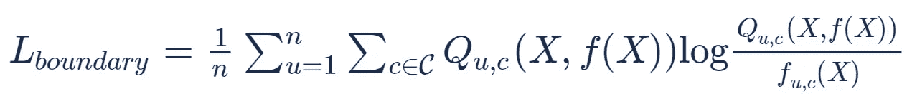

[10]

其中 *f_uc(X)* 为网络输出 *Q_uc(X，f(X))* 为条件随机场(CRF)。这是要最小化的 KL-散度，以便惩罚关于空间和颜色信息的不连续分割[10]。

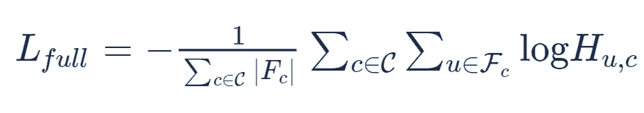

其中 *H_u，c* 是在分割图 ***H*** 的位置 *u* 处的类 *c* 的概率，并且 *F_c* 是背景真相掩码。这是一种交叉熵损失，其惩罚了与完全注释的图像(由人类专家注释)的偏差。该损耗仅用于半监督设置。

**方法总结**

在应用 DSRG 进行分割之前，FickleNet 贡献了随机隐藏单元选择作为预处理步骤。因此，通过不仅隐藏区别部分，而且首先不知道区别部分，CAM 得到改进。要注意的是，这种像素精确的分割仅用单个损失函数来训练。

## 实验

**设置**

*   *数据集* : PASCAL VOC 2012 图像分割基准[13] (20 类，10M 标签图像)
*   *网络* : VGG-16 [14]在 Imagenet [15]上预训练，由 DSRG [10]执行分割
*   *设置*:小批量:10，
*   图像在随机位置裁剪为 321x321 像素，
*   学习率 0.001，每 10 个时代减半，
*   亚当优化器[16]
*   *框架*:用于本地化地图的 Pytorch [17]
*   Caffe [18]用于分割
*   英伟达泰坦 Xp GPU

**评估**

两个弱监督设置和一个半监督设置被用作评估基线，具有用于分段的不同架构。在每种情况下，PASCAL VOC 2012 图像分割基准[13]都被用作数据源。

*   弱监督设置，使用 DeepLab-VGG16 进行分段

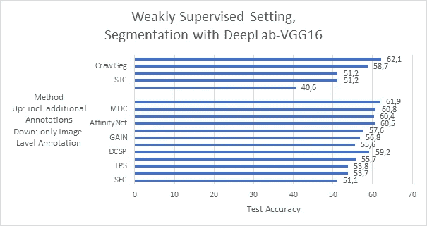

图 8:自己对[1]中给出的结果的评估

在这种情况下，FickleNet 优于同类网络。值得注意的是，精确度接近于利用附加注释的网络的精确度。

*   弱监督设置，使用 ResNet 进行分段

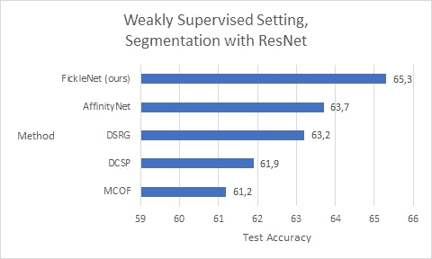

图 9:自己对[1]中给出的结果的评估

在这方面，FickleNet 也优于类似的网络。值得注意的是，即使是基于 ResNet 38 的 AffinityNet 也表现出色，而 FickleNet 只使用了不太复杂的 ResNet 101。

*   半监督设置，使用 DeepLab-VGG16 分段

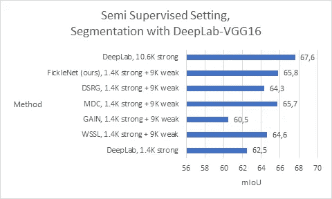

图 10:自己对[1]中给出的结果的评估

FickleNet 产生了稍好的联合平均交集(mIoU)分数，这是分割任务的准确性度量。在这种设置下，将网络与具有 1.4K 和 10.6K 强注释图像的完全监督方法进行比较。因此，半监督网络提供了比 DeepLab 1.4K 更多的信息，但比 DeepLab 10.6K 少。低改进可以通过 FickleNet 对弱监督学习的关注来解释，其中半监督学习的应用是可能的。该贡献不是合适的半监督学习解决方案。

**结果**

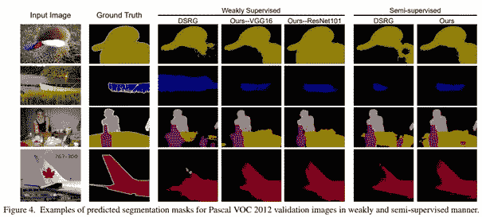

图 11:FickleNet 的视觉效果[1]

FickleNet 提供了消融研究的五个要点:

*   图距扩散

地图扩展使得在每个滑动窗口位置的随机隐藏单元选择更容易。这导致了更快的计算速度，代价是 GPU 内存使用量略有增加。

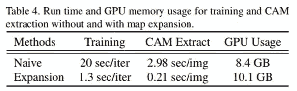

图 12:地图扩展的结果[1]

*   单个图像的更多随机选择

单个图像迭代得越频繁，对象的表示区域就越大。这证明了随机选择隐藏单元的主要思想，因为它使得遍历图像成为可能。

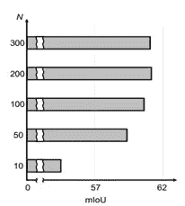

图 13:随机选择的结果[1]

*   辍学率

丢失率越高，目标对象的覆盖区域越大。如果退出率低，则对象的高区分度部分仍然活跃的概率高，这与隐藏这些区域的想法相抵触。因此，区分度较低的部分不被用作种子，提供的种子较少，覆盖的区域较小。

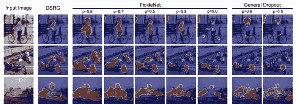

图 14:辍学率的结果[1]

*   中心保持辍学

为了保持滑动窗口位置之间的相关性，应用了中心保持丢失。如图 14 所示，相比之下，一般信号丢失会导致激活噪声。如果不保留相关性并将其提供给随机行走，则仍然属于同一对象的概率较低。在没有区别特征或相邻区别部分的相关性的情况下，对象的一些小部分没有被这样分类。

*   随机方法的效果

基本概念是对分割的随机观点，特别是将图像的哪些部分提供给分割网络。结果证明，训练和推理中的随机选择提供了最高的 mIoU(联合平均交集)分数。

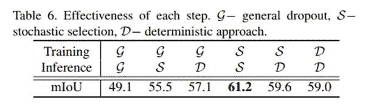

图 15:随机方法的结果[1]

## 结论

FickleNet 为弱半监督语义图像分割提供了一种新的预处理方法。已经证明随机选择隐藏单元的效果提高了分割任务的准确性。这个想法在其他领域的应用也很有趣。然而，该论文没有提出改进 FickleNet 的可能方向或该思想的不同应用，因此留给感兴趣的读者。

为了更进一步的形象化，请随意看看我的介绍 [*这里*](https://drive.google.com/file/d/13vSGklR9XyXCQTixvRbQVA-rDGhzRm0Y/view?usp=sharing) ！如果您有任何问题或想法，欢迎在 [*LinkedIn*](https://www.linkedin.com/in/till-richter-659334157/) 上联系我。

感谢阅读！

## 文献学

[1]: Lee，Jungbeom，等，“FickleNet:使用随机推理的弱和半监督语义图像分割。”*IEEE 计算机视觉和模式识别会议论文集*。2019.

[2]: B .周、a .科斯拉、a .拉皮德里扎、a .奥利瓦和 a .托拉尔巴。用于鉴别定位的深度特征学习

[3]:李、吴、彭、恩斯特、傅。告诉我去哪里找:引导注意力推理网络

[4]:辛格和李英杰。捉迷藏:迫使网络对弱监督的目标和动作定位非常细致

[5]:魏延东、冯军、梁晓松、郑明明、赵延东、严。具有对抗性删除的对象区域挖掘:语义分割方法的一种简单分类

[6]: X .张、y .魏、j .冯、y .杨、t .黄。弱监督目标定位的对抗互补学习

[7]:金东明、赵东明、刘东明和郭怡广。弱监督目标定位的两阶段学习

[8]:范力民、侯群、郑明民、穆廷杰、胡绍民。s4net:单阶段显著实例分割。

[9]:科列斯尼科夫和兰伯特。种子、扩展和约束:弱监督图像分割的三个原则

[10]:黄志军、王晓霞、王军、刘伟、王军。深度种子区域生长的弱监督语义分割网络

[11]: N .斯里瓦斯塔瓦、g .辛顿、a .克里热夫斯基、I .苏茨基弗和 r .萨拉胡季诺夫。辍学:防止神经网络过度拟合的简单方法

[12]: R. R. Selvaraju，M. Cogswell，A. Das，R. Vedantam，D. Parikh，D. Batra，等. Grad-cam:通过基于梯度的定位从深层网络进行视觉解释

[13]: M. Everingham、L. Van Gool、C. K. Williams、J. Winn 和 A. Zisserman。pascal 视觉对象类(voc)挑战

[14]: K .西蒙扬和 a .齐塞尔曼。用于大规模图像识别的非常深的卷积网络

[15]:邓俊杰、董文伟、索彻、李俊杰、李刚和李飞飞。Imagenet:一个大规模分层图像数据库

[16]: D. P .金马和 j .巴。Adam:一种随机优化方法

[17]: A. Paszke、S. Gross、S. Chintala、G. Chanan、E. Yang、Z. DeVito、Z. Lin、A. Desmaison、L. Antiga 和 A. Lerer。pytorch 中的自动微分

[18]:贾庆林、谢勒哈默、多纳休、卡拉耶夫、龙、吉希克、瓜达拉马和达雷尔。Caffe:用于快速特征嵌入的卷积架构