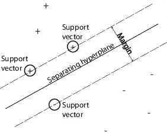

# FIFA 20 上的机器学习

> 原文：<https://towardsdatascience.com/fifa-20-player-clustering-f500cf0792c5?source=collection_archive---------25----------------------->

## 通过监督机器学习对视频游戏 FIFA 20 和球员分类的数据探索。

[JESHOOTS.COM](https://unsplash.com/@jeshoots?utm_source=unsplash&utm_medium=referral&utm_content=creditCopyText)在 [Unsplash](https://unsplash.com/s/photos/fifa?utm_source=unsplash&utm_medium=referral&utm_content=creditCopyText) 上拍照

# 路标

*   **简介**
*   **数据探索**
*   **玩家分类
    1**—**K-最近邻
    **2** — 决策树分类器
    **3** — 支持向量机
    **4** — 逻辑回归**
*   ****结果****
*   ****结论****

# **介绍**

**FIFA 是一款足球模拟游戏，由电子艺界公司每年发行，游戏的主角当然是足球运动员。电子游戏中的玩家希望在身体和技能上尽可能接近真实的玩家。这套技能决定了他们在场上的位置。你当然要杀手前锋，要人墙当守门员！**

## **目标**

**如果你是一个足球迷，你很可能知道每个球员在你最喜欢的球队中的位置。机器可以根据不同玩家的技能来学习他们的位置吗？**

## **获取数据**

**数据是从 [Kaggle](https://www.kaggle.com/stefanoleone992/fifa-20-complete-player-dataset?select=players_20.csv) 下载的，这些数据是从公开网站 [sofifa](https://sofifa.com) 上刮下来的。**

# **数据探索**

**第一步是下载资料，先看看球员的一些信息。**

**现在让我们来看看哪些球员会让一家俱乐部支付“最高价”。**

**这两个球员肯定贵，但是哪个俱乐部平均花费最多呢？为了说明这一点，球员按俱乐部分组，然后从“价值欧元”和“工资欧元”栏中取平均值。**

**让我们来看看拥有最有价值球员的前 10 家俱乐部和支付最高工资的前 10 家俱乐部。**

****

**球员平均价值(作为参考，第一个价值是 2990 万欧元)**

****

**支付给球员的平均工资(作为参考，第一个数值是 16.22 万欧元)**

**现在让我们来看看拥有顶级球员的俱乐部。**

****

**总体平均玩家**

> **注意:这并不一定转化为最佳球队的图表，因为一些俱乐部可能比其他俱乐部拥有更多的替补或替补球员，尽管如此，这是一个有趣的结果。**

**FIFA 20 上拥有更多联赛的国家是英格兰，毫不奇怪他们拥有游戏中最多的球员。**

**下面的直方图显示了一些有趣的见解:**

*   **大多数运动员都是右脚运动员。**
*   **左尾巴在总体 50 左右急剧减少(考虑到这些是职业队的球员，它不应该再向左走了，对吗？).**
*   **右尾巴很长，代表少数杰出的玩家。**
*   **球场中央比两端更“忙”，中场和后卫比前锋和守门员多。**

****

**从左至右:进攻队员、中场队员、防守队员和守门员**

**上面的直方图是按球员位置划分的，我们可以看看“整体”得分的大致分布。**

# **数据预处理**

## **玩家位置**

**如果我们看看球员的位置，我们注意到球员有一个位置，其他人有两个，有些人甚至三个！**

**就该项目的范围而言，职位将分为四类:**

****

*   **进攻者:圣西罗，LW，RW，CF**
*   **中场:凸轮，LM，CM，RM，CDM**
*   **后卫:LWB，RWB，LB，CB，RB**
*   **守门员:GK**

**在制作任何模型之前，正确地将玩家分类是重要的一步。让我们以玩家“41”为例，这个玩家有三个位置:**

*   **RW —攻击者**
*   **CAM —中场**
*   **CM —中场**

**如果我们只为每个球员选择第一个位置，这个“41”球员将被认为是一个“攻击手”，然而，他也踢其他两个位置，都是“中场”。所以更好的方法是把这个球员看作中场球员。为了实现这一点，我们创建了以下函数，并将其应用于“player_positions”列。**

## **拆分数据**

**创建了一个新的数据帧，该数据帧将只包含有用的列，这些列在下面显示为空值的数量。**

**我们的数据帧中有 0 个空值，所以我们可以继续。**

**数据值将被相应地分配，预测值(X)和目标值(y)，然后它将被分成训练和测试。**

*   **x 将包括玩家的所有技能。**
*   **y 将包括玩家位置。**

**来自 train_test_split 的输入:**

*   **test _ size = 0.2 训练数据将占 80%，测试将占 20%。**
*   **random_state=42 —用于播种新的 RandomState 对象。**
*   **分层= y-使分割的值成比例。**

**虽然数据的标准化是一个重要的预处理，但这将结合每个机器学习模型来执行，并通过管道进行交叉验证，以避免泄漏。**

**那么这些术语是什么呢？下面是对每一个的简要说明:**

## **数据泄露**

**当来自训练数据集之外的信息用于创建模型时。**

## **标准化**

**数据标准化是重新调整一个或多个属性的过程，使它们的平均值为 0，标准差为 1。**

## **管道**

**根据 scikit-learn 文档:
依次应用一系列转换和一个最终估计器。管道的中间步骤必须是“转换”，也就是说，它们必须实现 fit 和 transform 方法。最终的估计器只需要实现 fit。**

**管道的目的是组装几个步骤，这些步骤可以在设置不同参数的同时进行交叉验证。**

## **k 倍交叉验证**

**将数据分为训练和测试对于监督学习是必要的，然而，模型的结果将基于这种唯一的划分。这个问题的解决方案是一个叫做 k-fold 交叉验证的过程，其中数据被分成 *k* 个更小的集合。训练数据将是 *k-1* 个折叠，剩余的折叠将用于验证，跨 k 个折叠的验证结果的平均值将是性能测量。**

**这个过程在计算上可能是昂贵的，但是它有助于避免过拟合或选择偏差。**

****

**k 倍交叉验证的可视化。图片来自[维基百科](https://upload.wikimedia.org/wikipedia/commons/thumb/b/b5/K-fold_cross_validation_EN.svg/250px-K-fold_cross_validation_EN.svg.png)。**

# **玩家分类**

**在跳入不同的机器学习模型对球员位置进行分类之前，我们先来看看球员属性之间的关联矩阵。**

****

**通过查看这张热图，我们可以假设模型应该很容易识别守门员，让我们看看他们的表现如何。**

> **注意:对每种分类算法都会有一个简短的解释，对每种算法的更深入的研究超出了本文的范围。给出的解释应该足以理解显示的代码。**

## **k-最近邻**

**通过其邻居的多数投票对对象进行分类，将该对象分配到其 *k* 个最近邻居中最常见的类别。如果 *k* = 1，那么该对象被简单地分配给该单个最近邻的类。**

**下图显示了该算法如何工作的示例。绿点是测试对象。如果 *k* = 3，它将被分类为红色三角形，因为有两个红色三角形对着一个蓝色正方形(圆形区域)。如果 *k* = 5，它现在将被分类为蓝色方块，因为这些“邻居”现在占大多数(虚线圆圈区域)。**

****

**k 近邻可视化。图片来自[维基百科](https://upload.wikimedia.org/wikipedia/commons/thumb/e/e7/KnnClassification.svg/220px-KnnClassification.svg.png)。**

**下面的代码结合了我们到目前为止读到的内容:**

*   **数据标准化。**
*   **使用管道连接 ML 流程的不同“部分”(及其相应的参数)。**
*   **用 *k* -folds ( *k* = 5)通过数据进行交叉验证。**

**结果是具有相应最佳参数的交叉验证平均值。现在我们可以拟合模型并做出预测。**

**一个可视化算法性能的有用工具是混淆矩阵。这个二维表格显示了球员的标签。标准化以百分比显示分类，非标准化以玩家数量显示分类。例如:**

*   **510 名(73%)攻击者被正确分类。**
*   **180 名(26%)攻击手被归类为中场。**
*   **8 名(1.1%)攻击者被归类为防御者。**
*   **0 (0%)名攻击者被归类为守门员。**

**对每个位置依此类推。**

****

**k-最近邻混淆矩阵**

## **决策树分类器**

**一种结构，其中每个内部节点表示对一个属性的“测试”，每个分支表示测试的结果，每个叶节点表示一个类标签。DTC 的组成:**

****

**泰坦尼克号上乘客的生存。**

*   ****决策节点:**顾名思义，代表一个预测变量的一个决策点，它将导向目标变量。
    (例子——性别)**
*   ****分支:**节点之间的连接，用箭头表示。每个分支代表一个响应。
    (示例—男性/女性)**
*   ****叶节点:**叶节点或终止节点代表结果的最终类别。
    (示例—死亡/幸存)**

> **注意:对于我们的数据，决策节点将是预测器，分支将是“≤ *X* ”，叶节点将是玩家位置。
> 比如“技能 _ 运球”≤ 55.0 →后卫。**

**同样，我们使用管道来获得算法的最佳参数。**

**我们能确定这些是最好的参数吗？下面的代码展示了如何在每个 GridSearchCV 中获得最佳参数的“幕后”演示。**

**我们可以看到，在 24 种不同的可能性中，`(8, 'gini')`的得分最高`(0.858638...)`。既然我们有了最好的参数，就可以拟合这个模型了。**

**“gini”是默认参数。**

**看一下各自的混淆矩阵。**

****

**决策树分类器混淆矩阵**

## **支持向量机**

****

**MathWorks 中的例子。**

**这种算法是基于寻找一个能最好地分割数据的超平面的思想。目标是找到一个在观察值(支持向量)和超平面之间具有最大可能余量(距离)的超平面，从而有更大的机会正确识别新数据。如果输入特征的数量是两个，那么超平面只是一条线，如果输入特征的数量是三个，那么超平面变成一个二维平面。当特征的数量超过三个时，就很难想象了。这个想法是，数据将继续被映射到越来越高的维度，直到可以形成一个超平面来隔离它。**

**多类问题被分解为多个二元分类案例，也称为*一对一*。它将数据集拆分为每个类的一个数据集，而不是每隔一个类。**

*   ****二元分类问题 1**:ATT vs MID**
*   ****二元分类问题 2** : ATT vs. DEF**
*   ****二元分类问题 3**:ATT vs GK**
*   ****二进制分类问题 4** : MID vs. DEF**
*   ****二进制分类问题 5**:MID vs GK**
*   ****二元分类问题 6** : DEF vs. GK**

**每个二元分类模型可以预测一个类别标签，并且通过一对一策略预测具有最多预测或投票的模型。**

> **注:为了更好地掌握算法，吴恩达的[笔记](http://cs229.stanford.edu/notes/cs229-notes3.pdf)非常精彩。**

**再次，获得最佳参数并拟合模型。**

**在这种情况下，最好的参数是缺省值，所以不需要键入它们。**

**相应的混淆矩阵。**

****

## **逻辑回归**

**该模型用于在给定一组特征(预测因子)的情况下预测二元结果。分类器输出(目标)可以是 1 或 0。我们正在寻找一个观察值是(1 *)* 还是不是(0 *)* 类的一部分的概率。**

**简而言之，它获取特征，将每个特征乘以一个权重，对它们求和，然后将和通过一个 sigmoid 函数来生成一个概率并分配一个类别。权重(向量 *w* 和偏差 *b* )通过损失函数(交叉熵损失)从标记的训练集中学习。**

**我们的数据有两个以上的目标，所以我们使用多项式逻辑回归，它使用了 sigmoid 的推广，称为 softmax 函数。**

> **注意:同样，这是一个非常简单的算法，在这里可以找到更多的。**

**老样子，老样子，用管道获取最佳参数，拟合模型。**

> **注意:参数`*multi_class*`默认设置为“auto ”,如果数据不是二进制，则选择“多项式”。如果选择了“多项式”,则 softmax 函数用于查找每个类别的预测概率以分配目标。**

**最后混淆矩阵。**

****

**逻辑回归混淆矩阵**

# **结果**

**正如所料，所有不同的模型都可以很容易地识别守门员，他们拥有的大多数技能似乎与其他技能呈负相关，并且彼此之间有很强的相关性。**

**我们已经看到了不同的混淆矩阵，让我们最后看一下一些主要的分类指标。这些是通过`classification_report`和`accuracy_score`从`sklearn.metrics`图书馆获得的。为简单起见，所有报告都放在一个图像中。**

****

**算法分类报告和准确度分数**

**SVM 似乎是最准确的算法来确定球员的位置。然而，还有其他重要的指标。把一个进攻者放在防守者的位置上，也许不是世界末日，但肯定不会有那么好的表现。让我们看看这些有用的指标带来了什么。**

## **准确(性)**

**预测值与实际目标的接近程度。**

## **精确**

**检索到的实例中相关实例的比例。(归一化混淆矩阵的对角线值)。
有多少选择的项目是相关的？**

## **回忆**

**实际检索的相关实例总数的一部分。
选择了多少个相关项目？**

## **f 分数**

**精确度和召回率调和平均值。**

# **结论**

**有几个监督算法，这个故事显示了其中一些一目了然。数据的正确预处理以及参数的正确选择对于每个算法都至关重要。**

**在选择哪种算法性能更好时，记住这一点很重要:**

*   **当假阳性的成本很高时，精度是一个很好的模型度量。**
*   **当存在与假阴性相关联的高成本时，召回是一个好的模型度量。**
*   **如果我们需要在精确度和召回率之间寻求平衡，F-score 可能是一个更好的模型度量。**

**另一个有时被忽视的重要指标是时间！是的，你想要一个精确的模型，但是一些模型花费更多的时间来获得一点点的精确度。举例来说，SVM 的准确率比逻辑回归高 0.95%，然而，寻找 LogReg 的最佳参数比 SVM 快 6.6 倍(两者最初都是为二元分类设计的)。**

**以秒为单位的时间。**

**在某些情况下，1%可能是一个显著的差异，但有时为了获得更快的结果，放弃那个百分比也没关系。选择最佳算法取决于数据的属性。**

# **参考**

**Jurafsky，d .和 Martin，j .，2019。*语音和语言处理*。第三版。第 75-93 页。**

**[sci kit-learn:Python 中的机器学习](http://jmlr.csail.mit.edu/papers/v12/pedregosa11a.html)，Pedregosa *等人*，JMLR 12，第 2825–2830 页，2011 年。**