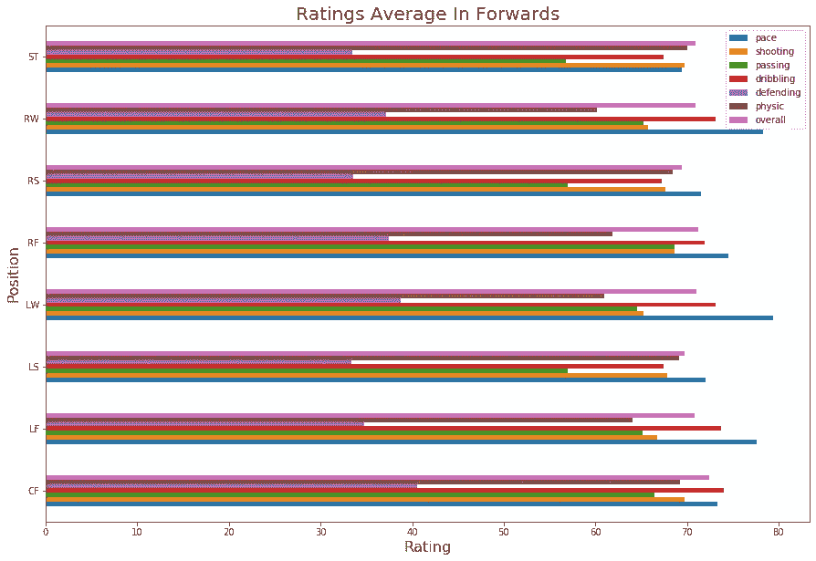

# FIFA 21 球员整体预测

> 原文：<https://towardsdatascience.com/fifa-21-players-overall-prediction-3b6171f90a9b?source=collection_archive---------26----------------------->

## **获得想法和数据**

在分析了 Kaggle 的一些数据集并浏览了社区的数据集后，我发现了一个真正引起我注意的数据集:

 [## FIFA 20 完整球员数据集

### 18k+球员，100+从国际足联最新版本中提取的属性

www.kaggle.com](https://www.kaggle.com/stefanoleone992/fifa-20-complete-player-dataset) 

我不是国际足联的超级粉丝，但我喜欢和我最好的朋友一起玩，只是为了好玩，这让我思考..*“我能用这个做什么？”*。尽管没有任何人工智能方面的经验，(但对这个主题很感兴趣)，我还是决定用它来做我的第一个人工智能项目。

> 然后，另一个问题出现了……*“但是，我想把它应用到哪里呢？”*。

有了从 FIFA 20 一直到 FIFA 15 的数据，我开始看 FIFA 19 的数据(主要是因为它是我玩得最多的一个)，直到我发现自己看到了球员的整体，然后…它点击了。

> *“也许如果训练一个具有 FIFA 19 中球员的一些特征的模型，包括整体，为了预测 FIFA 20 中相同球员的整体价值，我可以稍后使用该模型来估计 FIFA 21 中球员的整体价值！”*。

[来源](https://www.fifplay.com/img/public/fifa-21-and-beyond.jpg)

# 使用的库

# 提取重要数据

每个球员的数据超过 100 列，所以我必须选择我认为重要的。

对于 FIFA 20 的数据，我需要的唯一一栏是“整体”一栏，但我决定提取与 FIFA 19 相同的一栏，以防我以后想分析它的数据。

看起来合乎逻辑，守门员和其他球员相比有不同的统计数据，所以我有两个选择，创建一个模型来训练守门员的数据或者丢弃它们。正如你在下面看到的，我选择了第二个选项，因为从我的角度来看，它不值得额外的工作。

然后，我需要添加 FIFA 20 的整体价值。

最后，我开始考虑球员的位置，这有两个特点，他们踢的位置和他们可以踢的多个位置，所以我只使用第一个。在第一个职位中，共有 28 个职位，因此我决定创建另一个职位，可以是以下五个职位之一:

*   保留
*   代替者
*   拥护者
*   中场队员
*   向前

# 分析数据

所以，我想看的第一件事是 7 个主要特征(**速度，投篮，传球，运球，防守，身体和整体**)根据每个**位置**的变化。

> 我之前创建的 5 个位置

> 前沿阵地内的每个阵地

> 之后，我分析了每个位置的整体平均值，并预测前锋、中场和后卫应该具有相同的平均值，但替补应该更低，替补甚至更低。

> 每个位置的球员百分比

> 按位置划分的平均玩家成本(欧元)

> 总价值分布

# 准备训练和测试数据

在分析了我正在处理的数据之后，一切都准备好了，分割训练数据和测试数据，并使用*标准缩放器*对其进行预处理，该缩放器移除平均值(72.447)并将其缩放至单位方差。

我最终训练了大约 11000 名球员，测试了 1100 名球员(比最初的 18000 多名球员少了一些，因为守门员和不在 FIFA 20 的球员被排除在外)。

# 训练模型并对预测进行分类

对于神经网络，对于该数据最好的一个是多层感知器分类器，该模型使用随机梯度下降来优化对数损失函数，并且迭代地训练，因为在每个时间步长，计算损失函数相对于模型参数的偏导数来更新参数。

它还可以将正则化项添加到损失函数中，从而缩小模型参数以防止过拟合。

这个实现处理表示为浮点值的密集 numpy 数组的数据，这是预处理数据的又一个原因。

它的平均准确度分数是 25%(它从 290/1157 名玩家那里得到准确的整体值)，这一点也不差，因为平均绝对误差(1.67)非常低。

> 按总值分组的平均绝对误差:

# FIFA 21 球员整体预测

> 作为这篇文章的结尾，我将展示对 FIFA 21 中球员整体表现的 5 个预测

