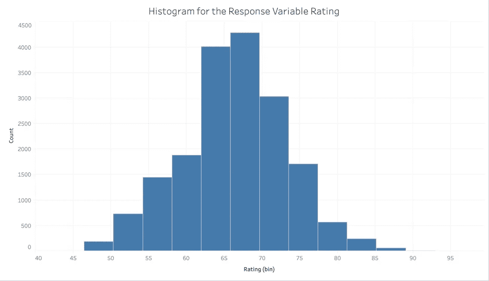
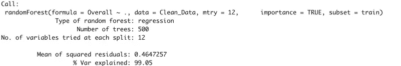
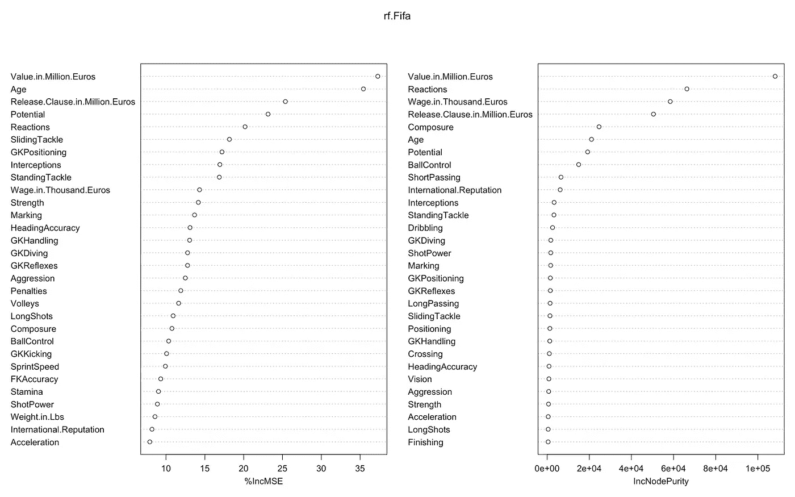
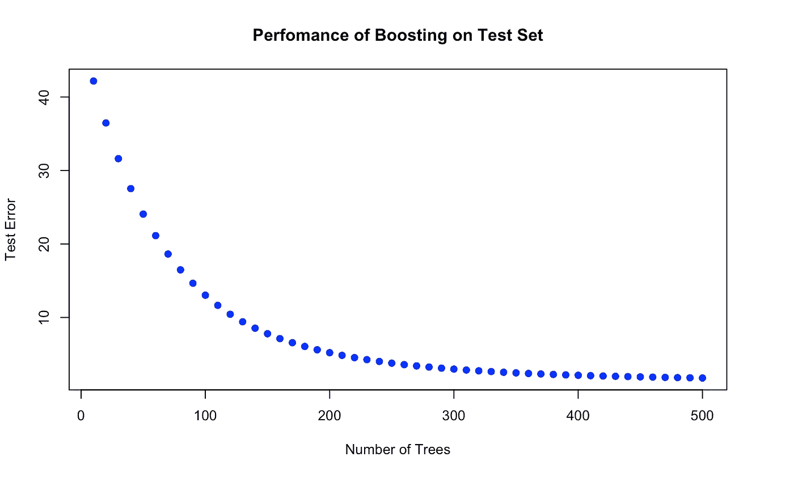
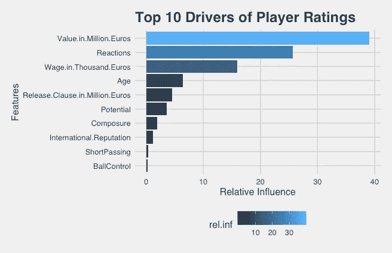

# 国际足联:c 罗 Vs 梅西

> 原文：<https://towardsdatascience.com/fifa-ronaldo-vs-messi-3c68a8604306?source=collection_archive---------51----------------------->

## 是什么决定了一个玩家的评分？

[JESHOOTS.COM](https://unsplash.com/@jeshoots?utm_source=medium&utm_medium=referral)在 [Unsplash](https://unsplash.com?utm_source=medium&utm_medium=referral) 上拍照

F IFA 19 是由艺电公司(EA)开发的特许足球模拟视频游戏，作为艺电公司国际足联系列的一部分。作为一个长期的游戏玩家，在过去的 12 年里，一直有一个挥之不去的问题，即游戏专营权如何决定游戏中特定玩家的评级。除此之外，游戏界一直在无休止地争论为什么罗纳尔多的评级高于梅西，反之亦然。为了结束这场辩论，让我们建立一个机器学习模型来预测玩家的评级，并确定背后最重要的玩家属性。

*等级是玩家的一种属性，表示他在游戏中的表现，等级范围为 0 到 100，后者为最佳。*

## 数据集:

该数据集可在 [Kaggle](https://www.kaggle.com/karangadiya/fifa19) 中获得，包含数据库中跨美洲、欧洲、亚洲和非洲等各大洲注册的 18，207 名真实生活玩家的详细属性，以及玩家的 90 种不同属性。

## 变量/玩家属性:

数据集中的变量可以大致分为以下几类

*   **球员详情**——姓名、身高、体重、年龄、国籍、俱乐部、球员价值、解约条款
*   **体能** —力量、弹跳、耐力和侵略性
*   **传球**——短传、视野、传中、长传、控球
*   防守——拦截、盯人和拦截
*   **射门**——射门力量、截击、点球和定位
*   运球——敏捷、平衡、沉着、运球和反应

上述不包括玩家详细信息的类别是从 0 到 *100 的数字。例如，如果一名球员(比如梅西)的运球得分为 98 分，铲球得分为 56 分，这表明该球员是一名进攻球员，而不是一名优秀的防守球员。*

## 正态性检验:

建立模型的第一步是通过图表(直方图)和统计方法对响应变量进行正态性检验。偏斜度测量结果是 0.084，接近于零。根据一般经验，如果偏斜度在-0.5 到+ 0.5 之间，则分布近似对称。

玩家等级直方图

上面的柱状图代表了玩家的数量(在 y 轴上)和玩家在 x 轴上的等级。基于响应变量的直方图和偏斜度测量，可以看出响应变量是正态分布的。

## 随机森林回归:

随机森林是一种集成机器学习技术，能够使用多个决策树和一种称为 **bagging 的统计技术来执行回归和分类任务。**

对于该模型，数据集以 80:20 的比例分为测试和训练，mtry 的值(*每次分割尝试的变量数*)设置为 12。

构建的树的数量被设置为默认的*(即 500)* ，并且该模型在预测响应变量(即特定玩家的评级)时具有 99.05%的准确度

**

*现在让我们画出变量重要性的度量，并确定变量的重要性*

**

*可变重要性图—随机森林*

## *解读剧情:*

*上图表示由于变量被置换，预测的 MSE 和节点杂质的百分比增加(数字越大越重要)。根据左侧的 MSE 图，三个最重要的变量如下*

*   ***球员价值**:球员在转会市场上的成本*
*   ***年龄**:玩家的年龄(玩家的平均等级倾向于增加，直到 30 岁，在 34 岁左右开始不可避免的下降之前，它会稳定几年。(即，随着年龄的增长，运动员在球场上的表现往往会下降)*
*   ***解约条款**:其他俱乐部可以获得该球员服务的预定价格。*

## *梯度提升:*

*梯度推进是一种用于回归和分类问题的机器学习技术，其产生弱预测模型集合形式的预测模型。梯度提升本质上是以迭代的方式将弱学习者组合成单个强学习者。随着每一个弱学习者的加入，一个新的模型被拟合以提供对响应变量的更精确的估计。*

*现在让我们看看梯度推进模型在确定重要变量方面如何与随机森林进行比较。*

*梯度推进模型*

*上面的模型是一个梯度增强模型，它生成了 *500 棵树*，其收缩参数为*λ= 0.01*，这是一种**学习率**。下一个参数是交互深度 *d* ，这是我们想要做的总分割。所以这里的每棵树都是一棵只有 4 个裂口的小树。*

*现在让我们计算作为树的数量的函数的测试误差。可以看出，随着树的数量增加，均方误差减小。*

**

*模型的概要给出了一个**特征重要性图**。在下面的列表中，顶部的变量是最重要的变量，最后是最不重要的变量。*

**

*十大功能重要性图*

*根据梯度推进模型，除了球员价值，最重要的特征是反应和工资*

*   ***反应** —反应衡量玩家对周围发生的情况做出反应的速度。*
*   ***工资**——按周支付给玩家的周薪*

> *基于这两个模型的最重要的特征是球员在转会市场上的成本。除此之外，排名前五的最常见的特征是——年龄、免责条款和反应，排名不分先后。*

*在列表中看到多变的*反应是相当令人惊讶的。需要注意的是，反应是唯一不受外部因素影响的玩家属性**

## *结论:*

*现在，至少我们知道电子艺界(EA)不会随机分配玩家的评级。就***c 罗 Vs 梅西*** 的辩论而言，我们都可以认同，比赛的品牌大使往往会获得更高的评分。*

*除了我们之前探索的基于树的建模方法之外，广义线性模型也能够阐明玩家评级，因为这些变量之间存在强线性相关性*

*感谢阅读！！*

*我们在 [LinkedIn](http://www.linkedin.com/in/vishnu-deepak) 上连线|在 [GitHub](https://github.com/Deepak2094/Fifa-codes/blob/master/FIFA_RandomForest.R) 上找代码*