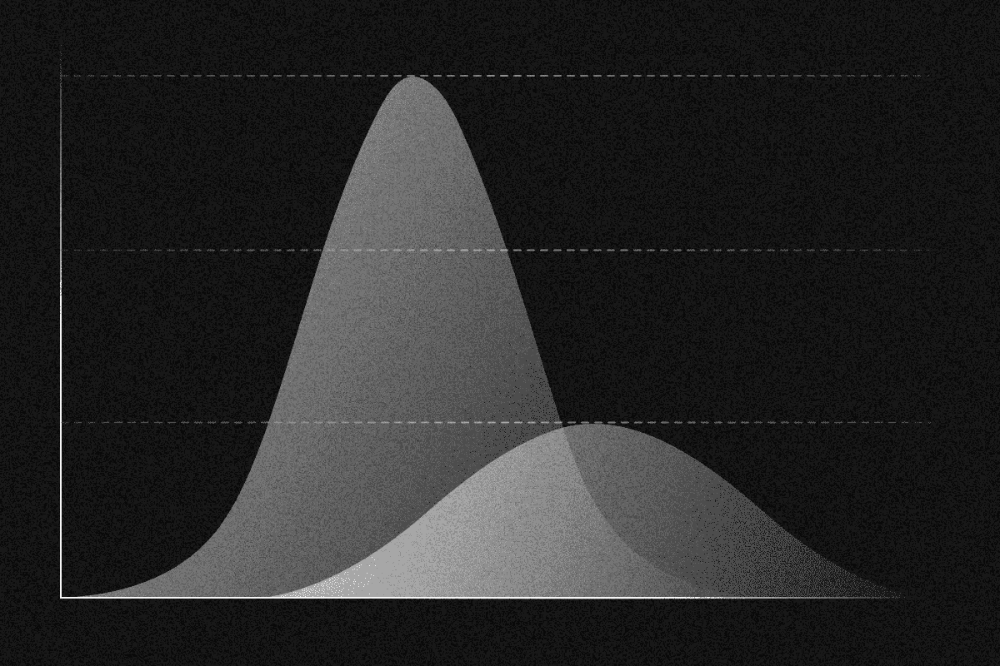
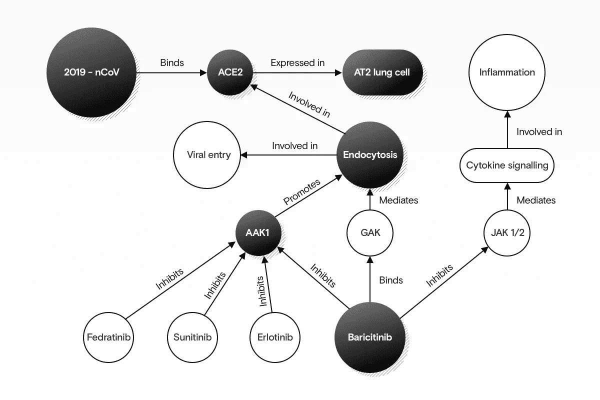
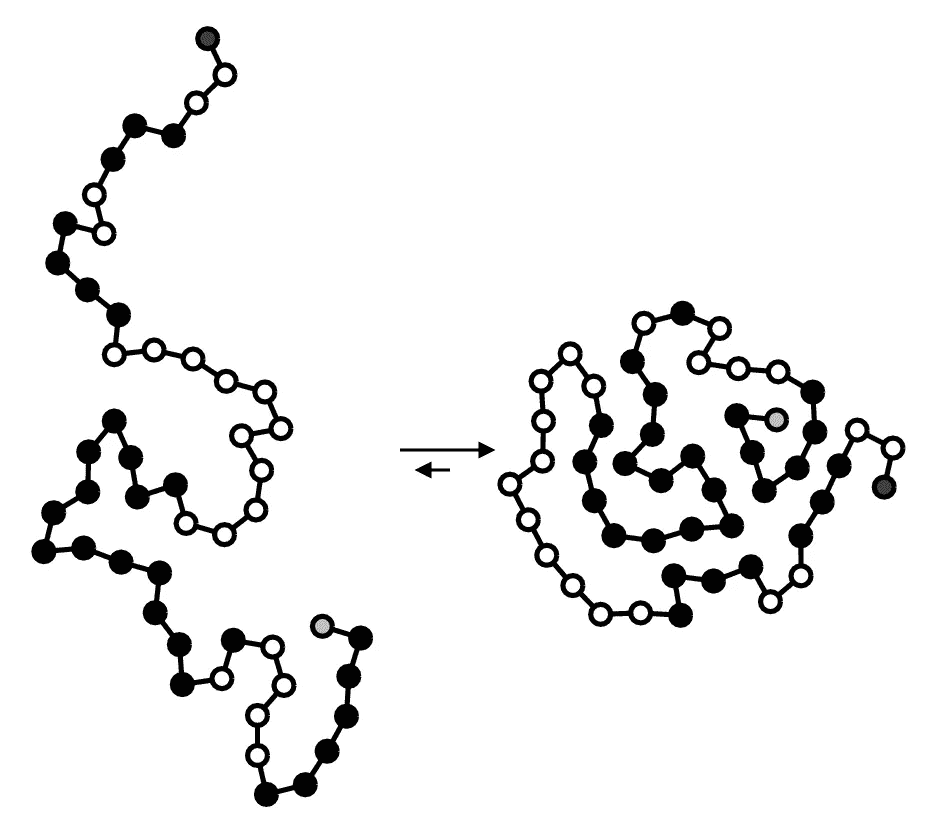
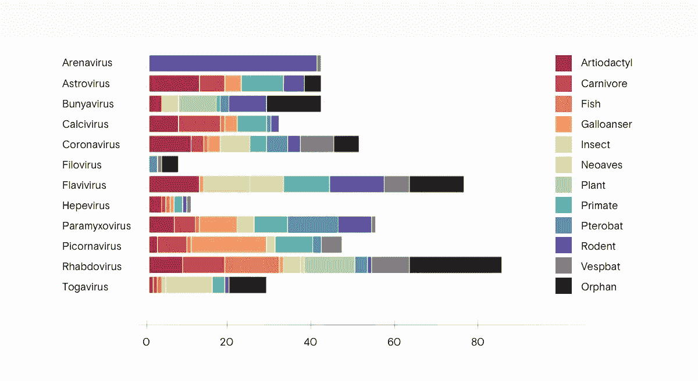

# 如何用机器学习对抗新冠肺炎

> 原文：<https://towardsdatascience.com/fight-covid-19-with-machine-learning-1d1106192d84?source=collection_archive---------6----------------------->

## 机器学习帮助我们对抗疫情病毒的 9 种方法

病毒性传染病是一个严重的威胁。新冠肺炎不是第一个，也不会是最后一个。

但是，前所未有的是，我们正在收集和分享我们对该病毒的了解。世界各地的数百个研究团队正在共同努力收集数据并开发解决方案。

我们希望让人们了解他们的工作，并展示机器学习如何帮助我们:

*   确定谁最危险，
*   诊断病人，
*   更快地开发药物，
*   预测疾病的传播，
*   更好地理解病毒，
*   绘制病毒来源图，以及
*   预测下一个疫情。

让我们推动研究来抗击这场疫情——并为下一场做好更充分的准备。

# 1.确定谁最有可能感染新冠肺炎病毒

事实证明，机器学习在预测许多领域的风险方面具有不可估量的价值。

具体到医疗风险，机器学习在三个关键方面具有潜在的兴趣。

*   **感染风险**:特定个人或群体感染新冠肺炎病毒的风险有多大？
*   **严重风险**:特定个人或群体出现严重新冠肺炎症状或需要住院或重症监护的并发症的风险有多大？
*   **结果风险**:特定治疗对某个个体或群体无效的风险有多大，他们死亡的可能性有多大？

机器学习可能有助于预测所有三种风险。虽然现在进行和发表大量针对新冠肺炎的机器学习研究还为时过早，但早期的实验是有希望的。此外，我们可以看看机器学习如何用于相关领域，并想象它如何有助于新冠肺炎的风险预测。

# 1.1 预测感染风险

早期统计显示，决定个人感染新冠肺炎病毒可能性的重要风险因素包括:

*   年龄，
*   先前存在的情况，
*   一般卫生习惯，
*   社交习惯，
*   人类互动的次数，
*   互动的频率，
*   位置和气候，
*   社会经济地位。

当前疫情的风险研究仍处于早期阶段。例如，DeCapprio 等人已经使用机器学习[为新冠肺炎建立了一个初始脆弱性指数](https://arxiv.org/pdf/2003.07347.pdf)。预防措施，如戴口罩，洗手，和社会距离都可能影响整体风险。随着更多更好的数据变得可用，以及[当前正在进行的](https://nltimes.nl/2020/03/30/study-launched-risk-factors-covid-19)研究产生结果，我们可能会看到**机器学习在预测感染风险方面的更多实际应用**。

# 1.2 预测谁有发展成严重病例的风险

一旦一个人或群体被感染，我们需要**预测那个人或群体**出现并发症或需要高级医疗护理**的风险**。许多人只出现轻微症状，而其他人则出现严重的肺部疾病或急性呼吸窘迫综合征(ARDS)，这可能是致命的。不可能治疗和密切监测每个有轻微症状的人，但如果可能出现更严重的症状，最好尽早开始治疗。

在《计算机、材料和康体佳》杂志上，研究人员[发表了一篇文章](https://www.techscience.com/cmc/v63n1/38464)，表明机器学习可以通过观察最初的症状来预测患者发生急性呼吸窘迫综合征的可能性以及死亡风险。研究人员承认这项研究的局限性:

> *“这项研究的一个明显限制是数据集的大小；53 名患者，有些数据不完整，严重程度有限。”*

但这项研究为一旦有更多数据可用时应用机器学习奠定了重要基础。

# 1.3 预测治疗结果

严重性预测的延伸是**预测治疗结果**，这通常是预测生死的字面意义。显然，在给定某些症状的情况下，知道患者存活的可能性有多大是有用的。但是除此之外，重要的是要记住不是所有的病人都以同样的方式治疗。给定一个特定的患者或群体，一种特定的治疗可能有多有效？

如果我们能预测特定治疗方法的结果，那么医生就能更有效地治疗病人。使用机器学习来个性化治疗计划[并不局限于新冠肺炎](https://www.ncbi.nlm.nih.gov/pubmed/31209850)，机器学习之前已经被用于[预测癫痫患者的治疗结果](https://www.sciencedirect.com/science/article/abs/pii/S105381191500484X)，这只是一个例子。研究人员还利用机器学习来预测对癌症免疫疗法的反应。

由于新冠肺炎的治疗方案仍在不断发展，我们可能还需要一段时间才能看到机器学习应用于预测特定治疗的结果。但是结果**预测仍然是风险评估**的重要组成部分，与我们上面讨论的感染和严重性预测密切相关。

# 2.筛查患者和诊断新冠肺炎

当一种新的疫情病毒来袭时，诊断个体是具有挑战性的。大规模的测试是困难的，测试可能是昂贵的，尤其是在开始阶段。任何有新冠肺炎症状的人都可能非常担心他们已经感染了这种疾病，即使同样的症状也预示着许多其他潜在的较轻疾病。

与其从每个病人身上提取医学样本，然后等待缓慢而昂贵的实验室报告回来，**一种更简单、更快速、更便宜的测试**(即使不太准确)将有助于在更大范围内收集数据。这些数据可用于进一步的研究，以及对患者进行**筛查和分类**。

当谈到使用机器学习来帮助诊断新冠肺炎时，有前途的研究领域包括:

*   使用面部扫描来识别症状，例如病人是否发烧，
*   使用智能手表等可穿戴技术来寻找患者静息心率的信号模式，
*   使用机器学习驱动的聊天机器人根据自我报告的症状筛选患者。

# 2.1 使用面部扫描筛查患者

虽然没有多少确切的细节，但佛罗里达州[的一家医院](https://www.wsj.com/articles/hospitals-tap-ai-to-help-manage-coronavirus-outbreak-11584696601)是首批利用机器学习帮助应对新冠肺炎而引起关注的医院之一。进入医院后，患者会接受自动面部扫描，该扫描使用机器学习来检测他们是否发烧。

就其本身而言，这些数据可能不是非常有帮助，但是当处理数百甚至数千名患者时，每一条数据都非常重要，有助于有效地对他们进行分类。

# 2.2 使用可穿戴技术筛查静息心率

苹果[在机器学习的帮助下使用苹果手表检测常见的心脏问题，成为头条新闻](https://www.businessinsider.com/apple-watch-saved-mans-life-detected-heart-problems-2019-11)。但是，静息心率的模式也可以指示更多具体的问题，一些使用 Fitbit 数据的初步研究表明，静息心率的变化可以帮助识别“ILI”或“流感样疾病”患者。显然，这离具体诊断新冠肺炎还有很长的路要走，但这项研究还很年轻。

同样，[来自睡眠和活动跟踪环 OURA](https://ouraring.com/ucsf-tempredict-study) 的研究使用体温、心率和呼吸频率来试图“识别新冠肺炎的发病、发展和恢复模式”

这两项研究仍在进行中，所以还没有结果。

# 2.3 使用聊天机器人进行筛查和诊断

如果医生花太多时间回答忧心忡忡的病人的基本问题，他们就没有太多时间专注于治疗更需要的病人。因此，许多国家开发了“自我分流”系统，让患者完成一份关于其症状和病史的问卷，然后被建议是呆在家里、打电话给医生还是去医院。

许多公司，[包括微软](https://www.businessinsider.com/cdc-microsoft-coronavirus-chatbot-feeling-sick-should-i-go-hospital-2020-3)，已经发布了聊天机器人，帮助人们根据他们的具体症状，自我确定他们的最佳行动方案。

基于这些例子，我们可以看到，机器学习目前更适合帮助筛选新冠肺炎患者，而不是可靠地诊断他们。进行真正的诊断很有挑战性，部分原因是任何诊断算法都必须对突变具有鲁棒性。帕迪斯·萨贝蒂在 ted 演讲中讨论了一些相关的挑战[:](https://www.ted.com/talks/pardis_sabeti_how_we_ll_fight_the_next_deadly_virus/transcript)

> 我们还可以看到，当病毒在人类之间传播时，它也在变异。这些突变中的每一个都非常重要，因为我们正在使用的诊断、疫苗和疗法都是基于基因组序列——从根本上说，这就是驱动它的原因。”

如果我们为一种特定的病毒做了所有这些工作，然后该病毒发生了变异，那么大量的工作就有可能被浪费掉，必须重做。如果我们真的找到了可以快速准确检测新冠肺炎的“圣杯”机器学习算法，它将需要足够强大，以处理突变。

# 3.加速药物开发

为了应对新的疫情病毒，关键是要尽快研发出疫苗、可靠的诊断方法和治疗药物。目前的方法涉及大量的试验和错误，这需要时间。即使分离出一种可行的候选疫苗也需要几个月的时间。

机器学习可以在不牺牲质量控制的情况下显著加快这一过程。当研究人员试图寻找埃博拉病毒的小分子抑制剂时，他们[发现](https://www.ncbi.nlm.nih.gov/pmc/articles/PMC4706063.2/)用病毒假型进入分析和埃博拉病毒复制分析数据训练贝叶斯 ML 模型有助于加快评分过程。(评分包括根据每个分子有多大可能有帮助来给它赋值。)这个加速的过程很快确定了三个潜在的测试分子。

同样，[研究 H7N9](https://www.ncbi.nlm.nih.gov/pmc/articles/PMC5669956/) 的研究人员发现，人工智能辅助的虚拟筛查和评分大大提高了评分的准确性。使用随机森林算法(一种由大量决策树组成的分类算法)对 H7N9 提供了最佳结果。

在新冠肺炎疫情这样的情况下，病毒正在迅速传播，更快地获得更准确的分数对于加快药物开发至关重要。

# 4.识别有效的现有药物

公司花费大量的时间和金钱让新药获得批准。他们需要尽可能确定这些药物不会有意想不到的有害副作用。

这个过程保护了我们，但在疫情期间，当我们需要更快的反应时，它也减慢了我们的速度。

一种选择是**重新利用已经被测试并用于治疗其他疾病的药物**。

但是有成千上万种候选药物，我们没有时间全部测试——那么我们如何找到正确的呢？

机器学习可以帮助我们更快地对候选药物进行优先排序，方法是自动:

1.  **构建**知识图表和
2.  **预测药物和病毒蛋白之间的相互作用**。

# 4.1 构建生物医学知识图表

我们所知道的关于药物、病毒及其机制的很多东西都是通过大量的研究文章传播的。我们可以使用自然语言处理(应用于文本的机器学习)来阅读和解释大量的科学文章并[构建](https://arxiv.org/abs/1907.01417) **生物医学知识图**，这些知识图是有意义地连接不同实体的结构化网络，例如药物和蛋白质)。

具体来说，[科学家](https://www.thelancet.com/journals/lancet/article/PIIS0140-6736(20)30304-4/fulltext)定制了一个 ML 构建的知识图，并将其应用于新冠肺炎，以寻找该病毒和潜在候选药物 Baricitinib 之间的联系。

新冠肺炎很可能利用 ACE2 蛋白质进入我们的肺细胞。这个过程——被称为**内吞**——由 **AAK1** (另一种蛋白质)调节。Baricitinib 抑制 AAK1，也可能阻止新冠肺炎进入我们的肺细胞。

# 4.2 预测药物-靶标相互作用

科学家们还利用机器学习通过预测病毒蛋白质和现有药物之间的药物靶相互作用来识别候选药物。

这些相互作用是高度复杂的，因此研究人员大多选择**神经网络**来识别它们( [1](https://www.biorxiv.org/content/10.1101/2020.01.31.929547v1.full.pdf) 、 [2](https://arxiv.org/pdf/2003.00728.pdf) 、 [3](https://www.researchgate.net/publication/339044319_Deep_Learning_Based_Drug_Screening_for_Novel_Coronavirus_2019-nCov) )。这些网络在大型 DTI 数据库上接受训练，以生成最有可能结合并抑制病毒蛋白质的特定候选药物列表。

值得注意的是，一个研究小组[开发了一个端到端的框架](https://www.researchgate.net/publication/330075138_NeoDTI_neural_integration_of_neighbor_information_from_a_heterogeneous_network_for_discovering_new_drug-target_interactions)，用于使用神经网络处理知识图，例如用于发现 Baricitinib 的知识图。然后，训练该模型来解释知识图，并可用于准确预测 DTI。

利用这种图-拓扑学习模型，**研究人员已经找到了一种有希望的候选药物，目前正在** [**进行临床试验**](https://www.researchgate.net/publication/339910608_A_data-driven_drug_repositioning_framework_discovered_a_potential_therapeutic_agent_targeting_COVID-19/link/5e71d69992851c93e0aa4d8f/download) 。

# 5.利用社交网络预测传染病的传播

在疫情中，当我们试图制定策略来积极应对它时，**我们首先需要知道我们在哪里。我们需要回答诸如“有多少人被感染了？”以及“这些人在哪里？”不幸的是，流行病——尤其是由病毒引起的流行病——很难追踪，而且成本高昂。**

通常，政府与卫生系统一起回答这些问题。例如，负责机构每天(或每周)统计并公布新诊断出的患病人数。但这里的一个问题是，在感染疾病、出现最初症状和检测呈阳性之间可能有很大的差距(在时间和空间上)。

幸运的是，我们生活在一个数字世界。一个开始出现症状的农民可能住在一个小镇上，附近没有医院能够进行测试。但这位农民可能仍然能够访问社交网络，并立即留下关于他的健康和疾病传播的暗示——**暗示，只有机器学习模型才能学会大规模处理**。

通过解释社交媒体上公共互动的内容，机器学习模型评估了新型病毒感染的可能性。该模型可能无法在个体层面上对人们进行分类，但它可以使用所有这些数据来 [**估计**](https://journals.plos.org/plosone/article/file?type=printable&id=10.1371/journal.pone.0019467) **疫情的实时传播**并 [**预测**](https://ieeexplore.ieee.org/abstract/document/6424743) **未来几周的传播**。

在快速发展的疫情，这些信息在决策过程中的价值怎么强调都不为过。

# 6.通过蛋白质了解病毒

要了解像新冠肺炎这样的病毒，就要了解它的蛋白质——我们如何生病完全取决于这些蛋白质如何与我们的身体相互作用。但是解释它们并不容易。

以下用例提供了机器学习如何通过分析病毒的蛋白质来帮助我们提高对病毒的理解的例子。

# 6.1 预测病毒-宿主蛋白质-蛋白质相互作用

病毒和人体细胞之间的蛋白质相互作用(PPIs)决定了我们身体对病原体的反应。病毒-宿主相互作用组是病毒和宿主蛋白质之间相互作用的完整图谱。这个相互作用组可以被视为病毒如何感染我们的身体和在我们的细胞中复制的蓝图。

许多研究小组正致力于减少大量可能的相互作用。用蛋白质数据训练的机器学习模型已被成功用于预测最有可能的 HIV 和 H1N1 病毒-宿主 PPI—**极大地减少了绘制整个病毒-宿主相互作用组**所需的工作。

了解病毒如何与我们的身体相互作用，对于新疗法的开发和新药的发现极其重要。

# 6.2 预测蛋白质折叠

展开的 v.s .折叠的 protei

我们知道蛋白质的结构与其功能相关联——一旦了解了这种结构，我们就可以猜测它在细胞中的作用，科学家可以开发出利用蛋白质独特形状的药物。

但是定义一个蛋白质的三维结构并不是一件容易的事情——单个蛋白质可能的结构范围是天文数字:一个由 100 个氨基酸组成的蛋白质有 3100 种可能的构象。

已知的蛋白质序列超过 10 亿条，但我们只能识别其中不到 0.1%的结构。

利用人工神经网络，研究小组**成功构建了能够** [**预测**](https://www.nature.com/articles/s41586-019-1923-7) **蛋白质结构**的模型，最终使得利用计算方法识别蛋白质结构变得可行。

# 7.找出如何攻击病毒

表位是在病毒外部发现的氨基酸簇。抗体与表位结合，这是我们的免疫系统识别和消除病毒的方式。因此，当我们开发疫苗时，发现和分类表位对于确定分子的哪个部分是至关重要的。

与含有灭活病原体的传统疫苗相比，**基于表位的疫苗更安全** —它们预防疾病，没有潜在的致命副作用风险。

定位正确的表位可能是一个耗时、昂贵的过程。有了新的疫情，如新冠肺炎，**更快地定位表位加快了开发有效疫苗的进程**。

这就是机器学习可以发挥作用的地方。支持向量机(SVM)、隐马尔可夫模型和人工神经网络(特别是深度学习)都被证明在识别表位方面比人类研究人员更快、更准确。

# 8.识别自然世界中的宿主

人畜共患疫情——就像我们正在经历的新型冠状病毒——是由一种传染病引起的疫情，这种传染病起源于不同的物种(如蝙蝠),并传播给人类。埃博拉病毒、艾滋病毒或新冠肺炎病毒等病毒可以在自然界中不为人知地存活很长时间，等待下一次变异和下一次感染我们的机会。它们隐藏在动物体内——称为宿主——不受疾病影响。

了解这些宿主是谁对于抗击疫情至关重要——一旦我们发现了他们，我们就可以制定策略来控制疾病的传播(**,防止更多的疾病爆发(**。****

********

****寻找储存宿主的传统方法可能需要数年的研究，而且仍然有许多孤儿病毒没有与动物宿主匹配。****

****那么我们能做什么呢？****

****由于技术的巨大进步，全基因组测序(WGS，确定生物体完整 DNA 序列的过程)已经变得便宜、快捷。研究表明，机器学习模型可以使用基因组测序数据和专家知识来确定最有可能成为疾病宿主的物种。****

****通过观察一小部分物种，我们可以大大加快在野外找到这些病原体的过程。****

# ****9.预测新流行病的风险****

****准确预测一种流感是否会发生人畜共患病的飞跃(从一个物种跳到另一个物种)可以帮助医生和医疗专业人员预测潜在的大流行并做好相应的准备。****

****例如，甲型流感主要存在于鸟类中，但它有可能传染给人类宿主。研究甲型流感的研究人员从数据库中分离出 67940 个蛋白质序列。他们对这些序列进行了过滤，这样数据集就只包括那些具有 11 种流感蛋白完整序列的流感毒株。****

****有了机器学习，研究人员就能够以很高的准确度识别出潜在的人畜共患病流感毒株。需要做更多的工作来建立直接传播的预测模型，但知道哪些流感毒株可能会发生飞跃是为下一次疫情做准备的重要的第一步。****

# ****结论****

****机器学习是对抗当前疫情的重要工具。如果我们借此机会收集数据，汇集我们的知识，结合我们的技能，我们可以拯救许多生命——无论是现在还是将来。****

*******编者按:*** [*走向数据科学*](http://towardsdatascience.com/) *是一份以数据科学和机器学习研究为主的中型刊物。我们不是健康专家或流行病学家，本文的观点不应被解释为专业建议。想了解更多关于疫情冠状病毒的信息，可以点击* [*这里*](https://www.who.int/emergencies/diseases/novel-coronavirus-2019/situation-reports) *。*****

*******作者注:*** *如果您迫切需要支持来开发一个医学机器学习应用程序(例如，朝着 FDA 批准的方向努力)，我们已经建立了一个经验丰富的 ML 应急响应团队:* [*联系我们*](https://www.datarevenue.com/en-contact) *。*****