# 用 fast.ai 和 Deepnote 打击旧金山犯罪

> 原文：<https://towardsdatascience.com/fight-san-francisco-crime-with-fast-ai-and-deepnote-6db2b96d2a83?source=collection_archive---------38----------------------->

## 有了正确的 ML 框架和笔记本平台，您就在快车道上了

[ev](https://unsplash.com/@ev?utm_source=unsplash&utm_medium=referral&utm_content=creditCopyText) 在 [Unsplash](https://unsplash.com/s/photos/police?utm_source=unsplash&utm_medium=referral&utm_content=creditCopyText) 上的照片

# 介绍

当大多数人描绘旧金山和湾区时，各种积极的含义如金门大桥、唐人街和软件公司浮现在脑海中。然而，像任何大都市一样，其密集的人口和贫富差距导致了大量犯罪的环境。多亏了诸如 [SF OpenData](https://datasf.org/opendata/) 和 Kaggle 的[旧金山犯罪分类竞赛](https://www.kaggle.com/c/sf-crime/overview)等举措，从所有这些犯罪中收集的数据可以被用来更好地处理和应对它。

特别是，本文将重点讨论 Deepnote 的 Jupyter 支持的笔记本环境和 fast.ai 对机器学习数据准备的有效封装如何大大提高数据科学家的效率。

# Deepnote 设置和集成

在为一个项目选择笔记本工具时，提供对我的计算环境的完全控制给了 Deepnote 很大的帮助。所谓完整，我的意思是有权按照我的意愿来定义`Dockerfile`。这为我提供了许多选择，比如安装 python 包装库的 C/C++依赖项，这些包装库不会在它们的`setuptools`进程中自动处理安装。当然，在这个特殊的问题上还有其他的方法。然而，访问他们环境的容器定义可以让您解决遇到的大多数问题。

你可能已经注意到在截图的项目初始化部分有一个额外的`init.ipynb`笔记本。每当底层机器启动时，这个笔记本就会被调用。在这个笔记本中，你可以放置任何你希望在主笔记本启动时“刚刚完成”的繁琐或乏味的逻辑。

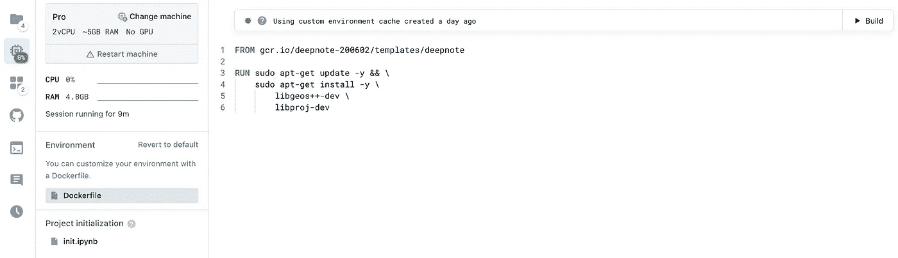

Deepnote 中一个 Dockerfile 的直接配置截图[图片由作者提供]

我还设置了两个集成，它们已经预加载用于主笔记本:一个 S3 桶和一个环境变量。虽然挑战的数据可以在 Kaggle 上免费获得[，但是我将数据复制到了一个 S3 桶中，并创建了一个对其具有只读访问权限的 IAM 角色。这样，数据在启动时可供笔记本电脑使用，并且只读凭据不会产生任何安全问题。](https://www.kaggle.com/c/sf-crime/data)

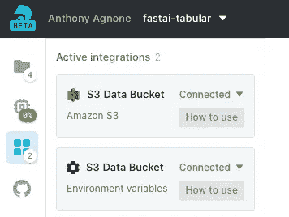

Deepnote 笔记本中活动集成的截图[图片由作者提供]

通过连接 S3 存储桶作为一个集成，笔记本电脑使数据在`/datasets/s3-data-bucket`时对环境可用！不需要`boto3`或文件同步。

此外，我创建了一个环境变量来保存 S3 存储桶名称以供参考。作为一个“集成”的环境变量，我在这里最喜欢的一点是你的变量设置得很整洁，随时可以使用，没有任何让人眼馋的笔记本式的单元格给`os.environ`分配任务。记住:笔记本的读者可能不关心最后执行的每一个命令，因此代码越少越好。

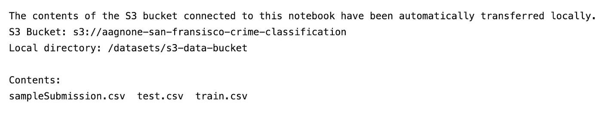

上面显示的代码输出[图片由作者提供]

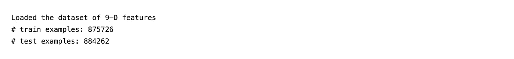

上面显示的代码输出[图片由作者提供]

# 数据模式

好吧，让我们好好看看我们对这种犯罪进行分类的工具。

*   日期—犯罪事件的时间戳
*   类别—犯罪事件的类别(仅在 train.csv 中)。这是你要预测的目标变量。
*   描述—犯罪事件的详细描述(仅在 train.csv 中)
*   星期——一周中的某一天
*   PdDistrict —警察局辖区的名称
*   解决方案—犯罪事件是如何解决的(仅在 train.csv 中)
*   地址—犯罪事件的大致街道地址
*   x-经度
*   y 纬度

还不错！时间戳和位置通常对预测性能有很大帮助。

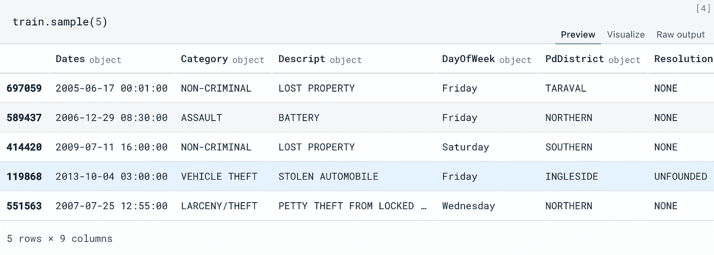

特征工程前数据集的快速样本[图片由作者提供]

# 偏见和简单化

为了使模型训练的第一次迭代保持简短，让我们对任务进行以下简化:

1)拆下`DayOfWeek`柱。这种改变没有任何原因，只是因为`fast.ai`提供了一个完整的功能，将一个日期-时间特性转换成*几个*这样的特性。这些特征中的一个确实是星期几。我们将在本文后面看到更多这方面的内容。

2)移除`Resolution`柱，该功能仅在培训期间可用。有许多方法可以使用这样的特性，但是让我们在这个建模迭代中放弃它们。

3)拆下`Descript`柱。这是另一个仅在培训期间可用的功能，它在更精细的级别上指定了犯罪的类别。我们将避免使用这一点，如在(2)中。

4)目标“盗窃/偷窃”类别的二进制分类。我们这样做主要是为了方便笔记本中的模型性能分析。比起它们的多类对应物，更多的视觉技术可以被平凡地应用于二分类技术。我鼓励每个人从这个笔记本建立一个多类分类器。

在文章的最后，我将提供被省略的特性的使用建议。

输出:1 个目标类别出现在 19.91%的样本中。

# 新增功能

## 街区上的地址

数据中的许多道路都有几个在`Address`特征中明确指出的区块。因此，应该存在有益的信息，以帮助在此基础上对犯罪类别进行分类。

## 十字路口的地址

与阻塞指示类似，`Address`功能指定犯罪何时发生在两条道路的交叉口。自然，十字路口汇集了不同的人流和车流。按理说，这种流动冲突导致某些类型的犯罪多于其他类型。

## 道路出现频率

除了知道*哪条*道路上发生了犯罪，了解这些道路在数据集中出现的*频率*也有助于深入了解犯罪类别。为了协调道路交叉口的道路频率，我们采用单个道路概率的平均值。此外，为了增加数值稳定性，我们将使用对数概率作为最终特征。

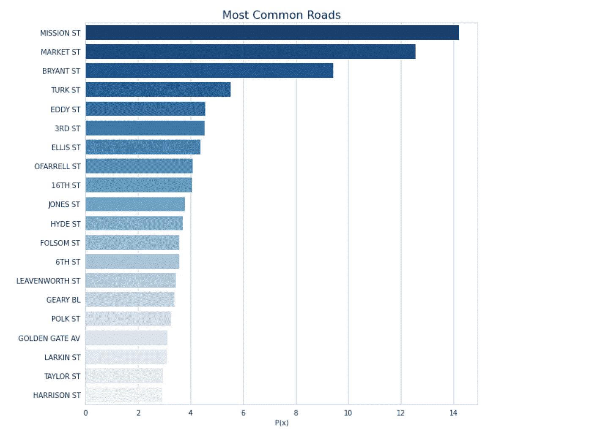

上面显示的代码输出[图片由作者提供]

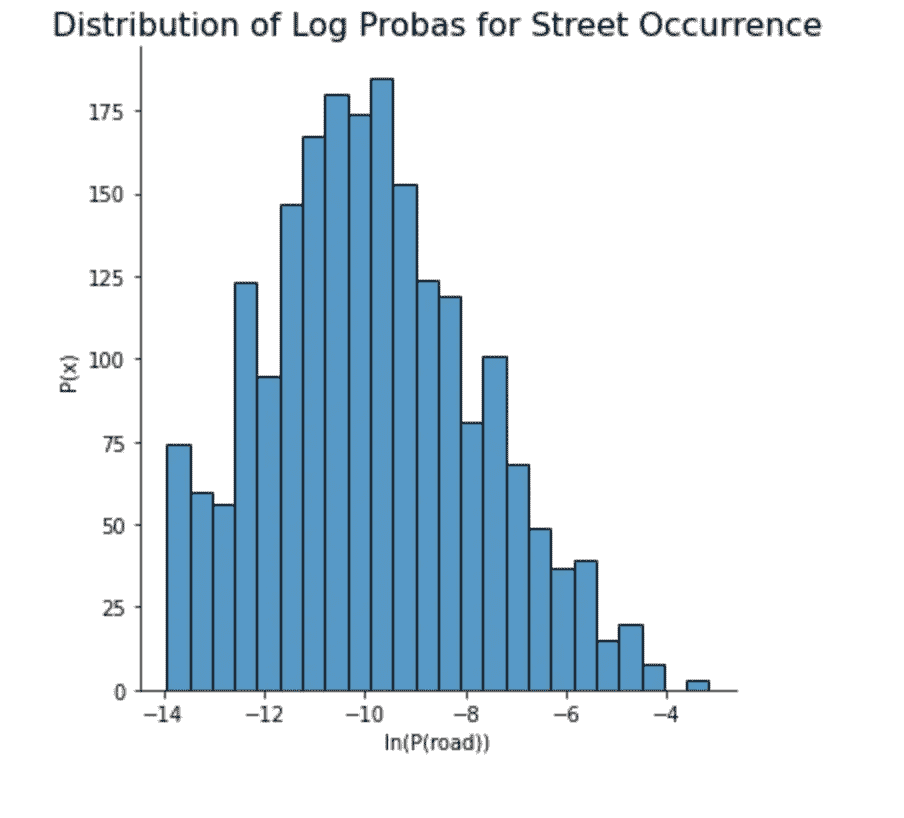

上面显示的代码输出[图片由作者提供]

作为对数道路概率特性的最后一项分析，我们来看看该特性提供的分布分离。尽管我们的最终模型将包含更多的决策特征，但如果我们看到不同类别的特征分布有所不同，这仍然是一个好信号。事实上，我们确实在分布模式的大小上看到一些差异，并且在最重要模式的邻域之外在概率质量上看到一些额外的差异。这个特性应该非常适合我们的用例！

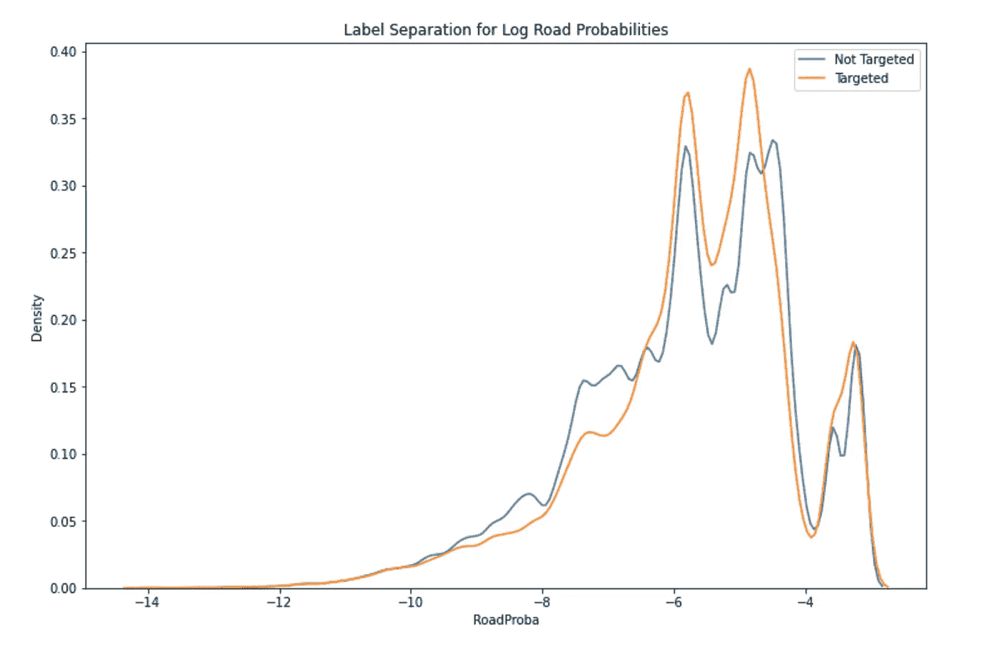

上面显示的代码输出[图片由作者提供]

# 由于`pandas-profiling`，数据集剖析得以实现

在所有这些手工特性设计和代码中，我不能不提到来自`pandas-profiling`包的精彩报告。您可能在手工繁重的工作中遇到的许多见解和问题可以直接从这些报告中提取出来。对于所有未来的项目，我强烈建议您在开始一个接一个地编码之前，先浏览一下类似的数据报告。这样做可能会节省很多时间。

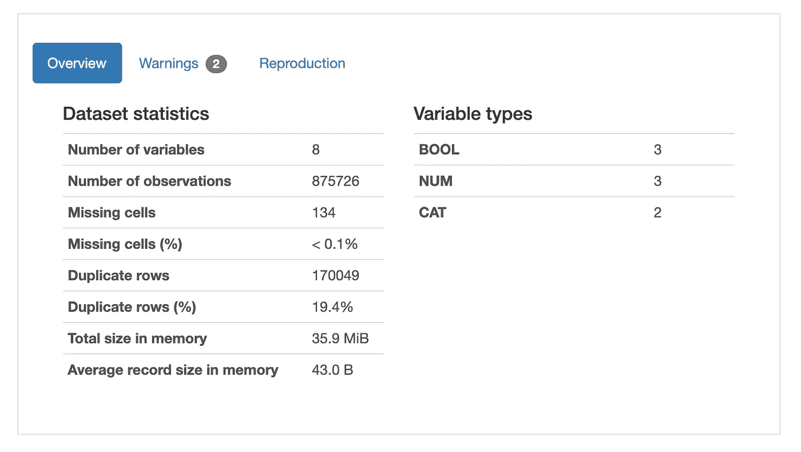

来自 pandas_profiling 的非常详细的报告的开头[图片由作者提供]

# 利用`fast.ai`简化数据准备

好了，现在是时候让`fast.ai`来掌舵，为我们处理很多事情了。由于一些设计良好的功能，我们可以以更有效的方式清理和准备我们的数据集，同时保持对机器学习最佳实践的信心。

首先，我们有一些恒星日期时间功能支持。注意，我说的*特性支持*并不是解析支持。当然，该库在自动解析几种日期数据类型方面做得很好。然而，真正的好处在于*新功能*自动为您创建。只需在您的 pandas 数据帧中指定 datetime 列，以及您是否希望在转换后保留该列。查看您收到的以下内容:

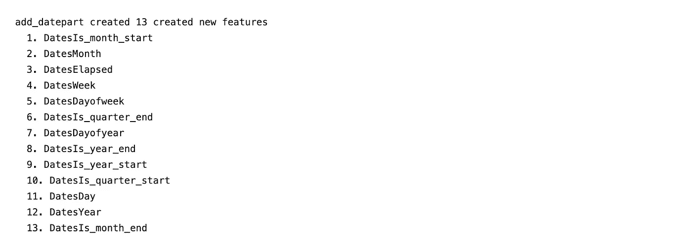

上面显示的代码输出[图片由作者提供]

这对于日期时间处理来说怎么样？为工程时间戳特性告别所有的手动垃圾代码。让我们继续前进，还有更多令人兴奋的事情。

我们也希望能够很好地处理字符串和缺失数据。一种典型的方法是将字符串转化为一次性分类特征，并从大量缺失数据的数据插补方法中进行选择。让我们使用 fastai 的`TabularPandas`类来代替这种更加手动的方法，它本质上是一个增强的`pandas`数据框架。

`TabularPandas`类的三个强大方面是`Normalize`、`Categorify`和`FillMissing`。所有这些产品都是`TabularProc` s. A `TabularProc`就像`fast.ai`中的常规`Transform`，除了就地功能和急切的一次性处理(而不是熊猫式的懒惰处理)。这两个特性的结合使得`TabularProc` s 在数据集准备方面非常高效。

`[Normalize](https://docs.fast.ai/data.transforms#Normalize)`是执行基本均值-方差数据归一化的`TabularProc`。

`[Categorify](https://docs.fast.ai/tabular.core#Categorify)`是一个用数字分类列替换列的`TabularProc`。

`[FillMissing](https://docs.fast.ai/tabular.core#FillMissing)`是一个`TabularProc`，它用列的中值替换丢失的值，并为任何丢失值的行创建一个设置为`True`的新布尔列。这两个特性的组合非常强大，因为您仍然可以通知模型数据何时丢失，同时还可以为不受影响的数值计算输入一个值。

一会儿，我们将看到`TabularPandas`类，它将所有这些功能集成在一个罩下。然而，我们将需要向该类指定我们的哪些特征是连续的和明确的。

是时候写一个手动方法了？

现在是时候调用另一个方便的方法`fast.ai`了。

我们可以使用助手函数`cont_cat_split`自动处理这个问题，如下所示。这只是数据集准备逻辑的另一个例子，它可以无缝地为您处理，同时允许在必要时进行轻微的定制。

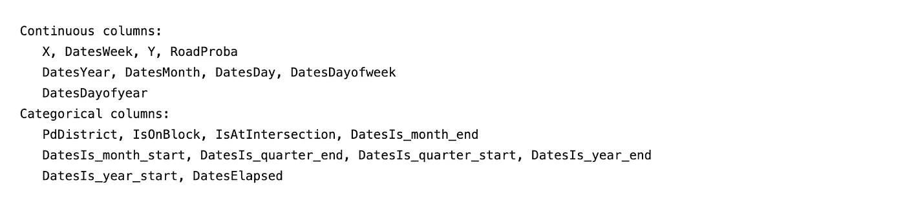

上面显示的代码输出[图片由作者提供]

有了这些知识，我们现在可以初始化`[TabularPandas](https://docs.fast.ai/tabular.core#TabularPandas)`类，它使用我们定义的`TabularProc`和特性分类来为我们的训练`DataFrame`提供强大的包装。这个课程的很多好处来自于你可以从它的界面中立即训练一个深度学习模型。相反，我们在这里关注的是这个类在本地接口中快速将数据传递给其他流行的 ML 库的便利性。

这意味着与外部库的无缝集成！如下所示，获取该类的底层`numpy`数据只需访问这些属性(假设`obj`是`TabularPandas`的一个实例):

*   `obj.train.xs.values`
*   `obj.train.ys.values`
*   `obj.validation.xs.values`
*   `obj.validation.ys.values`

瞧啊！这就是你所需要的。让我们训练模型。

# 模特培训

我提到了几种不同的机器学习库对训练模型的可用性。尽量不要花太多时间去钻研每一个细节；有许多 python 包为训练 ML 模型提供了很大的支持，而且很难出错。许多开始学习机器学习的人过于关注算法的选择，很大程度上是因为他们从老师那里学到的风格。专注于算法对于*学习*机器学习非常有效。当您必须通过软件应用这些知识时，请记住将您的大部分精力放在数据管道上。一旦你有了正确的数据准备学习，许多软件包会给你类似的性能。

对于训练基于树的模型，一些最流行的包是`[sklearn](https://scikit-learn.org/stable/)`、`[xgboost](https://xgboost.readthedocs.io/en/latest/)`和`[lightgbm](https://lightgbm.readthedocs.io/en/latest/)`。以下是我根据自己的经验对每一个问题的看法:

*   `sklearn`是最好的，因为它提供了广泛的算法。如果您需要在您的管道中潜在地使用许多不同的 ML 算法，请使用`sklearn`。
*   `xgboost`和`lightgbm`在你知道要用梯度提升或者随机森林的时候比较好。`xgboost` long 是首选的库，但微软在 2017 年发布了`lightgbm`，显示了更高效的计算建模和更好的准确性。有了更好的表现和大公司的支持，我喜欢`lightgbm`前进。为了更深入地了解`xgboost`和`lightgbm`的对比，请查看 [@sainikhilesh](https://medium.com/@sainikhilesh) 在 Medium 上发表的[这篇文章](/lightgbm-vs-xgboost-which-algorithm-win-the-race-1ff7dd4917d)。

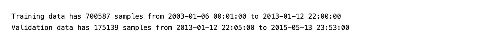

上面显示的代码输出[图片由作者提供]

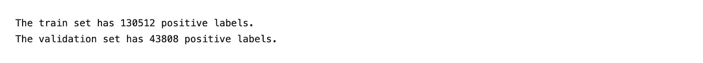

上面显示的代码输出[图片由作者提供]

# 分析

好了，模特完成训练了。我们打包回家吧！

不，现在是时候检查模型性能的几个方面，以判断它是否足够或需要改进。对于这类分析，我喜欢`[plotly](https://plotly.com/python/)`。我已经通过了好几个可视化库，从`matplotlib`到`seaborn`到`yellowbrick`到`vega`到`d3.js`。我从所有这些经历中总结出的一般规律如下:

*   对于只有你看得见的代码，使用你记忆最深的库
*   使用为其他人会看到的代码生成“最佳”图的库
*   使用为非技术消费者将使用的报告生成最具交互性的绘图的库

当然，定义“最好”是相对的。然而，我大致认为可视化库有价值，因为它们有丰富的特性集、大量的例子和很好的文档。正因如此，`seaborn`很快击败了`matplotlib`，直到`plotly`最终因为刚才提到的原因加上互动性胜出。`plotly`的代码冗长吗？当然，有一点。然而，更重要的是最终消费者如何看待你的结果。我打赌冗长的`plotly`会比几行`matplotlib`为你的消费者创造更多的价值。

你可能想知道“那`streamlit`呢？”。`streamlit`库是一个 web 服务器和接口，它对刚才提到的所有可视化库都有一定程度的支持。它还具有基于组件的扩展设计，因此任何可视化库都可以合理地插入。

# 分数分布

首先，让我们比较分数分布，跨类和数据集。

比较类的分数分布，我们希望看到正类和负类的预测分布之间尽可能多的分离。否则，我们的表现肯定会很差。事实上，我们在这里确实看到相当多的分离，但仍有很大的改进余地。

接下来，我们不希望在训练集和验证集上看到模型的预测分布有太大的差异。对此的推理很简单:对于呈现给模型的任何(最好是大量的)无偏数据样本，我们期望样本的分布与数据的真实分布非常相似。此外，我们期望模型在这些样本集上的得分彼此非常相似；否则，模型会有一些偏差，需要解决。

通过比较这些图，我们看到模型在验证数据集上的得分有显著的正向变化。这表明正在发生两种情况之一:1 .验证集的分布与训练集显著不同。2.经过训练的模型有一个学习偏差，它不能很好地推广到验证集。

我怀疑(2)正在发生，因为验证集是基于时间选择的。虽然很有可能在训练集和验证集的日期之间宇宙中的某些东西发生了变化，但我认为更有可能的是模型未能恰当地概括。

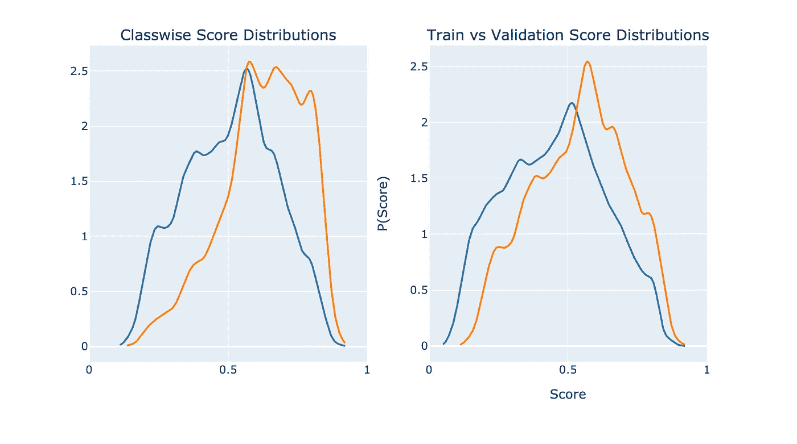

上面显示的代码输出[图片由作者提供]

# 混淆矩阵

进一步挖掘模型性能，让我们可视化它的错误分类。理想情况是东北方向的对角线包含所有的样本。左上角的样本是假阴性，右下角的样本是假阳性。

与上面验证集分数分布的正移一致，我们看到在验证数据上有大量的*假阳性*。这是正分布偏移直接影响，无论是由于模型偏差还是协变量偏移。

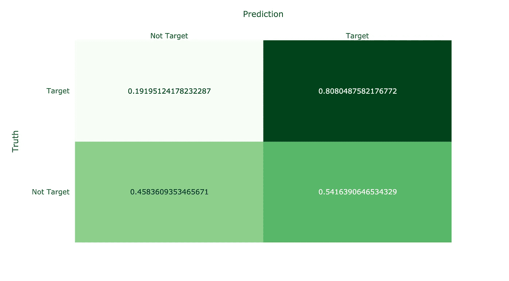

上面显示的代码输出[图片由作者提供]

# 权衡曲线:ROC 和精确召回

最后，我们有我们的性能权衡曲线。我没有像许多人那样选择一个，而是展示了两者及其微妙的区别。

在左边，我们有一个模型的 ROC 曲线。该曲线直观显示了当您允许模型在 x 轴上增加错误警报级别时，该模型在 y 轴上实现增加真实检测(召回)级别的速度。对于二进制分类，真正的随机模型在大约 50%的时间内是正确的(对于 N 个类别为 1/N)。为此，还绘制了一条虚线来表示随机模型对于每个 FPR 容许值的性能。

如果你有一个比 random 表现差的模型，你还有很多工作要做:)。

在右边，我们有一条相似但不同的权衡曲线。这一个形象化了精确性和回忆性，或者特异性和敏感性之间的权衡。ROC 曲线的召回与 FPR 图做出了“我想要更多的这个(召回)和更少的那个(FPR)”的权衡，而精度与召回图做出了“我想要这个(精度)*和*这个(召回)高”的权衡

不管您使用什么样的图，分类模型的生产应用程序通常需要一个非黑即白的决定。因此，你必须在一个特定的分数上做决定。这两个图都让你能够为自己或你的企业做出这个决定。选择在于你想如何呈现这种权衡，而你的听众可能更容易理解。

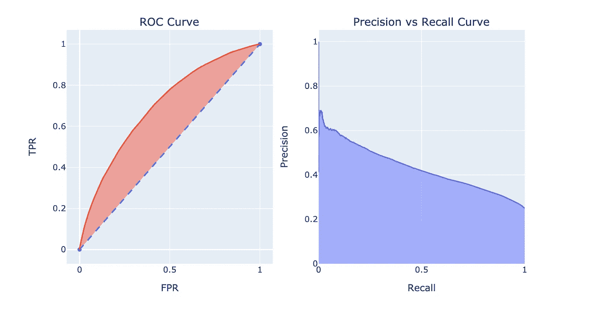

上面显示的代码输出[图片由作者提供]

# 你能做得更好吗？

有了这个笔记本为你设置好的一切，你所需要的就是渴望和专注来让这个模型变得更好。我在下面补充了一些建议，都是关于非深度学习策略的。深度神经网络可以进行大量的特征工程，但在手动特征工程和模型构建的复杂细节方面仍有许多有待学习。不要让深度学习大师动摇你，让你认为 DNNs 可以自动神奇地解决你所有的问题。它们在某些场景中表现惊人，但在机器学习的所有领域仍有大量工作要做。

## 使用`Resolution`栏

使用该功能对训练集和验证集进行更明智的[分层](https://en.wikipedia.org/wiki/Stratified_sampling)。分层的一个简单用法是使用`Category`特征作为分割数据的标签，这要粗糙得多*。通过使用附加信息进行分割，您可以进一步确定您的训练和验证数据分布是否尽可能相等。*

*或者，您可以将该特性转换为一个热编码，并添加一个额外的特性来指示`Resolution`特性是否缺失。一键功能将为模型学习提供更多信息，而`is_missing`功能可以在测试期间简单地提高。你可能认为`is_missing`功能将作为一个禁用按钮来使用一键功能。这只有在`is_missing=1`和`is_missing=0`的训练中呈现的数据分布相等时才会发生。*

## *使用`Descript`栏*

*直接用`Descript`作为训练和验证标签进行训练，并使用一个`Descript`->-`Category`映射进行测试预测。通过以更精细的分类为目标进行训练，您可以为模型提供更丰富的反馈。通过训练可能更强的模型，您使用构建的映射将测试时间`Descript`预测转换回用于测量/使用的`Category`预测。*

## *实际上任何其他东西*

*这就是用数据进行特征工程的妙处。把你所有牵强的想法拿出来，并以此为基础构建一个功能。如果做得正确，训练和验证过程将决定你的特性是有用的还是无用的。那只是…有数据的生活。*

# *资源*

*   *[直接启动我的 Deepnote 笔记本](https://deepnote.com/project/b710c6bb-1944-4803-879b-d7c3284d3a3a)*
*   *[卡格尔竞赛](https://www.kaggle.com/c/sf-crime/data)科幻犯罪数据集*
*   *Yannis Pappas 的数据集上的一个神奇的 [Kaggle 笔记本](https://www.kaggle.com/yannisp/sf-crime-analysis-prediction#Analysis)(这里重用了一些代码)*
*   *旧金山政府的 OpenData 计划*
*   *[fast.ai](https://www.fast.ai/) ，特别是这里的[表格式](https://docs.fast.ai/tutorial.tabular)包。*
*   *Github 页面。*
*   *Plotly 的精彩 [Python 支持](https://plotly.com/python/)。*
*   *更多来自[真实生活数据](https://www.lifewithdata.org/)、[推特](https://twitter.com/anthonyagnone)和[媒体](https://medium.com/@anthonyagnone)*

# *不断学习*

* [## Hello Danfo:用于 Javascript 的熊猫，来自 Tensorflow

### Tensorflow.js 刚刚获得了更多端到端

towardsdatascience.com](/hello-danfo-pandas-for-javascript-from-tensorflow-3d1d0ea3f3be)  [## 亚马逊想让你免费成为一名人工智能从业者

### 这家科技巨头计划通过公开其长期的内部材料来提高 ML 的熟练度

towardsdatascience.com](/amazon-wants-to-make-you-an-ml-practitioner-for-free-552c46cea9ba)  [## Deepnote 将成为 Jupyter 黑仔

### 旧金山的一个小团队 DeepNote 希望在你的数据科学工作流程中取代 Jupyter。

towardsdatascience.com](/deepnote-sets-course-to-become-the-jupyter-killer-d0cb6e3ca011) 

# 保持最新状态

这一个就到此为止。然而，在学术界和工业界，事情发生得很快！通过 [LifeWithData](https://lifewithdata.org/) 博客、[Medium 上的文章](https://medium.com/@anthonyagnone)和我的 [Twitter](https://twitter.com/@anthonyagnone) 随时了解最新动态。*