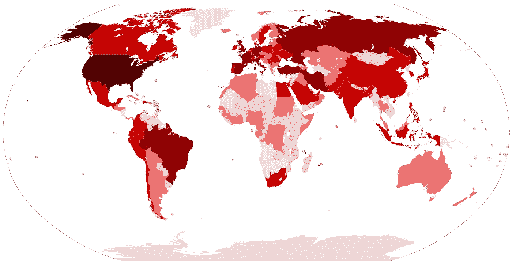
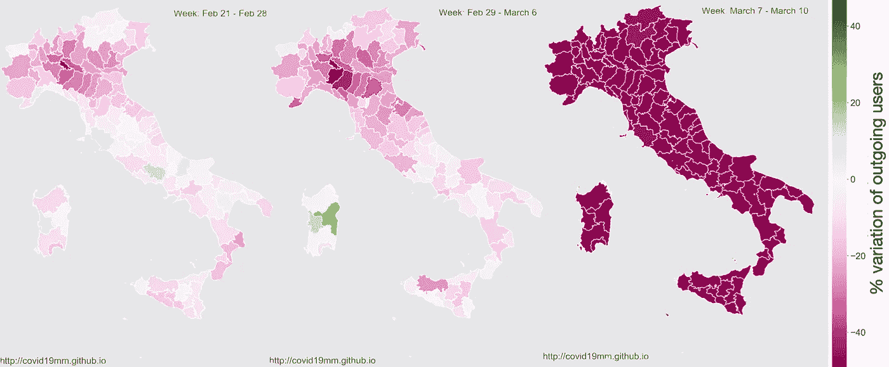
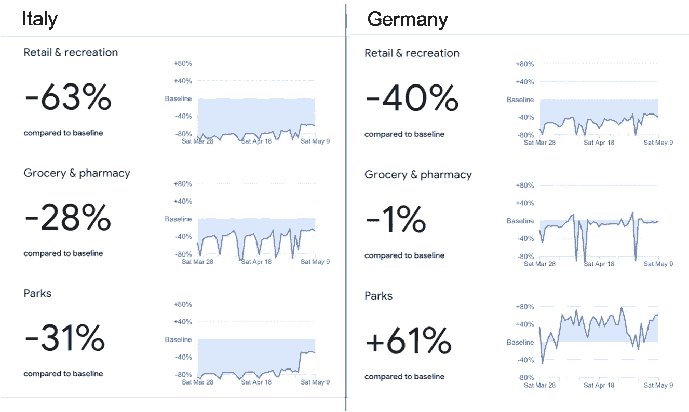

# 用数据科学对抗新冠肺炎

> 原文：<https://towardsdatascience.com/fighting-covid-19-with-data-science-6130eff5c734?source=collection_archive---------74----------------------->

创建地图来观察病毒在世界范围内的传播是数据科学分析在抗击新冠肺炎病毒中最受欢迎和最基本的应用之一。

想想 2020 年才过了 5 个月，这么多事情都变了，真是太神奇了。新冠肺炎改变了我们的生活，我们互动的方式，我们的习惯，甚至我们的思想。[一些政治家甚至说我们正处于“战争”](https://theconversation.com/war-metaphors-used-for-covid-19-are-compelling-but-also-dangerous-135406)，尽管这可能是夸张的说法，但我们确实正在以多种方式抗击病毒。社交距离、疫苗和医疗是最知名的，但也出现了许多其他方法，其中一些来自数据科学和人工智能社区。

你可能听说过[中国控制人们健康的应用](https://www.nytimes.com/2020/03/01/business/china-coronavirus-surveillance.html)(以及由此引发的所有隐私问题)，也听说过[苹果和 Alphabet 推出匿名跟踪 API](https://www.theverge.com/2020/4/10/21216484/google-apple-coronavirus-contract-tracing-bluetooth-location-tracking-data-app) ，但是还有许多其他有趣的方法被媒体忽略了。我对此做了一些研究，我想这可能会引起你们中许多人的兴趣，所以我决定在这里做一个简短的总结。

请继续阅读，了解数据科学和人工智能是如何加入对抗新冠肺炎的战斗的。倡议的数量非常多，所以这里我只选择了一些我知道的并且认为有意思的，如果你知道还有其他的，请告诉我。

# 检疫期间人口的流动性分析

了解人口如何流动对于防止病毒传播和观察隔离措施的有效性非常重要。在不损害数据隐私的情况下跟踪人口移动是一个巨大的挑战，但许多倡议正在尝试这样做。

其中之一是意大利的[新冠肺炎移动监控项目](https://covid19mm.github.io/)，该项目使用从匿名用户那里收集的数据，这些匿名用户选择通过符合 GDPR 标准的框架匿名访问他们的位置数据。使用 GPS、信标、wifi 和网络等多种传感器从装有 iOS 和 Android 的智能手机中收集数据。他们的目标是定量分析意大利实施的禁闭和社会距离措施的影响。

2020 年 2 月 21 日至 3 月 10 日期间整个意大利流动性下降的演变。在第一周，我们看到受影响较大的地区(伦巴第、皮埃蒙特、艾米利亚-罗马涅和威尼托)的流动性下降，并且我们看到在最后一周，随着封锁措施的实施，流动性下降在全意大利都是显而易见的[图摘自[新冠肺炎流动性监测项目的 github](https://covid19mm.github.io/in-progress/2020/03/13/first-report-assessment.html) 。]

此外，谷歌使用谷歌地图的匿名数据发布了世界各地的[移动报告](https://www.google.com/covid19/mobility/)。这些报告显示了谷歌地图的活动在整个疫情发生了怎样的变化，特别是当封锁措施到位的时候。根据国家/地区的不同，一些报告还按国家/地区划分数据。看到不同国家不同封锁措施的效果是非常有趣的。例如，我选择了意大利和德国，这两个国家使用不同的方法抗击新冠肺炎:在意大利，商店、公园和其他公共场所完全关闭，人们被限制在家中，除了一些例外情况，如购买食品杂货；相反，在德国，商店也关门了，但没有禁闭。我们可以看到每个国家的人口行为是如何不同的:在意大利和德国，零售和娱乐场所的活动急剧减少，意大利的公园也减少了，而在德国，实际上增加了，因为自从公园开放以来，人们更多地去公园。

意大利和德国的谷歌移动报告摘录【你可以在这里找到完整的报告[。]](https://www.google.com/covid19/mobility/)

# 《CORD-19，全球预测和发现》

Kaggle 是网上最知名的数据科学社区之一(顺便问一下，你知道它是谷歌的子公司吗？—我刚刚发现)他们正在为抗击新冠肺炎尽自己的一份力量，他们提出了三项挑战:

## [新冠肺炎公开研究数据集挑战赛(CORD-19)](https://www.kaggle.com/allen-institute-for-ai/CORD-19-research-challenge/tasks)

白宫和一个领先的研究小组联盟已经准备了 CORD-19，这是一个包含超过 63，000 篇学术文章的资源，其中包括超过 51，000 篇关于新冠肺炎，新型冠状病毒和相关冠状病毒的全文。该挑战的目标是开发文本和数据挖掘工具，帮助医疗界开发高优先级问题的答案。

## [COVID19 全球预测](https://www.kaggle.com/c/covid19-global-forecasting-week-5)

这一挑战是 CORD-19 的伴生物，涉及预测每个地区的确诊病例和死亡人数。然而，主要的目标不仅仅是产生准确的预报，而且还要确定似乎影响新冠肺炎传播率的因素。

## [揭开新冠肺炎](https://www.kaggle.com/roche-data-science-coalition/uncover)

这是一个与 CORD-19 类似的挑战，但数据集是从 20 个全球来源收集的，由罗氏数据科学联盟提供。我们面临的挑战是如何回答由全球一线的医疗保健提供商、医院、供应商和决策者提出和评估的关键问题。

# 传播建模和预测

目前有许多模型用于预测新冠肺炎的传播，其中大多数使用 [SIR(易感、感染、康复)](https://en.wikipedia.org/wiki/Compartmental_models_in_epidemiology#The_SIR_model)模型或其变体，这是流行病学家使用的一个著名模型。SIR 对疾病在人群中的传播进行建模，以离散时间步长的图表形式建模，从一些受感染的节点开始，然后显示疾病如何随着时间的推移在人群中传播。为了使用该模型，有必要输入一个适当模拟当前人口、疾病转移率和疾病死亡率的图表。然而，目前对于新冠肺炎的这些参数没有达成一致，这使得建模变得困难。

“[使用机器学习的新冠肺炎预测](https://covid19-projections.com)”是一个使用机器学习来估计该参数值的项目，并使用 SEIR 模型(SIR 的一种变体)来预测疾病在美国和世界的传播。这对我来说是一个非常有趣的项目，尤其是因为一种传统方法与机器学习的结合显示出了巨大的潜力。

每日死亡人数预测来自[新冠肺炎使用机器学习进行的预测](https://covid19-projections.com)【图取自[官网](https://covid19-projections.com/#us-summary)。]

# 帮助开发疫苗

几个组织、政府和抗击新冠肺炎的重要人士一致认为，在我们有疫苗之前，我们将不得不保持社会距离和目前严格的卫生措施。许多疫苗已经处于测试阶段，但其他几种疫苗仍在开发中。机器学习正被用于分析病毒序列，以识别疫苗可以靶向的部分(表位)。

其中一项举措来自 NEC，该团队分析了病毒的数千个序列，并确定了全球人群中 100 个最常见的 HLA 等位基因的表位，扫描了新型冠状病毒病毒中的所有蛋白质(哇，这太专业了)。他们在病毒蛋白质组中寻找在未来病毒株中不太可能发生突变，也不太可能对人类产生不利影响的区域，并将其发表在 [biorXiv](https://www.biorxiv.org/content/10.1101/2020.04.21.052084v1) 上。研究人员可以利用这一分析结果来开发一种对人群更有效、更少危险的疫苗。

# 结论

数据科学是一个非常有价值的工具，科学家和政府正在使用它来应对新冠肺炎疫情的影响，许多伟大的应用正在以非常快的速度出现。得知我们的领域正在帮助应对这场全球危机，并且有可能帮助解决我们现代社会的许多其他问题，这是非常有益的。

如果您知道任何其他计划，请不要犹豫，在下面的回复中分享它们。感谢您的阅读！

***编者按:*** [*走向数据科学*](http://towardsdatascience.com/) *是一份以数据科学和机器学习研究为主的中型刊物。我们不是健康专家或流行病学家，本文的观点不应被解释为专业建议。想了解更多关于疫情冠状病毒的信息，可以点击* [*这里*](https://www.who.int/emergencies/diseases/novel-coronavirus-2019/situation-reports) *。*