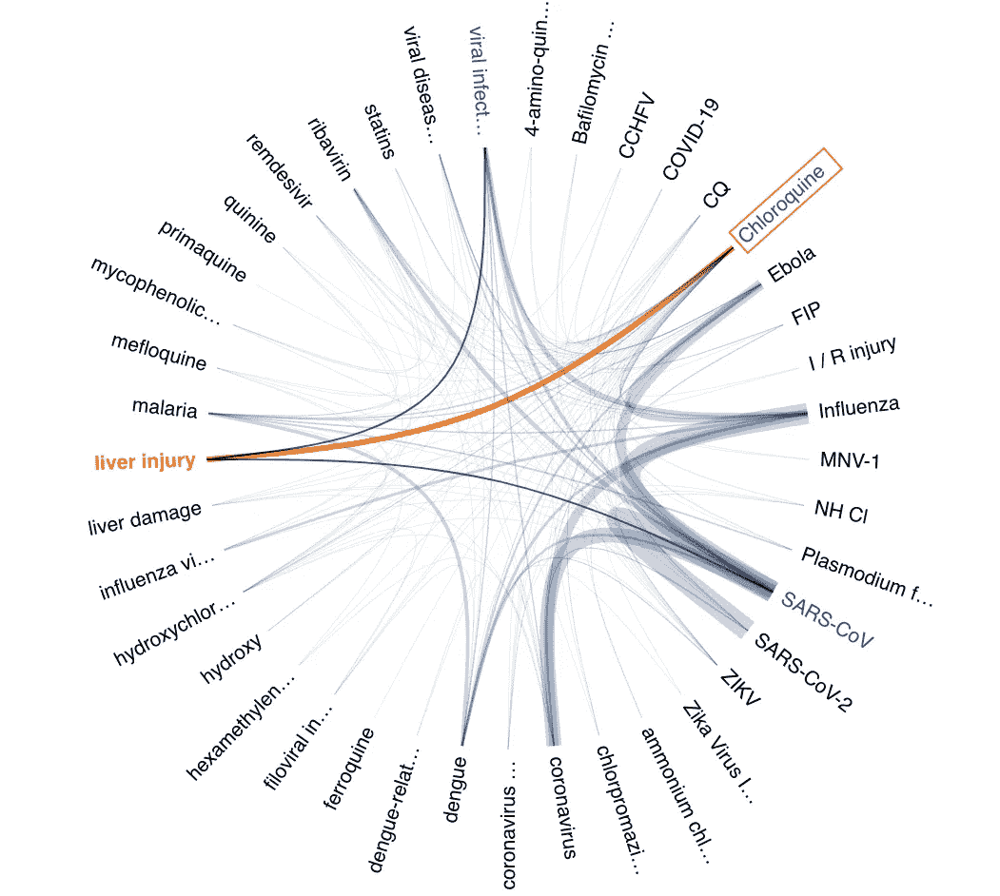
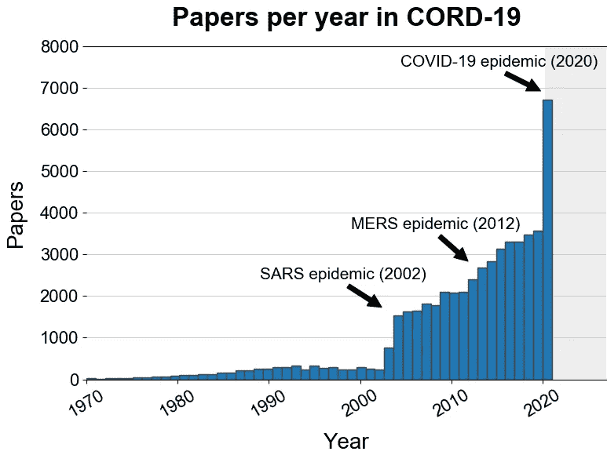
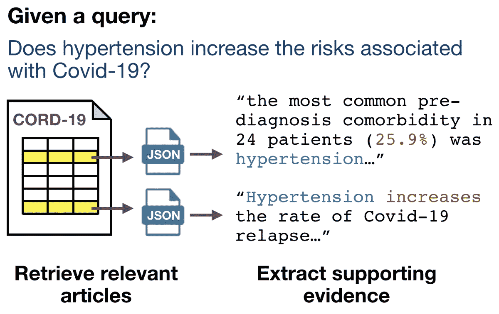

# 用开放存取和人工智能对抗新冠肺炎

> 原文：<https://towardsdatascience.com/fighting-covid-19-with-open-access-and-ai-9a4df3cbe8c0?source=collection_archive---------48----------------------->

## CORD-19 资源试图加速科学发现和拯救生命

与氯喹相关的疾病和化学物质的网络，是可以从 CORD-19 中提取的洞察力的一个例子——这个可视化是用来自 [AI2](https://allenai.org) 的 [CoViz](https://coviz.apps.allenai.org/) 工具制作的。

Michael Kratsios(他的头衔是美国首席技术官)打来的紧急电话提出了一个大胆的挑战:将所有与新冠肺炎直接相关的可用科学文章汇集成一个机器可读的语料库，以便人工智能和人工智能社区可以开发和利用尖端技术来获得对疾病、潜在治疗方法和疫苗之路的见解。

仅仅一周后，2020 年 3 月 16 日，[语义学者](http://semanticscholar.org)与 NIH、微软和几个领先的研究小组合作发布了[新冠肺炎开放研究数据集(CORD-19)](https://www.semanticscholar.org/cord19) 资源，该资源目前已被浏览近 200 万次。自启动以来，数百个组织和数千人对该项目做出了贡献，它是有史以来最受欢迎的 [Kaggle 竞赛](https://www.kaggle.com/allen-institute-for-ai/CORD-19-research-challenge)的基础。

从最初发布的 28K 篇论文开始，CORD-19 已经发展到包含超过 50K 篇关于当前新冠肺炎疫情和其他冠状病毒的科学论文，从新的出版物到追溯到 50 年前的历史数据。距离首次发布仅一个多月，两个重要主题已经出现:CORD-19 凸显了机器学习和 NLP 在推进科学研究方面的巨大潜力，以及跨科学领域的合作对于推进科学发现至关重要。

CORD-19 资源中包含的研究范围。艾伦人工智能研究所。

CORD-19 的[目标是刺激解释科学文献的自动化系统的创建，并利用这些系统来改善生物医学研究人员、临床医生和决策者的发现。到目前为止，一切顺利——CORD-19 已经被下载了超过 75000 次。正在进行的从 CORD-19 中提取有用发现的](https://www.semanticscholar.org/paper/CORD-19%3A-The-Covid-19-Open-Research-Dataset-Wang-Lo/bc411487f305e451d7485e53202ec241fcc97d3b) [Kaggle challenge](https://www.kaggle.com/allen-institute-for-ai/CORD-19-research-challenge) 有超过 550 个参赛团队， [TREC 检索相关 CORD-19 论文的共享任务](https://ir.nist.gov/covidSubmit/)在第一周就有超过 50 个团队提交。学术界和工业界的几十个研究小组[已经发布了系统](https://discourse.cord-19.semanticscholar.org/latest)，每个都展示了文档检索、信息提取和问题回答方法的独特组合。这些项目中的许多都促进了与生物医学和临床研究人员以及其他领域专家的成功合作。

从 CORD-19 中提取的给定假设的支持证据类型示例。艾伦人工智能研究所。

特别是，共享任务生态系统在促进新项目和与这些专家的合作方面发挥了关键作用。通过共享任务，我们正在学习如何最好地检索相关信息，并以用户易于理解的形式提取答案。想象一个回答医学问题“高血压会增加新冠肺炎相关风险吗？”我们已经看到[有希望的可能性](https://www.kaggle.com/covid-19-contributions)可以为临床医生和研究人员节省大量关键时间。

# 人工智能加速科学发展的潜力

这一时刻将证明机器学习和自然语言处理在科学中的潜力。随着近年来预训练-微调建模范例的兴起，大型领域适应语言模型，如 [BioBERT](https://github.com/dmis-lab/biobert) 和 [SciBERT](https://github.com/allenai/scibert) 已经成为在信息提取、信息检索、知识库填充、问题回答和摘要中推进许多科学 NLP 任务的最新技术的基础建模资源。我们现在可以看到这些进步如何以及如何快速地转化为用于访问及时内容的有用系统。

也可以看到现状的局限性。科学论文的主要分发格式 PDF 不适合文本处理。从 PDF 中提取的纸张内容(文本、图像、参考书目)和元数据并不完美，在用于分析之前需要进行大量清理。也没有表示纸张元数据的标准格式。现有的模式如 NLM 的 [JATS XML](https://www.niso.org/standards-committees/jats) 或图书馆学标准如 [BIBFRAME](https://www.loc.gov/bibframe/) 或 [Dublin Core](https://www.dublincore.org/specifications/dublin-core/dc-citation-guidelines/) 已经被用来表示论文元数据。然而，既没有合适的、定义良好的模式来表示论文元数据，也没有不同出版商和档案馆对任何特定模式的一致使用。最后，研究人员显然需要更容易获取更多的科学内容。尽管许多出版商慷慨地将新冠肺炎论文用于文本挖掘，但信息获取仍然存在瓶颈。例如，描述相关领域研究的论文(例如，关于其他传染性疾病或相关生物途径的论文)不一定是开放获取的，因此不提供给机构群体。

# 开放科学的重要性

科学产出是一种公共资源，开放获取这些资料是提高生产力和我们在历史知识基础上发展的能力所必需的。最近 CORD-19 的成功展示了文本挖掘和 NLP 如何被用于推进科学发现的步伐。广泛获取科学文献进行自动化分析和发现，可以加速研究各方面的进步，超越我们今天所处的危机局面。

> 如果数以千计的临床研究结果中隐藏着一种疑难杂症的治疗方法，那该怎么办？

Semantic Scholar 是基于一个简单的假设创建的:如果一种疑难杂症的治疗方法隐藏在数千项临床研究的结果中，会怎么样？从第一天起，我们的使命就是帮助学者找到并理解正确的研究，建立重要的联系，克服信息过载，从而加速科学突破。CORD-19 的建造是我们工作的自然延伸。我们鼓励研究和出版界通过将他们的科学出版物用于文本挖掘和其他二次应用来协助这项事业。我们的愿景是将这个数据集和由此产生的多样化、跨学科的社区作为应对未来全球挑战的模型。

**参考文献**

1.  CORD-19 数据集:[https://www.semanticscholar.org/cord19](https://www.semanticscholar.org/cord19)
2.  CORD-19:https://arxiv.org/abs/2004.10706 新冠肺炎开放研究数据集:
3.  Kaggle 挑战赛:[https://www . ka ggle . com/Allen-institute-for-ai/CORD-19-research-Challenge](https://www.kaggle.com/allen-institute-for-ai/CORD-19-research-challenge)
4.  https://ir.nist.gov/covidSubmit/ TREC-乔维德挑战赛:
5.  CORD-19 论坛:[https://discourse.cord-19.semanticscholar.org/latest](https://discourse.cord-19.semanticscholar.org/latest)

[**CORD-19**](https://www.semanticscholar.org/cord19) 是由[艾伦人工智能研究所](http://allenai.org)的[语义学者](http://semanticscholar.org)与我们在白宫科技政策办公室、美国国家卫生研究院国家医学图书馆、微软研究院、Chan-Zuckerberg Initiative、Kaggle 和乔治敦大学安全与新兴技术中心的合作伙伴合作提供的。