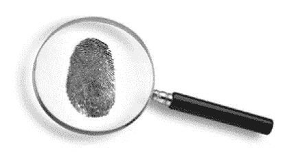
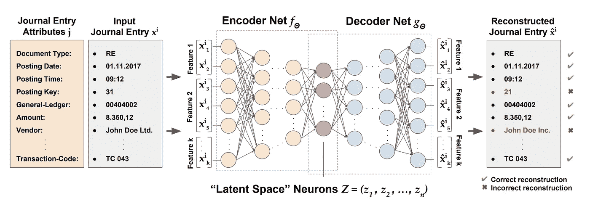

# 用人工智能对抗金融诈骗

> 原文：<https://towardsdatascience.com/fighting-financial-fraud-with-artificial-intelligence-f2a6bcaf131e?source=collection_archive---------23----------------------->

## 金融中的人工智能

## 使用自动编码器检测会计异常

图片来源:123rf.com

欺诈对企业来说是一个巨大的问题；注册欺诈审查员协会发现，典型的组织每年因欺诈损失约 5%的收入。在世界范围内，这意味着每年损失 3.7 万亿美元。虽然内部和外部审计通常被认为是揭露欺诈的关键工具，但它们仅分别负责 14%和 3%的欺诈检测。审计人员面临的一个问题是大海捞针:在数以千计的合法日志条目中寻找危险信号，而其中不到 1%的条目可能是虚假的，这当然不是一件容易的事情。对大数据集中极少量的异常进行分类？输入自动编码器。

# 解决方案:自动编码器

自动编码器架构([来源](/applied-deep-learning-part-3-autoencoders-1c083af4d798))

自动编码器是一种试图在其输出中复制输入的神经网络。编码器是一个完全连接的人工神经网络(ANN)，它将输入数据压缩成潜在空间表示(代码)。从那里，解码器，也是一个完全连接的人工神经网络，只使用代码产生输出。最后，重构误差衡量解码器的性能；由于代码的原因，正常实例将具有低重建误差，而异常值将具有高重建误差。与人工神经网络类似，该模型使用反向传播进行训练，并随着时间的推移变得更好。从上图中，我们可以观察到解码器的架构通常反映了编码器的架构。

自动编码器属于无监督学习的范畴，这意味着它们不需要显式标记的数据来从训练集中进行推断。让我们更具体地看看如何在我们的用例中应用自动编码器。

我们的自动编码器正在重建日志条目([来源](https://arxiv.org/abs/1709.05254)

当我们的自动编码器使用来自包含日志条目属性的 [Kaggle](https://www.kaggle.com/) 的[“合成财务数据集”](https://www.kaggle.com/ntnu-testimon/paysim1)进行训练时，自动编码器的代码就变成了输入数据的压缩表示(其中 99%是正常的日志条目)。因此，解码器在重建正常日志条目方面变得非常出色。然而，异常只是输入数据的极小一部分，因此当重建偏离规范的日志条目时，解码器会产生很高的重建误差。因此，提醒企业注意可能的欺诈情况。

我们要寻找的两种异常是全局异常和局部异常。全局会计异常是指包含罕见属性值(如奇数过帐时间)的日记帐分录。然而，全球异常通常可以归因于年终调整等事件，这意味着这些异常值中的大多数都是误报。本地会计异常是显示频繁出现的属性值的罕见组合的日记帐分录。这些不寻常的会计记录通常是由打算将恶意活动掩盖为常规业务活动的员工制作的，这使得它们更难被发现，也更有可能指出欺诈行为。

在我们的 autoencoder 程序运行后，我们看到 80% (56/70)的全局异常和 77% (23/30)的局部异常，当您记住异常值仅占整个数据集的 0.018%时，这是非常好的。整个项目的代码附后。

# 结论

自动编码器可以大大加快欺诈检测的过程。他们可以梳理整个日志条目列表，并以相当高的成功率检测出异常。与此同时，对于审计人员来说，这是一项极其繁琐的任务，他们并不总能找到舞弊的证据。虽然审计过程还没有准备好完全自动化，但企业可以将自动编码器纳入他们的内部控制，以减少未被发现的欺诈行为。

## 参考

[1] M. Schreyer 和 T. Sattarov，[使用深度自动编码器网络检测大规模会计数据中的异常](https://arxiv.org/abs/1709.05254) (2017)，arXiv

**先别走**！

我是 Roshan，16 岁，对人工智能和金融的交叉领域充满热情。关于人工智能在金融中的应用的广泛观点，请查看这篇[文章](https://becominghuman.ai/artificial-intelligence-and-its-application-in-finance-9f1e0588e777.)

在 Linkedin 上联系我