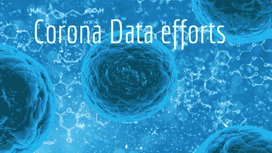

# 抗击新冠肺炎:所有数据集和数据工作都集中在一个地方

> 原文：<https://towardsdatascience.com/fighting-the-covid-19-all-the-datasets-and-data-efforts-in-one-place-4d6aeb0157ab?source=collection_archive---------30----------------------->

## 跟踪所有关于冠状病毒的数据很难。这就是为什么我在一个地方收集了所有相关的数据集和数据。该列表每天都会更新，所以请经常查看。

自从日冕爆发到我们的世界，研究机构和政府已经公开发布了许多数据库，以允许研究小组(和独立的个人)分析日冕传播周围的数据。这些数据库分散在许多计划和来源下。这个博客的目的是组织全世界所有主要的开放数据库和数据计划。**知道另一个重要的储存库吗？欢迎在评论中添加或者通过** [**这种形式**](https://forms.gle/W8cN44G9AVVtNJo29) **。**

# 数据集和数据挑战:

[**新冠肺炎公开研究数据集挑战赛(CORD-19)**](https://www.kaggle.com/allen-institute-for-ai/CORD-19-research-challenge/tasks)

***简短描述:***

作为对新冠肺炎疫情的回应，白宫和一个领先的研究团体联盟准备了新冠肺炎开放研究数据集(CORD-19)。CORD-19 是超过 44，000 篇学术文章的资源，包括超过 29，000 篇关于新冠肺炎、新型冠状病毒和相关冠状病毒的全文。这个免费提供的数据集提供给全球研究界，以应用自然语言处理和其他人工智能技术的最新进展，产生新的见解，支持正在进行的抗击这种传染病的斗争。由于新型冠状病毒文献的快速增长，使得医学研究界难以跟上，因此对这些方法的需求越来越迫切。

[**COVID19 全球预测。**](https://www.kaggle.com/c/covid19-global-forecasting-week-1/overview)

***简短描述:***

白宫科技政策办公室(OSTP)召集了一个联合研究小组和公司(包括 Kaggle)来准备新冠肺炎开放研究数据集(CORD-19 ),试图解决新冠肺炎的关键开放科学问题。这些问题来自 NASEM 的国家科学院、工程学院和医学院以及世卫组织的世界卫生组织。

[**牛津新冠肺炎政府回应追踪**](https://www.bsg.ox.ac.uk/research/research-projects/oxford-covid-19-government-response-tracker)

***简短描述:***

各国政府正在采取广泛措施应对新冠肺炎疫情。牛津新冠肺炎政府反应跟踪系统(OxCGRT)旨在以严格、一致的方式记录各国和各时期的反应。

[**小说电晕病毒 2019 数据集**](https://www.kaggle.com/sudalairajkumar/novel-corona-virus-2019-dataset) **(新冠肺炎感染病例日级信息)**

***简短描述:***

来自世界卫生组织——2019 年 12 月 31 日，世卫组织接到警报，中国湖北省武汉市出现几例肺炎病例。这种病毒与其他任何已知的病毒都不匹配。这引起了关注，因为当一种病毒是新的时，我们不知道它如何影响人。因此，当更广泛的数据科学社区可以获得关于受影响人群的日常信息时，这些信息可以提供一些有趣的见解。约翰·霍普金斯大学利用受影响的病例数据制作了一个极好的仪表板。数据是从相关的谷歌数据表中提取的，并在此处提供。

[**MIDAS 2019 新型冠状病毒库**](https://github.com/midas-network/COVID-19)

***简短描述:***

MIDAS 协调中心发布了一个新冠肺炎建模研究的在线门户。该门户网站改善了新冠肺炎信息的导航和搜索。接下来，我们将使用在线门户作为新冠肺炎数据和信息的登录页面，并使用新冠肺炎 GitHub 知识库共享包含数据、参数估计、软件和元数据的可计算(CSV)文件。该存储库的所有社区贡献功能都将得到维护，因此请继续发送请求或问题，以获取问题或贡献！

[**COVID-Net 和 COVIDx 数据集**](https://github.com/lindawangg/COVID-Net)

***简短描述:***

新冠肺炎疫情继续对全球人口的健康和福祉产生破坏性影响。抗击新冠肺炎的一个关键步骤是有效筛查受感染的患者，其中一个关键的筛查方法是使用胸部放射照相术进行放射成像。在早期的研究中发现，患者在胸部放射摄影图像中表现出异常，这是新冠肺炎感染者的特征。受此激励，已经提出了许多基于深度学习的人工智能(AI)系统，并且结果已经显示在使用胸部射线照相图像检测感染新冠肺炎病毒的患者的准确性方面非常有希望。

[**霍普金斯病毒仪表板库**](https://github.com/CSSEGISandData/COVID-19)

*****简短描述:*****

**这是由约翰·霍普金斯大学系统科学与工程中心(JHU·CSSE)运营的 2019 年新型冠状病毒视觉仪表板的数据存储库。此外，由 ESRI 生活图集团队和约翰霍普金斯大学应用物理实验室(JHU APL)支持。**

**[**GISAID——共享所有流感数据的全球倡议**](https://www.gisaid.org/)**

*****简短描述:*****

**世界各地的实验室正在以前所未有的方式产生越来越多的与新出现的冠状病毒(hCoV-19)相关的基因组序列和相关临床和流行病学数据，这些数据可通过 GISAID 快速获得。疫情病毒于 2019 年 12 月底在湖北省首次发现，那里的患者患有肺炎等呼吸道疾病。从那时起，hCoV-19 在全球范围内被检测到。**

**[**新冠肺炎冠状病毒数据(欧盟)**](https://data.europa.eu/euodp/en/data/dataset/covid-19-coronavirus-data)**

*****简短描述:*****

**该数据集包含关于新冠肺炎的最新可用公共数据，包括每日情况更新、流行病学曲线和全球地理分布(欧盟/欧洲经济区和英国，全世界)。2020 年 2 月 12 日，这种新型冠状病毒被命名为严重急性呼吸综合征冠状病毒 2 型(新型冠状病毒),而与之相关的疾病现在被称为新冠肺炎。ECDC 正在密切监测这一疫情，并提供风险评估，以指导欧盟成员国和欧盟委员会的应对活动。**

**[**Tableau 聚合冠状病毒数据集**](https://www.tableau.com/covid-19-coronavirus-data-resources)**

*****简短描述:*****

**随着冠状病毒(新冠肺炎)的爆发，我们正面临前所未有的公共卫生危机。我们相信，数据驱动的决策，以及人们为了更大的利益而共同努力，是度过这一困难时期的最佳方式。现在，拥有资源来回答对您的组织和员工至关重要的关键问题比以往任何时候都更加重要。这包括获得及时、详细和可信的数据，以便快速思考和行动。我们集合了 Tableau 社区的力量和我们的技术，创建了一个免费的 Covid19 数据资源中心，帮助您对数据做出自信的决策。**

**[美国冠状病毒(新冠肺炎)数据](https://github.com/nytimes/covid-19-data)**

*****简短描述:*****

**《纽约时报》正在发布一系列数据文件，其中包括美国各州和县一级的冠状病毒病例的累积数量。我们正在汇编来自州和地方政府以及卫生部门的时间序列数据，试图提供正在发生的疫情的完整记录。**

**自 1 月下旬以来，时报一直在实时跟踪冠状病毒病例，因为它们是在测试后被确认的。然而，由于普遍缺乏检测，数据在描述疫情时必然是有限的。我们已经使用这些数据为我们追踪疫情的地图和报告提供支持，并且现在这些数据将向公众开放，以响应希望访问这些数据以更好地了解疫情的研究人员、科学家和政府官员的请求。这些数据始于 2020 年 1 月 21 日华盛顿州报道的首例冠状病毒病例。我们将定期发布该库中数据的更新。**

# **课程、可视化等**

*****简短描述:*****

**[**CS472 数据科学与人工智能新冠肺炎**](https://sites.google.com/view/data-science-covid-19)**

**这个专题课程使用数据科学和机器学习的工具对新冠肺炎进行调查和建模。我们将介绍新冠肺炎病毒的生物学和流行病学的相关背景。然后，我们将严格检查当前用于预测人群感染率的模型，以及用于支持各种公共卫生干预措施(如群体免疫和社会距离)的模型。这门课的核心是旨在创造工具的项目，这些工具可以帮助正在进行的全球卫生工作。潜在的项目包括数据可视化和教育平台，改进的建模和预测，新冠肺炎信息传播的社交网络和 NLP 分析，以及促进良好健康行为的工具等。该课程面向在数据科学和人工智能方面有经验的学生，并将包括生物医学专家的客座讲座。**

*****编者按:*** [*走向数据科学*](http://towardsdatascience.com/) *是一份以数据科学和机器学习研究为主的中型刊物。我们不是健康专家或流行病学家，本文的观点不应被解释为专业建议。想了解更多关于疫情冠状病毒的信息，可以点击* [*这里*](https://www.who.int/emergencies/diseases/novel-coronavirus-2019/situation-reports) *。***