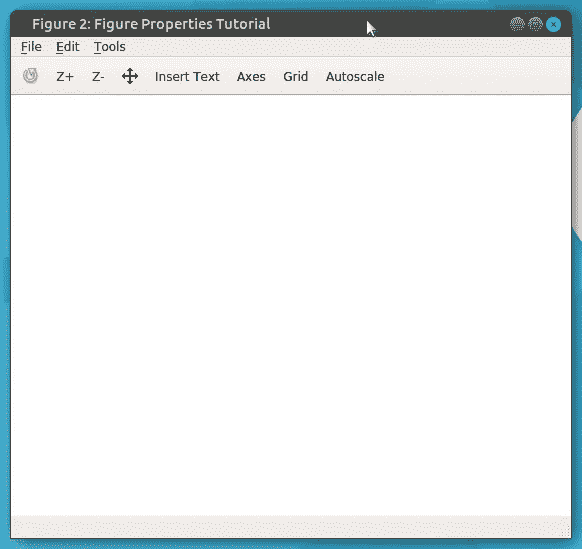
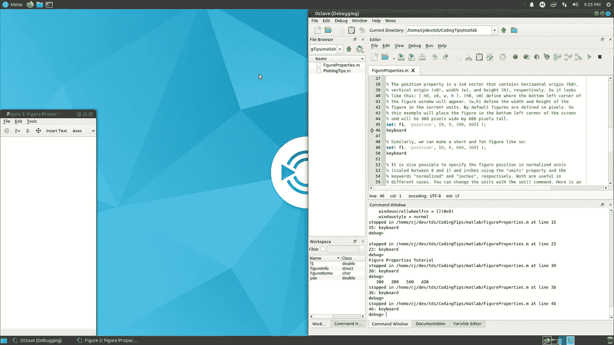
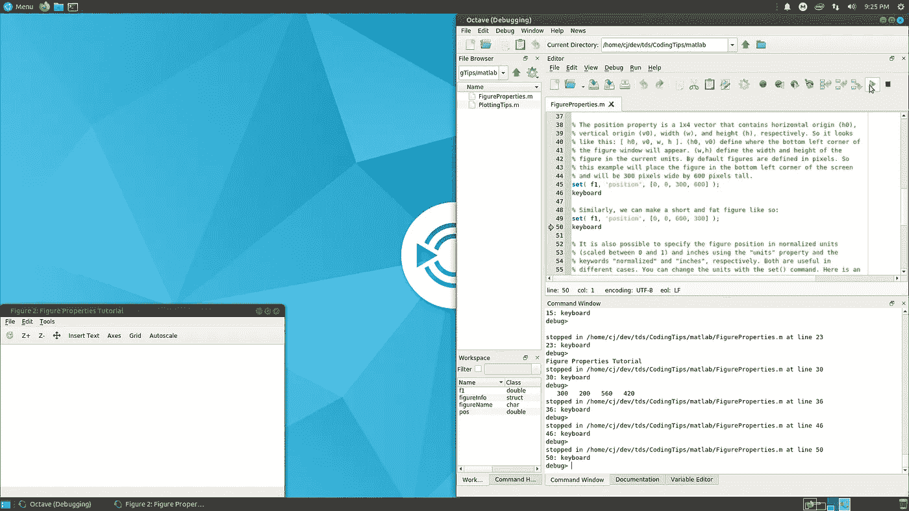
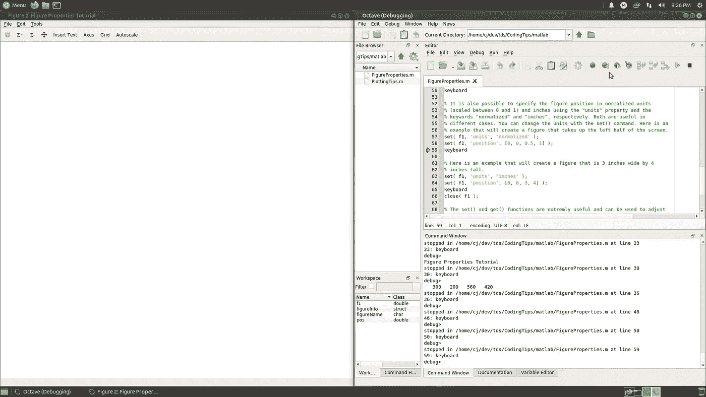

# MATLAB 中的图形属性

> 原文：<https://towardsdatascience.com/figure-properties-in-matlab-f2d45dfa28c6?source=collection_archive---------46----------------------->


作者图片

## 使用 set()和 get()更新图形对象

在本教程中，我们将介绍两个基本函数， *get()* 和 *set()* ，它们可用于在 MATLAB 中操作图形对象的属性。具体来说，我们将关注数字；然而，这些方法可以应用于许多不同的对象。

所有示例代码都可以在[编码技巧 GitHub](https://github.com/ThinkData-science/CodingTips) 库中找到，应该可以在 MATLAB 和 Octave 中运行。本教程中包含的示例输出是使用 Octave 运行的。

让我们从创建一个图形并保存其句柄开始。在 Octave 和更老版本的 MATLAB (r2014a 和更老版本)中，这将返回一个索引；然而，在 MATLAB 的最新版本中，这将返回一个图形对象。

```
f1 = figure();
```

使用 *get()* 函数，我们可以检查图上的属性。在 MATLAB 中，这将返回一个对象，但在 Octave 中，这将返回一个结构。下面的示例显示了图形属性。请注意，为了便于说明，输出中的一些长矩阵已被替换为“…]”。

```
figureInfo = get( f1 );
disp( figureInfo );scalar structure containing the fields:beingdeleted = off
    busyaction = queue
    buttondownfcn = [](0x0)
    children = [](0x1)
    clipping = on
    createfcn = [](0x0)
    deletefcn = [](0x0)
    handlevisibility = on
    hittest = on
    interruptible = on
    parent = 0
    pickableparts = visible
    selected = off
    selectionhighlight = on
    tag =
    type = figure
    uicontextmenu = [](0x0)
    userdata = [](0x0)
    visible = on
    alphamap = [...]closerequestfcn = closereq
    color =1   1   1colormap = [...]currentaxes = [](0x0)
    currentcharacter =
    currentobject = [](0x0)
    currentpoint =0
       0dockcontrols = off
    filename =
    graphicssmoothing = on
    integerhandle = on
    inverthardcopy = on
    keypressfcn = [](0x0)
    keyreleasefcn = [](0x0)
    menubar = figure
    name =
    number =  2
    nextplot = add
    numbertitle = on
    outerposition =1   552   562   529paperorientation = portrait
    paperposition =0.25000   2.50000   8.00000   6.00000paperpositionmode = manual
    papersize =8.5000   11.0000papertype = usletter
    paperunits = inches
    pointer = arrow
    pointershapecdata = [...]pointershapehotspot =0   0position =300   200   560   420renderer = opengl
    renderermode = auto
    resize = on
    resizefcn = [](0x0)
    selectiontype = normal
    sizechangedfcn = [](0x0)
    toolbar = auto
    units = pixels
    windowbuttondownfcn = [](0x0)
    windowbuttonmotionfcn = [](0x0)
    windowbuttonupfcn = [](0x0)
    windowkeypressfcn = [](0x0)
    windowkeyreleasefcn = [](0x0)
    windowscrollwheelfcn = [](0x0)
    windowstyle = normal
```

我们也可以请求我们感兴趣的特定属性，而不是返回所有属性。例如，我们可以通过使用关键字‘name’和 *get()* 函数返回当前的图形名称。默认情况下，该属性将是一个空字符串。

```
figureName = get( f1, 'name' );
disp( figureName );''
```

现在使用 *set()* 方法我们可以改变图上的属性。例如，我们可以使用类似的语法来更改图形名称。

```
set( f1, 'name', 'Figure Properties Tutorial' );
figureName = get( f1, 'name' );
disp( figureName );Figure Properties Tutorial
```

这个名称现在也将显示在图形窗口的顶部。



作者图片

您将想要使用的最常见的属性之一是“位置”。例如，我们可以使用这个关键字和 *get()* 函数来获得当前的图形位置。

```
pos = get( f1, 'position' );
disp( pos );300   200   560   420
```

position 属性是一个 1x4 向量，分别包含水平原点(h0)、垂直原点(v0)、宽度(w)和高度(h)。所以是这样组织的:[ h0，v0，h，v ]。原点(h0，v0)定义了图形窗口的左下角将出现的位置。size (w，h)以当前单位定义图形的宽度和高度。默认情况下，图形以像素为单位定义。

下面是一个例子，它将把图形放在屏幕的左下角，并使它的宽度为 300 像素，高度为 600 像素。

```
set( f1, 'position', [0, 0, 300, 600] );
```



作者图片

或者，我们可以做一个又矮又胖的图形，如下所示:

```
set( f1, 'position', [0, 0, 600, 300] );
```



作者图片

还可以使用“单位”属性和关键字“归一化”来指定以归一化单位表示的图形位置，该归一化单位被缩放到显示大小[0，1]。下面是一个使用标准化单位绘制图像的示例，该图像占据了显示器的整个左侧。

```
set( f1, 'units', 'normalized' );
set( f1, 'position', [0, 0, 0.5, 1] );
```



作者图片

以英寸为单位指定图形大小通常也很有用。如果您在多个显示器上运行相同的代码，并且需要一致的输出，这将非常有用。当你试图为出版物准备情节时，这也很有帮助。创建 3 英寸宽、4 英寸高的图形的简单示例如下所示:

```
set( f1, 'units', 'inches' );
set( f1, 'position', [0, 0, 3, 4] );
```

另一件很好的事情是将这两个命令结合起来，让您以编程方式设置多个图形，使其具有相同的属性或以某种方式相关的属性。假设有两个打开的图形，手柄分别为 f1 和 f2。以下代码将图 f2 的大小和位置与图 f1 的大小和位置匹配。

```
set( f2, 'units', get( f1, 'units' ) )
set( f2, 'position', get( f1, 'position' ) )
```

*set()* 和 *get()* 函数在 MATLAB 中非常有用，本教程仅仅触及了许多应该定期调整的属性的表面。其他教程将涵盖这些函数在图形、轴和许多其他对象上的更多用途。

值得注意的是，MathWorks 从 MATLAB R2014b 开始引入了 HG2 图形系统，它允许您使用点运算符直接访问图形对象。 *set()* 和 *get()* 方法仍然有效，但是，直接使用对象通常要方便得多。本教程重点介绍了用于实现最大可比性的 *set()* 和 *get()* 函数；然而，所有相同的原则都适用于使用较新的接口。感兴趣的读者可以参考 [MathWorks](https://www.mathworks.com/products/matlab/matlab-graphics.html) 网页了解更多信息。

编码快乐！