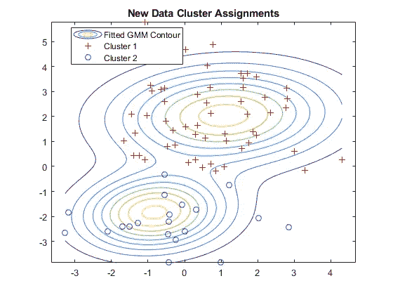

# 使用无监督的机器学习来找出企业 Instagram 帖子的“品牌”

> 原文：<https://towardsdatascience.com/figuring-out-whats-on-brand-for-corporate-instagram-posts-through-unsupervised-machine-learning-1fd6067fc1a2?source=collection_archive---------42----------------------->


照片由 [NeONBRAND](https://unsplash.com/@neonbrand?utm_source=unsplash&utm_medium=referral&utm_content=creditCopyText) 在 [Unsplash](/s/photos/instagram?utm_source=unsplash&utm_medium=referral&utm_content=creditCopyText) 上拍摄

## 数据科学

对来自美国 500 家最大公司的 15，000 多条 Instagram 帖子使用网页抓取、维度缩减和无监督机器学习，尝试并构成一个普通公司帖子的风格。

当我过去帮助计划和管理大学活动时，“风格指南”这个词每天都被挂在嘴边。它的理念是你发布的所有东西都应该有一致的字体、大小、调色板等等。我认为这将是一个有趣的练习，看看哪些行业有最多样化的图片帖子(或最不标准的风格指南)以及 Instagram 上的文字说明。

我的理论是，一些行业应该非常标准，尤其是面向消费者的行业(即汽车应该是一堆汽车)。其他行业可能根本不是标准行业(类似于财务咨询)！

我分三步做了这件事:

1.  获取各公司帖子的图文数据
2.  图像和文本数据的主成分分析和 t-SNE
3.  基于高斯混合模型的异常检测

对于所有交互式图表，您必须从文件夹中下载 html 文件[并在浏览器中打开它。](https://drive.google.com/drive/folders/1Q5IKcvwtADh58p3ycFcPL-pZBCrsTebF?usp=sharing)

## 获取各公司帖子的图文数据

事实证明，这一部分比实际困难更耗时，主要是因为需要大量的抓取和超时。每个脚本的运行时间显示在每个步骤的旁边。

1.  获取标准普尔 500 公司的 Instagram 句柄(2 小时)
2.  获取每个公司页面上的帖子链接列表(4 小时)
3.  从页面上的每个帖子中获取照片来源链接列表(6 小时)

为了完成这些步骤，我同时使用了`selenium`和`beautifulsoup4`。对于第一步来说，这个脚本并不难制作，我只是用 selenium 打开了一个 webdriver，继续搜索`name-of-company + ‘ instagram’`，然后获取包含`(@`的第三个文本元素。首先导入这些包:

```
import pandas as pd
import numpy as np
import datetimefrom selenium import webdriver
from selenium.webdriver.common.keys import Keys
from selenium.webdriver.support.ui import WebDriverWait
```

然后代码看起来像这样:

检查完页面上的一个元素后，右键单击 html 可以得到`xpath`，然后只需转到`copy → xpath`。有时使用`CSS selector`更好，因为`xpath`会因不同的职位而变化。

为了抓取帖子，我将循环遍历以下内容:

1.  `driver.get(“instagram.com/” + username)`
2.  拉动`driver.page_source`前滚动三次
3.  使用 bs4 将每个卡中的 post 链接拉入数据帧

Instagram 似乎会从 html 中卸载帖子链接，如果你向下滚动得太远，你可以拉出 html 并以某种方式附加它——但我觉得 16，711 个帖子对于这个练习来说足够了。最后一步是遍历每个 post 链接，并提取图像 src 和 post 文本。作为预防措施，我将这些图像保存到了我的桌面上，但是你不需要这样做。针对不同的情况(不同的帖子类型、没有帖子、旧格式等)进行了一些测试，但这并没有占用太多时间。我让它运行了一整夜，然后把它保存在一个 excel 文件中。

我用这个函数将照片读入扁平数组:

一旦我保存了所有的照片，我就用这段代码并行读取数组值(其中`sorted_files`是我所有图像文件的路径，由索引命名):

虽然连接步骤占用的时间比并行化应用节省的时间多，所以我决定改用 swifter(它根据任务选择向量化而不是 Dask 并行化)。这大约需要 4 分钟来运行。

```
import swiftersorted_files["Photo"] = sorted_files[0].swifter.apply(lambda x: PC_to_image_flat(x))
```

如果您有磁盘空间，那么使用这个函数将它们保存在一个字节数组中:

## 图像和文本数据的主成分分析和 t-SNE

MNIST 数据集上有很多降维的好例子，比如这个[这里](https://dash-gallery.plotly.host/dash-tsne/)。对于图像，我们必须将 1080x1080 的照片展平成一个数组。因为是 RGB，这就变成了`image.reshape(-1,3)`而不仅仅是`image.reshape(-1)`。并非所有的帖子都是图片，有 4000 个是视频。我将每张图片的大小调整为 225x225，因为在下面的代码中，我不断达到内存限制(32gb RAM)。

灰度 PCA 图如下所示:


飞机从左边的 BLM 黑方块(-10k，-20k)到右边有小文字的白色方块(0，30k)。中间是一个光谱，从汽车和工具→建筑→团体和人群的照片→单人照片→更抽象的艺术和信息→有很多空白空间的帖子。顶部和底部只是不同的环境(顶部是山，底部是拥挤的照片)。这也告诉我，大多数帖子实际上颜色更深，因为左边的浓度更高。

对于颜色，我必须将尺寸缩小到 100x100x3，但是 PCA 给了我:


与 225x225 的灰度相似，但图像间的一致性较差

当我们使用`px.imshow`将鼠标悬停在数据点上时，我很快组装了一个 dash 应用程序来浏览图像。由于调整大小，一些颜色数据丢失，这可能会影响我们的结果。下面你可以看到我在本地托管应用程序时使用了 t-SNE 图形，右上是黑色方块，左下是白色方块。


内存超过 8gb，所以我不能在 Heroku 上运行。图片来自公开的 Instagram 帖子。

这与 PCA 的趋势是一致的(只是从右到左颠倒了)，但是你可以看到在这个图表中有许多小簇，那里有相似风格的帖子。较大的集群似乎是围绕后布局，颜色和环境。从(10，10)到(15，10)的线簇都是 BLM 类型的帖子，其中在(0，0)周围的中心的许多帖子是一般的建筑物和环境照片。很多照片在整形后都是强烈的蓝色，我其实不太确定这是为什么——可能与`cv2.resize()`如何处理插值有关。

在使用`nltk`对单词进行矢量化并应用相同的变换后，我们得到:


大多数文本都集中在白点(所有的点轮廓都互相遮挡)

还有 SNE 霸王龙:


它就像一个多层球体，并没有告诉我们太多

看起来虽然文字标题中有一些模式，但它们在行业或内容上并没有太大的不同。PCA 的中心谈了很多爱、旅行和世界——这很有意义。边缘上的簇是包含许多“个人简介中的链接”或类似的帖子结束行的帖子，这并不像我预期的那样受欢迎。

## **高斯混合模型异常检测**

如果你不熟悉 K-means，一定要先阅读一下。本质上，通过计算一个点属于一个或另一个聚类的概率，我们比 K-means 更进一步。


概率点 X 存在于聚类 K 中，基于正态分布的总和([https://towardsdatascience . com/Gaussian-mixture-models-explained-6986 aaf5 a 95](/gaussian-mixture-models-explained-6986aaf5a95))

这样，我们可以计算一个新图像属于一个或另一个集群的概率。为了更好地解释什么是模型最大化，以及它如何采取步骤实现它，请查看下图后面的任何一篇文章。


[https://towards data science . com/Gaussian-mixture-models-explained-6986 aaf5 a 95](/gaussian-mixture-models-explained-6986aaf5a95)



[https://towards data science . com/Gaussian-mixture-models-d 13 a5 e 915 c 8 e](/gaussian-mixture-models-d13a5e915c8e)

现在有趣的部分，让我们看看我们是否可以建立一个 GMM 来预测一个张贴的图像何时远离行业中的通常风格。你可以在这里找到代码的完整遍历(以及一般的无监督学习)[。在运行了几次模型以找出最佳 K 值后，我选定了 5。](https://github.com/ageron/handson-ml2/blob/master/09_unsupervised_learning.ipynb)


20 次迭代后收敛

让我们看看空间上的概率总和是否仍为 1:

够近了！这是 2D GMM 的剧情:


最后，异常值如下所示，使用 4%的密度阈值。


这看起来对我们最初的理论没什么用，特别是考虑到 BIC 是 76280。同样根据我们之前的分析，这个数据集可能包含大多数类型的 Instagram 帖子的示例。我们必须努力创造一个异常点。公司特定的模型也不能很好地工作，因为大多数分布在整个空间，如 3M:


300 万条 Instagram 帖子

虽然这些数据肯定有改进的空间，可能还有其他用例，但我现在就暂停在这里。我可能会再次这样做，但对于有更具体策划的反馈的受欢迎的影响者和艺术家来说——也许我们可以对艺术风格和以比预期更相似的方式描绘的主题了解一二。

**结论**

我们已经了解了很多关于 Instagram 帖子图片和文字说明的类型。我们尝试的方法主要是按内容分组，我可能需要应用不同的过滤器和其他图像差分方法来开始识别更多不同的集群。以更高的分辨率和全原色运行可能也有很大的不同。我希望你和我一样喜欢这篇文章。