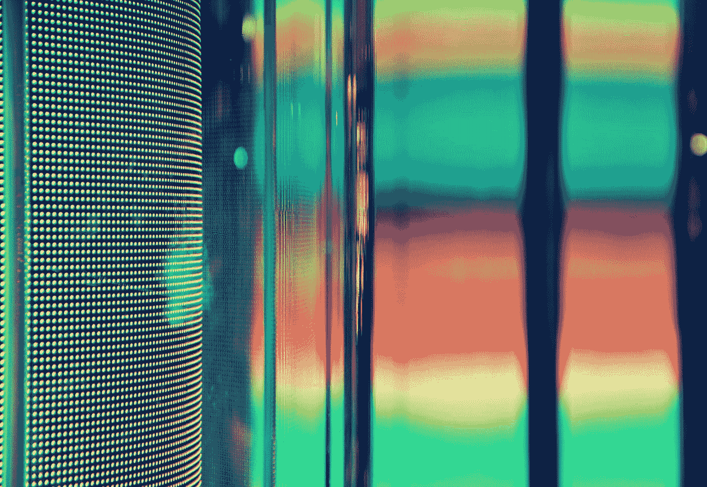
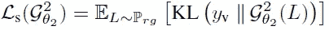
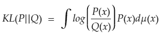
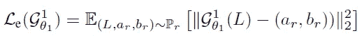
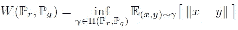
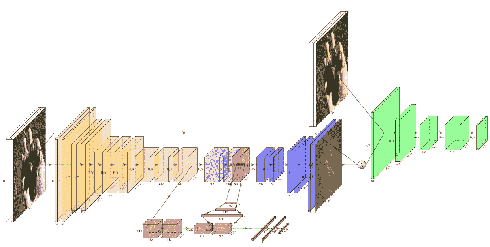
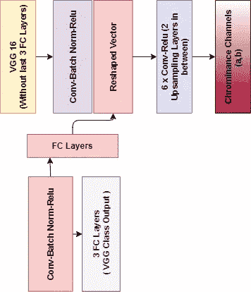
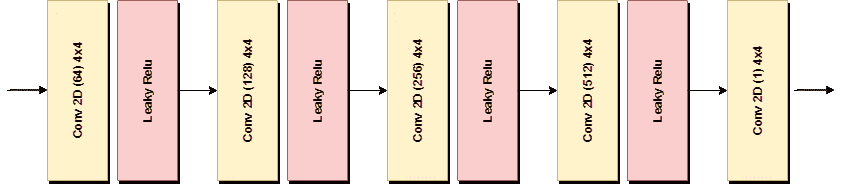
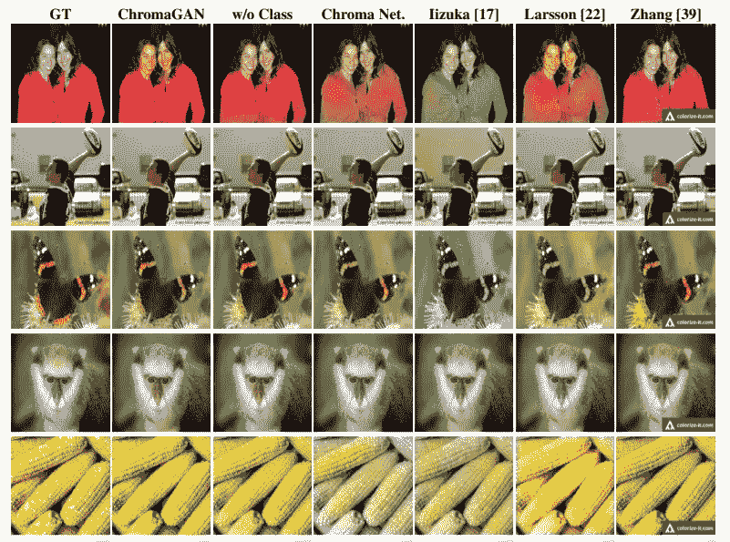
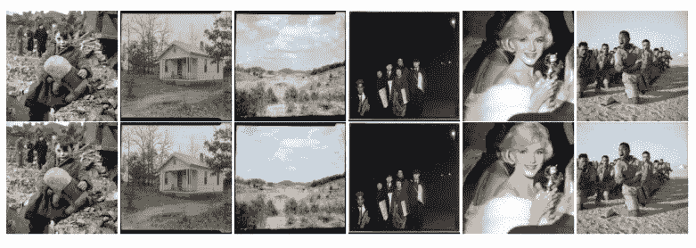

# 让你的世界充满色彩:色度

> 原文：<https://towardsdatascience.com/fill-your-world-with-colors-chromagans-6e916bbff9aa?source=collection_archive---------59----------------------->

## 了解色原以及如何使用它们为图像着色

阿瑟·马齐在 [Unsplash](https://unsplash.com?utm_source=medium&utm_medium=referral) 上的照片

将灰度图像转换成彩色图像似乎是一个古老的问题，但是传统的方法有多少次合理地将图像彩色化了呢？随着时间的推移，随着深度学习的进步，已经提出了各种基于 CNN 的方法来做同样的事情，这些方法已经成功地胜过了它们以前的方法。无论如何，在今天的这篇文章中，我们将看到一种这样的方法，它基于[这里](https://arxiv.org/pdf/1907.09837.pdf)的对抗学习技巧。

为了完全理解这篇文章，建议读者对 GANs 及其工作原理有一个基本的了解。如果你觉得你没有必备的知识，这篇文章不是一个正确的起点。我推荐这样的读者阅读这篇[博客](https://medium.com/r?url=https%3A%2F%2Ftowardsdatascience.com%2Funderstanding-generative-adversarial-networks-gans-cd6e4651a29)并回到这篇文章。

## 损失函数

熟悉 GANs 的人都知道，与其他为不同目的设计的基于视觉的架构不同，在影响发电机网络输出方面，损失函数比其他超参数起着更大的作用。有时，损失函数在很大程度上决定了发电机的输出类型。因此，理解它们以获得发电机如何学习产生特定类型输出的要点是极其重要的。现在，在色度 GANs 中，总损失函数可以分解为三个子损失函数。

*   **类分布损失:**

*级分配损耗*测量发电机(发电机 2)输出和 VGG-16 输出之间的**KL**误差。你们很多人都知道 KL 误差代表 Kullback-Leibler 散度。为了简单地解释，它计算一个概率分布如何不同于给定的参考概率分布。根据上面的公式 ***Y* ᵥ** 是从用于灰度图像的 VGG-16 模型的输出分布中采样的，并且用作参考概率分布。因此，我们将计算发电机的预测分布(*发电机 2* )与 VGG-16 模型的预测分布有何不同。两个概率分布例如 Pand 和 Q 之间的 KL 散度由下式给出，

当所有*x*的 *P* 与 *Q* 相同时，KL 损失为零

*   **颜色误差损失:**

*颜色误差损失*简单地计算发生器(发生器 1)产生的输出和输入图像(真实彩色图像)的色度通道之间的**均方误差**

*   **WGAN 损耗:**

在一个香草 GAN 中，两个概率分布之间的距离用 [*JS 散度(简森-香农散度)*](https://lilianweng.github.io/lil-log/2017/08/20/from-GAN-to-WGAN.html#kullbackleibler-and-jensenshannon-divergence) *来度量。*它有几个问题，因此被替换为*瓦塞尔斯坦距离*也称为*推土机距离。*避免了消失梯度、模式崩溃，实现了更稳定的训练。它量化了将一种概率分布转换成另一种概率分布所需的能量或成本。让我们取两个连续的概率分布***【pᵣ】***(对于真实数据)***p*【𝓰】**(对于生成的数据)*并让***π(pᵣ***、***p*𝓰*)***为 *P* 和 *Q 定义所有联合概率分布的集合* γ( *x，y* )表示 *x* 变为 *y* 的数值变化量。 *瓦塞尔斯坦距离*或*推土机距离*由下式给出:*

**

*其中 **E( *x，y*)∨γ∨*x*—*y*∨=∑γ(x，y)∨x y∨**。最后，在计算 E( *x，y* )后我们取其中的**最小代价**(下确界—最大下界)。*

***注:**为了不偏离文章主旨，说明是有限制的。人们可以参考这个[帖子](https://lilianweng.github.io/lil-log/2017/08/20/from-GAN-to-WGAN.html#wasserstein-gan-wgan)来获得详细的解释。*

## *体系结构*

**

*图片来自[原文](https://arxiv.org/pdf/1907.09837.pdf)*

*从上图可以看出，绿色部分对应于鉴别器，其余部分对应于发生器。发电机由两个子网络 G1 *(发电机 1)* 和 G2 *(发电机 2)* 组成。黄色、紫色、红色和蓝色的**是 G1** ，红色和灰色的**是 G2** 。我们来详细看看各个网络是做什么的。*

*   ***发电机网络:***

*发电机分为网络 G1 和 G2。由于 GAN 必须将灰度图像转换成彩色图像，每个网络接收尺寸为***H*x*w .*的灰度图像，G1 输出色度信息( *a，b* )，其中 *a* 和 *b* 是 CIE Lab 空间中的色度通道。**所以 G1( *L* ) = ( *a，b)*** *。* G2 输出类别分布向量 *y* ，因此**G2(*L*)=*y***(*y*属于 Imagenet 上预定义的 VGG-16 模型的输出分布向量) ***。******

**

*在上面的图像中，紫色块和整形后的矢量被融合，然后输入到蓝色(conv-雷鲁)块中。*

*   ***鉴别器网络:***

*鉴别器架构基于来自 [PatchGAN](https://arxiv.org/pdf/1611.07004.pdf) 的马尔可夫架构。PatchGAN 的鉴别器从输入图像中取出一个 *N* x *N* 的补丁，并尝试识别该补丁是真的还是假的。输出将在来自相应面片的所有输出上进行平均。由于这些补片可能比原始图像小得多，鉴别器将使用较少数量的参数运行，使其计算快速，并允许其任意应用于较大的图像。该模型的主要优点是，即使颜色误差损失(L2 范数)未能捕获高频结构，它也可以跟踪高频结构。*

**

*鉴别器架构(此图对应于整体架构中的绿色部分)*

## *培训流程:*

**G1* 和 *G2* 都是用单一反向传播步骤训练的。根据该论文的超参数配置是 10 个图像的批量大小、2e-5 的学习速率、adam 优化器的 beta(0.5，0.999)。图像大小调整为 224x224，并转换为三个通道的灰度图像(通过将同一通道复制三次)。首先，图像通过发生器网络发出色度通道(a，b ),然后与真实图像的 L 通道融合。现在，从生成的图像中获得一小块，然后鉴别器试图预测它。然后，训练过程与任何敌对网络几乎相同。*

## *结果:*

**

*与其他网络结果的相对比较(图片来自[论文](https://arxiv.org/pdf/1907.09837.pdf)*

**

*使用 ChromaGAN 对历史黑白图像进行着色(图像来自[纸](https://arxiv.org/pdf/1907.09837.pdf)*

*你可以在这个 GitHub 链接中查看作者的官方实现。*

* [## pvitoria/ChromaGAN

### ChromaGAN 的官方 Keras 实现:带有语义类分布的对立图片彩色化

github.com](https://github.com/pvitoria/ChromaGAN)*