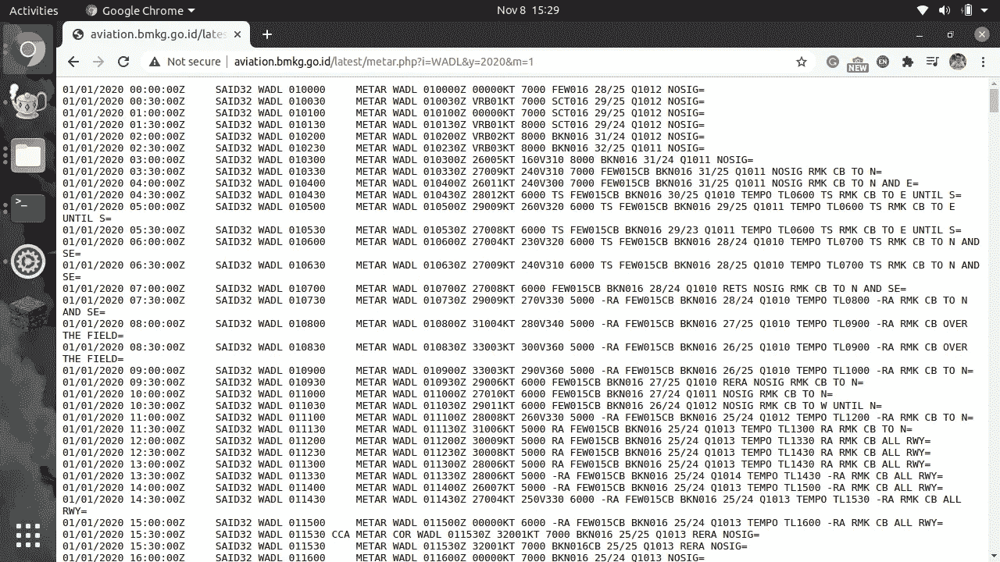
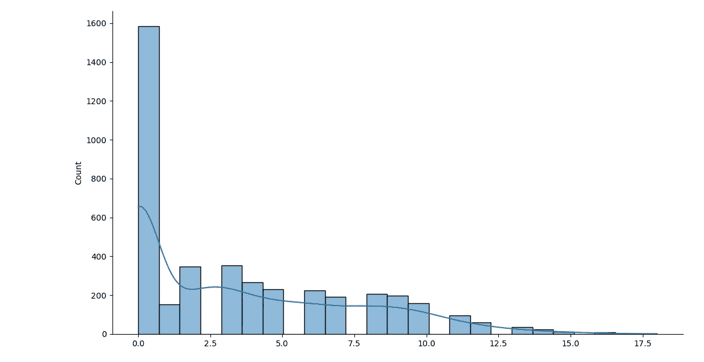
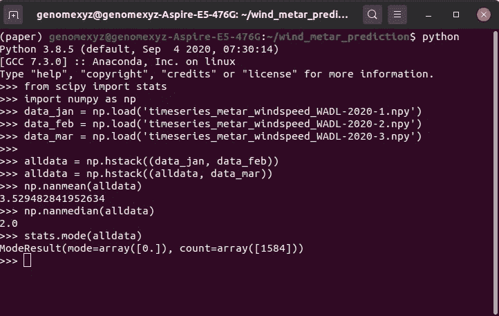
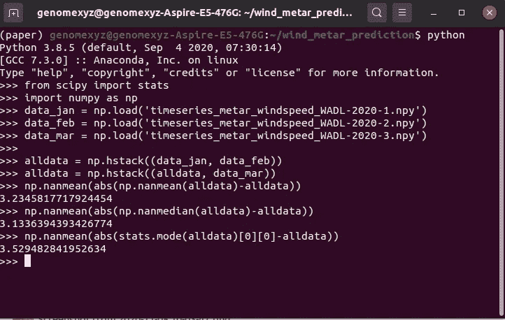
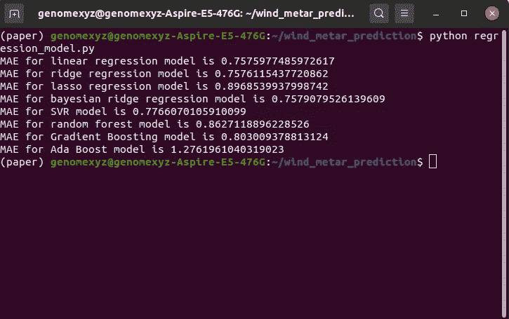

# 用各种回归技术填补缺失的风速数据

> 原文：<https://towardsdatascience.com/filling-missing-wind-speed-data-using-various-regression-technique-3649502ae935?source=collection_archive---------19----------------------->

## 除了使用数据的平均值、中值和众数之外的另一种方法

[伊琳娜](https://unsplash.com/@sofiameli?utm_source=medium&utm_medium=referral)在 [Unsplash](https://unsplash.com?utm_source=medium&utm_medium=referral) 上的照片

当您收集数据时，丢失数据是很常见的。但是当你在数据分析阶段，这将是一个问题。至少对我来说，一个常见的最佳实践是忽略缺失的数据。为什么？因为**没有** **不管你的方法有多好来填补缺失的部分，总会有方法**引入的错误。然后**填充数据不能是数据中缺失的一片图案**。这是因为**方法根据数据**中的可用模式来预测缺失数据。

如果您的数据具有正态分布，则填充缺失数据的最常见方法是使用数据的平均值**。如果不是，则使用中位数或众数。**很多时候，人们使用均值**是因为数据总是假设具有正态分布(我想这就是为什么称之为正态是因为*通常*，数据会具有这种分布)。这是为什么呢？因为这里我们试图猜测丢失的数据是什么，在正态分布中我们知道大多数时候单个数据的值都在数据的平均值附近**，所以最好的猜测是数据的平均值。但这不适用于非正态分布的数据，因此最佳猜测是数据中“中心”的值或最频繁的值。这就是我们选择中位数或众数的原因。

另一种方法是使用回归技术。我们试图**根据缺失数据的周围数据**来预测缺失数据的价值。这就是我们将在本帖中讨论的内容。在本帖中我们将使用**普通** **线性回归(OLR)、岭线性回归(RLR)、拉索线性回归(LLR)、贝叶斯线性回归(BLR)、随机森林(RF)、支持向量回归(SVR)、梯度增强(GB)、Ada 增强(AB)** 。作为一项基准技术，我们将使用数据的平均值和中位数。

我们将使用的数据是龙目岛气象站 METAR 代码中的风速数据。你可以用[http://aviation.bmkg.go.id/latest/metar.php?i=<IATA _ code>&y =<年> & m= <](http://aviation.bmkg.go.id/latest/metar.php?i=WADL&y=2020&m=1) 月>查询印尼任何气象站的气象数据。所以，如果我想得到龙目岛 2020 年 1 月的 METAR 数据，链接是【http://aviation.bmkg.go.id/latest/metar.php?i=WADL】T2&y = 2020&m = 1

示例链接的输出。作者图片

我们的风速数据仍以 METAR 码编码，因此**我们必须先解码 METAR 码**才能提取风速数据。下面是我提取风速数据的代码。

在本例中，我检索了 Lombok 三个月的风速数据(一月、二月和三月)。让我们分割数据来模拟缺失数据。我们将我们的数据分组到一个组中，每个组都有长度为 5 的顺序数据，并将索引 3 中的数据视为缺失数据(标签),其余数据视为参数。

我们的数据准备好了。现在，作为分析数据的第一步，让我们看看数据的分布情况。这是代码

它的输出是

数据的直方图和分布。作者图片

如您所见，我们的数据呈非正态分布。为了测试我们关于谁在什么条件下是最好的理论，让我们检查该数据的平均值、中值和众数，并根据我们的“缺失数据”(标签)检查其平均绝对误差(MAE)。

作者图片

众数是 0，均值是 3.53，众数是 2。让我们看看，哪一个对“缺失数据”的 MAE 最小。

作者图片

如上图所示，平均值的 MAE 为 3.23，中值为 3.13，平均值为 3.52。因此**最佳填充缺失数据是中位数**。中位数的 MAE 将被用作即将到来的回归模型的基准。

这里的代码针对风速缺失数据来训练和测试各种回归模型。在这个代码中，我们使用最后 600 个数据作为测试数据，其余的是训练数据。

结果是

作者图片

所有型号都超过了我们的基准 MAE。如您所见，**一般来说，所有线性模型(OLR、RLR、LLR、BLR)的结果都优于非线性模型(RF、SVR、GB、AB)** 。最好的模型是 OLR。我们在这里提取的气象数据中的风速波动似乎是线性的和可预测的。

好了，这就是如何使用回归模型来填充数据集中缺失数据的真实示例。总之，您选择制作填充数据的方法是基于您的数据的特征。