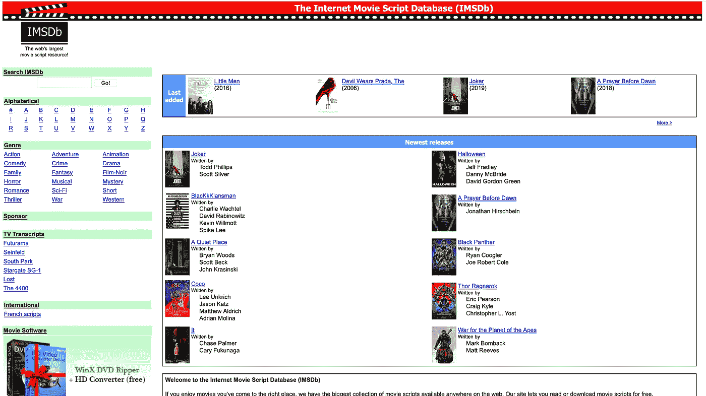
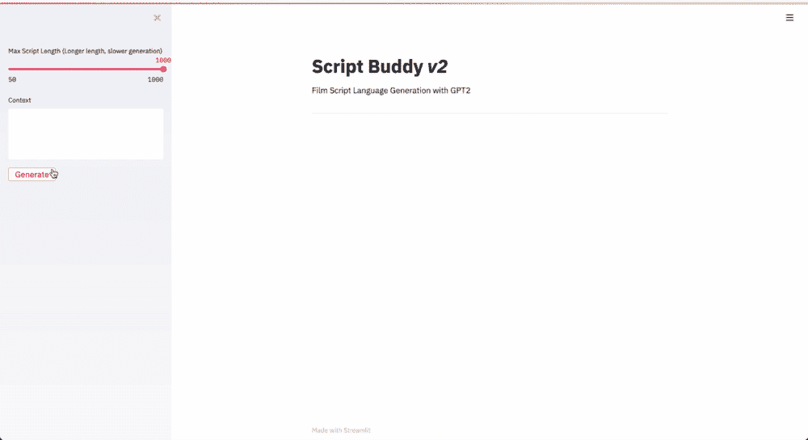

# 用 GPT-2 生成电影剧本

> 原文：<https://towardsdatascience.com/film-script-generation-with-gpt-2-58601b00d371?source=collection_archive---------15----------------------->


卢卡·奥尼博尼在 [Unsplash](https://unsplash.com?utm_source=medium&utm_medium=referral) 上的照片

## 自然语言处理

## 微调 GPT-2 成为编剧使用拥抱脸的变形金刚包。

# 介绍

在过去的两年中，NLP 和语言一代经历了一个*复兴*的时刻。随着 transformer 神经网络架构的出现，围绕这些类型的模型的大量潜在用例的工作(和宣传)出现了爆炸式增长。

语言生成是这些模型的一个特点，我觉得这个特点特别令人印象深刻，主要是因为它提供了一种非常人性化的方式来判断模型内部语言表达的质量。

Open AI 的 [GPT-2](https://openai.com/blog/better-language-models/) 作为一个语言模型已经获得了很多关注，特别是因为它的自动回归特性，这使它能够生成新的文本序列。

在这个项目中，我想在电影剧本数据集 *(~60mb)* 上微调一个语言模型，这个数据集是我从 IMSDB(互联网电影剧本数据库)中搜集的。

我最初是在几年前为我本科时的另一个项目收集了这个数据集，该项目对电影剧本中的对话进行情感分析和聚类。当时我想尝试创作新的电影剧本片段，但研究还没有完成，拥抱脸的变形金刚包也没有完成。

谢天谢地，它现在已经存在了，我可以用它来构建脚本伙伴了。如果您想自己快速启动并运行该模型，您可以:

*   查看下面的 python 脚本片段，并亲自运行该模型。
*   请访问 Github 上的项目，了解如何在您的本地机器上安装和运行 Streamlit 应用程序。
*   查看该机器人在 twitter 上的最新帖子。

> [https://github.com/cdpierse/script_buddy_v2 Github](https://github.com/cdpierse/script_buddy_v2)
> 
> 推特:https://twitter.com/script_buddy

如果你想更多地了解这个项目，或者想知道如何为你自己的项目微调 GPT-2，请继续阅读。

快速开始使用模型— *记得先安装变压器和 py torch/tensor flow*

# 从 IMSDB 抓取剧本



IMSDB 主页

IMSDB 是一个在线电影剧本库，包含大约 1300 个电影剧本。

虽然只有 1300 个剧本，但一个电影剧本平均包含约 30，000 个单词。所以在数据集中，我们有将近 4000 万个单词序列

由于剧本在网站上以纯文本的形式存储，设计一个 scraper 来用 [Scrapy](https://scrapy.org/) 遍历每个剧本 url 变得相对容易。

脚本以纯文本形式存储在 IMSDB 上的另一个巨大好处是，它允许我保持每个脚本的结构和特定的缩进不变。

电影剧本是高度结构化的文本，用视觉线索来表示场景动作、场景位置和人物对话。我希望模型能够生成完整的脚本序列，每个序列中包含混合的脚本元素，因此，在训练时输入模型的数据必须代表剧本的文本和结构布局，以使模型能够优化特定的结构，这一点很重要。

随着每一个剧本的搜集，我也能够收集类型元数据。虽然我没有使用它来训练模型，但过滤特定流派的训练脚本将是一种潜在的进一步微调模型的方法，以便在未来生成属于特定流派的片段。

# 准备数据

要将脚本数据批量加载到模型中，它需要采用 GPT 新协议的正确标记化格式。谢天谢地，使用 PyTorch 的 dataset 类和 transformers 进行设置相对容易。

我创建了一个 ScriptData 类*(见下文)*，它将整个脚本数据集分割成标记化的张量块。一旦运行，这些模块就可以在训练循环中批量加载到 GPT-2 中。如果您自己正在使用 transformers 包，那么根据您自己的项目需求修改下面的 dataset 类应该相对简单。

# 微调 GPT-2

在我动手之前，微调对我来说似乎非常令人生畏。然而，一旦我进入拥抱脸的文件，并找到一些资源，我开始拼凑如何微调和 GPT-2 的一些内部机制如何工作。感谢马丁·弗罗洛夫在他的[帖子](https://mf1024.github.io/2019/11/12/Fun-With-GPT-2_/)中详细介绍了他是如何在一组笑话上对 GPT-2 进行微调的，这是一个巨大的帮助。

首先，你**需要**一个 GPU 来真实地训练一个像 GPT-2 或变形金刚模型一般的模型，我利用了 [Paperspace 的](https://www.paperspace.com/)免费 GPU 支持的 Jupyter 笔记本。我选择这个而不是 Google Colab 的 GPU 笔记本，纯粹是因为我不喜欢 Colab 的按键绑定和界面。但是，如果 Colab 是您的笔记本电脑，它也将工作得很好。

我用的`gpt2-medium`是变形金刚提供的 GPT-2 的中型版本。这个版本的模型有 12 层，大约 3.45 亿个参数。由于免费笔记本中 GPU 的内存限制，在这个`gpt2-large`和`gpt2-xl`之上还有两个版本的模型我在最初的培训中没有使用。希望将来我会使用更大的模型做一些进一步的微调。

用 transformers 包调用模型及其标记器非常简单，可以通过两行代码完成:

```
tokenizer = GPT2Tokenizer.from_pretrained('gpt2-medium')
model = GPT2LMHeadModel.from_pretrained('gpt2-medium')
```

有了这两个对象，您可以按原样使用 GPT-2，但是要在标记化文本的自定义数据集上对其进行微调或优化，您需要创建一个训练循环，从整个数据集中逐步加载一批脚本序列。

> C 为数据加载器选择一个批处理大小可能很棘手，如果你选择了一个太大的大小，会导致你很快耗尽 GPU 内存。为了安全起见，我建议从 1 开始，测试你能推多远。最后，我成功地训练了批量为 7 的模型。

对于每一批，标记化张量作为其输入和目标标签通过语言模型头运行。返回了许多结果，我们使用前两个结果:`loss`和`logits`对梯度进行反向传递，并报告一定步数的损失。

每 200 个批次，我设置一个评估步骤，生成一批文本，这有助于在培训期间作为一个可视化的辅助工具来查看模型优化和捕获脚本结构的情况。从 2.4 版本开始，transformers 中增加的`generate`功能非常有用，它提供了许多不同的解码方法，您可以调整这些方法以获得最佳的生成结果。

> 查看他们的帖子[https://huggingface.co/blog/how-to-generate](https://huggingface.co/blog/how-to-generate)以了解更多信息。

我总共运行了 3 个完整时期的模型，每个时期花费了大约 6 个小时。

要查看下面微调脚本的完整笔记本，请单击[此处](https://github.com/cdpierse/script_buddy_v2/blob/master/script_buddy/script_generation.ipynb)。

# 简化应用程序

模型本身被托管在 huggingface 的[模型中心](https://huggingface.co/cpierse/gpt2_film_scripts)中，可以使用这个包直接下载。

我还利用这个模型作为最终使用 [Streamlit](https://www.streamlit.io/) 的机会，这是一个新的 python 框架，用于快速构建 ML 和数据工具。

[](/coding-ml-tools-like-you-code-ml-models-ddba3357eace) [## 将 Python 脚本变成漂亮的 ML 工具

### 介绍专为 ML 工程师打造的应用框架 Streamlit

towardsdatascience.com](/coding-ml-tools-like-you-code-ml-models-ddba3357eace) 

编写好友 Streamlit 应用程序脚本

这款应用的开发轻而易举，不到 40 行代码就完成了。一个特别棒的特性是内置的缓存装饰函数，它允许我只在应用启动时加载一次模型和标记器，而不是在侧边栏的元素改变时。

# 推特机器人

Script Buddy 也作为 tweepy 开发的机器人在 [twitter](https://twitter.com/script_buddy) 上运行。该机器人每天都会在推特上发布几次随机脚本样本。如果你想跟上机器人作为编剧的萌芽生涯，请随意关注。

剧本伙伴的家庭情节剧

# 包裹

希望这有助于你理解如何微调变形金刚包。

我发现这个项目最有趣的地方是这个模型开始聚焦于剧本的一般结构的速度有多快。我想这很大程度上是因为电影剧本的格式在整个行业都是标准化的，因此为这个模型提供了大量可以优化的例子。展望未来，我希望在更大版本的 GPT-2 上训练模型，并将随着模型的改进更新机器人，希望脚本巴迪的巨著就在眼前。