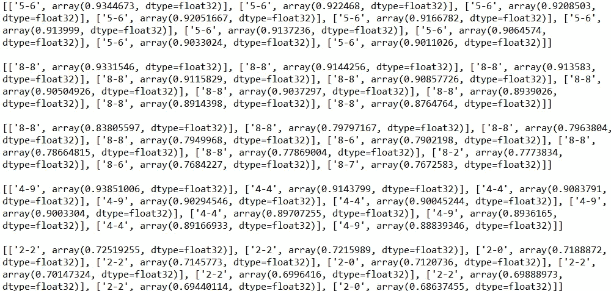

# 无监督学习的学习过滤器

> 原文：<https://towardsdatascience.com/filter-learning-with-unsupervised-learning-6e72fd5057a9?source=collection_archive---------42----------------------->

## 一种无监督学习方法，用于学习能够从图像中提取有意义特征的过滤器

数据就是一切。尤其在深度学习中，数据量、数据类型、数据质量是最重要的因素。有时，我们拥有的标记数据的数量不够，或者我们处理的问题领域对使用大量数据没有意义，例如在少量学习中。在这些情况下，重要的因素是算法。在深度度量学习中，我们使用的损失函数是最重要的因素。我们在 DML 中尝试做的是学习一组特征，这些特征可以区分不同的图像样本，同时将相似的图像样本相互匹配。

在我的工作中，我已经开始从事一个项目，我们需要利用深度度量学习方法。我们需要从图像中提取有意义的特征，以便我们能够准确地分类成千上万的图像样本。虽然 DML 是我们构建的系统的问题域，但我在考虑可以从图像中提取有意义特征的其他方法。我回头看了看人类的大脑。

我认为，人脑既不是分类模型，也不是自动编码器模型。人脑是一个 DML 系统，其中每个对象、每个场景和每个输入都用一组嵌入来表示。但是，当我们还是婴儿的时候，有没有人过来给我们看每一件物品并说

"嘿，孩子，看，这个物体和这个物体是不同的，而这些是相同的."？

嗯……他们没有。就在我们能说话的时候，我们这些好奇的孩子不停地向父母提问。

“嘿，妈妈/爸爸，这是什么？”。

学习我们看到的每件事物的嵌入确实发生在我们学习对大脑中的嵌入进行分类之前，而且这个过程是在无人监督的情况下发生的，就在我们自己的时候。所以，这种学习机制不是 DML 算法。那是什么？

我已经想出了一个解决这个问题的基本方法:特征区分。

## 特征区分

在这种方法中，我们需要建立一个神经网络，其中每个卷积层在同一级别上尽可能互不相同。所以，当我们用 32 个 5x5 的滤镜对一幅灰度图像进行卷积运算时，这 32 层应该互不相同。我们如何做到这一点？答案是余弦相似度。我们可以通过两个展平层(其中一个被转置)的矩阵乘法来容易地计算余弦相似性。我们需要应用这个操作多少次？答案与卷积层的组合一样多。

让我们开始编码吧，我知道这是你喜欢的部分。

## 首先，让我们导入我们的库，我将使用 PyTorch 来构建神经网络:

```
import torch
import torch.nn as nn
import torch.optim as optim
from torchvision import datasets, transforms
import itertools
import numpy as np
import matplotlib.pyplot as plt
```

## 接下来是构建卷积图层类:

```
class ConvLayer(torch.nn.Module):
    def __init__(self, in_channels, out_channels, kernel_size, stride):
        super(ConvLayer, self).__init__()
        self.conv2d = torch.nn.Conv2d(in_channels, out_channels, kernel_size, stride)def forward(self, x):
        out = self.conv2d(x)
        return out
```

因此，现在我们需要建立两个网络，其中一个包括每个级别的卷积层，而另一个包括所有级别的卷积层。

## 一级卷积层的网络:

```
class SSNet(torch.nn.Module): # The child class
    def __init__(self,in_filters, out_filters):
        super(SSNet, self).__init__()
        self.conv1 = ConvLayer(in_filters, 64, kernel_size = 5, stride = 1)
        self.conv2 = ConvLayer(64, out_filters, kernel_size = 1, stride = 1)
        self.relu = torch.nn.ReLU()

    def forward(self, x):
        out = self.conv2(self.relu(self.conv1(x)))
        return out
```

你可能会问，“嘿，Evrim，你为什么在每一层中使用两个卷积层？”答案是它们捕捉了更多的要素，并且这种方法比单个卷积图层效果更好。另外，我在单个卷积层的末尾应用的 ReLU 会在一段时间后导致 nan 的损失。当我把 ReLU 放在两个卷积层之间时，我没有得到 nan 值的损失。我没有解释得这么“科学”，我知道。但是，如果你正在寻找科学文章，媒体很可能不是一个“科学”文章的地方，不是吗？:D

不管怎样，我们继续。现在，我们需要构建 main，即包含每个卷积运算级别的母类。正如您在下面的类中所看到的，每个卷积图层被称为一个子图层，它们被追加到一个“子”Python 列表中。如果您在“Sequential”函数的输入中询问“children”列表前面的星号，该星号将解释 children 列表中的每个元素，而没有包围它们的列表。

```
class SSNetMultiple(torch.nn.Module): #The Holy Mother Class
    def __init__(self):
        super(SSNetMultiple, self).__init__()
        self.children = []
        for cnt in range(4):
            if cnt == 0:
                in_filters, out_filters = 1,16
            elif cnt == 3:
                in_filters, out_filters = 16,4
            else:
                in_filters, out_filters = 16,16
            self.children.append(SSNet(in_filters, out_filters))

        self.main = nn.Sequential(*self.children)

    def forward(self, x, queue = 1):
        outs = [x]
        for cnt,child in enumerate(self.main):
            if cnt<queue:
                outs.append(child(outs[-1]))
        return outs[-1]
```

我知道您正在考虑 forward 函数中的“队列”问题。你还记得我们需要在卷积层的一个级别中区分每个特征图吗？我们将在几个层中这样做，队列就是为此而工作的。剩下的就看你的了，读读代码，试着理解一下，我们不可能一直过着安逸的生活，对吗？

好了，现在我们上课了。我们给他们打个电话吧。但首先，我们需要数据来训练网络并做一些测试。

```
transform=transforms.Compose([
        transforms.ToTensor()
        ])
dataset = datasets.MNIST('../data',
                         train=True,
                         download=True,
                         transform=transform)
```

## 让我们定义母模型和一些其他必要的参数。

```
model = SSNetMultiple()
lr = 0.8
optimizer = optim.SGD(model.parameters(), lr=lr)
lossfunc = nn.MSELoss()
loss_obs = 0
epoch = 0
```

Holly molly，Evrim 这个学习率好高啊！我知道，我知道。我通过反复试验来确定这个学习速度。学习速度越慢，学习就越慢。当我说慢，我是认真的。

## 现在是时候为训练迭代写一个脚本了。

```
while epoch<4:
#    if epoch>0:
#        for cc,param in enumerate(model.main[epoch-1].parameters()):
#            print(epoch-1,"grad is deactivated")
#            param.requires_grad = True
    for cnt,sample in enumerate(dataset):
        optimizer.zero_grad()
        image, label = sample
        out = model(image.unsqueeze(0), queue = epoch+1)
        sim_vec = sim_func(out)
        loss = lossfunc(sim_vec, torch.zeros(sim_vec.shape))
        loss_obs_ = torch.max(torch.abs(sim_vec-torch.zeros(sim_vec.shape)))
        loss_obs += loss_obs_
        loss.backward()
        optimizer.step()
        print("__Loss: {}__".format(loss_obs_))if cnt%10 == 0 and cnt!=0:
            loss_obs = loss_obs/10
            print("Epoch: {}\tSample: {}\tLoss: {}\tLR: {}".format(epoch,cnt,loss_obs,optimizer.param_groups[0]["lr"]))
            if loss_obs<0.40:
                epoch += 1
                break
            loss_obs = 0
```

## 那么，这里发生了什么？

我们从数据集中提取每个样本，并将其提供给模型。如果我们在第一个纪元中，模型学习区分第一级上的特征图。如果我们在第二个纪元，模型学习区分第二个层次上的特征图，这样继续下去。简单对吗？

那些被评论的部分呢？他们将冻结已经能够区分过滤器的水平的学习过程。你可以激活那部分并尝试，但我发现冻结它们并不能让网络更容易地学习下一级。

因此，在每个时期，我们的相似性向量得到较少的值，因为它最初是针对的。如果观察到的损失(这不同于均方损失，并且不用于反向传播)在最后 10 个损失值的平均值上小于 0.4，则该卷积级别的训练完成。所以，我们跳到下一个。

如你所知，我们这里不需要任何标签。我们只是试图在前馈过程结束时得到最不同的特征图。

此外，网络已经达到数据集的最大 300 个样本，直到它完成每一级的学习过程。

## 所以，让我们测试一下，看看我们如何从我们的网络中获得准确的结果。

```
def test(test_index = 0):
    img0,label0 = dataset[test_index]
    out0 = model(img0.unsqueeze(0), queue = 5)

    results = []
    for cnt,sample in enumerate(dataset):
        if cnt<10000 and cnt!=test_index:
            img1, label1 = sample
            out1 = model(img1.unsqueeze(0), queue = 5)

            first = out0.flatten()
            second = out1.flatten()

            first_norm = (first - torch.mean(first)) / (torch.std(first) * len(first))
            second_norm = (second - torch.mean(second)) / (torch.std(second))

            results.append(["{}-{}".format(label0,label1),torch.matmul(first_norm,second_norm.T).detach().numpy()])

    sorted_results = sorted(results,key = lambda x:x[1],reverse=True)
    print(sorted_results[0:10],"\n")
    return sorted_resultssr1 = test(test_index = 2000)
sr2 = test(test_index = 2001)
sr3 = test(test_index = 2002)
sr4 = test(test_index = 2003)
sr5 = test(test_index = 2004)
```

这里发生了什么？我们给出一个样本索引作为输入。这个样本索引是我们将与其他样本进行比较的锚。然后，我们将每个样本输入神经网络，我们得到嵌入，并将这些嵌入与锚样本的嵌入进行比较。正如你在“如果”条件中看到的，测试样本永远不会与锚定样本相同。

结果？给你:



当我们比较标签为“5”的样本时，我们发现大多数相似的样本都有标签“6 ”,这有点符合逻辑，因为 5 和 6 在视觉上是相似的数字。

当我们比较一个标签为“8”的样本时，我们发现大多数相似的样本都有标签“8”，yeeyyy！

对于标签为“4”的样本，我们找到的最相似的样本是 9，但我们也找到了标签为“4”的相似样本，数量相当多。

对于标签为“2”的样本，网络再次成功。

## 结论

我们看到，网络已经学会区分特征图，这有助于它创建嵌入，帮助我们准确地对样本进行分类。我知道它没有那么高的精确度。但是记住，这只是一个婴儿的特征提取过程。婴儿还没有长大到足以对从视觉中提取的嵌入进行分类。这将是我需要继续的下一步。

## 链接到包含代码的回购:[链接](https://github.com/evrimozmermer/filter_distinguisher)

链接到这个主题的下一篇文章:[链接](https://link.medium.com/e4a4kTmYvab)