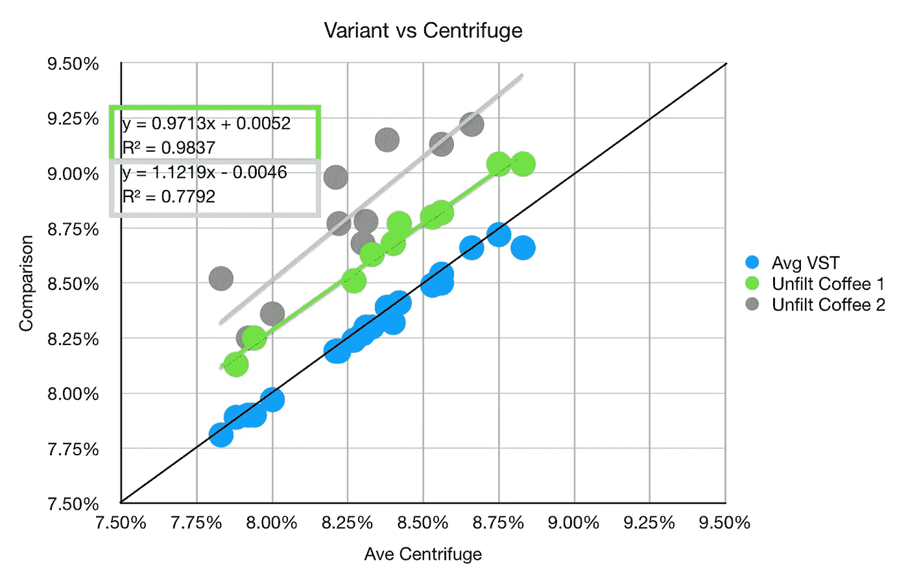
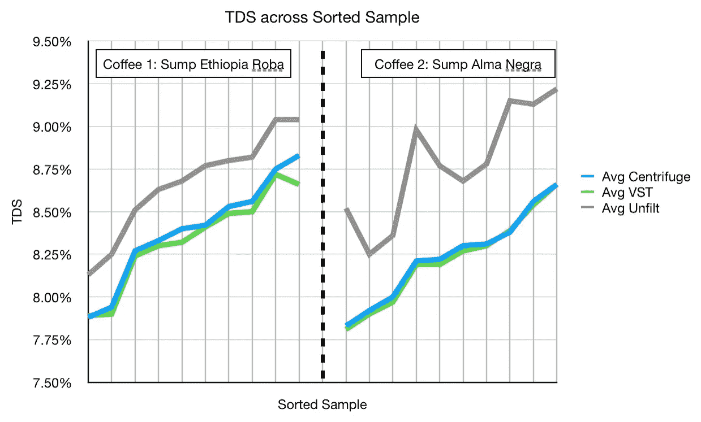
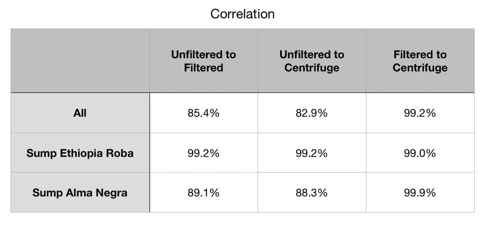
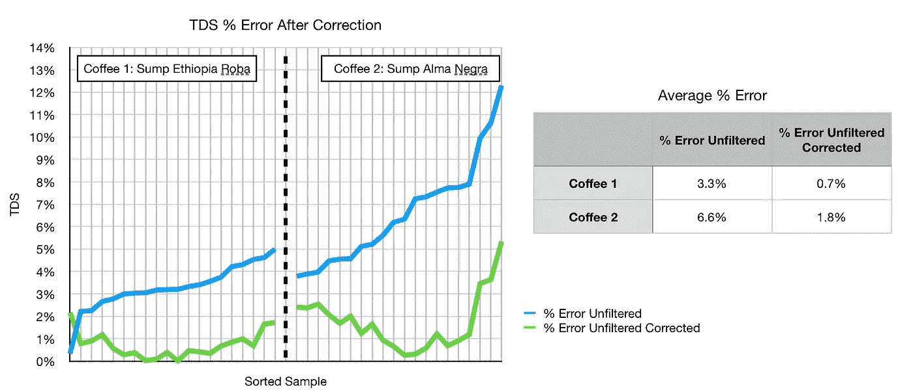

# 用于 TDS 咖啡测量的过滤注射器似乎是不必要的

> 原文：<https://towardsdatascience.com/filter-syringes-for-tds-coffee-measurements-seem-to-be-unnecessary-e52aded77ac4?source=collection_archive---------37----------------------->

## 对以前作品的评论

当我在万维网上闲逛时，我偶然发现了一个关于在进行 TDS(总溶解固体)测量之前过滤浓缩咖啡样本的小研究。 [TDS 广泛用于测量咖啡萃取率](https://link.medium.com/5rypQgHc19)作为一种更客观的咖啡质量测量方法。这项小型研究对比了使用离心机和注射器过滤器进行样品过滤的情况。他们在几周的时间里，在两个咖啡豆之间分配了 20 个镜头，比较了离心机、注射器过滤器和未过滤的样本。他们一丝不苟地确保样品是好的。

然而，我不同意他们的发现，我认为他们错过了一个机会，因为他们绘制数据的方式。从好的方面来看，他们似乎发现了一些有趣的东西:过滤样本和未过滤样本之间存在直接的相关性和转化。这意味着，即使在没有滤波器的情况下测量 TDS，您也可以高精度地估计滤波后的 TDS。本质上，使用昂贵的离心机或昂贵的注射器过滤器对于在家里或咖啡馆测量 TDS 是不必要的；未过滤的测量是可靠的。

# 这项研究

[之前来自苏格拉底咖啡的数据](http://socraticcoffee.com/2015/07/measuring-total-dissolved-solids-a-refractometer-comparison-part-iii-espresso-filters/)表明过滤结果只会提高精确度。我之前发现过滤不够有用，不足以证明其成本。最终，对于一个已经非常昂贵的爱好来说，离心机或注射器过滤器是非常昂贵的。

这项[研究](http://awasteof.coffee/science/espresso-filtration/)在多天内采集了 20 份样本，拍摄了多张照片，在两杯咖啡之间进行了分割。然后他们计算概率分布来显示未过滤的样本是有问题的。他们在表格中显示了数据，但没有将数据绘制成散点图。

我对数据很好奇，就拉出来看看。如果他们的数据证明过滤是必要的，我会更倾向于过滤我所有的结果。然而，过滤样品有一个主要的成本障碍，即注射器过滤器很贵，即使离心机不贵，也需要更多的时间。

# 数据

他们提供了[原始数据](https://docs.google.com/spreadsheets/d/1gCCO6zOrVnQnYyXgD_J6PdCcUe_ksr8BTZ5dPTHXvos/edit?usp=sharing)，我从一些散点图开始。

一条简单的最佳拟合线性线显示 R^2 值为 0.68，这是相当高的。因此，让我们再次将数据分成两个独立的部分，看看这是如何改变这些趋势的。

现在每种咖啡的线性拟合更强，这表明从过滤样品到未过滤样品的转换。让我们将样品排成一行并分类，但按咖啡分类:

同样，它们是相互关联的，所以我们应该计算相关性。相关性是一个有助于理解两个指标趋势的紧密程度的指标:

对于水坑埃塞俄比亚 Roba 来说，相关系数太高，不能忽略。即使是 80 多岁的 Sump Alma Negra 相关系数也表明，未过滤和过滤之间的联系只是一种转换。

将变换应用于每个数据组，我们可以计算常规测量的百分比误差(| x-x _ ground truth |/x _ ground truth)，然后根据最佳拟合线变换进行校正。

假设离心样本是真实的，那么校正后的实际误差百分比就没什么可担心的了。

虽然这项研究的作者在控制变量和收集数据方面做得很好，但他们的分析并没有揭示真正的发现，即证明过滤咖啡样品用于 TDS 测量可能是不必要的。不确定性是每种豆子都有不同的校正曲线，如果你非常担心，一项跨多种豆子的更大规模的研究将有助于证实这一理论。

如果你愿意，可以在 Twitter 和 YouTube 上关注我，我会在那里发布不同机器上的浓缩咖啡视频和浓缩咖啡相关的东西。你也可以在 [LinkedIn](https://www.linkedin.com/in/robert-mckeon-aloe-01581595?source=post_page---------------------------) 上找到我。

# 我的进一步阅读:

[咖啡豆脱气](/coffee-bean-degassing-d747c8a9d4c9)

[解构咖啡:分割烘焙、研磨和分层以获得更好的浓缩咖啡](/deconstructed-coffee-split-roasting-grinding-and-layering-for-better-espresso-fd408c1ac535)

[浓缩咖啡的预浸:更好的浓缩咖啡的视觉提示](/pre-infusion-for-espresso-visual-cues-for-better-espresso-c23b2542152e)

[咖啡的形状](/the-shape-of-coffee-fa87d3a67752)

[搅拌还是旋转:更好的浓缩咖啡体验](https://towardsdatascience.com/p/8cf623ea27ef)

[香辣意式浓缩咖啡:热磨，冷捣以获得更好的咖啡](/spicy-espresso-grind-hot-tamp-cold-36bb547211ef)

[断续浓缩咖啡:提升浓缩咖啡](https://medium.com/overthinking-life/staccato-espresso-leveling-up-espresso-70b68144f94)

[用纸质过滤器改进浓缩咖啡](/the-impact-of-paper-filters-on-espresso-cfaf6e047456)

[浓缩咖啡中咖啡溶解度的初步研究](/coffee-solubility-in-espresso-an-initial-study-88f78a432e2c)

[断奏捣固:不用筛子改进浓缩咖啡](/staccato-tamping-improving-espresso-without-a-sifter-b22de5db28f6)

[浓缩咖啡模拟:计算机模型的第一步](https://towardsdatascience.com/@rmckeon/espresso-simulation-first-steps-in-computer-models-56e06fc9a13c)

[更好的浓缩咖啡压力脉动](/pressure-pulsing-for-better-espresso-62f09362211d)

[咖啡数据表](https://towardsdatascience.com/@rmckeon/coffee-data-sheet-d95fd241e7f6)

[被盗浓缩咖啡机的故事](https://towardsdatascience.com/overthinking-life/the-tale-of-a-stolen-espresso-machine-6cc24d2d21a3)

[浓缩咖啡过滤器分析](/espresso-filters-an-analysis-7672899ce4c0)

[便携式浓缩咖啡:指南](https://towardsdatascience.com/overthinking-life/portable-espresso-a-guide-5fb32185621)