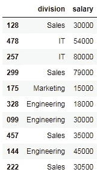
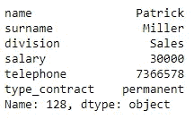
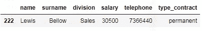
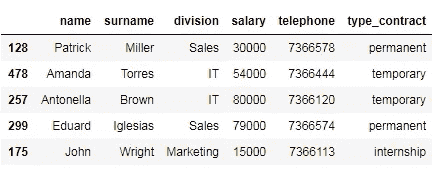
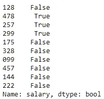

# 熊猫中的数据过滤

> 原文：<https://towardsdatascience.com/filtering-data-frames-in-pandas-b570b1f834b9?source=collection_archive---------0----------------------->

## 清理数据集的完整指南—第 3 部分

从数据框中过滤数据是清理数据时最常见的操作之一。Pandas 提供了多种根据行和列的位置和标签选择数据的方法。此外，Pandas 还允许您获得基于列类型的数据子集，并使用布尔索引过滤行。

在本文中，我们将介绍从 Pandas 数据框中选择数据子集的最常见操作:(1)按标签选择单个列，(2)按标签选择多个列，(3)按数据类型选择列，(4)按标签选择单个行，(5)按标签选择多个行，(6)按位置选择单个行，(7)按位置选择多个行，(8)同时选择行和列，(9)选择标量值，以及(10)使用布尔选择来选择行。

此外，我们将提供多个编码示例！现在，让我们开始吧:)❤️

法国人 Daphné Be 在 [Unsplash](https://unsplash.com/?utm_source=medium&utm_medium=referral) 上的照片

# 数据集

在本文中，我们使用一个小数据集进行学习。在现实世界中，使用的数据集会大得多；然而，用于过滤数据的程序保持不变。

数据框包含一家公司的 10 名员工的信息:(1) id，(2)姓名，(3)姓氏，(4)部门，(5)电话，(6)工资，以及(7)合同类型。

# 1.按标签选择单个列

要在 Pandas 中选择**单列**，我们可以同时使用**。操作员**和**操作员**。

> 按标签选择单个列
> 
> →df[字符串]

以下代码使用两种方法(点符号和方括号)访问 salary 列。

如上图所示，当**检索单个列**时，结果是一个**系列**对象。为了在只选择一列时获得一个 **DataFrame** 对象，我们需要传入一个只有一项的列表，而不仅仅是一个字符串。

此外，重要的是要记住，当列名包含空格时，我们不能使用点符号来访问数据框的特定列。如果我们这样做，就会引发一个**语法错误**。

# 2.按标签选择多列

我们可以通过传入一个列名如下的列表来选择一个数据帧的多个列。

> 按标签选择多列
> 
> →df[字符串列表]

如上所示，结果是一个 **DataFrame** 对象，只包含列表中提供的列。

# 3.按数据类型选择列

我们可以用 [**熊猫。data frame . select _ dtypes(include = None，exclude=None)**](https://pandas.pydata.org/pandas-docs/stable/reference/api/pandas.DataFrame.select_dtypes.html) 方法根据列的数据类型选择列。该方法在参数**中接受列表或单一数据类型，包括**和**排除**。请记住，必须至少提供其中一个参数(包括或排除),并且它们不能包含重叠的元素。

> 按数据类型选择列
> 
> → df.select_dtypes(包含=无，排除=无)

在下面的例子中，我们通过将 **np.number** 对象传递给 **include** 参数来选择数据帧的数字列(整数和浮点数)。或者，我们可以通过提供字符串' **number'** 作为输入来获得相同的结果。

如您所见， **select_dtypes()方法**返回一个 **DataFrame** 对象，其中包含了 **include 参数**中的 dtypes，并排除了 **exclude** **参数**中的 dtypes。

如前所述， **select_dtypes()方法**可以接受字符串和 numpy 对象作为输入。下表显示了在 Pandas 中引用数据类型的最常见方式。

提醒一下，我们可以使用 [**pandas 来检查列的数据类型。data frame . info**](https://pandas.pydata.org/pandas-docs/stable/reference/api/pandas.DataFrame.info.html)**方法或者用 [**熊猫。DataFrame.dtypes**](https://pandas.pydata.org/pandas-docs/stable/reference/api/pandas.DataFrame.dtypes.html) 属性。前者打印数据框的简明摘要，包括列名及其数据类型，而后者返回一个包含每列数据类型的**系列**。**

********

# **4.按标签选择单行**

****数据框**和**系列**不一定有数字索引。默认情况下，索引是指示行位置的整数；但是，它也可以是字母数字字符串。在我们当前的例子中，索引是雇员的 id 号。**

**要通过 id 号选择单个行，我们可以使用**。loc[]索引器**提供一个**单字符串**(索引名)作为输入。**

> **按标签选择单行**
> 
> **→ df.loc[string]**

**下面的代码显示了如何选择 id 号为 478 的雇员。**

****

**如上图所示，当单个行被选中时，**。loc[]索引器**返回一个**系列对象**。然而，我们也可以通过向**传递一个单元素列表来获得一个单行**数据帧**。loc[]** 方法如下。**

****

# **5.按标签选择多行**

**我们可以用**选择**多行**。loc[]索引器**。除了单个标签之外，索引器还接受标签列表或标签切片作为输入**。****

> **按标签选择多行**
> 
> **→df . loc[字符串列表]**
> 
> **→df . loc[字符串切片]**

**接下来，我们获取包含 id 号为 478 和 222 的雇员的数据帧的子集，如下所示。**

****

**注意，**的结束索引。loc[]方法**总是包含在内，意味着选择包括最后一个标签。**

# **6.按位置选择单行**

****。iloc[]索引器**用于按位置索引数据帧。属性选择一行。iloc[]属性，我们将行位置(单个整数)传递给索引器。**

> **按位置选择单行**
> 
> **→df . iloc[整数]**

**在下面的代码块中，我们选择索引为 0 的行。在这种情况下，返回数据帧的第一行，因为在 Pandas 中，索引从 0 开始。**

****

**另外，**。iloc[]索引器**也支持**负整数**(从-1 开始)作为相对于数据帧结尾的位置。**

****

**如上图，当单个行被选中时，**。iloc[]索引器**返回一个将列名作为索引的**系列**对象。然而，正如我们对**所做的那样。loc[]索引器**，我们也可以通过以下方式将单整数列表传递给索引器来获得一个**数据帧**。**

****

**最后，请记住，当试图访问一个超出界限的索引时，会引发一个 **IndexError** 。**

# **7.按位置选择多行**

**为了按位置提取多行，我们向**传递一个 list 或 slice 对象。iloc[]** 索引器。**

> **按位置选择多行**
> 
> **→df . iloc[整数列表]**
> 
> **→df . iloc[整数切片]**

**以下代码块显示了如何使用整数列表选择数据帧的前五行。**

****

**或者，我们可以使用切片符号获得相同的结果。**

****

**如上图**，** Python 切片规则(半开区间)适用于**。iloc[]属性**，表示包含第一个索引，但不包含结束索引。**

# **8.同时选择行和列**

**到目前为止，我们已经学习了如何使用**通过标签或位置选择数据框中的行。loc[]** 和**。iloc[]索引器**。但是，这两个索引器不仅能够选择行，还能够同时选择行和列。**

**为此，我们必须提供由逗号分隔的行和列标签/位置，如下所示:**

> **同时选择行和列**
> 
> **→df . loc[行标签，列标签]**
> 
> **→df . iloc[行 _ 位置，列 _ 位置]**

**其中 **row_labels** 和 **column_labels** 可以是单个字符串、字符串列表或字符串片段。同样， **row_positions** 和 **column_positions** 可以是单个整数、整数列表或整数片段。**

**以下示例显示了如何使用**一次提取行和列。loc[]** 和**。iloc[]** 索引器。**

*   ****选择标量值****

**我们以下面的方式按职位和标签选择 id 号为 478 的雇员的工资。**

**在这种情况下，两个索引器的输出都是整数。**

*   ****选择一行多列****

**我们选择 id 号为 478 的雇员的名字、姓氏和薪水，方法是将单个值作为第一个参数，将一个值列表作为第二个参数，结果得到一个 Series 对象。**

****

*   ****选择不连续的行和列****

**要选择多个行和列，我们需要向两个索引器传递两个值列表。下面的代码显示了如何提取 id 号为 478 和 222 的雇员的姓名和薪水。**

****

**与以前不同，两个索引器的输出都是 DataFrame 对象。**

*   ****选择连续的行和列****

**我们可以通过使用切片符号提取数据帧的连续行和列。下面的代码片段显示了如何选择 id 号为 128、478、257 和 299 的雇员的姓名和薪水。**

****

**如上所示，我们仅使用切片符号来提取数据帧的行，因为我们想要选择的 id 号是连续的(索引从 0 到 3)。**

**一定要记住**。loc[]索引器**使用**闭合区间**，提取开始标签和停止标签。反之，**。iloc[]步进器**采用了**半开区间**，因此停止步进处的值不包括在内。**

# ****9。使用选择标量值。在[]和。iat[]** 索引器**

**如上所述，我们可以通过向**传递由逗号分隔的两个字符串/整数来选择一个标量值。loc[]** 和**。****iloc【索引器】。**此外，Pandas 提供了两个优化的函数来从数据框对象中提取标量值:**。在[]** 和**。iat[]运算符**。前者通过标签提取单个值，而后者通过位置访问单个值。**

> **通过标签和位置选择标量值**
> 
> **→df . at[字符串，字符串]**
> 
> **→df . IAT[整数，整数]**

**下面的代码显示了如何使用**通过标签和职位选择 id 号为 478 的雇员的工资。在[]** 和**。iat[]索引器**。**

**我们可以使用 **%timeit 神奇函数**来计算这两条 Python 语句的执行时间。如下图所示，**。在[]** 和**。iat[]运算符**比**快得多。loc[]** 和**。iloc[]索引器**。**

********

**最后，重要的是要记住**。在[]** 和**。iat[]** 索引器只能用于访问单个值，在尝试选择数据帧的多个元素时会引发类型错误。**

# **10.使用布尔选择选择行**

**到目前为止，我们已经通过标签和位置过滤了数据框中的行和列。或者，我们也可以使用布尔索引在 Pandas 中选择一个子集。布尔选择包括通过为每行提供一个布尔值(真或假)来选择数据框的行。**

**在大多数情况下，这个布尔值数组是通过对单个或多个列的值应用一个条件来计算的，该条件的计算结果为 True 或 False，具体取决于这些值是否满足该条件。但是，也可以使用其他序列、Numpy 数组、列表或 Pandas 系列来手动创建一个布尔数组。**

**然后，将布尔值序列放在方括号[]中，返回与真值相关联的行。**

> **使用布尔选择选择行**
> 
> **→df[布尔序列]**

## **根据单个列的值进行布尔选择**

**根据单个列的值过滤数据框的最常见方法是使用比较运算符。**

**比较运算符计算两个操作数(a 和 b)之间的关系，并根据是否满足条件返回 True 或 False。下表包含 Python 中可用的比较运算符。**

****

**这些比较运算符可用于数据框的单个列，以获得一系列布尔值。例如，我们通过使用大于运算符来确定雇员的工资是否大于 45000 欧元，如下所示。**

****

**输出是一系列布尔值，其中高于 45000 的工资为真，低于或等于 45000 的工资为假。正如您可能注意到的，这一系列的布尔值与原始数据帧具有相同的索引(id 号)。**

**这个序列可以传递给索引运算符[]，以便只返回结果为真的行。**

****

**如上所示，我们获得了一个数据框对象，其中只包含工资高于 45000 欧元的雇员。**

## **根据多列的值进行布尔选择**

**之前，我们已经根据单个条件过滤了数据帧。然而，我们也可以使用逻辑运算符将多个布尔表达式组合在一起。在 Python 中，有三种逻辑运算符:and、or 和 not。但是，这些关键字在 Pandas 中不能用于组合多个布尔条件。相反，使用以下运算符。**

****

**下面的代码显示了如何选择工资高于 45000 并且有永久合同的雇员，该永久合同用逻辑运算符&组合了两个布尔表达式。**

****

**您可能知道，在 Python 中，比较运算符的优先级高于逻辑运算符。但是，它不适用于熊猫，在熊猫中，逻辑运算符的优先级高于比较运算符。因此，我们需要用括号将每个布尔表达式括起来，以避免错误。**

## **使用熊猫方法的布尔选择**

**Pandas 提供了大量的内置函数，这些函数返回一系列的布尔表达式，对于结合了比较和逻辑操作符的更复杂的布尔表达式来说，这是一种很有吸引力的替代方法。**

*   ****isin 方法****

**[**熊猫。Series.isin**](https://pandas.pydata.org/pandas-docs/stable/reference/api/pandas.Series.isin.html) 方法接受一系列值，并在序列中与列表中的值匹配的位置返回 True。**

**这个方法允许我们检查一个列中是否存在一个或多个元素，而不需要使用逻辑运算符 or。下面的代码显示了如何使用逻辑运算符 or 和 isin 方法来选择具有永久或临时合同的雇员。**

****

**如您所见，isin 方法对于检查同一列中的多个 or 条件非常方便。此外，它更快！**

****

*   ****间法****

**[**熊猫。Series.between**](https://pandas.pydata.org/pandas-docs/stable/reference/api/pandas.Series.between.html)**

**以下代码选择工资高于或等于 30000 欧元且低于或等于 80000 欧元的雇员。**

****

**正如您所观察到的，两个边界(30000 和 80000)都包括在内。为了排除它们，我们必须以下面的方式传递参数 **inclusive=False** 。**

****

**您可能已经注意到，上面的代码相当于编写两个布尔表达式，并使用逻辑运算符 and 对它们求值。**

*   ****串音方法****

**此外，我们还可以对字符串方法使用布尔索引，只要它们返回一个布尔序列。**

**比如说， [**熊猫。Series.str.contains**](https://pandas.pydata.org/pandas-docs/stable/reference/api/pandas.Series.str.contains.html)**

**下面的代码显示了如何选择所有包含 57 的电话号码。**

****

**当 **contains** 方法计算一个子串是否包含在一个序列的每个元素中时， [**方法计算。series . str . starts with**](https://pandas.pydata.org/pandas-docs/stable/reference/api/pandas.Series.str.startswith.html#pandas.Series.str.startswith)**函数检查字符串开头是否存在子字符串。同样， [**熊猫。series . str . ends with**](https://pandas.pydata.org/pandas-docs/stable/reference/api/pandas.Series.str.endswith.html#pandas.Series.str.endswith)**测试一个子串是否出现在一个字符串的末尾。******

******以下代码显示了如何选择姓名以“A”开头的雇员。******

************

# ******摘要******

******在本文中，我们介绍了从 Pandas 数据框中选择数据子集的最常见操作。此外，我们还提供了多个使用示例。现在！在清理自己的数据时，是时候将这些技术付诸实践了！✋******

******除了数据过滤，数据清理过程还涉及许多其他操作。如果您仍然有兴趣了解更多关于数据清理的知识，可以看看这些文章。******

****** [## 使用 Pandas 和 Scikit 实现数据标准化-学习

### 清洁数据集的完整指南—第 1 部分

towardsdatascience.com](/data-normalization-with-pandas-and-scikit-learn-7c1cc6ed6475)  [## 识别熊猫、Statsmodels 和 Seaborn 的异常值

### 清理数据集的完整指南—第 2 部分

medium.com](https://medium.com/swlh/identify-outliers-with-pandas-statsmodels-and-seaborn-2766103bf67c) 

感谢阅读👐

阿曼达·❤️******