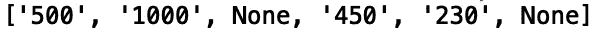
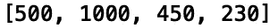
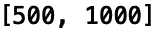
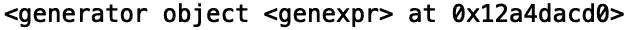
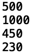

# Python 中的过滤列表

> 原文：<https://towardsdatascience.com/filtering-lists-in-python-a3387c7b6b5e?source=collection_archive---------7----------------------->

## Python 中的过滤方法


[来源](https://www.pexels.com/photo/clear-glass-pitcher-beside-black-ceramic-teacup-2267855/)

在本帖中，我们将讨论 Python 中列表过滤的三种方法。具体来说，我们将介绍如何使用列表理解、生成器表达式和内置的“filter()”方法来过滤 python 中的列表。

我们开始吧！

# 使用列表理解进行过滤

假设我们在一个列表中有数据，我们想提取值或根据一些标准减少列表。具体来说，让我们考虑下面的列表，它包含一个带有一些缺失值的医疗费用列表:

```
medical_charges = ["500", "1000", None, "450", "230", None]
print(medical_charges)
```



首先，我们可以使用列表理解来过滤掉“无”值:

```
medical_charges = [n for n in medical_charges if n != None]
print(medical_charges)
```


我们也可以将列表中的元素转换成整数，只是对列表的理解稍作修改:

```
medical_charges = [int(n) for n in medical_charges if n != None]
print(medical_charges)
```



将每个元素转换为整数后，我们还可以根据每个整数的大小进行过滤。假设我们要保持费用大于或等于 500 美元，我们可以写出下面的列表理解:

```
medical_charges = [n for n in medical_charges if n >= 500]
print(medical_charges)
```



# 使用发生器过滤

如果我们正在处理大量的数据，这是医疗记录的常见情况，我们可以使用生成器表达式进行迭代过滤。如果我们想用一个生成器表达式来转换我们的原始列表，我们做如下的事情:

```
charges = (int(n) for n in medical_charges if n != None)
print(charges)
```



从列表理解来看，语法上的主要区别是使用了圆括号而不是方括号。我们现在可以迭代生成器:

```
for charge in charges:
    print(charge)
```



# 使用“LIST()”和“FILTER()”方法进行筛选

有时候，过滤标准不容易用列表理解或生成器表达式来表达。让我们考虑将我们的字符串值医疗费用原始列表转换为整数并删除缺失值的示例:

```
medical_charges = ["500", "1000", None , "450", "230", None]
```

我们可以定义一个函数，它接受一个列表，并尝试将每个元素转换成一个整数。当转换没有抛出错误时，我们返回 true。当转换抛出值错误时，我们使用 except 语句来捕捉错误并返回 false:

```
def convert_and_filter(input_list):
    try:
        int(input_list)
        return True
    except ValueError:
        return False
```

然后，我们可以使用内置的“filter()”和“list()”方法。“filter()”函数创建一个迭代器，“list()”方法允许我们创建一个结果列表:

```
charges = list(filter(convert_and_filter, medical_charges))
print(charges)
```

我将在这里停下来，但是可以随意使用上面的例子。例如，您可以尝试更改 list comprehension 示例中的过滤条件，使其只包含少于或等于$500 的费用。

# 结论

总之，在这篇文章中，我们讨论了 Python 中列表过滤的四种方法。我们讨论了列表理解，这对它的可读性是有用的。我们还讨论了生成器表达式，如果我们想避免从大型数据集生成大型结果，可以使用它。最后，我们讨论了使用内置的“filter()”和“list()”方法以及一个自定义函数来过滤列表。我希望你觉得这篇文章有用/有趣。这篇文章的代码可以在 GitHub 上找到。感谢您的阅读！